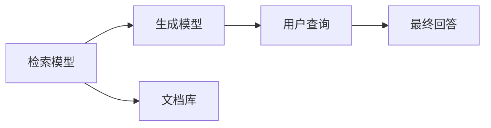
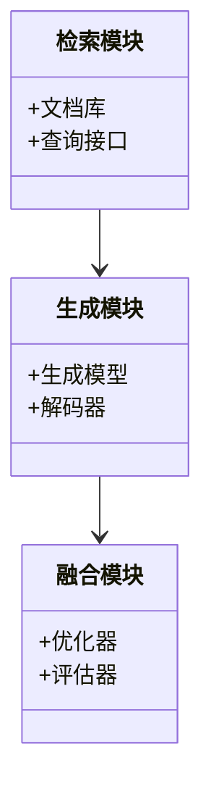
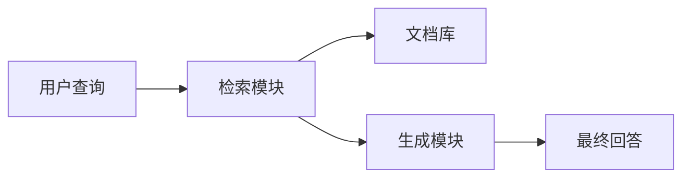

                 


---

# 检索增强生成：提高AI Agent回答的准确性

> **关键词**：检索增强生成、AI Agent、准确性、信息检索、生成模型  
> **摘要**：本文深入探讨了检索增强生成（RAG）技术，通过结合检索与生成模型，显著提升了AI Agent的回答准确性。文章从背景、核心概念、算法原理、系统架构到项目实战，全面解析了RAG的实现与优化方法，结合数学公式与图表，帮助读者掌握RAG的核心思想与应用场景。

---

## 第1章: 检索增强生成的背景与问题描述

### 1.1 检索增强生成的背景

#### 1.1.1 大语言模型的崛起
近年来，大语言模型（如GPT系列、BERT等）在自然语言处理领域取得了显著进展。这些模型通过海量数据训练，能够生成连贯且自然的文本。然而，生成式AI的输出有时缺乏准确性，尤其是在依赖外部知识的情况下。

#### 1.1.2 生成式AI的局限性
生成式AI在处理复杂查询时，容易受到训练数据偏差的影响，导致回答不准确。此外，生成模型无法直接利用外部知识库，限制了回答的精确性。

#### 1.1.3 检索与生成的结合必要性
通过结合检索技术，AI Agent可以在生成回答前，从外部知识库中获取最新、最准确的信息，从而弥补生成模型的局限性。

### 1.2 问题背景与描述

#### 1.2.1 AI Agent回答准确性的挑战
AI Agent需要在复杂场景下提供准确、连贯的回答，尤其是在涉及多源信息时，单纯依赖生成模型难以满足需求。

#### 1.2.2 检索增强生成的核心问题
如何有效地结合检索与生成技术，提升回答的准确性和相关性，是检索增强生成技术的核心问题。

#### 1.2.3 边界与外延
检索增强生成技术不仅适用于问答系统，还可应用于对话系统、文本摘要等领域，具有广泛的应用前景。

### 1.3 核心概念与要素

#### 1.3.1 检索增强生成的定义
检索增强生成（RAG）是一种结合检索与生成技术的方法，通过检索相关文档信息，辅助生成模型生成更准确的回答。

#### 1.3.2 核心要素与组成
- **检索模块**：负责从知识库中检索相关信息。
- **生成模块**：基于检索结果生成最终回答。
- **融合模块**：将检索和生成结果进行整合优化。

#### 1.3.3 概念结构与关系
通过ER图展示检索增强生成的核心概念及其关系，帮助读者理解各部分的协作机制。

---

## 第2章: 检索增强生成的核心概念与联系

### 2.1 核心概念原理

#### 2.1.1 检索模型的原理
检索模型通过计算查询与文档的相关性，返回最相关的文档结果。常用算法包括BM25、TF-IDF等。

#### 2.1.2 生成模型的原理
生成模型（如GPT）通过自回归方式生成文本，依赖大量数据进行微调以提升生成质量。

#### 2.1.3 检索与生成的结合方式
检索结果作为生成模型的上下文输入，辅助生成更准确的回答。

### 2.2 核心概念属性对比

| 属性       | 检索模型                | 生成模型                |
|------------|-------------------------|--------------------------|
| 输入        | 查询与文档库            | 用户查询与历史对话       |
| 输出        | 相关文档列表            | 自然语言文本             |
| 优势        | 高准确性                 | 创造性与灵活性            |
| 局限性        | 依赖知识库质量           | 受训练数据偏差影响         |

### 2.3 实体关系图



---

## 第3章: 检索增强生成的算法原理

### 3.1 检索算法

#### 3.1.1 余弦相似度计算
通过向量空间模型，计算查询与文档的余弦相似度：
$$ \text{similarity}(x, y) = \frac{x \cdot y}{\|x\| \|y\|} $$

#### 3.1.2 BM25算法
BM25是一种基于统计的检索算法，公式为：
$$ \text{score}(t, d) = \frac{\text{BM25k}(t, d) \times \text{IDF}(t)}{\text{BM25k}(t, d) + \text{IDF}(t)} $$

#### 3.1.3 向量空间模型
将文本转化为向量，计算向量之间的相似度。

### 3.2 生成算法

#### 3.2.1 基于Transformer的生成模型
使用Transformer架构，通过自注意力机制生成文本。

#### 3.2.2 梯度下降优化
通过最小化损失函数，优化模型参数。

#### 3.2.3 解码策略
采用贪心解码或随机采样策略生成最终文本。

### 3.3 检索与生成的联合优化

#### 3.3.1 联合训练框架
同时优化检索与生成模块，共享参数以提升整体性能。

#### 3.3.2 多目标损失函数
结合检索和生成任务，设计多目标损失函数。

#### 3.3.3 贝叶斯推理
利用贝叶斯框架，整合检索结果与生成概率，提升回答准确性。

---

## 第4章: 检索增强生成的数学模型与公式

### 4.1 检索模型的数学基础

#### 4.1.1 向量相似度公式
$$ \text{similarity}(x, y) = \frac{x \cdot y}{\|x\| \|y\|} $$

#### 4.1.2 BM25公式
$$ \text{score}(t, d) = \frac{\text{BM25k}(t, d) \times \text{IDF}(t)}{\text{BM25k}(t, d) + \text{IDF}(t)} $$

### 4.2 生成模型的数学基础

#### 4.2.1 Transformer模型
$$ \text{softmax}(W_{\text{query}} q^T W_{\text{key}} k) $$

#### 4.2.2 损失函数
交叉熵损失：
$$ \mathcal{L} = -\sum_{i=1}^{n} y_i \log p(y_i) $$

---

## 第5章: 检索增强生成的系统架构设计

### 5.1 系统功能设计

#### 5.1.1 领域模型


#### 5.1.2 系统架构


---

## 第6章: 检索增强生成的项目实战

### 6.1 环境安装

```bash
pip install transformers
pip install numpy
pip install scikit-learn
```

### 6.2 核心实现代码

```python
import numpy as np
from sklearn.metrics.pairwise import cosine_similarity

def retrieve_docs(query, doc_embeddings):
    query_embedding = model.encode(query)
    similarity_scores = cosine_similarity([query_embedding], doc_embeddings)
    return np.argsort(similarity_scores, axis=1)[:, ::-1]

def generate_response(context):
    inputs = tokenizer(context, return_tensors='np')
    outputs = model.generate(inputs.input_ids, max_length=50)
    return tokenizer.decode(outputs[0])
```

---

## 第7章: 最佳实践与小结

### 7.1 最佳实践

#### 7.1.1 数据质量
确保知识库的准确性和全面性。

#### 7.1.2 模型选择
根据任务需求选择合适的检索与生成模型。

#### 7.1.3 调优技巧
通过实验优化检索阈值和生成参数。

### 7.2 小结

检索增强生成技术通过结合检索与生成的优势，显著提升了AI Agent的回答准确性。本文详细探讨了其核心概念、算法原理与系统架构，为实际应用提供了理论支持与实践指导。

### 7.3 注意事项

- 定期更新知识库以保持信息的准确性。
- 注意生成模型的伦理风险，避免生成有害信息。

### 7.4 拓展阅读

- 建议深入学习大语言模型的微调技术。
- 关注最新的检索增强生成研究成果。

---

**全文完**

