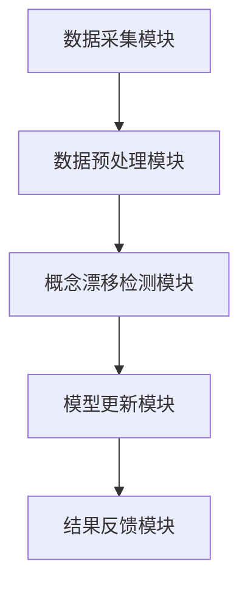
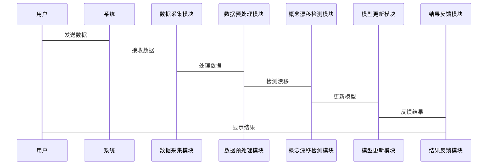

                 

# 概念漂移检测：适应动态变化的环境

## 关键词
概念漂移检测, 数据分布变化, 机器学习模型, 动态环境, 实时系统

## 摘要
概念漂移检测是指在动态数据环境中，识别数据分布或模型性能的变化，以维持机器学习模型的有效性。本文将深入探讨概念漂移的核心概念、检测算法、系统设计和实际应用，帮助读者掌握应对动态变化的技术和方法。

---

## 第一部分: 概念漂移检测概述

### 第1章: 概念漂移的基本概念

#### 1.1 概念漂移的定义与背景
- 1.1.1 数据分布变化的定义
- 1.1.2 概念漂移的背景与应用场景
- 1.1.3 概念漂移的核心问题与挑战

#### 1.2 概念漂移的类型与特征
- 1.2.1 突发性概念漂移
- 1.2.2 渐进性概念漂移
- 1.2.3 混淆性概念漂移
- 1.2.4 概念漂移的特征对比表

#### 1.3 概念漂移的产生原因与影响
- 1.3.1 数据源的变化
- 1.3.2 环境条件的变化
- 1.3.3 概念漂移对机器学习模型的影响
- 1.3.4 概念漂移对实时系统的影响

### 第2章: 概念漂移检测的重要性

#### 2.1 概念漂移检测的核心目标
- 2.1.1 监测数据分布的变化
- 2.1.2 提前预警概念漂移
- 2.1.3 维护模型的性能

#### 2.2 概念漂移检测的挑战
- 2.2.1 数据量的动态变化
- 2.2.2 模型更新的复杂性
- 2.2.3 多维数据的处理难度
- 2.2.4 概念漂移检测的计算效率

#### 2.3 概念漂移检测的边界与外延
- 2.3.1 概念漂移的边界条件
- 2.3.2 相关概念的对比
- 2.3.3 概念漂移与其他数据变化的关系

### 第3章: 概念漂移检测的核心要素

#### 3.1 数据特征分析
- 3.1.1 数据分布的统计特征
- 3.1.2 数据特征的变化检测
- 3.1.3 特征重要性评估

#### 3.2 模型性能监控
- 3.2.1 模型预测准确性评估
- 3.2.2 模型性能变化的指标
- 3.2.3 模型更新的策略

#### 3.3 概念漂移检测的数学模型
- 3.3.1 统计假设检验
- 3.3.2 聚类分析方法
- 3.3.3 分类模型的性能评估

---

## 第二部分: 概念漂移检测的核心算法与数学模型

### 第4章: 基于统计假设检验的概念漂移检测

#### 4.1 统计检验方法
- 4.1.1 Kolmogorov-Smirnov检验
- 4.1.2 Chi-squared检验
- 4.1.3 t检验与z检验

#### 4.2 统计检验的实现步骤
- 数据预处理
- 检验统计量计算
- 显著性水平比较

#### 4.3 统计检验的优缺点分析
- 优点：简单高效，适用于小样本
- 缺点：假设条件严格，可能不适用于复杂分布

### 第5章: 基于聚类的概念漂移检测

#### 5.1 聚类算法简介
- K-means算法
- DBSCAN算法
- 层次聚类算法

#### 5.2 聚类在概念漂移检测中的应用
- 数据分布变化的聚类分析
- 聚类中心的变化监测

#### 5.3 聚类方法的优缺点
- 优点：发现数据分布的变化模式
- 缺点：计算复杂度较高

### 第6章: 基于机器学习的概念漂移检测

#### 6.1 分类模型的应用
- 使用分类器检测数据分布变化
- 模型性能下降的预警

#### 6.2 回归模型的应用
- 使用回归模型预测数据变化
- 模型性能评估指标

#### 6.3 深度学习方法的应用
- 使用神经网络进行概念漂移检测
- 模型鲁棒性分析

### 第7章: 综合算法对比与选择

#### 7.1 不同算法的性能对比
- 统计检验 vs. 聚类方法 vs. 机器学习方法

#### 7.2 算法选择的依据
- 数据类型与规模
- 检测实时性要求
- 计算资源限制

---

## 第三部分: 系统设计与架构方案

### 第8章: 系统分析与架构设计

#### 8.1 问题场景介绍
- 动态数据环境下的概念漂移检测
- 实时系统中的模型维护

#### 8.2 系统功能设计
- 数据采集模块
- 概念漂移检测模块
- 模型更新模块
- 结果反馈模块

#### 8.3 系统架构设计
- 分层架构：数据层、算法层、应用层
- 模块化设计：各功能模块独立实现

#### 8.4 系统交互设计
- 数据流的处理流程
- 模型更新的触发机制
- 结果反馈的展示方式

### 第9章: 系统架构实现

#### 9.1 系统架构图

#### 9.2 系统功能模块实现
- 数据采集模块：负责数据的获取与存储
- 数据预处理模块：数据清洗与标准化
- 概念漂移检测模块：算法实现与结果输出
- 模型更新模块：模型调整与优化
- 结果反馈模块：结果展示与报警

#### 9.3 系统交互流程

### 第10章: 系统实现与优化

#### 10.1 系统实现步骤
- 环境配置：安装所需库与工具
- 模块开发：各功能模块的编码实现
- 系统集成：模块之间的接口对接
- 测试验证：功能测试与性能测试

#### 10.2 系统优化策略
- 并行计算优化
- 算法优化：选择高效的检测算法
- 系统架构优化：模块化设计与负载均衡

#### 10.3 系统优化效果
- 提高检测效率
- 降低资源消耗
- 提升系统稳定性

---

## 第四部分: 项目实战与案例分析

### 第11章: 项目实战

#### 11.1 环境安装与配置
- 安装Python与相关库（如scikit-learn, numpy, mermaid等）
- 安装Jupyter Notebook用于开发与测试

#### 11.2 核心代码实现
- 统计检验方法的实现
- 聚类方法的实现
- 机器学习方法的实现

#### 11.3 代码应用解读与分析
- 代码结构分析
- 核心算法实现细节
- 代码运行结果分析

### 第12章: 案例分析与详细讲解

#### 12.1 实际案例分析
- 某电商网站的用户行为分析
- 某金融系统的交易数据监测

#### 12.2 案例分析过程
- 数据采集与预处理
- 概念漂移检测的实施
- 模型更新与优化

#### 12.3 案例分析结果与总结
- 检测结果展示
- 模型优化效果
- 经验总结与改进建议

### 第13章: 项目小结

#### 13.1 项目总结
- 项目目标达成情况
- 项目实施过程中的问题与解决方法
- 项目成果与价值

#### 13.2 项目经验总结
- 关键技术点总结
- 系统设计与实现的经验
- 项目管理的经验

---

## 第五部分: 数学模型与公式推导

### 第14章: 统计假设检验的数学模型

#### 14.1 Kolmogorov-Smirnov检验
- 检验统计量的计算公式
- 检验过程的数学推导
- 显著性水平的计算

#### 14.2 Chi-squared检验
- 卡方统计量的计算公式
- 自由度的计算
- p值的计算与判断

### 第15章: 聚类分析的数学模型

#### 15.1 K-means算法
- 距离计算公式
- 聚类中心更新公式
- 簇划分的评估指标

#### 15.2 DBSCAN算法
- 密度计算公式
- 核心点与边缘点的定义
- 簇的合并与分裂规则

### 第16章: 机器学习模型的数学模型

#### 16.1 分类模型
- 线性回归模型的公式
- 逻辑回归模型的公式
- 支持向量机模型的公式

#### 16.2 深度学习模型
- 神经网络的结构公式
- 激活函数的定义
- 损失函数的计算

---

## 第六部分: 系统分析与架构设计方案

### 第17章: 系统分析与架构设计方案

#### 17.1 系统分析
- 数据流分析
- 功能需求分析
- 性能需求分析

#### 17.2 系统架构设计
- 分层架构设计
- 模块化设计
- 系统扩展性设计

#### 17.3 系统接口设计
- 数据接口设计
- 模型接口设计
- 用户接口设计

#### 17.4 系统交互流程设计
- 用户请求的处理流程
- 数据处理的流程
- 模型更新的流程

### 第18章: 系统架构实现

#### 18.1 系统架构图

#### 18.2 系统实现步骤
- 数据采集模块的实现
- 数据预处理模块的实现
- 概念漂移检测模块的实现
- 模型更新模块的实现
- 结果反馈模块的实现

#### 18.3 系统实现细节
- 各模块之间的接口设计
- 数据格式的统一
- 系统的可扩展性设计

---

## 第七部分: 项目实战与案例分析

### 第19章: 项目实战

#### 19.1 环境安装与配置
- Python环境的安装与配置
- 相关库的安装（如scikit-learn, numpy, pandas等）
- 开发工具的配置（如Jupyter Notebook）

#### 19.2 核心代码实现
- 数据采集模块的代码实现
- 数据预处理模块的代码实现
- 概念漂移检测模块的代码实现
- 模型更新模块的代码实现
- 结果反馈模块的代码实现

#### 19.3 代码应用解读与分析
- 代码的运行结果分析
- 各模块的交互分析
- 系统性能的分析

### 第20章: 案例分析与详细讲解

#### 20.1 实际案例分析
- 某电商网站的概念漂移检测
- 某金融系统的概念漂移检测

#### 20.2 案例分析过程
- 数据采集与预处理过程
- 概念漂移检测的实施过程
- 模型更新与优化过程

#### 20.3 案例分析结果与总结
- 检测结果展示
- 模型优化效果展示
- 经验总结与改进建议

### 第21章: 项目小结

#### 21.1 项目总结
- 项目目标达成情况
- 项目实施过程中的问题与解决方法
- 项目成果与价值

#### 21.2 项目经验总结
- 关键技术点总结
- 系统设计与实现的经验
- 项目管理的经验

---

## 第八部分: 最佳实践、小结与注意事项

### 第22章: 最佳实践

#### 22.1 系统设计中的最佳实践
- 模块化设计
- 可扩展性设计
- 高可用性设计

#### 22.2 算法选择中的最佳实践
- 根据数据类型选择算法
- 根据实时性要求选择算法
- 根据计算资源选择算法

#### 22.3 项目实施中的最佳实践
- 需求分析
- 项目规划
- 团队协作

### 第23章: 小结与展望

#### 23.1 小结
- 概念漂移检测的核心内容总结
- 系统设计与实现总结
- 项目实战经验总结

#### 23.2 展望
- 概念漂移检测的未来发展方向
- 新技术的应用前景
- 研究领域的挑战与机遇

### 第24章: 注意事项与风险提示

#### 24.1 注意事项
- 数据预处理的重要性
- 模型更新的及时性
- 系统维护的持续性

#### 24.2 风险提示
- 数据质量风险
- 算法失效风险
- 系统性能风险

#### 24.3 风险应对策略
- 数据质量控制
- 算法组合使用
- 系统性能优化

---

## 第九部分: 拓展阅读与参考资料

### 第25章: 拓展阅读

#### 25.1 相关技术文献
- 统计假设检验的经典论文
- 聚类分析的经典论文
- 机器学习中的概念漂移检测方法

#### 25.2 技术博客与在线资源
- 开源项目的参考
- 技术博客的链接
- 在线课程的推荐

#### 25.3 书籍推荐
- 统计学经典书籍
- 机器学习经典书籍
- 深度学习经典书籍

### 第26章: 参考资料与致谢

#### 26.1 参考资料
- 数据来源
- 工具与库的引用
- 论文引用

#### 26.2 致谢
- 感谢团队成员
- 感谢导师或指导老师
- 感谢开源社区

---

## 结语

通过以上目录结构，我们可以看到，这本书将全面覆盖概念漂移检测的各个方面，从理论到实践，从算法到系统设计，为读者提供一个系统化、结构化的知识框架。无论是理论学习还是实际应用，这本书都能为读者提供有价值的指导和参考。

