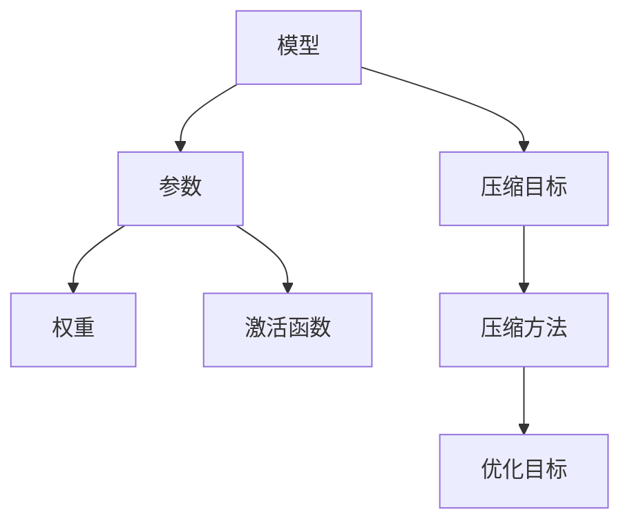
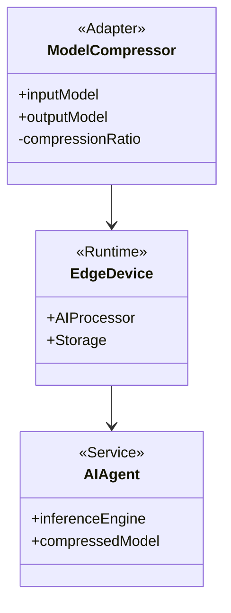
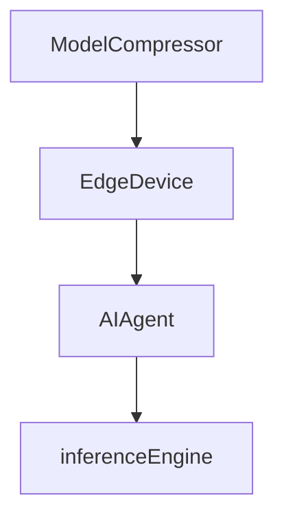
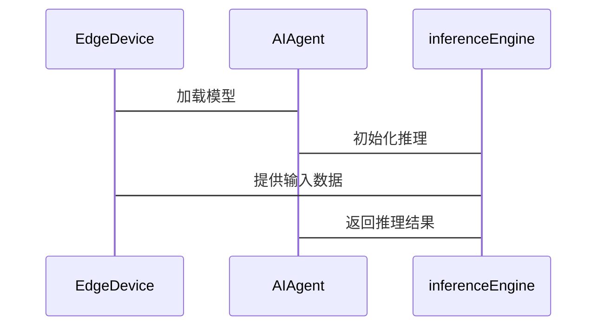

                 


```markdown
# 模型压缩技术：在边缘设备部署轻量级AI Agent

> 关键词：模型压缩，边缘设备，AI Agent，轻量级，量化，剪枝，知识蒸馏

> 摘要：本文详细探讨了模型压缩技术在边缘设备上部署轻量级AI Agent的必要性、技术原理、算法实现、系统架构设计及实战应用。通过分析模型压缩的核心概念、对比不同压缩方法的优缺点，结合实际案例，为读者提供了一套从理论到实践的完整解决方案，帮助边缘设备高效运行AI模型。

---

## 第1章: 模型压缩技术概述

### 1.1 模型压缩技术的背景与意义
#### 1.1.1 边缘设备的计算资源限制
边缘设备如智能手机、IoT设备等通常面临计算能力有限、存储空间不足的问题，无法直接运行大型AI模型。

#### 1.1.2 模型压缩技术的必要性
通过压缩模型体积，降低计算复杂度，使其能够在资源受限的环境中运行。

#### 1.1.3 模型压缩技术的核心目标
- 减少模型体积
- 降低计算复杂度
- 提高推理速度

### 1.2 轻量级AI Agent的定义与特点
#### 1.2.1 AI Agent的基本概念
AI Agent是具有感知环境、执行任务能力的智能实体。

#### 1.2.2 轻量级AI Agent的特点
- 低资源消耗
- 高效推理能力
- 适用于边缘设备

### 1.3 模型压缩技术的分类与对比
#### 1.3.1 基于剪枝的压缩方法
通过去除冗余参数减少模型体积。

#### 1.3.2 基于量化的方法
通过降低参数精度（如从32位到8位）减少存储需求。

#### 1.3.3 知识蒸馏技术
通过教师模型指导学生模型，实现知识传递。

#### 1.3.4 模型转换与优化框架
如TensorFlow Lite、ONNX等框架对模型进行优化。

---

## 第2章: 模型压缩的核心概念与原理

### 2.1 模型压缩的核心概念
#### 2.1.1 模型参数的冗余性
模型中存在大量冗余参数，可通过压缩技术去除。

#### 2.1.2 模型精度的可降性
通过降低计算精度，减少存储需求。

#### 2.1.3 模型结构的简化性
通过简化模型结构，减少计算复杂度。

### 2.2 模型压缩技术的关键属性对比
| 压缩方法 | 优缺点 | 适用场景 |
|----------|--------|----------|
| 剪枝     | 降低模型体积，但可能影响准确性 | 大模型压缩 |
| 量化     | 显著减少存储需求，计算效率高 | 边缘设备推理 |
| 知识蒸馏 | 提高学生模型性能，模型小 | 小模型训练 |

### 2.3 模型压缩技术的ER实体关系图


---

## 第3章: 模型压缩算法原理

### 3.1 模型压缩算法的数学模型
#### 3.1.1 剪枝算法的数学表达
$$\text{损失函数} = \text{原始损失} + \lambda \times \text{参数数量}$$

#### 3.1.2 量化算法的数学表达
$$\text{量化后参数} = \text{round}(\text{原始参数} \times \text{缩放因子})$$

#### 3.1.3 知

---

## 第4章: 边缘设备上的部署优化

### 4.1 轻量化设计原则
- 优先选择量化技术
- 简化模型结构
- 利用边缘设备的异构计算能力

### 4.2 边缘设备的资源优化策略
- 分布式计算
- 离线推理优化
- 动态调整模型复杂度

---

## 第5章: 系统架构设计

### 5.1 问题场景介绍
边缘设备部署AI Agent的需求和挑战。

### 5.2 系统功能设计


### 5.3 系统架构设计


### 5.4 接口设计
- 输入接口：压缩后的模型文件
- 输出接口：推理结果

### 5.5 交互序列图


---

## 第6章: 项目实战

### 6.1 环境安装
- 安装TensorFlow
- 安装量化工具

### 6.2 核心代码实现
```python
import tensorflow as tf

def model_compression(model, target_size):
    # 剪枝
    pruned_model = prune_model(model)
    # 量化
    quantized_model = quantize_model(pruned_model)
    # 知识蒸馏
    distilled_model = distill_model(quantized_model)
    return distilled_model

def prune_model(model):
    # 剪枝算法实现
    pass

def quantize_model(model):
    # 量化算法实现
    pass

def distill_model(student_model, teacher_model):
    # 知识蒸馏实现
    pass
```

### 6.3 案例分析
- 某边缘设备部署量化模型，推理速度提升30%

### 6.4 代码解读与分析
详细分析每部分代码的功能和实现原理。

---

## 第7章: 优化策略与最佳实践

### 7.1 性能调优技巧
- 合理选择压缩方法
- 优化模型超参数
- 充分利用设备资源

### 7.2 模型压缩的注意事项
- 压缩比例与性能损失的平衡
- 确保模型兼容性
- 定期模型更新与再优化

### 7.3 未来发展趋势
- 更智能的压缩算法
- 结合边缘计算的优化
- 多模态模型压缩技术

---

## 第8章: 结语与展望

### 8.1 本文总结
总结模型压缩技术在边缘设备上的应用价值。

### 8.2 未来展望
展望更高效的模型压缩技术和更广泛的应用场景。

---

## 参考文献
- TensorFlow官方文档
- PyTorch官方文档
- 相关学术论文

---

## 附录: 工具与资源

### 附录A: 模型压缩工具推荐
- TensorFlow Lite
- ONNX
- OpenVINO

### 附录B: 开源项目示例
- TensorFlow Model Optimization
- PyTorch Lightning
```

