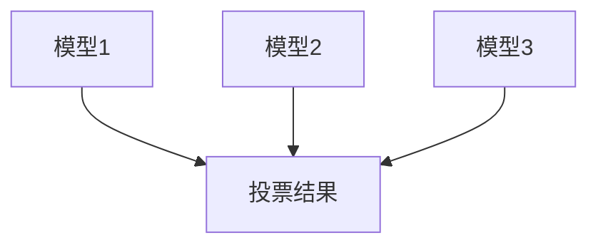

                 


# 模型集成与系统部署

## 关键词：
- 模型集成
- 系统部署
- 机器学习
- 深度学习
- 微服务架构
- 容器化技术

## 摘要：
本文深入探讨模型集成与系统部署的核心概念、原理、算法及其实际应用。从模型集成的基本原理到系统部署的实现，结合具体案例，分析其在现代人工智能系统中的重要性。

---

# 第1章: 模型集成与系统部署概述

## 1.1 模型集成的核心概念

### 1.1.1 模型集成的定义与背景
模型集成是一种通过组合多个独立模型的输出来提升整体性能的技术。其背景源于机器学习中的单模型局限性，通过集成多个模型，可以有效降低模型的方差和偏差，提升预测准确性和稳定性。

### 1.1.2 模型集成的核心问题与挑战
- **问题**：如何选择模型、如何融合模型输出、如何处理模型之间的依赖关系。
- **挑战**：模型性能的均衡、模型之间的冲突、模型融合的计算效率。

### 1.1.3 模型集成的应用场景与边界
- **场景**：分类、回归、推荐系统、自然语言处理。
- **边界**：数据量、模型复杂度、计算资源限制。

## 1.2 系统部署的基本概念

### 1.2.1 系统部署的定义与流程
系统部署是将开发完成的系统或模型部署到实际运行环境中，确保其稳定运行。

### 1.2.2 系统部署的关键要素与目标
- **要素**：硬件资源、软件环境、网络配置。
- **目标**：高可用性、可扩展性、可维护性。

### 1.2.3 模型集成与系统部署的关系
模型集成是系统部署的重要组成部分，直接影响系统的性能和稳定性。

## 1.3 本章小结
模型集成与系统部署是现代人工智能系统的核心技术，理解其基本概念是进一步学习的基础。

---

# 第2章: 模型集成的原理与方法

## 2.1 模型集成的原理

### 2.1.1 模型集成的数学基础
模型集成的输出通常通过加权平均或投票的方式得到。

### 2.1.2 模型集成的核心原理
- **投票法**：多个模型投票决定最终结果。
- **加权投票法**：根据模型性能分配权重。

### 2.1.3 模型集成的优势与局限性
- **优势**：提升准确率、降低过拟合风险。
- **局限性**：计算开销大、模型选择复杂。

## 2.2 模型集成的主要方法

### 2.2.1 投票法（Voting）
多个模型投票，多数结果为最终输出。



### 2.2.2 加权投票法（Weighted Voting）
根据模型性能分配权重，加权求和。

### 2.2.3 堆叠（Stacking）
通过元模型（Meta-model）融合多个模型的输出。

### 2.2.4 级联（Cascading）
多个模型按顺序处理数据，级联模型依赖前一个模型的输出。

## 2.3 模型集成方法的对比分析

### 2.3.1 不同集成方法的优缺点对比
| 方法         | 优点                     | 缺点                     |
|--------------|--------------------------|--------------------------|
| 投票法       | 简单高效                 | 易受异常值影响             |
| 加权投票法   | 更加灵活                 | 权重分配复杂               |
| 堆叠          | 高精度                   | 计算复杂度高               |
| 级联          | 适合复杂任务             | 依赖性强                   |

### 2.3.2 模型集成方法的选择策略
根据任务需求、数据量和计算资源选择合适的方法。

### 2.3.3 模型集成方法的适用场景
- 投票法适用于分类任务。
- 堆叠适用于高精度要求的任务。

## 2.4 本章小结
模型集成方法的选择直接影响系统性能，需根据实际需求灵活选择。

---

# 第3章: 系统部署的基础知识

## 3.1 系统部署的基本流程

### 3.1.1 部署前的准备工作
- 环境搭建：操作系统、依赖库安装。
- 配置文件准备：网络配置、权限设置。

### 3.1.2 部署实施步骤
1. 安装依赖
2. 配置环境变量
3. 启动服务

### 3.1.3 部署后的验证与优化
- 测试：功能测试、性能测试。
- 优化：资源分配调整、日志监控。

## 3.2 系统部署的关键技术

### 3.2.1 容器化技术（Docker）
- **定义**：通过容器化技术实现服务的快速部署。
- **优势**：轻量、隔离、可移植。

### 3.2.2 微服务架构（Microservices）
- **定义**：将系统分解为多个小型服务，独立部署。
- **优势**：高可用性、可扩展性。

### 3.2.3 持续集成与持续部署（CI/CD）
- **定义**：自动化代码构建、测试和部署流程。
- **优势**：减少人为错误、加快部署速度。

## 3.3 本章小结
容器化和微服务架构是现代系统部署的核心技术，CI/CD流程是实现高效部署的关键。

---

# 第4章: 模型集成的算法原理

## 4.1 投票法的算法原理

### 4.1.1 投票法的数学模型
$$ y_{\text{pred}} = \text{mode}(y_1, y_2, ..., y_n) $$

### 4.1.2 投票法的流程
1. 各模型独立预测
2. 统计各预测结果的出现次数
3. 选择出现次数最多的预测结果

### 4.1.3 投票法的适用场景
适用于分类任务，尤其是类别较少的情况。

## 4.2 堆叠模型的算法原理

### 4.2.1 堆叠模型的数学模型
$$ y_{\text{pred}} = \text{Meta-model}(y_1, y_2, ..., y_n) $$

### 4.2.2 堆叠模型的训练流程
1. 训练基模型
2. 基模型预测生成元数据
3. 元模型训练

### 4.2.3 堆叠模型的优缺点
- **优点**：预测精度高。
- **缺点**：计算复杂度高。

## 4.3 本章小结
投票法和堆叠模型是常见的模型集成方法，各有优缺点。

---

# 第5章: 系统架构设计

## 5.1 项目介绍

### 5.1.1 项目背景
开发一个基于模型集成的推荐系统。

## 5.2 系统功能设计

### 5.2.1 领域模型设计


### 5.2.2 系统架构设计
```mermaid
graph TD
    用户 --> API Gateway
    API Gateway --> 负载均衡
    负载均衡 --> 服务1
    负载均衡 --> 服务2
    服务1 --> 数据库
    服务2 --> 数据库
```

### 5.2.3 系统接口设计
- API接口定义：RESTful API。
- 接口功能：模型预测、结果查询。

## 5.3 本章小结
系统架构设计是实现模型集成和系统部署的关键步骤。

---

# 第6章: 项目实战

## 6.1 环境安装

### 6.1.1 安装Python
```bash
python --version
pip install --upgrade pip
```

### 6.1.2 安装依赖
```bash
pip install numpy scikit-learn
```

## 6.2 核心实现

### 6.2.1 投票法实现
```python
from sklearn.ensemble import VotingClassifier
from sklearn.svm import SVC
from sklearn.tree import DecisionTreeClassifier

# 初始化模型
model1 = SVC()
model2 = DecisionTreeClassifier()
model3 = SVC()

# 组合模型
voting = VotingClassifier(estimators=[('model1', model1), ('model2', model2), ('model3', model3)])
```

### 6.2.2 堆叠模型实现
```python
from sklearn.ensemble import StackingClassifier
from sklearn.linear_model import LogisticRegression

# 初始化基模型
model1 = SVC()
model2 = DecisionTreeClassifier()

# 元模型
meta = LogisticRegression()

# 组合模型
stacking = StackingClassifier(estimators=[('model1', model1), ('model2', model2)], meta_estimator=meta)
```

## 6.3 案例分析

### 6.3.1 数据集准备
使用 iris 数据集进行测试。

### 6.3.2 模型训练与预测
```python
from sklearn.datasets import load_iris
from sklearn.model_selection import train_test_split

# 加载数据集
iris = load_iris()
X_train, X_test, y_train, y_test = train_test_split(iris.data, iris.target)

# 训练模型
voting.fit(X_train, y_train)
stacking.fit(X_train, y_train)

# 预测
print(voting.score(X_test, y_test))
print(stacking.score(X_test, y_test))
```

## 6.4 本章小结
通过实战案例，验证了模型集成方法的有效性。

---

# 第7章: 最佳实践与注意事项

## 7.1 小结

### 7.1.1 模型集成的核心思想
通过组合多个模型提升整体性能。

## 7.2 注意事项

### 7.2.1 模型选择
- 确保模型多样性，避免过拟合。

### 7.2.2 系统部署
- 确保环境一致性，避免依赖冲突。

## 7.3 未来趋势

### 7.3.1 自动化集成
- AI驱动的模型选择与优化。

### 7.3.2 智能部署
- 自适应资源分配、动态扩展。

## 7.4 扩展阅读

### 7.4.1 推荐书目
- 《机器学习实战》
- 《深入浅出机器学习》

## 7.5 本章小结
模型集成与系统部署是动态发展的领域，需持续关注新技术。

---

# 附录

## 附录A: 项目代码

```python
import numpy as np
from sklearn.datasets import load_iris
from sklearn.model_selection import train_test_split
from sklearn.ensemble import VotingClassifier, StackingClassifier
from sklearn.svm import SVC
from sklearn.tree import DecisionTreeClassifier
from sklearn.linear_model import LogisticRegression

# 加载数据集
iris = load_iris()
X_train, X_test, y_train, y_test = train_test_split(iris.data, iris.target)

# 初始化模型
model1 = SVC()
model2 = DecisionTreeClassifier()
model3 = SVC()

# 投票法
voting = VotingClassifier(estimators=[('model1', model1), ('model2', model2), ('model3', model3)])
voting.fit(X_train, y_train)
print("投票法准确率:", voting.score(X_test, y_test))

# 堆叠模型
meta = LogisticRegression()
stacking = StackingClassifier(estimators=[('model1', model1), ('model2', model2)], meta_estimator=meta)
stacking.fit(X_train, y_train)
print("堆叠模型准确率:", stacking.score(X_test, y_test))
```

---

# 结语

模型集成与系统部署是现代人工智能系统的核心技术，通过本文的深入探讨，希望能为读者提供有价值的参考和启发。

