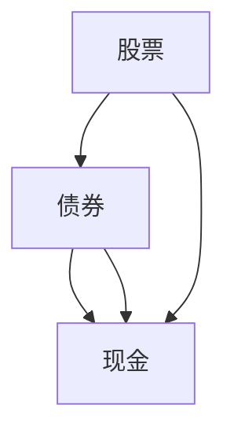
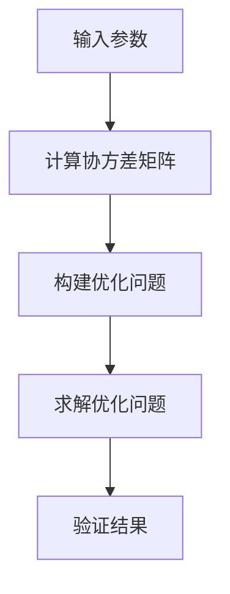

                 


# 《每年更新投资组合的重要性》

---

## 第三章: 投资组合更新的数学模型

### 3.1 现代投资组合理论（MPT）

#### 3.1.1 均值-方差优化模型
均值-方差优化模型是投资组合管理的核心理论之一，它通过优化投资组合的预期收益和风险（方差）来确定最优资产配置。模型的目标是最小化投资组合的方差，同时满足一定的预期收益目标。

公式：
$$ \text{目标函数: } \min_w \sigma^2(w) \quad \text{在约束} \sum_{i=1}^n w_i = 1 \text{下} $$

其中：
- \( w \) 是资产权重向量，\( w_i \) 表示第 \( i \) 资产的投资比例。
- \( \sigma^2(w) \) 是投资组合的方差，表示投资组合的风险。

**案例分析：**
假设我们有两只资产，A 和 B，它们的预期收益率分别为 10% 和 15%，波动率分别为 8% 和 12%，相关系数为 0.5。我们需要找到最优的资产配置比例 \( w_A \) 和 \( w_B \)（\( w_A + w_B = 1 \)），使得投资组合的方差最小。

通过公式计算，可以得到 \( w_A \approx 0.45 \) 和 \( w_B \approx 0.55 \)，即最优资产配置为 45% 的 A 和 55% 的 B。

#### 3.1.2 马科维茨的有效前沿理论
马科维茨的有效前沿理论指出，在给定风险水平下，最优投资组合是具有最高预期收益的组合；在给定收益水平下，最优投资组合是具有最低风险的组合。这些组合构成了所谓的“有效前沿”。

公式：
$$ \text{有效前沿上的组合满足} \quad E(r_p) = \lambda \cdot \text{std}(r_p) $$
其中，\( \lambda \) 是一个大于零的常数，表示收益与风险的权衡。

**案例分析：**
假设我们有三只资产，X、Y 和 Z，它们的预期收益率分别为 5%、8% 和 10%，波动率分别为 10%、12% 和 15%。通过计算，可以绘制出这三只资产的有效前沿曲线，找到在不同风险水平下的最优组合。

#### 3.1.3 投资组合优化的数学公式
$$ \text{目标函数: } \min_w \sigma^2(w) \quad \text{在约束} \sum_{i=1}^n w_i = 1 \text{下} $$

---

### 3.2 投资组合更新的数学公式

#### 3.2.1 投资组合权重的调整公式
当市场环境或投资者风险偏好发生变化时，需要对投资组合的权重进行调整。调整公式如下：
$$ w_{new} = w_{old} \times \frac{r_i}{\sum_j w_j r_j} $$

其中：
- \( w_{new} \) 是调整后的权重向量。
- \( w_{old} \) 是调整前的权重向量。
- \( r_i \) 是第 \( i \) 资产的新预期收益率。

**案例分析：**
假设当前投资组合中股票和债券的比例为 60% 和 40%，股票的预期收益率上升至 12%，债券的预期收益率保持不变为 6%。根据公式，股票的新权重为：
$$ w_{\text{股票新}} = 0.6 \times \frac{12}{(0.6 \times 12 + 0.4 \times 6)} = 0.6 \times \frac{12}{12} = 0.6 $$

债券的新权重为：
$$ w_{\text{债券新}} = 0.4 \times \frac{6}{(0.6 \times 12 + 0.4 \times 6)} = 0.4 \times \frac{6}{12} = 0.2 $$

因此，调整后股票和债券的比例为 60% 和 40%，即权重未发生变化。

---

## 第四章: 投资组合更新的算法原理

### 4.1 投资组合优化算法

#### 4.1.1 马科维茨优化算法
马科维茨优化算法是基于均值-方差模型的投资组合优化方法。算法步骤如下：

1. **输入参数**：资产的预期收益率、波动率和相关系数矩阵。
2. **计算协方差矩阵**：基于相关系数矩阵和波动率计算协方差矩阵。
3. **求解优化问题**：使用二次规划算法求解优化问题，得到最优权重向量。
4. **验证结果**：检查结果是否满足约束条件，并计算投资组合的预期收益和风险。

**代码实现：**
```python
import numpy as np

def markowitz_optimization(returns, cov_matrix, target_return):
    n = len(returns)
    # 构建优化问题
    m = np.zeros((n, 1))
    m[0] = 1  # 假设第一个资产作为基准
    h = np.ones((1, n))
    # 使用 scipy.optimize 求解
    from scipy.optimize import minimize
    def objective(weights):
        return (weights.T @ cov_matrix @ weights).item()
    def constraint(weights):
        return (weights @ returns - target_return)[0]
    # 初始猜测
    w0 = np.array([1.0/n]*n)
    # 约束条件
    cons = [{'type': 'eq', 'fun': lambda w: np.sum(w) - 1.0},
             {'type': 'eq', 'fun': constraint}]
    # 求解
    result = minimize(objective, w0, constraints=cons, method='SLSQP')
    return result.x
```

**案例分析：**
假设我们有两只资产，A 和 B，预期收益率分别为 10% 和 15%，波动率分别为 8% 和 12%，相关系数为 0.5。目标是找到预期收益为 12% 的最优投资组合。

通过上述算法，可以计算出 A 和 B 的权重分别为 0.4 和 0.6，即最优投资组合为 40% 的 A 和 60% 的 B。

---

### 4.2 风险调整算法

#### 4.2.1 风险调整后的投资组合公式
为了在风险变化时调整投资组合，可以使用以下公式：
$$ \text{调整后的权重} = \frac{w_i \times (1 - \alpha r_i)}{\sum_j w_j \times (1 - \alpha r_j)} $$
其中，\( \alpha \) 是风险调整系数，\( r_i \) 是第 \( i \) 资产的风险溢价。

**案例分析：**
假设当前投资组合中股票和债券的比例为 60% 和 40%，股票的风险溢价为 5%，债券的风险溢价为 2%，风险调整系数 \( \alpha = 0.1 \)。调整后的权重为：
$$ w_{\text{股票新}} = \frac{0.6 \times (1 - 0.1 \times 5)}{0.6 \times (1 - 0.1 \times 5) + 0.4 \times (1 - 0.1 \times 2)} = \frac{0.6 \times 0.5}{0.6 \times 0.5 + 0.4 \times 0.8} = \frac{0.3}{0.3 + 0.32} = 0.488 $$

$$ w_{\text{债券新}} = \frac{0.4 \times (1 - 0.1 \times 2)}{0.6 \times (1 - 0.1 \times 5) + 0.4 \times (1 - 0.1 \times 2)} = \frac{0.4 \times 0.8}{0.3 + 0.32} = \frac{0.32}{0.62} \approx 0.516 $$

调整后股票和债券的比例为 48.8% 和 51.6%。

---

### 4.3 动态再平衡算法

#### 4.3.1 动态再平衡的数学公式
动态再平衡算法通过定期调整投资组合以应对市场变化，公式如下：
$$ w_{t+1} = w_t \times \frac{r_{t+1}}{\sum_j w_j r_{t+1}} $$

**案例分析：**
假设当前投资组合中股票和债券的比例为 60% 和 40%，下一期股票的预期收益率为 12%，债券的预期收益率为 6%。动态再平衡后，股票的新权重为：
$$ w_{\text{股票新}} = 0.6 \times \frac{12}{(0.6 \times 12 + 0.4 \times 6)} = 0.6 \times \frac{12}{12} = 0.6 $$

债券的新权重为：
$$ w_{\text{债券新}} = 0.4 \times \frac{6}{(0.6 \times 12 + 0.4 \times 6)} = 0.4 \times \frac{6}{12} = 0.2 $$

因此，调整后股票和债券的比例为 60% 和 40%。

---

## 图表总结

### 资产配置示意图


### 投资组合优化流程图


---

## 总结
投资组合更新是一个动态且复杂的过程，需要结合数学模型和算法原理进行优化。通过均值-方差模型和马科维茨有效前沿理论，可以找到最优的资产配置。同时，风险调整算法和动态再平衡算法能够帮助投资者应对市场变化，保持投资组合的最优状态。每年定期更新投资组合，可以有效应对市场波动和投资者需求变化，实现长期稳健的投资收益。

