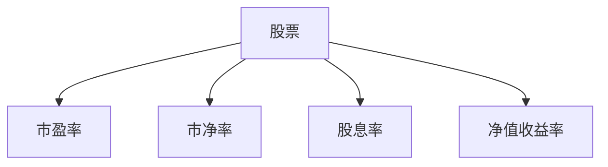
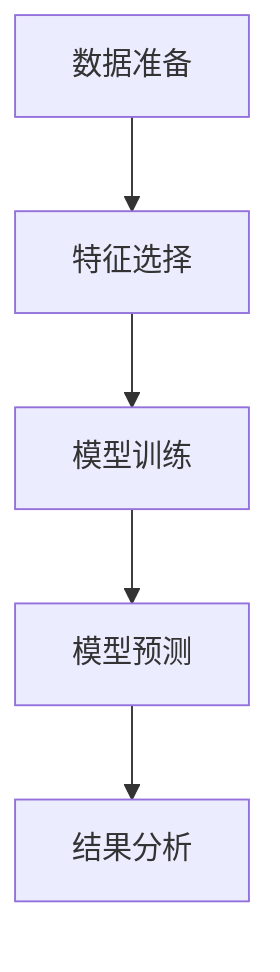
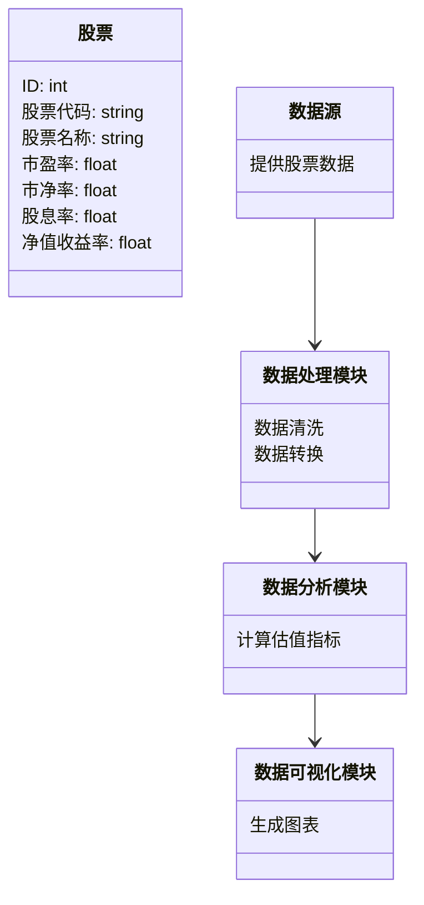
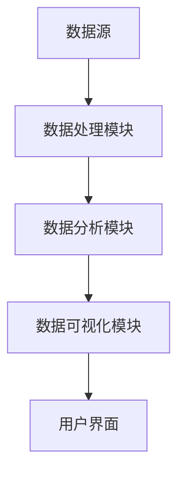
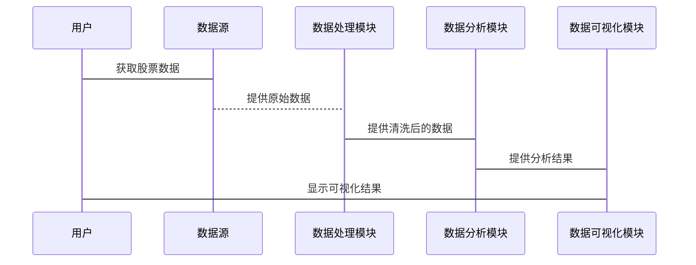

                 


# 每日更新的全球股市估值数据分析

## 关键词：全球股市，估值分析，数据采集，数据清洗，数据建模，数据可视化，投资决策

## 摘要：本文将介绍每日更新的全球股市估值数据分析的方法和应用。通过分析股市估值的核心指标，结合数据采集、清洗、建模和可视化等技术，为投资者提供科学的决策支持。文章从背景、概念、算法、系统架构、项目实战到最佳实践，全面解析股市估值分析的全过程。

---

# 第1章: 全球股市估值分析的背景与重要性

## 1.1 股市估值分析的定义与目标

### 1.1.1 股市估值分析的定义
股市估值分析是通过对股票价格、公司财务数据等信息的分析，评估股票的内在价值，从而判断其是否被市场合理定价的过程。

### 1.1.2 股市估值分析的重要性
- **投资决策支持**：帮助投资者做出买入、卖出或持有股票的决策。
- **风险管理**：识别高风险股票，避免重大损失。
- **市场趋势分析**：通过估值指标的变化，洞察市场的整体走势。

### 1.1.3 股市估值分析的目标
- 提供准确的估值依据。
- 发现被低估或高估的股票。
- 为投资组合优化提供数据支持。

## 1.2 全球股市估值分析的背景

### 1.2.1 全球化背景下的股市特点
- **多样性**：全球股市覆盖不同国家和行业，具有多样性。
- **波动性**：受全球经济、政治等多种因素影响，波动性较大。
- **信息不对称**：投资者获取信息的及时性和全面性影响估值准确性。

### 1.2.2 金融市场的复杂性与挑战
- **数据量大**：每天产生大量交易数据，需要高效的数据处理能力。
- **数据多样性**：包括价格、成交量、财务报表等多种数据。
- **市场波动**：突发事件可能导致市场剧烈波动，增加分析难度。

### 1.2.3 数据驱动的分析需求
- **技术进步**：大数据和人工智能技术为股市分析提供了新的工具。
- **需求增长**：投资者对数据驱动的分析需求日益增加。
- **监管要求**：监管机构要求金融机构提高透明度，推动数据驱动的分析。

## 1.3 股市估值分析的核心要素

### 1.3.1 市盈率（P/E Ratio）
- **定义**：市盈率是股票价格与每股净利润的比率，用于衡量股票的估值水平。
- **公式**：$$ P/E = \frac{\text{股价}}{\text{每股净利润}} $$
- **应用**：用于比较股票的相对估值，判断是否被高估或低估。

### 1.3.2 市净率（P/B Ratio）
- **定义**：市净率是股票价格与每股净资产的比率，用于评估股票的价值。
- **公式**：$$ P/B = \frac{\text{股价}}{\text{每股净资产}} $$
- **应用**：适用于评估银行、保险公司等资产-heavy行业的股票。

### 1.3.3 股息率（Dividend Yield）
- **定义**：股息率是每股股息与股价的比率，用于衡量投资回报。
- **公式**：$$ Dividend Yield = \frac{\text{每股股息}}{\text{股价}} $$
- **应用**：用于评估股票的分红能力，适合注重分红的投资者。

### 1.3.4 净值收益率（ROE）
- **定义**：净值收益率是净利润与净资产的比率，用于衡量公司的盈利能力。
- **公式**：$$ ROE = \frac{\text{净利润}}{\text{净资产}} $$
- **应用**：用于评估公司的盈利能力，是选股的重要指标之一。

---

## 1.4 本章小结
本章介绍了全球股市估值分析的背景、重要性及核心要素，为后续的分析奠定了基础。通过理解这些概念，读者可以更好地进行股市估值分析，为投资决策提供支持。

---

# 第2章: 股市估值分析的核心概念与联系

## 2.1 核心概念原理

### 2.1.1 市盈率的计算与应用
- **计算方法**：市盈率 = 股价 / 每股净利润。
- **应用案例**：假设A公司股价为10元，每股净利润为2元，市盈率为5倍，低于行业平均水平，可能被低估。

### 2.1.2 市净率的计算与应用
- **计算方法**：市净率 = 股价 / 每股净资产。
- **应用案例**：假设B公司股价为20元，每股净资产为5元，市净率为4倍，低于行业平均水平，可能被低估。

### 2.1.3 股息率的计算与应用
- **计算方法**：股息率 = 每股股息 / 股价。
- **应用案例**：假设C公司每股股息为1元，股价为10元，股息率为10%，高于行业平均水平，适合注重分红的投资者。

### 2.1.4 净值收益率的计算与应用
- **计算方法**：净值收益率 = 净利润 / 净资产。
- **应用案例**：假设D公司净利润为1000万元，净资产为5000万元，净值收益率为20%，高于行业平均水平，说明公司盈利能力强。

## 2.2 核心概念对比分析

### 2.2.1 市盈率与市净率的对比
| 指标 | 定义 | 适用场景 | 优点 | 缺点 |
|------|------|----------|------|------|
| 市盈率 | 股价/每股净利润 | 适用于盈利稳定的公司 | 反映市场对收益的预期 | 不适合亏损公司 |
| 市净率 | 股价/每股净资产 | 适用于资产-heavy行业 | 反映资产的市场价值 | 不反映盈利能力 |

### 2.2.2 股息率与市盈率的对比
| 指标 | 定义 | 适用场景 | 优点 | 缺点 |
|------|------|----------|------|------|
| 股息率 | 每股股息/股价 | 适用于注重分红的投资者 | 反映分红能力 | 不反映成长性 |
| 市盈率 | 股价/每股净利润 | 适用于成长型投资者 | 反映市场对收益的预期 | 不反映分红能力 |

### 2.2.3 净值收益率与市净率的对比
| 指标 | 定义 | 适用场景 | 优点 | 缺点 |
|------|------|----------|------|------|
| 净值收益率 | 净利润/净资产 | 适用于评估公司盈利能力 | 反映盈利能力 | 不反映市场对公司的估值 |
| 市净率 | 股价/每股净资产 | 适用于资产-heavy行业 | 反映资产的市场价值 | 不反映盈利能力 |

## 2.3 实体关系图



---

## 2.4 本章小结
本章详细讲解了股市估值分析的核心概念及其之间的关系，通过对比分析和实体关系图，帮助读者更好地理解这些指标的含义和应用场景。

---

# 第3章: 股市估值分析的算法原理

## 3.1 算法原理概述

### 3.1.1 线性回归模型
- **定义**：线性回归是一种统计分析方法，用于建立自变量与因变量之间的线性关系。
- **应用**：用于预测股票价格或估值指标的变化趋势。

### 3.1.2 线性回归模型流程


### 3.1.3 线性回归模型实现
```python
import numpy as np
from sklearn.linear_model import LinearRegression

# 示例数据
X = np.array([[1], [2], [3], [4], [5]])
y = np.array([2, 4, 5, 4, 6])

# 模型训练
model = LinearRegression()
model.fit(X, y)

# 模型预测
predicted = model.predict(X)
print(predicted)
```

### 3.1.4 线性回归模型数学公式
- **损失函数**：$$ L = \sum_{i=1}^{n} (y_i - \hat{y_i})^2 $$
- **优化目标**：最小化损失函数，找到最佳拟合直线。

### 3.1.5 案例分析
假设我们有股票的价格和市盈率数据，可以使用线性回归模型预测未来的价格。

---

## 3.2 本章小结
本章介绍了线性回归模型在股市估值分析中的应用，通过流程图、代码和数学公式，详细讲解了算法的原理和实现过程。

---

# 第4章: 股市估值分析系统分析与架构设计

## 4.1 系统分析

### 4.1.1 问题场景介绍
- **数据来源**：全球股市数据，包括股票价格、财务数据等。
- **分析需求**：每天更新估值指标，支持投资决策。

### 4.1.2 项目介绍
- **项目目标**：构建一个每日更新的全球股市估值分析系统。
- **项目范围**：覆盖主要股市，支持多指标分析。

## 4.2 系统功能设计

### 4.2.1 领域模型设计


### 4.2.2 系统架构设计


## 4.3 系统接口设计

### 4.3.1 数据接口
- **输入接口**：从数据源获取原始数据。
- **输出接口**：提供清洗后的数据供分析模块使用。

### 4.3.2 分析接口
- **输入接口**：接收清洗后的数据。
- **输出接口**：输出估值指标和分析结果。

## 4.4 系统交互流程

### 4.4.1 用户与系统交互流程


---

## 4.5 本章小结
本章通过系统分析和架构设计，展示了如何构建一个高效的全球股市估值分析系统，为后续的项目实现奠定了基础。

---

# 第5章: 股市估值分析项目实战

## 5.1 环境安装与配置

### 5.1.1 环境安装
- **Python**：安装Python 3.8以上版本。
- **数据处理库**：安装Pandas、NumPy。
- **数据可视化库**：安装Matplotlib、Seaborn。
- **机器学习库**：安装Scikit-learn。

### 5.1.2 环境配置
- **虚拟环境**：使用virtualenv管理环境。
- **依赖管理**：使用Pip安装依赖包。

## 5.2 系统核心实现

### 5.2.1 数据采集模块实现
```python
import pandas as pd
import requests

# 下载数据
url = "https://example.com/stock_data.csv"
response = requests.get(url)
data = pd.read_csv(url)
print(data.head())
```

### 5.2.2 数据清洗模块实现
```python
# 清洗数据
data.dropna(inplace=True)
data = data[~data['市盈率'].isinf()]
print(data.info())
```

### 5.2.3 数据分析模块实现
```python
# 计算估值指标
data['市盈率'] = data['股价'] / data['每股净利润']
data['市净率'] = data['股价'] / data['每股净资产']
data['股息率'] = data['每股股息'] / data['股价']
data['净值收益率'] = data['净利润'] / data['净资产']
print(data.head())
```

### 5.2.4 数据可视化模块实现
```python
import matplotlib.pyplot as plt
import seaborn as sns

# 绘制市盈率分布图
plt.figure(figsize=(10,6))
sns.histplot(data['市盈率'], bins=20, kde=True)
plt.title('市盈率分布图')
plt.xlabel('市盈率')
plt.ylabel('频数')
plt.show()
```

## 5.3 实际案例分析

### 5.3.1 数据来源与处理
假设我们从Yahoo Finance获取某公司的历史数据，并进行清洗和转换。

### 5.3.2 数据分析与解读
通过计算市盈率、市净率等指标，分析该公司的估值情况。

### 5.3.3 数据可视化与报告
生成图表和报告，展示分析结果，为投资决策提供支持。

## 5.4 项目小结

### 5.4.1 项目总结
- **数据采集**：成功获取并清洗了股票数据。
- **数据分析**：计算了主要的估值指标。
- **数据可视化**：生成了直观的图表，支持投资决策。

### 5.4.2 项目经验
- **数据清洗的重要性**：确保数据的准确性和完整性。
- **模型选择的挑战**：不同行业和公司可能需要不同的分析方法。

### 5.4.3 改进建议
- **引入机器学习模型**：如随机森林，提高预测准确性。
- **多指标综合分析**：结合多个估值指标，进行综合评估。

---

## 5.5 本章小结
本章通过实际案例，展示了如何在Python环境中实现全球股市估值分析系统，从数据采集到可视化，详细讲解了每个步骤的实现方法。

---

# 第6章: 最佳实践与总结

## 6.1 最佳实践

### 6.1.1 数据处理
- **数据清洗**：确保数据的完整性和准确性。
- **数据转换**：根据需要进行数据转换，如对数变换。

### 6.1.2 数据分析
- **多指标分析**：结合市盈率、市净率等指标，进行综合评估。
- **行业对比**：将公司的估值指标与行业平均水平进行对比。

### 6.1.3 数据可视化
- **选择合适的图表**：如柱状图、折线图等。
- **图表美化**：确保图表清晰易读。

### 6.1.4 投资决策
- **动态调整**：根据市场变化，及时调整投资策略。
- **风险管理**：设置止损点，避免重大损失。

## 6.2 项目总结

### 6.2.1 核心成果
- 成功构建了每日更新的全球股市估值分析系统。
- 提供了科学的估值指标和分析报告。

### 6.2.2 经验教训
- 数据清洗和预处理是关键步骤。
- 不同行业和公司的估值指标可能差异较大，需要针对性分析。

## 6.3 注意事项

### 6.3.1 数据来源
- 确保数据的可靠性和准确性。
- 注意数据的时间戳，避免数据滞后。

### 6.3.2 模型选择
- 根据具体需求选择合适的分析方法。
- 定期更新模型，适应市场变化。

### 6.3.3 风险管理
- 设置合理的止损点，控制投资风险。
- 避免过度依赖单一指标，进行综合分析。

## 6.4 拓展阅读

### 6.4.1 推荐书籍
- 《投资学》：帮助理解投资的基本原理。
- 《Python数据分析实战》：提升数据处理和分析能力。

### 6.4.2 推荐在线资源
- [Quantitative Analysis](https://www.quantInst.com)：提供量化分析的在线课程。
- [Kaggle](https://www.kaggle.com)：提供丰富的数据集和比赛，提升实战能力。

---

## 6.5 本章小结
本章总结了项目的最佳实践，提供了投资决策的注意事项，并推荐了进一步学习的资源，帮助读者在股市估值分析领域不断进步。

---

# 结语

通过本文的详细讲解，读者可以掌握每日更新的全球股市估值数据分析的方法和应用。从背景、概念、算法、系统架构到项目实战，全面了解股市估值分析的全过程。希望本文能为投资者和数据分析师提供有价值的参考和指导。

--- 

**感谢您的耐心阅读，如果对本文有任何疑问或建议，请随时与我们联系。**

