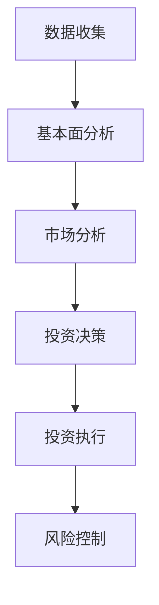

                 

# 《比尔·米勒的价值增长投资：bridging value and growth》

---

## 关键词：
- 价值投资
- 成长投资
- 投资策略
- 投资理念
- 比尔·米勒
- 股票分析

---

## 摘要：
本文深入探讨了比尔·米勒的价值增长投资理念，分析了如何将价值投资与成长投资相结合，以实现长期稳健的投资回报。文章从价值投资和成长投资的基本理论出发，结合米勒的投资实践，详细阐述了价值与成长投资的内在联系、系统分析方法、风险管理策略以及实际案例。通过本文，读者可以全面理解米勒的投资理念，并将其应用于实际投资中。

---

# 第1章：引言

## 1.1 投资的基本概念
投资是通过将资金投入到资产中，以期获得未来收益的行为。投资的核心目标是在不确定的市场环境中，通过科学的分析和决策，实现资产的保值与增值。

## 1.2 价值投资与成长投资的定义
- **价值投资**：以低于内在价值的价格买入优质资产，长期持有，等待市场重新认识其价值。
- **成长投资**：投资于具有高速成长潜力的公司，关注收入和利润的快速增长。

## 1.3 比尔·米勒的投资理念
比尔·米勒是美国著名投资经理，曾管理过长期资本增值基金（LTCVX），创造了连续15年跑赢市场的纪录。他的投资理念是将价值投资与成长投资相结合，既关注资产的内在价值，又注重公司的成长潜力。

---

# 第2章：价值投资与成长投资的背景与发展

## 2.1 价值投资的起源与发展
价值投资的理论基础源于本杰明·格雷厄姆和戴维·多德的工作。格雷厄姆提出了“安全边际”概念，强调以低于内在价值的价格买入资产。

## 2.2 成长投资的起源与发展
成长投资的代表人物包括菲德·费雪和彼得·林奇。他们强调投资于具有高速成长潜力的公司，关注公司的收入增长率和利润率。

## 2.3 价值与成长投资的融合
比尔·米勒将价值投资的纪律性和成长投资的前瞻性结合，创造了一种新的投资策略，既注重公司的基本面，又关注其未来的成长潜力。

---

# 第3章：价值与成长投资的核心概念

## 3.1 价值投资的核心原理
- **内在价值**：资产在市场中的真实价值，与市场波动无关。
- **安全边际**：买入价格与内在价值的差额，提供了投资的安全性。

## 3.2 成长投资的核心原理
- **收入增长率**：公司收入的年增长率，反映了公司的成长潜力。
- **ROE（净资产收益率）**：衡量公司盈利能力的重要指标。

## 3.3 价值与成长投资的对比
| **对比维度** | **价值投资** | **成长投资** |
|---------------|---------------|---------------|
| 投资目标       | 买入低于内在价值的资产 | 投资于高成长潜力的公司 |
| 关注点         | 资产的内在价值、安全边际 | 公司的成长性、收入增长率 |
| 投资期限       | 长期持有         | 中长期持有     |

---

# 第4章：系统分析与架构设计

## 4.1 投资策略的制定
- **数据收集**：收集公司的财务数据、行业分析报告等。
- **基本面分析**：分析公司的盈利能力、成长潜力、财务健康状况。
- **市场分析**：研究市场的整体走势和行业趋势。

## 4.2 投资决策流程

## 4.3 投资组合管理
- **分散投资**：通过投资不同行业的资产，降低投资风险。
- **动态调整**：根据市场变化和公司基本面，定期调整投资组合。

---

# 第5章：项目实战

## 5.1 案例分析：比尔·米勒的经典投资
以米勒投资某科技公司为例，分析其如何将价值与成长投资相结合。

## 5.2 投资决策过程
1. **数据收集**：分析公司的财务报表、行业地位等。
2. **基本面分析**：评估公司的盈利能力、成长潜力。
3. **市场分析**：研究行业趋势和市场情绪。
4. **投资决策**：综合分析，决定是否买入。

## 5.3 投资效果
通过具体案例，展示米勒的投资策略如何实现超额收益。

---

# 第6章：风险管理

## 6.1 风险管理的重要性
- **市场风险**：市场波动对资产价格的影响。
- **流动性风险**：资产变现能力的强弱。

## 6.2 风险管理策略
- **分散投资**：通过投资不同类型资产，降低风险。
- **对冲策略**：利用衍生工具对冲市场风险。

---

# 第7章：未来展望

## 7.1 投资领域的未来趋势
- **科技的影响**：人工智能和大数据在投资中的应用。
- **ESG投资**：环境、社会和治理因素在投资中的重要性。

## 7.2 价值与成长投资的融合
未来，价值与成长投资的融合将更加紧密，投资者需要更加注重资产的内在价值和公司的成长潜力。

---

# 第8章：结论

## 8.1 总结
比尔·米勒的价值增长投资理念为投资者提供了一种新的思路，通过将价值投资与成长投资相结合，实现长期稳健的投资回报。

## 8.2 实践建议
- **学习米勒的投资理念**：理解其核心思想和操作方法。
- **注重基本面分析**：在投资中注重公司的内在价值和成长潜力。
- **长期持有**：坚持价值投资的纪律性，避免短期波动的干扰。

---

## 推荐阅读
- 《价值》——张磊
- 《投资的艺术》——约翰·博格
- 《彼得·林奇的投资笔记》——彼得·林奇

---

通过本文的分析，读者可以全面理解比尔·米勒的价值增长投资理念，并将其应用于实际投资中，实现资产的长期稳健增长。

