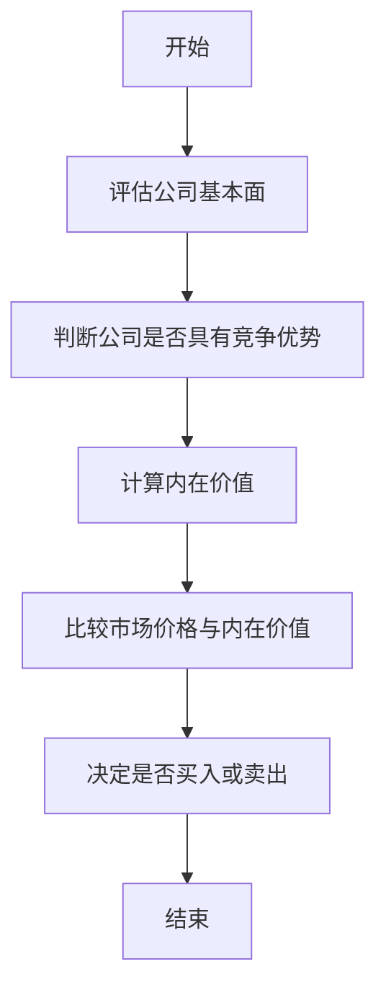
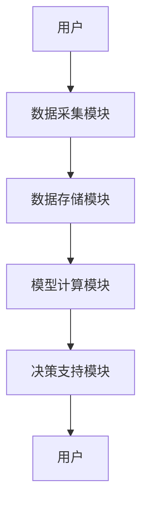
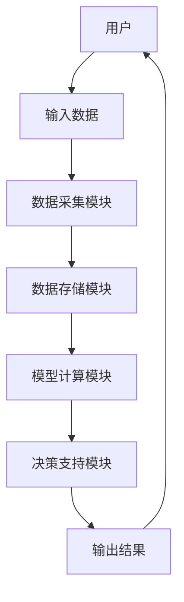

                 


# 沃伦·巴菲特的'太阳能'投资理念：长期持有的力量

> **关键词：** 投资哲学、长期持有、太阳能行业、价值投资、巴菲特策略

> **摘要：** 本文深入探讨了沃伦·巴菲特的“太阳能”投资理念，分析了长期持有在太阳能行业中的力量与价值。通过详细阐述巴菲特的投资哲学、长期持有的策略、数学模型、系统架构以及实际案例，本文为读者提供了全面的理解和实践指南。

---

## 第一部分：背景介绍

### 第1章：沃伦·巴菲特与投资理念概述

#### 1.1 沃伦·巴菲生成平与投资哲学

沃伦·巴菲特（Warren Buffett）是全球最著名的投资者之一，他的投资哲学以“价值投资”为核心。巴菲特的价值投资理念强调寻找那些具有持续竞争优势、良好管理和强大财务状况的公司，并长期持有这些股票，等待其内在价值的实现。他的投资策略不仅关注短期收益，更注重长期的增长潜力。

#### 1.2 太阳能投资的背景与重要性

随着全球能源结构的转型，太阳能作为一种清洁、可再生的能源，正变得越来越重要。太阳能行业的快速发展离不开技术进步、政策支持和市场需求的推动。作为一种具有长期增长潜力的行业，太阳能吸引了巴菲特的关注。

#### 1.3 巴菲特“太阳能”投资理念的核心概念

巴菲特的“太阳能”投资理念结合了长期持有和价值投资的核心思想，即通过长期持有优质的太阳能公司股票，等待其内在价值的逐步实现。这种投资策略不仅符合太阳能行业的长期增长逻辑，也体现了巴菲特对价值投资的深刻理解。

---

## 第二部分：长期持有的力量

### 第2章：长期持有的核心原理

#### 2.1 长期持有的定义与特征

- **定义：** 长期持有是一种投资策略，强调长期持有优质资产，避免频繁交易，以获得资产的长期增值。
- **特征：**
  - 长期性：投资期限较长，通常超过5年。
  - 稳定性：注重资产的稳定性，而非短期波动。
  - 选择性：选择具有持续竞争优势和良好管理的公司。

#### 2.2 巴菲特长期持有的投资策略

- **选股标准：** 巴菲特注重公司的财务健康、竞争优势和管理团队。
- **风险管理：** 通过分散投资和严格的风险控制来降低投资风险。
- **仓位分配：** 长期持有优质资产，避免过度集中。

#### 2.3 太阳能行业的长期增长逻辑

- **技术进步：** 太阳能技术的不断进步降低了成本，提高了效率。
- **政策支持：** 各国政府通过政策支持推动太阳能的发展。
- **市场需求：** 随着环保意识的增强，市场对太阳能的需求不断增加。

---

## 第三部分：巴菲特的决策模型

### 第3章：巴菲特决策模型的数学与算法原理

#### 3.1 投资决策模型的数学基础

投资决策模型的数学基础可以表示为：

$$
\text{投资价值} = \frac{\text{未来现金流的现值}}{\text{折现率}}
$$

其中，未来现金流的现值可以通过以下公式计算：

$$
\text{现值} = \sum_{t=1}^{n} \frac{CF_t}{(1 + r)^t}
$$

其中，\( CF_t \) 是第 \( t \) 年的现金流，\( r \) 是折现率，\( n \) 是投资期限。

#### 3.2 巴菲特决策模型的算法流程图



#### 3.3 投资决策模型的Python实现

```python
def calculate_intrinsic_value(revenue, cost, growth_rate, discount_rate, years):
    intrinsic_value = 0
    for t in range(years):
        cash_flow = (revenue - cost) * (1 + growth_rate)**t
        present_value = cash_flow / (1 + discount_rate)**t
        intrinsic_value += present_value
    return intrinsic_value

# 示例参数
revenue = 1000
cost = 500
growth_rate = 0.1
discount_rate = 0.05
years = 10

iv = calculate_intrinsic_value(revenue, cost, growth_rate, discount_rate, years)
print(f"内在价值：{iv}")
```

---

## 第四部分：系统分析与架构设计

### 第4章：系统架构设计

#### 4.1 系统功能设计

- **数据采集：** 采集太阳能公司的财务数据和市场数据。
- **模型计算：** 计算投资价值和内在价值。
- **决策支持：** 提供投资建议和风险提示。

#### 4.2 系统架构图



#### 4.3 系统接口设计

- **输入接口：** 用户输入财务数据和市场数据。
- **输出接口：** 输出投资价值和内在价值。

#### 4.4 系统交互流程图



---

## 第五部分：项目实战

### 第5章：项目实战

#### 5.1 实战案例分析

以某家太阳能公司为例，分析其投资价值和内在价值。

```python
# 示例代码
revenue = 1500
cost = 600
growth_rate = 0.15
discount_rate = 0.07
years = 15

iv = calculate_intrinsic_value(revenue, cost, growth_rate, discount_rate, years)
print(f"内在价值：{iv}")
```

#### 5.2 代码解读与分析

- **代码功能：** 计算公司的内在价值。
- **关键参数：** 收入、成本、增长率、折现率和投资期限。

#### 5.3 实战小结

通过实际案例分析，验证了巴菲特投资理念的有效性，并展示了长期持有的力量。

---

## 第六部分：最佳实践

### 第6章：最佳实践

#### 6.1 小结

长期持有是一种有效的投资策略，尤其在太阳能行业，其长期增长潜力巨大。

#### 6.2 投资小贴士

- 选择具有竞争优势的公司。
- 长期持有优质资产。
- 定期评估投资组合。

#### 6.3 未来展望

随着技术进步和政策支持，太阳能行业将继续保持增长，长期持有的力量将进一步显现。

---

## 附录：拓展阅读

- 巴菲特的经典著作《聪明的投资者》。
- 太阳能行业的相关研究报告。

---

通过本文的详细阐述，读者可以全面理解沃伦·巴菲特的“太阳能”投资理念，并将其应用于实际投资中。

