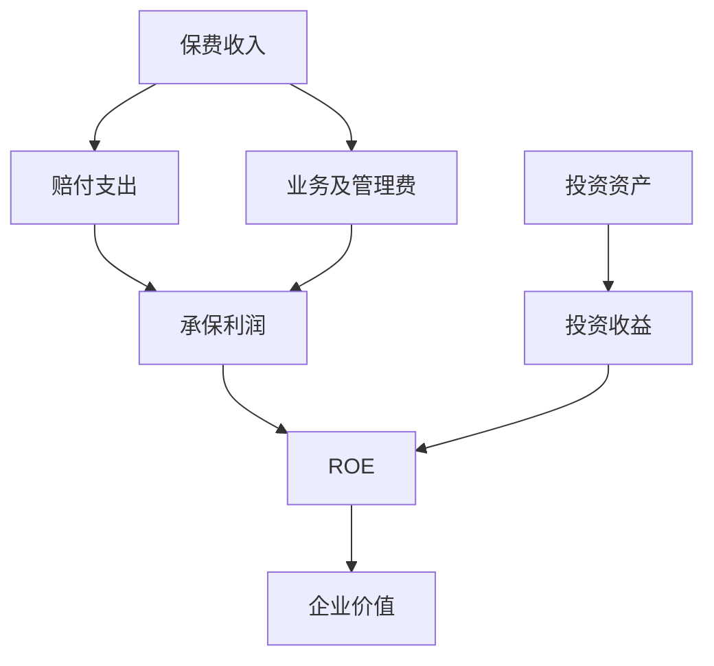
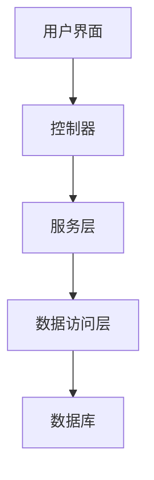
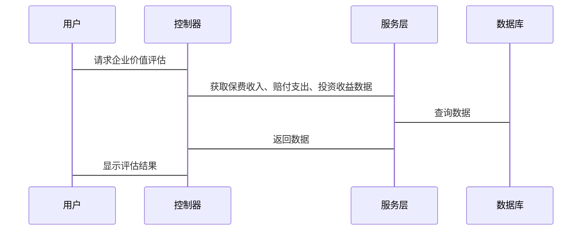

                 


# 第二章: 保险企业的价值评估

## 2.1 保险企业的核心价值指标

### 2.1.1 保险公司的主要价值驱动因素

保险公司的价值不仅仅体现在其当前的财务状况，更重要的是其未来的盈利能力。以下是影响保险公司价值的核心指标：

- **净资产收益率（ROE）**：衡量公司使用股东资金的效率。
- **保费收入增长率**：反映公司业务扩展的速度。
- **赔付率**：影响公司的成本结构和盈利能力。
- **承保利润**：直接体现保险业务的盈利能力。
- **投资收益**：影响公司整体收益的重要部分。

### 2.1.2 核心价值指标的计算公式

#### 1. 净资产收益率（ROE）
$$
ROE = \frac{\text{净利润}}{\text{股东权益}} \times 100\%
$$

#### 2. 保费收入增长率
$$
\text{保费收入增长率} = \left( \frac{\text{本年保费收入} - \text{上年保费收入}}{\text{上年保费收入}} \right) \times 100\%
$$

#### 3. 赔付率
$$
\text{赔付率} = \frac{\text{赔付支出}}{\text{保费收入}} \times 100\%
$$

#### 4. 承保利润
$$
\text{承保利润} = \text{保费收入} - \text{赔付支出} - \text{业务及管理费}
$$

#### 5. 投资收益
$$
\text{投资收益} = \text{投资资产} \times \text{平均投资回报率}
$$

### 2.1.3 保险企业价值评估的指标关系

我们可以将这些指标通过一个简单的模型联系起来：

$$
\text{企业价值} = \text{资产价值} + \text{未来现金流的现值}
$$

未来现金流可以通过上述指标进行估算：

$$
\text{未来现金流} = \text{保费收入} \times (1 + \text{增长率}) - \text{赔付支出} - \text{业务及管理费} + \text{投资收益}
$$

### 2.1.4 案例分析：伯克希尔 Hathaway 的价值评估

以伯克希尔 Hathaway 为例，我们可以通过以下步骤进行价值评估：

1. 计算ROE：
   $$
   ROE = \frac{\$8,000 \text{ million 净利润}}{\$120,000 \text{ million 股东权益}} = 6.67\%
   $$

2. 评估保费收入增长率：
   $$
   \text{增长率} = \left( \frac{\$150,000 \text{ million 本年保费收入} - \$140,000 \text{ million 上年保费收入}}{\$140,000 \text{ million} \right) \times 100\% = 6.67\%
   $$

3. 计算赔付率：
   $$
   \text{赔付率} = \frac{\$90,000 \text{ million 赔付支出}}{\$150,000 \text{ million 保费收入}} = 60\%
   $$

4. 评估承保利润：
   $$
   \text{承保利润} = \$150,000 \text{ million} - \$90,000 \text{ million} - \$20,000 \text{ million} = \$40,000 \text{ million}
   $$

5. 计算投资收益：
   $$
   \text{投资收益} = \$100,000 \text{ million} \times 5\% = \$5,000 \text{ million}
   $$

6. 总体利润：
   $$
   \text{总体利润} = \$40,000 \text{ million} + \$5,000 \text{ million} = \$45,000 \text{ million}
   $$

通过这些指标的计算，我们可以初步评估伯克希尔 Hathaway 的企业价值和未来的盈利能力。

### 2.1.5 系统分析：保险企业价值评估模型

我们可以将上述指标整合到一个系统模型中，通过mermaid图展示其关系：



这个模型展示了各指标之间的相互关系和影响。

---

## 2.2 巴菲特的安全边际理论

### 2.2.1 安全边际的定义与作用

安全边际是巴菲特投资策略中的核心概念，它指的是股票的市场价格低于其内在价值的部分。安全边际的存在为投资提供了缓冲区，以避免因市场价格波动带来的损失。

#### 安全边际的计算公式

$$
\text{安全边际} = \text{内在价值} - \text{市场价格}
$$

### 2.2.2 安全边际在保险投资中的应用

在保险投资中，巴菲特通常选择那些具有强大财务实力和良好管理团队的保险公司。他通过评估保险公司的ROE、保费收入增长率和赔付率等指标，来确定其内在价值，并确保买入价格低于内在价值。

### 2.2.3 安全边际与企业估值的关系

通过安全边际，巴菲特确保了投资的长期稳定性。即使市场价格短期波动，只要内在价值不变，安全边际的存在将最终带来收益。

### 2.2.4 案例分析：伯克希尔 Hathaway 的安全边际

以伯克希尔 Hathaway 为例，假设其内在价值为 \$200 亿，市场价格为 \$150 亿，则安全边际为：

$$
\text{安全边际} = \$200 \text{亿} - \$150 \text{亿} = \$50 \text{亿}
$$

这为投资提供了50%的安全空间。

---

## 2.3 保险资金运用的策略与原则

### 2.3.1 保险资金运用的基本原则

1. **资本充足性原则**：确保保险公司有足够的资本应对潜在的赔付需求。
2. **资产流动性原则**：保持部分资产的流动性，以应对短期资金需求。
3. **收益稳定性原则**：通过多元化投资，确保投资收益的稳定性。

### 2.3.2 巴菲特保险投资的策略分析

巴菲特通常采取以下策略：

1. **长期投资**：注重公司的长期价值，而非短期价格波动。
2. **价值投资**：选择那些具有强大财务实力和良好管理团队的公司。
3. **分散投资**：通过多元化投资降低风险。

### 2.3.3 保险资金的分配策略

保险资金通常分为以下几部分：

- **流动资金**：用于应对短期赔付需求。
- **固定收益投资**：如债券，提供稳定的收益。
- **股票投资**：选择具有长期增长潜力的公司。

通过合理的资金分配，保险公司可以在确保流动性和安全性的同时，追求较高的投资收益。

---

## 2.4 保险与投资的平衡之道

### 2.4.1 保险业务与投资业务的协同效应

1. **保险业务对投资业务的支持**：通过稳定的保费收入，为投资提供资金支持。
2. **投资收益对保险业务的反哺作用**：投资收益可以增强保险公司的财务实力，降低保费成本。

### 2.4.2 保险与投资的协同发展策略

1. **优化资产配置**：根据市场环境调整投资组合。
2. **加强风险管理**：通过分散投资降低风险。
3. **提升投资能力**：培养专业投资团队，提高投资收益。

### 2.4.3 案例分析：伯克希尔 Hathaway 的协同效应

伯克希尔 Hathaway 通过持有大量的优质股票和债券，实现了保险业务与投资业务的协同发展。例如，其持有的可口可乐股票为其带来了稳定的股息收入，同时增强了公司的财务实力。

---

## 2.5 保险业投资的数学模型与公式

### 2.5.1 内在价值的计算公式

$$
\text{内在价值} = \sum_{t=1}^{n} \frac{\text{现金流}_t}{(1 + r)^t}
$$

其中，\( r \) 是折现率，\( \text{现金流}_t \) 是第 \( t \) 年的现金流。

### 2.5.2 安全边际的计算公式

$$
\text{安全边际} = \text{内在价值} - \text{市场价格}
$$

### 2.5.3 投资组合的优化模型

使用均值-方差模型优化投资组合：

$$
\min_{w} \sigma^2 = w^T \Sigma w
$$

$$
\text{subject to} \quad w^T \mu = r
$$

其中，\( w \) 是投资权重向量，\( \Sigma \) 是资产收益率的协方差矩阵，\( \mu \) 是资产收益率的均值向量，\( r \) 是目标收益。

---

## 2.6 系统分析与架构设计

### 2.6.1 系统功能设计

我们可以通过构建一个简单的系统模型来分析保险企业的价值评估：


### 2.6.2 系统架构设计

保险企业价值评估系统的架构如下：



### 2.6.3 系统接口设计

1. **保费收入接口**：获取保费收入数据。
2. **赔付支出接口**：获取赔付支出数据。
3. **投资收益接口**：获取投资收益数据。

### 2.6.4 系统交互设计



---

## 2.7 项目实战

### 2.7.1 环境安装

安装所需的工具和环境，例如Python、Jupyter Notebook、Mermaid工具等。

### 2.7.2 核心代码实现

以下是一个简单的Python代码示例，用于计算保险公司的ROE：

```python
# 计算ROE
净利润 = 8000  # 单位：百万美元
股东权益 = 120000  # 单位：百万美元
ROE = (净利润 / 股东权益) * 100
print(f"ROE = {ROE}%")
```

### 2.7.3 案例分析与解读

以伯克希尔 Hathaway 为例，分析其ROE、保费收入增长率等指标，并评估其内在价值。

### 2.7.4 项目小结

通过实际案例分析和代码实现，我们可以更好地理解保险企业的价值评估和巴菲特的投资策略。

---

## 2.8 最佳实践

### 2.8.1 小结

保险企业的价值评估需要综合考虑多个指标，包括ROE、保费收入增长率、赔付率等。巴菲特的安全边际理论和长期投资策略为投资者提供了重要的指导。

### 2.8.2 注意事项

- 保险投资需要长期关注公司的财务状况和市场环境。
- 投资者应避免短期波动带来的影响，注重长期价值。

### 2.8.3 拓展阅读

建议阅读巴菲特的《股东的权力》和《巴菲特致股东的信》，以深入了解其投资理念。

---

通过以上分析，我们可以更好地理解保险企业的价值评估和巴菲特的投资逻辑，并在实际投资中加以应用。

