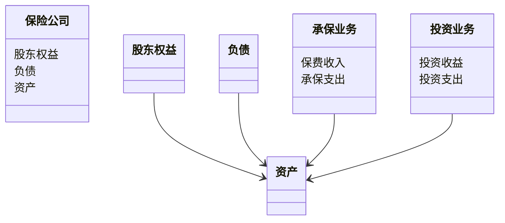

                 


# 《沃伦·巴菲特的保险行业投资模式解析》

---

## 关键词：
沃伦·巴菲特，保险行业，投资模式，价值投资，安全边际，内在价值

---

## 摘要：
本文深入解析了沃伦·巴菲特在保险行业的投资模式，探讨了他的价值投资理念、安全边际策略以及内在价值评估方法。通过分析保险行业的特点和财务结构，结合实际案例，揭示了巴菲特如何通过长期稳定的保险投资实现财富增长。文章结构清晰，内容详实，适合投资者和研究者参考。

---

## 第1章 沃伦·巴菲特的投资理念概述

### 1.1 投资的基本概念
#### 1.1.1 投资的定义与分类
投资是指将资金投入某种资产或项目，以期在未来获得收益的行为。根据投资对象的不同，可以分为股票、债券、房地产等多种类型。投资的核心目标是实现资产的保值与增值。

#### 1.1.2 价值投资的起源与发展
价值投资是一种以低于内在价值的价格买入优质资产的投资策略，由本杰明·格雷厄姆和戴维·多德提出，并由巴菲特发扬光大。价值投资强调关注企业的内在价值，寻找市场低估的股票进行投资。

#### 1.1.3 巴菲特投资理念的核心思想
巴菲特的投资理念可以概括为“以合理的价格买入优秀的公司”。他强调长期投资、价值投资和安全边际，认为市场短期可能疯狂，但长期会回归理性。

### 1.2 保险行业的特点与投资价值
#### 1.2.1 保险行业的基本概念
保险行业通过收取保费，承担被保险人的风险，提供风险保障服务。保险公司通过承保和投资双轮驱动，实现利润增长。

#### 1.2.2 保险行业的商业模式与财务特征
保险公司的收入主要来自保费收入和投资收益。其商业模式具有杠杆效应，即通过少量的股东资本撬动大量负债，从而放大收益和风险。

#### 1.2.3 保险行业在巴菲特投资组合中的地位
巴菲特认为保险行业具有稳定的现金流和长期的复利效应，是实现财富增长的理想选择。他通过控股保险公司，利用其浮存金进行投资，进一步放大了投资收益。

---

## 第2章 巴菲特保险行业投资模式的背景分析

### 2.1 巴菲特对保险行业的关注点
#### 2.1.1 保险行业的风险与收益分析
保险行业面临的风险包括承保风险、市场风险和利率风险。然而，保险公司通过分散承保和长期投资可以有效降低风险，同时享受复利效应带来的收益。

#### 2.1.2 保险行业的财务杠杆效应
保险公司的财务杠杆效应体现在负债与股东权益的比值上。巴菲特利用这一杠杆效应，通过低成本的负债进行高收益的投资，放大了股东的收益。

#### 2.1.3 保险行业的长期稳定性
保险行业的收入具有较强的稳定性，保费收入不受经济周期波动的影响较大。巴菲特选择保险行业，正是看中其长期稳定的现金流和持续的复利增长。

### 2.2 巴菲特保险投资模式的形成
#### 2.2.1 巴菲特早期投资经历
巴菲特早期的投资经历使他深刻理解了价值投资的理念，注重寻找具有持续竞争优势和稳定现金流的企业。

#### 2.2.2 巴菲特保险投资模式的形成过程
通过控股保险公司，巴菲特利用浮存金进行长期投资，实现资金的保值与增值。这种模式结合了保险行业的稳定性和投资的高收益性。

#### 2.2.3 巴菲特保险投资模式的理论基础
巴菲特的保险投资模式基于价值投资理论，强调内在价值、安全边际和长期复利效应。他通过分析保险公司的财务结构和市场地位，选择具有竞争优势的企业进行投资。

---

## 第3章 保险行业投资的核心概念

### 3.1 保险行业的核心要素
#### 3.1.1 保险公司的主要业务模式
保险公司通过承保和投资双轮驱动，实现利润增长。承保业务是保费收入的主要来源，投资业务则通过资金运作实现收益。

#### 3.1.2 保险公司的财务结构
保险公司的财务结构包括股东权益、负债和资产。负债主要包括保费收入和再保险负债，资产主要包括投资资产和流动资产。

#### 3.1.3 保险公司的风险管理
保险公司通过风险评估、风险分散和风险对冲等方式，降低承保和投资风险。巴菲特强调保险公司的风险管理能力，认为这是实现长期稳定收益的关键。

### 3.2 巴菲特投资模式的核心要素
#### 3.2.1 价值投资的核心理念
价值投资强调寻找市场价格低于内在价值的股票，长期持有优质企业，实现收益增长。

#### 3.2.2 安全边际的概念与应用
安全边际是指市场价格与内在价值之间的差额。巴菲特通过寻找具有安全边际的股票，降低投资风险，提高收益的确定性。

#### 3.2.3 内在价值的计算与评估
内在价值是企业未来现金流的现值。巴菲特通过分析企业的财务状况、行业地位和竞争优势，计算其内在价值，作为投资决策的依据。

---

## 第4章 核心概念的联系与对比

### 4.1 保险行业与巴菲特投资模式的关系
#### 4.1.1 保险行业的财务特征与巴菲特投资理念的契合点
保险行业的稳定现金流和长期复利效应与巴菲特的价值投资理念高度契合，使其成为巴菲特的理想投资对象。

#### 4.1.2 保险行业的风险与巴菲特的安全边际策略
保险行业的风险通过巴菲特的安全边际策略得以有效控制。他通过分析保险公司的财务结构和市场地位，确保投资的安全性。

#### 4.1.3 保险行业的长期稳定性与巴菲特的价值投资理念
保险行业的长期稳定性与巴菲特的价值投资理念一致，他通过长期持有优质保险公司股票，实现资产的稳定增长。

### 4.2 核心概念的对比分析
#### 4.2.1 保险行业与其他行业的投资模式对比
保险行业的投资模式注重稳定性和长期性，与其他行业的高风险高收益模式形成对比。巴菲特通过选择保险行业，实现了风险与收益的平衡。

#### 4.2.2 巴菲特投资模式与其他投资模式的对比
巴菲特的投资模式以价值投资为核心，注重安全边际和内在价值，与其他短期交易和投机模式形成鲜明对比。

#### 4.2.3 巴菲特保险投资模式的创新与突破
巴菲特将价值投资理念与保险行业的特点相结合，创新出一种独特的投资模式，既利用了保险行业的杠杆效应，又发挥了价值投资的长期优势。

---

## 第5章 巴菲特保险投资模式的数学模型

### 5.1 内在价值的计算模型
内在价值的计算公式如下：

$$
\text{内在价值} = \sum_{t=1}^{\infty} \frac{\text{现金流}_t}{(1 + r)^t}
$$

其中，\( r \) 是折现率，\( \text{现金流}_t \) 是第 \( t \) 年的现金流。

#### 5.1.1 内在价值的计算步骤
1. 估计企业的未来现金流。
2. 确定合适的折现率。
3. 将未来的现金流折现，计算其现值。

#### 5.1.2 内在价值计算的案例分析
假设某保险公司未来5年的现金流分别为100、120、150、180和200万元，折现率为10%。计算其内在价值：

$$
\text{内在价值} = \frac{100}{1.1} + \frac{120}{1.1^2} + \frac{150}{1.1^3} + \frac{180}{1.1^4} + \frac{200}{1.1^5} \approx 402.30 \text{万元}
$$

### 5.2 安全边际的计算方法
安全边际可以通过以下公式计算：

$$
\text{安全边际} = \text{内在价值} - \text{市场价格}
$$

#### 5.2.1 安全边际的应用
如果某保险公司的内在价值为1000元，市场价格为800元，其安全边际为200元。巴菲特倾向于选择具有较大安全边际的股票进行投资。

---

## 第6章 系统分析与架构设计方案

### 6.1 保险行业的系统架构
保险行业的系统架构包括承保系统、理赔系统、投资系统和管理系统。各系统之间通过数据交互，实现业务流程的高效运作。

#### 6.1.1 领域模型Mermaid类图


#### 6.1.2 系统架构Mermaid架构图


---

## 第7章 项目实战

### 7.1 环境安装
安装Python和相关数据分析库，如Pandas和NumPy。

### 7.2 核心实现源代码
```python
import pandas as pd
import numpy as np

def calculate_intrinsic_value(cash_flows, discount_rate):
    return np.npv(discount_rate, cash_flows)

cash_flows = [100, 120, 150, 180, 200]
discount_rate = 0.10

iv = calculate_intrinsic_value(cash_flows, discount_rate)
print("内在价值:", iv)
```

### 7.3 实际案例分析
以巴菲特投资的某保险公司为例，分析其内在价值和安全边际，评估其投资价值。

### 7.4 项目小结
通过实际案例分析，验证巴菲特保险投资模式的有效性，总结其成功经验。

---

## 第8章 总结与展望

### 8.1 总结
本文深入分析了巴菲特在保险行业的投资模式，揭示了其价值投资理念、安全边际策略和内在价值评估方法。通过结合保险行业的特点，巴菲特实现了长期稳定的收益。

### 8.2 展望
未来的研究可以进一步探讨保险行业的数字化转型和风险管理创新，结合巴菲特的投资理念，探索新的投资模式和策略。

---

通过以上结构和内容，本文系统地解析了巴菲特的保险行业投资模式，为投资者提供了深刻的洞察和实践指导。

