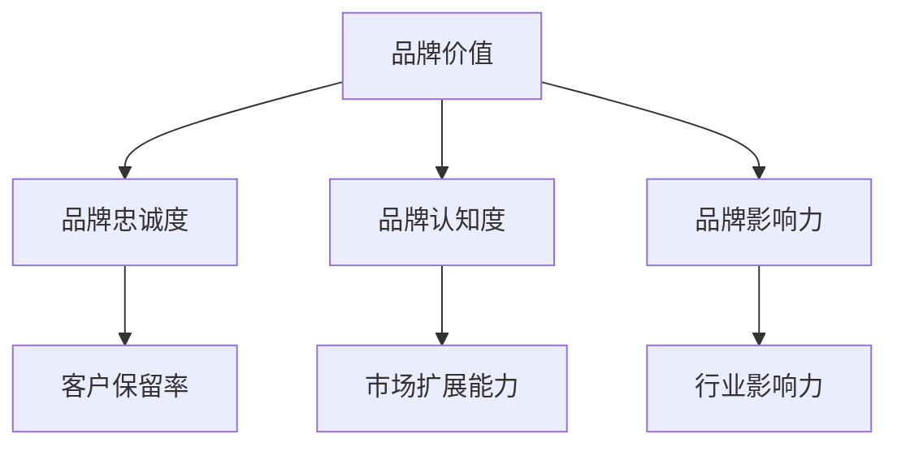
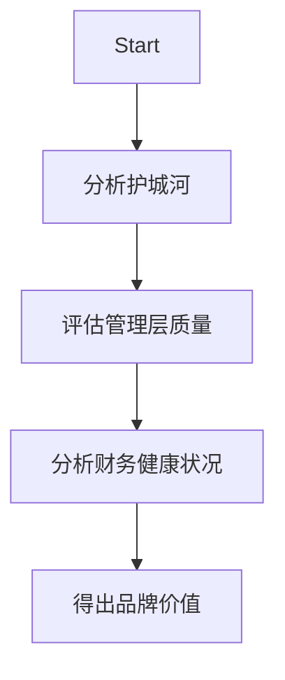
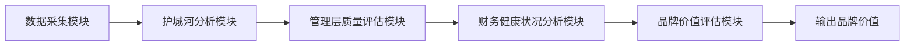
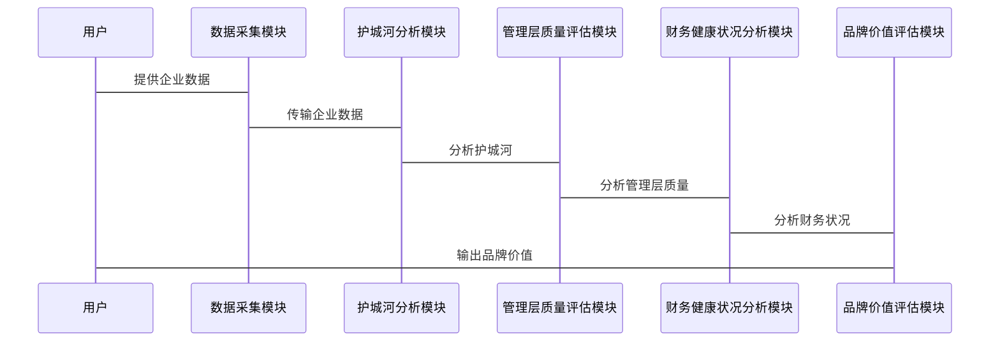

                 


# 沃伦·巴菲特的品牌价值评估方法

## 关键词：品牌价值评估，沃伦·巴菲特，投资方法，护城河分析，企业价值

## 摘要：本文深入探讨了沃伦·巴菲特的品牌价值评估方法，结合其独特投资理念，分析了品牌价值的核心概念、评估框架和数学模型，并通过实际案例展示了如何将这些方法应用于品牌价值评估中。文章结构清晰，内容详实，适合对品牌价值评估和投资分析感兴趣的专业人士阅读。

---

# 沃伦·巴菲特的品牌价值评估方法

## 第一部分：品牌价值评估的背景与核心概念

### 第1章：品牌价值评估的背景与重要性

#### 1.1 什么是品牌价值
- **1.1.1 品牌的定义与内涵**  
品牌是企业与其客户之间建立的一种信任关系，它不仅代表了企业的核心产品或服务，还承载了企业的声誉、文化和客户忠诚度。品牌价值是品牌在市场上的表现，反映了品牌在客户心中的地位和影响力。

- **1.1.2 品牌价值的构成要素**  
品牌价值由多个要素构成，包括品牌知名度、品牌忠诚度、品牌影响力、品牌创新能力和品牌文化等。这些要素共同决定了品牌在市场中的价值。

- **1.1.3 品牌价值与企业价值的关系**  
品牌价值是企业整体价值的重要组成部分。一个强大的品牌可以为企业带来更高的客户忠诚度、更强的市场竞争力和更高的利润 margins。

#### 1.2 品牌价值评估的重要性
- **1.2.1 企业投资决策中的品牌价值**  
在企业并购、品牌扩展和市场进入等决策中，品牌价值是评估目标企业或品牌的重要指标。品牌价值高的企业通常具有更强的市场地位和盈利能力。

- **1.2.2 品牌价值对企业市场价值的影响**  
品牌价值直接影响企业的市场估值。投资者通常会将品牌价值纳入企业整体估值的考量，尤其是在评估企业是否具有长期投资价值时。

- **1.2.3 品牌价值在并购中的作用**  
在企业并购中，品牌价值是决定收购价格的重要因素。一个具有强大品牌价值的企业通常能够以更高的溢价被收购。

#### 1.3 沃伦·巴菲特的品牌价值评估方法
- **1.3.1 巴菲特投资理念的核心**  
巴菲特的投资理念基于“价值投资”，即寻找具有持续竞争优势和长期盈利能力的企业。他特别关注企业的内在价值，而非短期市场波动。

- **1.3.2 巴菲特对品牌价值的关注**  
在巴菲特看来，品牌价值是企业内在价值的重要组成部分。他倾向于投资那些具有强大品牌价值和长期竞争优势的企业，因为这些企业能够持续为股东创造价值。

- **1.3.3 巴菲特品牌价值评估的独特视角**  
巴菲特的品牌价值评估方法注重企业的护城河、管理层质量和财务健康状况。他通过分析这些因素来判断企业的品牌价值和长期发展潜力。

---

## 第二部分：品牌价值评估的核心概念与联系

### 第2章：品牌价值的核心概念与联系

#### 2.1 核心概念
- **2.1.1 品牌忠诚度**  
品牌忠诚度是指客户对企业品牌或产品的忠诚程度。高品牌忠诚度意味着客户更愿意选择该品牌的产品或服务，即使在面对竞争时也是如此。

- **2.1.2 品牌认知度**  
品牌认知度是指客户对品牌的熟悉程度。高品牌认知度意味着品牌在市场上的知名度和影响力较高。

- **2.1.3 品牌影响力**  
品牌影响力是指品牌在市场中对消费者和其他市场参与者的影响程度。强大的品牌影响力通常意味着品牌具有较高的市场地位和话语权。

#### 2.2 核心概念的对比分析
- **2.2.1 品牌忠诚度与品牌认知度的对比**  
品牌忠诚度关注的是客户对品牌的忠诚程度，而品牌认知度关注的是客户对品牌的熟悉程度。两者共同构成了品牌在市场上的竞争力。

- **2.2.2 品牌影响力与品牌价值的关系**  
品牌影响力是品牌价值的重要组成部分。强大的品牌影响力通常意味着品牌具有更高的市场价值和更强的盈利能力。

#### 2.3 实体关系图


---

## 第三部分：巴菲特品牌价值评估方法的算法原理

### 第3章：巴菲特品牌价值评估方法的算法原理

#### 3.1 评估框架
- **3.1.1 护城河分析**  
护城河是指企业在市场中抵御竞争对手的能力。巴菲特特别关注那些具有宽护城河的企业，因为这些企业能够长期保持竞争优势。

- **3.1.2 管理层质量评估**  
管理层的质量是影响品牌价值的重要因素。巴菲特倾向于投资那些由有能力且诚实的管理层领导的企业。

- **3.1.3 财务健康状况分析**  
财务健康状况是评估企业品牌价值的重要指标。巴菲特关注企业的盈利能力、资产负债状况和现金流健康状况。

#### 3.2 算法流程图


---

## 第四部分：数学模型与公式

### 第4章：数学模型与公式

#### 4.1 市盈率模型
- **公式**：市盈率 = 股价 / 每股收益  
$$市盈率 = \frac{股价}{每股收益}$$  
- **示例**：假设某公司的股价为50元，每股收益为5元，则市盈率为10倍。

#### 4.2 市净率模型
- **公式**：市净率 = 股价 / 每股净资产  
$$市净率 = \frac{股价}{每股净资产}$$  
- **示例**：假设某公司的股价为50元，每股净资产为25元，则市净率为2倍。

---

## 第五部分：系统分析与架构设计

### 第5章：系统分析与架构设计

#### 5.1 问题场景介绍
- **问题场景**：品牌价值评估是一个复杂的系统工程，需要结合多个因素进行综合分析。为了实现品牌价值的系统化评估，我们可以设计一个基于巴菲特评估方法的系统架构。

#### 5.2 系统功能设计
- **功能模块**：
  - **数据采集模块**：收集企业的财务数据、市场数据和行业数据。
  - **护城河分析模块**：评估企业的竞争优势和市场地位。
  - **管理层质量评估模块**：分析企业的管理层能力和治理结构。
  - **财务健康状况分析模块**：评估企业的财务状况和盈利能力。
  - **品牌价值评估模块**：综合以上因素，计算出企业的品牌价值。

#### 5.3 系统架构设计


#### 5.4 系统接口设计
- **输入接口**：企业财务数据、市场数据、行业数据。
- **输出接口**：品牌价值评估结果。

#### 5.5 系统交互设计


---

## 第六部分：项目实战

### 第6章：项目实战

#### 6.1 环境安装
- **工具安装**：安装Python、Pandas、Matplotlib、Seaborn等数据分析工具。
- **数据获取**：获取目标企业的财务数据和市场数据。

#### 6.2 系统核心实现源代码
```python
import pandas as pd
import matplotlib.pyplot as plt
import seaborn as sns

# 数据加载
data = pd.read_csv('company_data.csv')

# 护城河分析
def moat_analysis(data):
    moat = data['moat'].mean()
    return f"护城河得分：{moat}"

# 管理层质量评估
def management_quality(data):
    quality = data['management_quality'].mean()
    return f"管理层质量得分：{quality}"

# 财务健康状况分析
def financial_health(data):
    health = data['financial_health'].mean()
    return f"财务健康状况得分：{health}"

# 品牌价值评估
def brand_value(data):
    value = data['brand_value'].mean()
    return f"品牌价值：{value}"

# 数据分析
moat_score = moat_analysis(data)
quality_score = management_quality(data)
health_score = financial_health(data)
brand_value_score = brand_value(data)

print(moat_score)
print(quality_score)
print(health_score)
print(brand_value_score)

# 可视化
plt.figure(figsize=(10,6))
sns.histplot(data['brand_value'], kde=True)
plt.title('品牌价值分布')
plt.show()
```

#### 6.3 代码应用解读与分析
- **数据加载**：从CSV文件中加载企业数据。
- **护城河分析**：计算护城河的平均得分。
- **管理层质量评估**：计算管理层质量的平均得分。
- **财务健康状况分析**：计算财务健康的平均得分。
- **品牌价值评估**：计算品牌价值的平均得分。
- **可视化**：绘制品牌价值分布的直方图。

#### 6.4 实际案例分析
- **案例选择**：以可口可乐为例，分析其品牌价值。
- **数据来源**：使用可口可乐的财务数据和市场数据。
- **分析步骤**：
  1. 数据加载。
  2. 护城河分析。
  3. 管理层质量评估。
  4. 财务健康状况分析。
  5. 品牌价值评估。
  6. 可视化分析。

#### 6.5 项目小结
- **关键发现**：通过分析可口可乐的品牌价值，可以发现其强大的品牌影响力和护城河是其高品牌价值的重要原因。
- **项目总结**：本项目通过实际案例展示了如何将巴菲特的品牌价值评估方法应用于实际分析中。

---

## 第七部分：最佳实践、小结、注意事项、拓展阅读

### 第7章：最佳实践、小结、注意事项、拓展阅读

#### 7.1 最佳实践
- **数据准确性**：确保数据来源可靠，数据清洗和预处理是关键。
- **方法适用性**：根据具体行业和企业特点，选择合适的评估方法。
- **持续学习**：品牌价值评估是一个动态过程，需要不断学习和更新评估方法。

#### 7.2 小结
- 本文详细介绍了沃伦·巴菲特的品牌价值评估方法，包括品牌价值的核心概念、评估框架、数学模型和系统设计。
- 通过实际案例分析，展示了如何将这些方法应用于品牌价值评估中。

#### 7.3 注意事项
- **数据偏差**：注意数据偏差对评估结果的影响。
- **方法局限性**：认识到评估方法的局限性，避免过度依赖单一方法。
- **行业差异**：不同行业的品牌价值评估可能需要不同的方法和指标。

#### 7.4 拓展阅读
- **推荐书籍**：《巴菲特选股术》、《价值投资实战》。
- **推荐网站**：Morningstar、FactSet、S&P Global Market Intelligence。

---

# 结语

通过本文的详细讲解，读者可以全面了解沃伦·巴菲特的品牌价值评估方法，并能够将其应用于实际的品牌价值评估中。品牌价值评估是一个复杂而重要的过程，需要结合企业的具体情况和市场环境进行综合分析。希望本文的内容能够为读者提供有价值的参考和启发。

