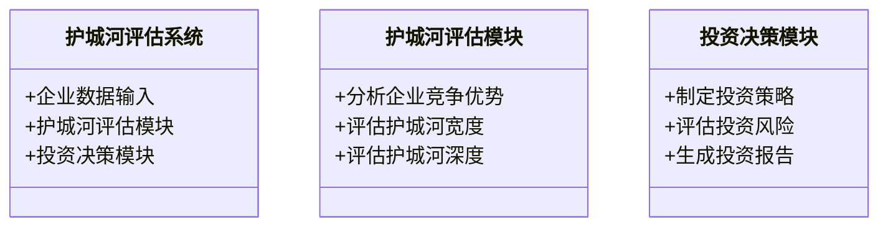
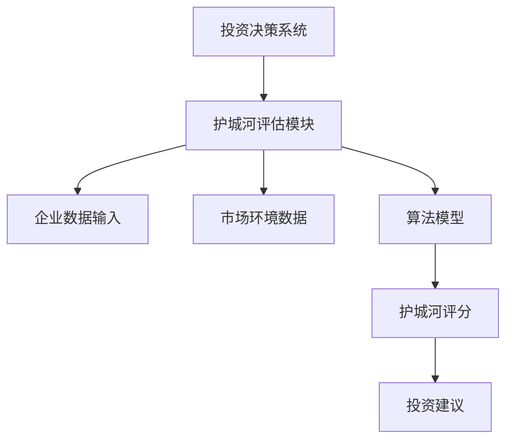
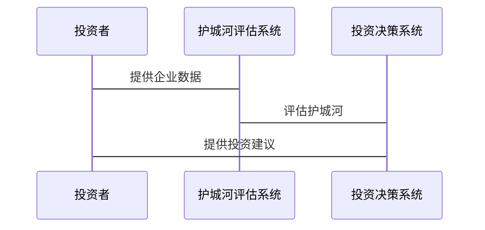

                 


# 沃伦·巴菲特的经济护城河深度分析

## 关键词
- 沃伦·巴菲特
- 经济护城河
- 投资策略
- 竞争优势
- 可持续发展

## 摘要
本文深度分析了沃伦·巴菲特的经济护城河理论，探讨了其在投资决策中的重要性。通过分析经济护城河的核心概念、形成机制、分类及其与企业价值的关系，揭示了护城河在企业竞争优势中的作用。结合实际案例，本文详细阐述了如何通过护城河理论评估企业投资价值，并提出了在现代投资环境中的应用策略。文章结构清晰，内容详实，旨在为投资者提供科学的分析框架和实用的指导。

---

# 第一部分: 经济护城河的背景与核心概念

## 第1章: 经济护城河的基本概念

### 1.1 经济护城河的定义与内涵
#### 1.1.1 什么是经济护城河
经济护城河（Economic Moat）是沃伦·巴菲特投资理论中的核心概念，指企业在行业中形成的持久竞争优势，使竞争对手难以复制或超越。这种竞争优势可以是成本优势、技术壁垒、品牌影响力或网络效应等。

#### 1.1.2 经济护城河的核心要素
1. 市场地位：企业在市场中的占有率和品牌影响力。
2. 成本优势：企业通过规模效应或独特的生产方式降低成本。
3. 技术壁垒：企业拥有专利技术或独特的创新能力。
4. 网络效应：用户数量增加时，产品或服务的价值也随之增加。

#### 1.1.3 经济护城河与竞争优势的关系
经济护城河是竞争优势的动态体现，能够帮助企业抵御竞争压力，保持长期盈利能力。

### 1.2 沃伦·巴菲特的经济护城河理论
#### 1.2.1 巴菲特投资理念的核心
巴菲特强调投资于具有宽厚护城河的企业，这些企业能够在长期的竞争中保持领先地位，为股东创造持续价值。

#### 1.2.2 护城河在巴菲特投资中的重要性
巴菲特认为，护城河是企业抵御市场风险的关键因素，能够确保企业在经济波动中依然保持盈利。

#### 1.2.3 护城河的分类与特点
1. **成本优势型**：如沃尔玛，通过规模效应降低成本。
2. **品牌影响力型**：如可口可乐，强大的品牌认知度形成市场壁垒。
3. **技术壁垒型**：如科技公司，依靠专利技术保持竞争优势。
4. **网络效应型**：如社交媒体平台，用户数量的增加提升了整体价值。

## 第2章: 经济护城河的形成与边界

### 2.1 经济护城河的形成机制
#### 2.1.1 市场地位与品牌价值
企业通过长期积累的品牌影响力和市场地位，形成竞争优势。

#### 2.1.2 成本优势与规模效应
企业通过规模化生产降低成本，形成价格优势。

#### 2.1.3 技术创新与研发投入
企业通过持续的研发投入和技术创新，保持技术领先。

### 2.2 经济护城河的边界与外延
#### 2.2.1 护城河的局限性
护城河并非一成不变，可能受到政策变化、技术进步或市场需求变化的影响。

#### 2.2.2 护城河的动态变化
护城河的强度会随着市场环境的变化而变化，企业需要持续维护和强化护城河。

#### 2.2.3 护城河的可持续性评估
评估护城河的可持续性，需要考虑行业特性、企业战略和外部环境。

---

# 第二部分: 经济护城河的核心概念与联系

## 第3章: 经济护城河的核心原理

### 3.1 护城河的经济学原理
#### 3.1.1 经济护城河的微观经济学分析
从微观层面分析护城河如何影响企业的市场地位和盈利能力。

#### 3.1.2 护城河与市场结构的关系
市场结构的不同会影响护城河的形成和强度。

#### 3.1.3 护城河与企业定价权的关联
护城河强的企业具有更强的定价权，能够在市场中制定更有利的价格。

### 3.2 护城河与企业价值的关系
#### 3.2.1 护城河宽度与企业价值的正相关性
护城河越宽，企业价值越高。

#### 3.2.2 护城河深度对企业盈利能力的影响
护城河越深，企业的盈利能力越强，抗风险能力越大。

#### 3.2.3 护城河的动态变化对企业价值的影响
护城河的变化会影响企业的长期价值，企业需要持续维护和强化护城河。

## 第4章: 经济护城河的核心概念对比

### 4.1 护城河与竞争优势的对比分析
#### 4.1.1 核心概念的异同
竞争优势是护城河的表现形式，而护城河是竞争优势的根源。

#### 4.1.2 护城河与竞争优势的相互作用
护城河的强弱直接影响竞争优势的大小。

#### 4.1.3 护城河在竞争优势中的特殊地位
护城河是竞争优势的核心要素，决定了企业的长期盈利能力。

### 4.2 护城河与企业生命周期的关系
#### 4.2.1 不同生命周期阶段的护城河特点
企业在不同生命周期阶段的护城河特点不同，成熟期企业更依赖护城河。

#### 4.2.2 护城河在企业成长中的作用
护城河能够帮助企业抵御竞争压力，保持市场份额。

#### 4.2.3 护城河的动态变化与企业成长
护城河的动态变化与企业的成长密不可分，企业需要不断强化护城河。

---

# 第三部分: 经济护城河的系统分析与应用

## 第5章: 经济护城河的系统分析

### 5.1 问题场景介绍
本文将通过实际案例分析，探讨如何利用护城河理论评估企业的投资价值。

### 5.2 系统功能设计
#### 5.2.1 领域模型设计
使用Mermaid类图展示系统的功能模块。



### 5.3 系统架构设计
#### 5.3.1 系统架构设计图
使用Mermaid架构图展示系统的整体架构。



### 5.4 系统接口设计
#### 5.4.1 护城河评估模块接口
定义接口`assess_moat`，用于评估企业的护城河宽度和深度。

#### 5.4.2 投资决策模块接口
定义接口`investment_decision`，用于根据护城河评估结果生成投资建议。

### 5.5 系统交互设计
#### 5.5.1 护城河评估模块的交互流程
使用Mermaid序列图展示系统的交互流程。



---

# 第四部分: 经济护城河的项目实战

## 第6章: 项目实战

### 6.1 环境安装
安装必要的工具和库，如Python、Pandas、Matplotlib等。

### 6.2 核心代码实现
#### 6.2.1 护城河宽度评估模型
代码实现护城河宽度的评估。

```python
def assess_moat_width(company_data):
    # 公司数据包括：市场占有率、品牌影响力、成本优势等指标
    market_share = company_data['market_share']
    brand_influence = company_data['brand_influence']
    cost_advantage = company_data['cost_advantage']
    # 计算护城河宽度
    moat_width = (market_share + brand_influence + cost_advantage) / 3
    return moat_width
```

#### 6.2.2 护城河深度评估模型
代码实现护城河深度的评估。

```python
def assess_moat_depth(company_data):
    # 公司数据包括：技术专利数、研发投入、创新能力等指标
    patent_count = company_data['patent_count']
    r_d_investment = company_data['r_d_investment']
    innovation_ability = company_data['innovation_ability']
    # 计算护城河深度
    moat_depth = (patent_count + r_d_investment + innovation_ability) / 3
    return moat_depth
```

### 6.3 代码解读与分析
解读代码实现，分析护城河宽度和深度的计算方法。

### 6.4 实际案例分析
以实际公司为例，分析其护城河情况，并评估其投资价值。

---

# 第五部分: 经济护城河的最佳实践

## 第7章: 最佳实践

### 7.1 小结
总结护城河理论的核心内容和实际应用。

### 7.2 注意事项
提醒投资者在实际操作中需要注意的问题。

### 7.3 拓展阅读
推荐进一步学习护城河理论的相关书籍和资源。

---

# 结语

本文从理论到实践，全面分析了沃伦·巴菲特的经济护城河理论，为企业投资者提供了科学的分析框架和实用的指导。通过实际案例和系统设计，帮助读者更好地理解和应用护城河理论，提升投资决策的科学性和准确性。

--- 

以上是文章的大纲和部分内容，希望对您有所帮助。

