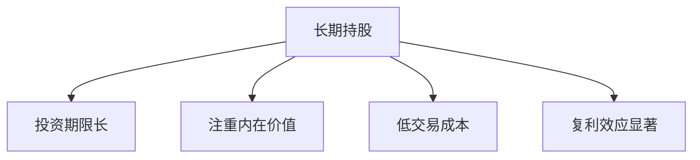
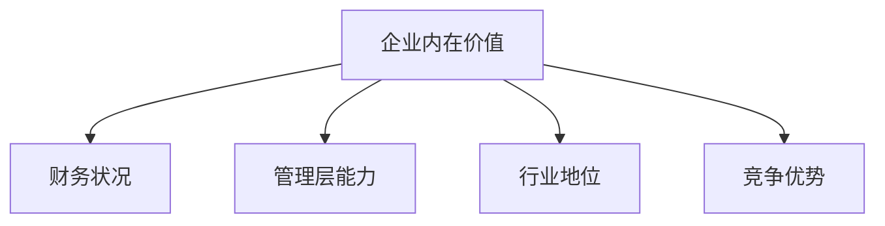
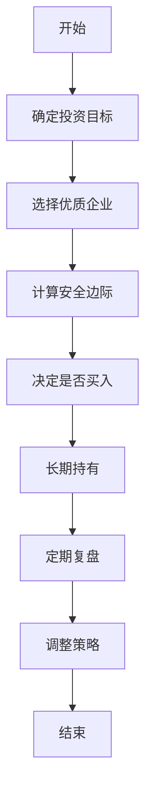
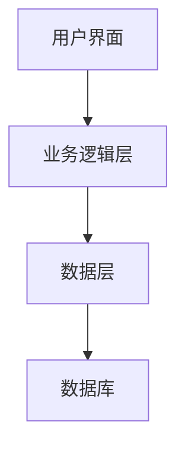

                 


```markdown
# 沃伦·巴菲特的长期持股策略分析

## 关键词
- 长期持股、巴菲特、价值投资、投资策略、复利效应

## 摘要
本文详细分析了沃伦·巴菲特的长期持股策略，从其投资哲学、核心概念到实际应用，层层剖析。通过背景介绍、核心概念分析、算法原理讲解、系统设计、项目实战和最佳实践，全面阐述了长期持股策略的理论与实践。文章结合数学模型和实际案例，帮助读者深入理解并应用这一策略。

## 第一部分: 长期持股策略的背景介绍

### 第1章: 投资哲学与长期持股概述

#### 1.1 巴菲特投资哲学的核心理念
##### 1.1.1 价值投资的定义与内涵
价值投资是一种以企业的内在价值为基础的投资策略，强调购买价格低于内在价值的股票。巴菲特认为，市场先生的情绪波动为理性投资者提供了买入优质资产的机会。

##### 1.1.2 长期持股在价值投资中的地位
长期持股是价值投资的核心，巴菲特认为频繁交易会增加成本并降低收益。长期持有优质资产，能够最大化复利效应。

##### 1.1.3 巴菲特投资哲学的演变与影响
巴菲特的投资哲学从早期的烟蒂投资逐步发展为买入并持有优质企业的策略，对全球投资者产生了深远影响。

#### 1.2 长期持股策略的背景与现状
##### 1.2.1 长期持股的定义与特点
长期持股是指投资者买入优质股票后长期持有，不因短期市场波动而频繁交易。其特点包括稳定性、低交易成本和复利效应。

##### 1.2.2 长期持股与短期投资的对比
长期持股注重企业内在价值，而短期投资关注市场波动。长期策略适合风险承受能力强的投资者，短期策略适合追求短期收益的投资者。

##### 1.2.3 当前市场环境下的长期持股趋势
近年来，全球市场波动加剧，长期持股策略因其稳定性受到更多投资者青睐。

#### 1.3 长期持股的理论基础
##### 1.3.1 复利效应与长期投资的关系
复利效应是长期持股的核心动力，$$ FV = PV \times (1 + r)^n $$，其中PV为本金，r为年收益率，n为年数。

##### 1.3.2 安全边际的概念与应用
安全边际=内在价值-市场价格，确保买入价格低于内在价值，降低投资风险。

##### 1.3.3 股东权益与企业价值评估
巴菲特强调企业价值评估，包括ROE、ROA等指标，确保投资标的具备长期竞争优势。

### 第2章: 巴菲特长期持股策略的核心要素

#### 2.1 长期持股策略的定义与分类
##### 2.1.1 长期持股的定义
长期持股策略是指投资者买入优质股票后长期持有，不因短期市场波动而改变投资决策。

##### 2.1.2 长期持股与其他投资策略的对比
通过对比持有期、风险承受能力、交易频率等方面，分析长期持股的优劣势。

##### 2.1.3 长期持股的分类
根据投资目标和策略，长期持股可以分为防御型、增长型和价值型三种类型。

#### 2.2 长期持股策略的实施步骤
##### 2.2.1 确定投资目标与策略
明确投资目标，制定投资计划，选择适合的股票。

##### 2.2.2 选择优质企业与管理层
评估企业的财务状况、管理层能力和行业地位，选择具备长期竞争优势的企业。

##### 2.2.3 定期复盘与调整策略
定期检查投资组合，评估表现，根据市场变化调整投资策略。

#### 2.3 长期持股策略的数学模型与公式
##### 2.3.1 复利计算公式
$$ FV = PV \times (1 + r)^n $$

##### 2.3.2 安全边际计算公式
$$ \text{安全边际} = \text{内在价值} - \text{市场价格} $$

---

## 第二部分: 长期持股策略的核心概念与联系

### 第3章: 长期持股策略的核心概念分析

#### 3.1 长期持股的定义与属性
##### 3.1.1 长期持股的定义
通过mermaid图展示长期持股的定义和核心属性。



##### 3.1.2 长期持股与其他投资策略的对比
通过表格对比长期持股、短线交易和趋势投资的优劣势。

| 投资策略 | 持股时间 | 风险承受 | 交易频率 |
|----------|----------|----------|----------|
| 长期持股 | 长期     | 低       | 低       |
| 短线交易 | 短期     | 高       | 高       |
| 趋势投资 | 中期     | 中       | 中       |

#### 3.2 长期持股策略的核心要素
##### 3.2.1 企业内在价值评估
通过mermaid图展示企业内在价值评估的关键因素。



##### 3.2.2 安全边际的重要性
通过公式和案例分析，解释安全边际在降低投资风险中的作用。

##### 3.2.3 复利效应的数学模型
通过数学公式和实例，解释复利效应如何在长期持股中发挥作用。

---

## 第三部分: 长期持股策略的算法原理讲解

### 第4章: 长期持股策略的算法实现

#### 4.1 算法原理概述
##### 4.1.1 长期持股策略的决策流程
通过mermaid图展示长期持股策略的决策流程。



##### 4.1.2 算法的核心逻辑
根据企业基本面、安全边际和市场环境，决定是否买入并长期持有。

#### 4.2 算法的数学模型与公式
##### 4.2.1 内在价值计算公式
$$ \text{内在价值} = \sum_{t=1}^{n} \frac{CF_t}{(1 + r)^t} $$

##### 4.2.2 安全边际计算公式
$$ \text{安全边际} = \text{内在价值} - \text{市场价格} $$

##### 4.2.3 复利效应的数学模型
$$ FV = PV \times (1 + r)^n $$

#### 4.3 算法实现步骤
##### 4.3.1 确定投资目标
根据投资者的风险承受能力和收益目标，确定投资目标。

##### 4.3.2 选择优质企业
通过基本面分析，选择具有长期竞争优势的企业。

##### 4.3.3 计算安全边际
比较市场价格与内在价值，确保买入价格低于内在价值。

##### 4.3.4 长期持有
买入后长期持有，定期复盘并调整策略。

---

## 第四部分: 长期持股策略的系统分析与架构设计

### 第5章: 投资分析系统的架构设计

#### 5.1 系统功能设计
##### 5.1.1 数据采集模块
从财务数据库获取企业基本面数据。

##### 5.1.2 分析模块
计算内在价值、安全边际等关键指标。

##### 5.1.3 决策模块
根据分析结果，生成投资建议。

#### 5.2 系统架构设计
##### 5.2.1 分层架构
- 数据层：负责数据的存储和管理。
- 业务逻辑层：负责分析和计算。
- 用户界面层：负责展示结果。

##### 5.2.2 模块化设计
通过mermaid图展示系统架构。



#### 5.3 系统接口设计
##### 5.3.1 数据接口
通过API获取企业基本面数据。

##### 5.3.2 分析接口
提供安全边际计算等接口。

##### 5.3.3 决策接口
生成投资建议并反馈给用户。

#### 5.4 系统交互设计
##### 5.4.1 用户登录
用户登录系统，输入用户名和密码。

##### 5.4.2 数据分析
用户选择企业，系统进行分析并展示结果。

##### 5.4.3 投资决策
用户根据分析结果，做出投资决策。

---

## 第五部分: 长期持股策略的项目实战

### 第6章: 项目实战与案例分析

#### 6.1 环境安装
##### 6.1.1 安装Python
安装Python 3.9及以上版本。

##### 6.1.2 安装依赖库
安装pandas、numpy、scikit-learn等库。

#### 6.2 核心代码实现
##### 6.2.1 数据采集模块
编写代码从数据库获取企业基本面数据。

##### 6.2.2 分析模块
编写代码计算内在价值和安全边际。

##### 6.2.3 决策模块
根据分析结果生成投资建议。

#### 6.3 代码实现与解读
##### 6.3.1 数据采集代码
```python
import pandas as pd
import requests
import json

def get_financial_data(ticker):
    url = f'https://api.example.com/financial_data/{ticker}'
    response = requests.get(url)
    data = json.loads(response.text)
    return pd.DataFrame(data)
```

##### 6.3.2 安全边际计算代码
```python
def calculate_margin_of_safety(intrinsic_value, market_price):
    return intrinsic_value - market_price
```

##### 6.3.3 投资决策代码
```python
def investment_decision(margin_of_safety):
    if margin_of_safety > 0:
        return "买入"
    elif margin_of_safety < 0:
        return "卖出"
    else:
        return "观望"
```

#### 6.4 案例分析
##### 6.4.1 实际案例
以苹果公司为例，计算其内在价值和安全边际，做出投资决策。

##### 6.4.2 代码实现
```python
# 假设苹果股票代码为AAPL
data = get_financial_data('AAPL')
intrinsic_value = data['intrinsic_value'].mean()
market_price = data['market_price'].mean()
margin_of_safety = calculate_margin_of_safety(intrinsic_value, market_price)
decision = investment_decision(margin_of_safety)
print(f"投资决策：{decision}")
```

##### 6.4.3 分析与解读
根据计算结果，做出买入、卖出或观望的投资决策，并解释其背后的逻辑。

#### 6.5 项目小结
总结项目实现的关键点，分析存在的问题及改进方向。

---

## 第六部分: 长期持股策略的最佳实践

### 第7章: 最佳实践与经验总结

#### 7.1 投资策略的注意事项
##### 7.1.1 分散投资
避免过度集中，降低风险。

##### 7.1.2 定期复盘
定期检查投资组合，评估表现。

##### 7.1.3 风险管理
设置止损点，控制风险敞口。

#### 7.2 长期持股策略的优化
##### 7.2.1 动态调整
根据市场变化，动态调整投资策略。

##### 7.2.2 技术进步
利用大数据和AI技术，提高分析效率和准确性。

#### 7.3 长期持股策略的未来展望
##### 7.3.1 数字化转型
技术进步将推动长期持股策略的数字化转型。

##### 7.3.2 全球化投资
未来，全球化投资将成为长期持股策略的重要组成部分。

#### 7.4 经验总结与投资心态
##### 7.4.1 长期心态
保持耐心和信心，避免短期波动干扰。

##### 7.4.2 理性决策
基于事实和数据，做出理性投资决策。

---

## 第七部分: 总结

### 第8章: 总结与展望

#### 8.1 总结
长期持股策略是巴菲特投资理念的核心，通过买入优质股票并长期持有，实现财富增值。本文从背景、核心概念、算法原理、系统设计、项目实战和最佳实践等多个方面，全面分析了长期持股策略的理论与实践。

#### 8.2 展望
未来，随着技术的进步和市场的变化，长期持股策略将更加注重数字化和全球化。投资者需要不断学习和适应，以应对新的挑战和机遇。

---

## 参考文献
1. 巴菲特，沃伦。《巴菲特致股东的信》
2. 《投资学原理》
3. 网络资源与学术论文

---

## 附录
- 代码示例
- 数据表格
- mermaid图
- 其他相关资料
```

