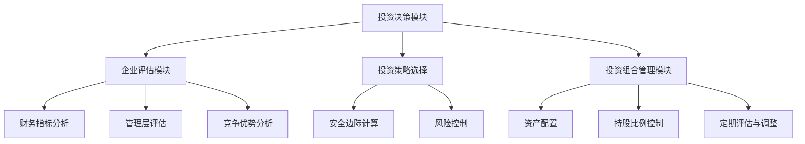

                 


# 沃伦·巴菲特：从格雷厄姆到自己的投资之路

> 关键词：沃伦·巴菲特，价值投资，投资哲学，数学模型，投资策略，系统架构

> 摘要：本文详细分析了沃伦·巴菲特的投资理念，从其导师本杰明·格雷厄姆的价值投资理论出发，逐步探讨了巴菲特如何发展出自己的投资体系。通过数学模型和系统架构的分析，深入揭示了巴菲特投资策略的核心原理，并结合实际案例，展示了其投资哲学的实践应用。

---

# 第一部分: 背景介绍

## 第1章: 沃伦·巴菲特的成长与投资理念起源

### 1.1 沃伦·巴菲特的早年经历与投资启蒙

#### 1.1.1 巴菲特的童年与成长背景
沃伦·巴菲特（Warren Buffett）于1930年8月31日出生在美国内布拉斯州的奥马哈市。他的父亲Howard Buffett是一位成功的房地产开发商和律师，母亲Leila Buffett则来自一个富裕的家庭。巴菲特从小就展现出了对数字和金融的浓厚兴趣，他在童年时期就开始阅读股票和投资相关的书籍。

#### 1.1.2 巴菲特早期的投资实践
在高中时期，巴菲特就开始尝试股票投资。他通过阅读《穆迪手册》（Mood's Manual）学习企业分析，并在14岁时用自己赚取的300美元购买了第一只股票——Cities Service Preferred。尽管这次投资最终亏损，但这段经历为他后来的投资生涯奠定了基础。

#### 1.1.3 巴菲特与导师本杰明·格雷厄姆的相遇
巴菲特进入哥伦比亚大学后，遇到了他的导师本杰明·格雷厄姆（Benjamin Graham）。格雷厄姆是价值投资理论的创始人之一，他的课程彻底改变了巴菲特的投资观念。格雷厄姆强调“安全边际”和“内在价值”的概念，这些理念成为巴菲特投资哲学的核心。

---

## 第2章: 价值投资的起源与发展

### 2.1 格雷厄姆的价值投资体系

#### 2.1.1 价值投资的定义与核心理念
价值投资是一种以低于其内在价值的价格购买优质股票的投资策略。格雷厄姆认为，市场的短期波动是不可预测的，但长期来看，股票的价格会回归其内在价值。他提出了“安全边际”（margin of safety）的概念，即以低于内在价值的价格买入股票，以降低投资风险。

#### 2.1.2 购买便宜货的投资策略
格雷厄姆的策略是寻找那些市场价格远低于其内在价值的股票。他通过分析企业的财务报表，重点关注市盈率（P/E ratio）、市净率（P/B ratio）等指标，寻找被市场低估的投资标的。

#### 2.1.3 格雷厄姆的股票筛选方法
格雷厄姆提出了一种基于财务指标的股票筛选方法，包括：
- 市盈率低于5倍
- 市净率低于1.5倍
- 股息率稳定且高于市场平均水平

---

### 2.2 巴菲特对格雷厄姆理念的吸收与转变

#### 2.2.1 巴菲特早期对格雷厄姆理念的模仿
巴菲特在早期的投资生涯中，严格遵循了格雷厄姆的价值投资理论。他在职业生涯初期购买的股票，如American Express和石油公司股票，都是基于格雷厄姆的筛选标准。

#### 2.2.2 巴菲特对价值投资的个性化发展
随着经验的积累，巴菲特逐渐将格雷厄姆的理论与自己的观察结合起来。他意识到，企业内在价值的计算不仅仅依赖于财务指标，还包括对管理层素质、企业竞争优势和行业地位的综合评估。

#### 2.2.3 巴菲特与格雷厄姆理念的分岔点
尽管巴菲特深受格雷厄姆的影响，但他最终发展出了自己的投资体系。他将价值投资的理念从“购买便宜货”扩展到“购买优秀企业”的策略，并强调长期持有的重要性。

---

## 第3章: 巴菲特的投资哲学与体系

### 3.1 巴菲特的投资理念

#### 3.1.1 长期投资与价值发现
巴菲特认为，投资的核心是找到具有强大竞争优势的企业，并长期持有。他强调，投资不是一种短期的博弈，而是通过持有优质资产来实现财富的长期增长。

#### 3.1.2 股票的安全边际
巴菲特继承了格雷厄姆的安全边际理念，但他将其扩展到更广泛的应用场景。他认为，安全边际不仅体现在价格折扣上，还包括企业竞争优势、管理层素质和财务健康状况等多个方面。

#### 3.1.3 股东权益与企业内在价值
巴菲特将企业的内在价值视为投资的核心指标。他通过分析企业的盈利能力、现金流和行业地位，计算出企业的内在价值，并将其与市场价格进行对比。

---

### 3.2 巴菲特的投资策略

#### 3.2.1 质量优先：寻找优秀的公司
巴菲特认为，投资成功的前提是选择优秀的公司。他关注企业的竞争优势、管理层素质和财务健康状况，并优先选择那些能够在长期竞争中胜出的企业。

#### 3.2.2 价格合理：安全边际的重要性
巴菲特强调，即使选择了一家优秀的企业，也必须以合理的价格买入。他通过计算企业的内在价值，并将其与市场价格进行对比，确保投资的安全边际。

#### 3.2.3 长期持有：时间的力量
巴菲特的投资策略是长期持有优质资产。他认为，频繁的买卖不仅会增加交易成本，还会错失企业长期增长的机会。通过长期持有，投资者能够分享企业的成长果实。

---

## 第4章: 巴菲特的投资实践与经典案例

### 4.1 巴菲特的经典投资案例

#### 4.1.1 可口可乐：巴菲特的长期投资
巴菲特在1988年开始投资可口可乐公司，他的买入价格为每股38.5美元。他选择可口可乐的原因在于其强大的品牌优势、稳定的现金流和高效的管理层。经过多年的持有，可口可乐的股价一路上涨，为巴菲特带来了巨大的收益。

#### 4.1.2 苹果公司：巴菲特的科技投资
尽管巴菲特早期对科技股持谨慎态度，但他最终还是投资了苹果公司。他认为苹果公司具有强大的品牌影响力和创新能力，并且管理层具备卓越的领导能力。苹果的股价表现也证明了巴菲特的选择是正确的。

#### 4.1.3 富国银行：巴菲特的金融投资
巴菲特在20世纪90年代开始投资富国银行，他认为该银行具有强大的竞争优势和稳定的盈利能力。富国银行的股价表现也证明了巴菲特的投资眼光。

---

### 4.2 巴菲特的投资失败与教训

#### 4.2.1 巴菲特的早期失败投资
在职业生涯早期，巴菲特也经历过一些失败的投资。例如，他在1951年购买的石油公司股票最终亏损了50%。这些失败的投资让巴菲特意识到，仅仅依赖财务指标是不够的，还需要综合考虑企业竞争优势和管理层素质。

#### 4.2.2 巴菲特对IBM的投资教训
巴菲特在2011年投资IBM股票，但最终亏损了约10亿美元。这次失败让巴菲特意识到，科技行业的商业模式可能与传统行业存在本质差异，他需要更加谨慎地评估科技公司的长期前景。

#### 4.2.3 巴菲特对市场的误判与反思
巴菲特在2008年金融危机期间，曾误判了市场的下跌幅度，导致他的投资组合遭受了较大损失。这次教训让巴菲特更加注重对市场周期的判断，并在投资决策中加入更多的风险控制因素。

---

# 第二部分: 巴菲特的投资体系与数学模型

## 第5章: 巴菲特投资体系的数学模型

### 5.1 企业内在价值的计算公式

#### 5.1.1 内在价值的定义与公式
企业的内在价值是指其未来现金流的现值。巴菲特通过计算企业的未来现金流，将其与市场价格进行对比，以确定是否存在投资价值。

$$ \text{内在价值} = \frac{\text{未来现金流的现值}}{\text{折现率}} $$

#### 5.1.2 现金流折现模型（DCF）

$$ DCF = \sum_{t=1}^{n} \frac{CF_t}{(1 + r)^t} + \frac{TV}{(1 + r)^n} $$

其中：
- $CF_t$：第t年的现金流
- $r$：折现率
- $TV$：终值

---

### 5.2 安全边际的数学表达

#### 5.2.1 安全边际的计算公式
安全边际是巴菲特投资体系中的重要概念，它表示市场价格与内在价值之间的差异。巴菲特认为，安全边际越大，投资风险越小。

$$ \text{安全边际} = \text{市场价格} - \text{内在价值} $$

#### 5.2.2 安全边际与投资风险的关系
$$ \text{风险} = \frac{\text{市场价格} - \text{内在价值}}{\text{内在价值}} $$

---

### 5.3 股票估值的数学模型

#### 5.3.1 市盈率与市净率的比较

$$ \text{市盈率} = \frac{\text{股价}}{\text{每股收益}} $$
$$ \text{市净率} = \frac{\text{股价}}{\text{每股净资产}} $$

---

## 第6章: 巴菲特投资体系的系统架构设计

### 6.1 问题场景介绍
巴菲特的投资体系是一个复杂的系统，包含多个模块。本文将从系统架构的角度，分析巴菲特投资体系的核心组成部分。

### 6.2 系统功能设计

#### 6.2.1 企业评估模块
- 财务指标分析：市盈率、市净率、ROE等
- 管理层评估：管理层素质、决策能力
- 竞争优势分析：品牌、技术、市场占有率

#### 6.2.2 投资决策模块
- 安全边际计算
- 投资策略选择
- 风险控制

#### 6.2.3 投资组合管理模块
- 资产配置
- 持股比例控制
- 定期评估与调整

### 6.3 系统架构设计



---

## 第7章: 项目实战

### 7.1 环境安装
为了实践巴菲特的投资理念，我们需要安装以下工具：
- 财务分析软件（如Excel、Morningstar）
- 数据分析工具（如Python、Pandas）

### 7.2 系统核心实现源代码

```python
# 计算企业内在价值
def calculate_intrinsic_value(revenue, margin, growth_rate, discount_rate):
    # 假设未来现金流 = 收入 × 边际利润率 × 增长率
    cash_flow = revenue * margin * (1 + growth_rate)
    # 现金流折现
    intrinsic_value = cash_flow / (1 + discount_rate)
    return intrinsic_value

# 计算安全边际
def calculate_margin_of_safety(price, intrinsic_value):
    return price - intrinsic_value
```

---

### 7.3 实际案例分析

#### 7.3.1 可口可乐案例分析
假设可口可乐的收入为100亿美元，边际利润率为20%，增长率5%，折现率为8%。

```python
revenue = 100  # 亿美元
margin = 0.2
growth_rate = 0.05
discount_rate = 0.08

intrinsic_value = calculate_intrinsic_value(revenue, margin, growth_rate, discount_rate)
print(f"内在价值：${intrinsic_value:.2f}亿美元")

price = 50  # 美元
margin_of_safety = calculate_margin_of_safety(price, intrinsic_value)
print(f"安全边际：${margin_of_safety:.2f}美元")
```

#### 7.3.2 苹果公司案例分析
假设苹果公司的收入为3000亿美元，边际利润率为25%，增长率3%，折现率为8%。

```python
revenue = 3000  # 亿美元
margin = 0.25
growth_rate = 0.03
discount_rate = 0.08

intrinsic_value = calculate_intrinsic_value(revenue, margin, growth_rate, discount_rate)
print(f"内在价值：${intrinsic_value:.2f}亿美元")

price = 150  # 美元
margin_of_safety = calculate_margin_of_safety(price, intrinsic_value)
print(f"安全边际：${margin_of_safety:.2f}美元")
```

---

## 第8章: 总结与展望

### 8.1 总结
巴菲特的投资体系是一个复杂的系统，包含多个核心模块。从格雷厄姆的价值投资理论出发，巴菲特发展出了自己的投资哲学，强调长期投资、安全边际和企业内在价值。通过数学模型和系统架构的分析，我们可以更清晰地理解巴菲特的投资策略。

### 8.2 展望
随着人工智能和大数据技术的发展，巴菲特的投资体系也面临着新的挑战和机遇。未来的投资者可以通过技术手段，更高效地分析企业的内在价值和竞争优势，从而优化投资决策。

---

## 第9章: 附录

### 9.1 巴菲特的经典语录
1. “价格是暂时的，价值是永恒的。”
2. “投资最重要的ことは、何かを買う前に考えて買う。”

### 9.2 推荐阅读
- 《巴菲特传》
- 《价值投资入门》
- 《股票投资实战指南》

### 9.3 工具推荐
- Python：用于数据分析和建模
- Excel：用于财务分析和报表制作
- Morningstar：用于股票分析和估值

---

通过以上分析，我们可以看到巴菲特的投资体系是一个复杂但有序的系统。从格雷厄姆的价值投资理论出发，巴菲特逐步发展出了自己的投资哲学，并通过数学模型和系统架构的分析，优化了投资决策。未来，随着技术的进步，巴菲特的投资理念将更加广泛地应用于实际投资中。

