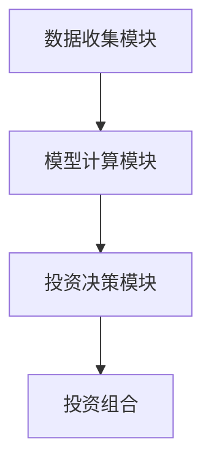

                 


# 沃伦·巴菲特：奥马哈预言家的价值投资策略

---

## 关键词：
- 沃伦·巴菲特
- 价值投资
- 投资策略
- 安全边际
- 投资组合管理
- 股票分析

---

## 摘要：
沃伦·巴菲特是全球最著名的价值投资者之一，他通过长期投资、基本面分析和安全边际等策略，实现了卓越的投资回报。本文深入分析巴菲特的价值投资理念，探讨其背后的数学模型、算法原理和系统架构，并结合实际案例，为投资者提供实用的指导。

---

# 引言

沃伦·巴菲特被誉为“奥马哈的预言家”，他通过价值投资策略在全球投资领域取得了巨大的成功。本文将从技术角度分析巴菲特的价值投资方法，揭示其背后的逻辑、算法和系统设计。

---

## 第一部分：价值投资的背景与核心理念

### 第1章：价值投资的定义与核心要素

#### 1.1 价值投资的定义
- 价值投资是一种基于公司内在价值的投资策略。
- 投资者通过分析公司的基本面，寻找被市场低估的投资标的。

#### 1.2 价值投资的核心要素
- **内在价值**：公司未来现金流的现值。
- **市场价值**：市场的买卖价格。
- **安全边际**：内在价值与市场价值之间的差异。

#### 1.3 价值投资与其它投资策略的对比
- 股票投资的三种主要策略：
  1. **价值投资**：寻找低估的股票。
  2. **成长投资**：投资高成长性的股票。
  3. **趋势投资**：跟随市场趋势进行投资。

---

### 第2章：巴菲特的价值投资理念

#### 2.1 股票的价值评估
- **内在价值计算**：
  - 使用 discounted cash flow (DCF) 模型计算公司价值。
  - 公式：$$ V = \frac{CF}{(1 + r)^n} $$
  - 其中，CF 是未来现金流，r 是贴现率，n 是时间跨度。

#### 2.2 安全边际
- 安全边际 = 内在价值 - 市场价格。
- 巴菲特强调安全边际的重要性，以降低投资风险。

#### 2.3 长期投资与复利效应
- 长期投资的核心是复利效应。
- 公式：$$ A = P(1 + r)^t $$
  - A：终值
  - P：本金
  - r：年收益率
  - t：时间

---

## 第二部分：价值投资的算法与系统架构

### 第3章：价值投资的算法原理

#### 3.1 投资决策算法
- 输入：公司基本面数据（收入、利润、现金流等）。
- 输出：是否投资该股票。
- 流程：
  1. 计算公司内在价值。
  2. 比较内在价值与市场价格。
  3. 如果市场价格 < 内在价值，投资该股票。

  mermaid 流程图：
  ```mermaid
  graph TD
    A[输入：公司基本面数据] --> B[计算内在价值]
    B --> C[比较内在价值与市场价格]
    C --> D[投资决策]
  ```

#### 3.2 投资组合管理算法
- 输入：多个股票的内在价值与市场价格。
- 输出：投资组合配置。
- 流程：
  1. 计算每个股票的安全边际。
  2. 根据安全边际排序。
  3. 分配资金到安全边际最高的股票。

---

### 第4章：系统架构设计

#### 4.1 系统功能模块
- 数据收集模块：
  - 收集公司的财务数据（收入、利润、现金流等）。
  - 数据来源：公开财报、金融数据库。
- 模型计算模块：
  - 计算内在价值、安全边际。
  - 使用 DCF 模型和其他估值方法。
- 投资决策模块：
  - 根据算法输出投资建议。
  - 生成投资组合。

#### 4.2 系统架构图


#### 4.3 系统接口设计
- 数据接口：
  - 输入：公司基本面数据。
  - 输出：内在价值、安全边际。
- 投资接口：
  - 输入：投资组合配置。
  - 输出：投资建议。

---

## 第三部分：价值投资的实战与案例分析

### 第5章：价值投资的实战案例

#### 5.1 苹果公司的分析
- **基本面分析**：
  - 收入：$$ 2745 亿美元（2022 年）$$。
  - 利润：$$ 998 亿美元（2022 年）$$。
- **内在价值计算**：
  - 使用 DCF 模型，假设现金流增长率 5%。
  - 计算结果：内在价值约为 150 美元/股。
- **市场价格**：假设苹果股价为 140 美元/股。
- **安全边际**：150 - 140 = 10 美元，安全边际为 6.67%。

#### 5.2 投资组合管理
- 投资组合配置：
  - 苹果公司：60%
  - 可口可乐：20%
  - 其他股票：20%
- 风险控制：
  - 分散投资，降低个股风险。
  - 定期再平衡投资组合。

---

### 第6章：价值投资的总结与展望

#### 6.1 总结
- 巴菲特的价值投资策略的核心是：
  1. 长期投资。
  2. 基本面分析。
  3. 安全边际。
- 技术实现：
  1. 数据收集与处理。
  2. 数学模型计算。
  3. 投资决策算法。

#### 6.2 未来展望
- **人工智能的应用**：
  - 使用机器学习模型优化基本面分析。
  - 自动化投资决策。
- **区块链技术**：
  - 提高数据透明度。
  - 实现更高效的交易执行。

---

## 第四部分：价值投资的最佳实践

### 第7章：价值投资的注意事项

#### 7.1 风险管理
- 设置止损点。
- 定期审查投资组合。
- 避免过度杠杆。

#### 7.2 投资心态
- 长期思维。
- 避免情绪化决策。
- 保持耐心。

---

### 第8章：价值投资的未来趋势

#### 8.1 数字化投资
- 使用大数据分析公司基本面。
- 应用人工智能优化投资策略。

#### 8.2 可持续投资
- 重视 ESG（环境、社会、治理）因素。
- 投资符合可持续发展的公司。

---

## 结语

沃伦·巴菲特的价值投资策略不仅是一种投资方法，更是一种长期、稳健的投资哲学。通过技术手段的辅助，投资者可以更好地理解和应用这一策略，实现长期的财富增长。

--- 

*本文基于技术角度，详细分析了巴菲特的价值投资策略，从理论到实践，结合算法、系统架构和案例分析，为投资者提供了全面的指导。*

