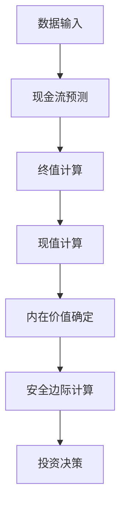
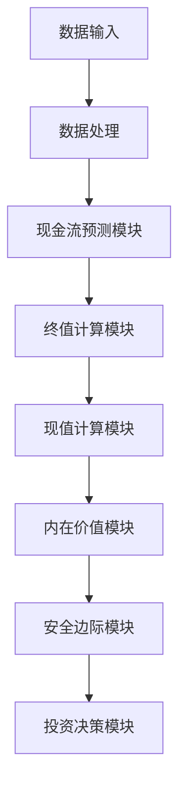

                 


# 沃伦巴菲特的并购策略分析

> 关键词：沃伦巴菲特，并购策略，内在价值，安全边际，投资哲学，价值投资

> 摘要：本文深入分析了沃伦巴菲特的并购策略，探讨了其核心理念、选股标准、安全边际、内在价值评估以及长期投资的复利效应。结合实际案例和数学模型，本文详细解读了巴菲特并购策略的逻辑和应用，为读者提供了系统化的分析框架和实践指南。

---

## 第一部分: 沃伦巴菲特并购策略的背景与基础

### 第1章: 沃伦巴菲特与并购概述

#### 1.1 沃伦巴菲特的生平与投资理念
沃伦·巴菲特（Warren Buffett）是全球最著名的职业投资人之一，被誉为“股神”。他于1934年出生在美国奥马哈市，早年通过投资股票积累了第一桶金，并在1965年收购了一家保险公司——伯克希尔哈撒韦（Berkshire Hathaway），将其转变为一家投资公司。

巴菲特的投资理念以“价值投资”为核心，强调以低于内在价值的价格买入优质资产，并长期持有。他的投资哲学包括以下几点：
1. **安全边际**：买入价格低于内在价值，确保投资的安全性。
2. **长期思维**：关注企业的长期价值，而非短期市场波动。
3. **集中投资**：将资金集中在少数优质资产上，以降低风险并提高收益。

#### 1.2 并购的基本概念与类型
并购（Mergers and Acquisitions，简称 M&A）是指一家企业合并或收购另一家企业，以实现资源优化配置和价值创造。并购可以分为以下几种类型：
1. **横向并购**：同一行业内的竞争对手合并，以扩大市场份额。
2. **纵向并购**：上下游产业的整合，以控制供应链或销售渠道。
3. **混合并购**：与主业无关的跨行业并购，通常用于多元化发展。

#### 1.3 巴菲特并购策略的背景与重要性
在现代企业竞争中，并购已成为企业快速扩张和提升竞争力的重要手段。巴菲特的并购策略的独特性在于其对内在价值的精准评估和对安全边际的严格要求。通过并购，巴菲特实现了对优质企业的长期投资，并通过复利效应实现财富的持续增长。

---

### 第2章: 巴菲特并购策略的核心要素

#### 2.1 巴菲特并购的选股标准
巴菲特的选股标准可以总结为“三好学生”：好行业、好生意、好管理层。

1. **好行业**：选择具有持续增长潜力的行业，如消费品、金融等。
2. **好生意**：企业应具备强大的竞争优势，如高利润率、稳定的现金流。
3. **好管理层**：管理层应具备诚信、智慧和决策能力。

#### 2.2 安全边际与内在价值
**安全边际**是指买入价格低于内在价值的部分，是巴菲特投资策略的核心。内在价值是企业未来现金流的现值，可以通过以下公式计算：

$$ V = \frac{CF}{r - g} $$

其中：
- \( V \) 是内在价值
- \( CF \) 是未来现金流
- \( r \) 是折现率
- \( g \) 是现金流增长率

通过安全边际的计算，巴菲特确保了投资的安全性，即使市场波动，也能以较低的风险获得超额收益。

#### 2.3 并购的长期性与复利效应
巴菲特的并购策略强调长期性，认为财富的积累依赖于复利效应。通过长期持有优质资产，投资者可以最大化收益，同时降低短期波动的影响。

---

### 第3章: 巴菲特并购策略的数学模型与分析

#### 3.1 内在价值的计算模型
内在价值的计算是巴菲特并购策略的核心。以下是现金流折现法（DCF）的步骤：

1. **预测未来现金流**：基于企业的盈利能力、增长潜力和行业状况，预测未来5-10年的现金流。
2. **计算终值**：使用永续增长率公式计算终值。
3. **计算现值**：将未来现金流和终值按折现率折算为现值。
4. **确定内在价值**：现值之和即为企业的内在价值。

以下是一个简单的现金流折现法示例：

```python
def calculate_intrinsic_value(cash_flows, discount_rate, growth_rate, years):
    intrinsic_value = 0
    for i in range(years):
        cf = cash_flows * (1 + growth_rate) ** i
        intrinsic_value += cf / (1 + discount_rate) ** i
    return intrinsic_value

# 示例
cash_flows = 1000000  # 第一年现金流
discount_rate = 0.1  # 折现率10%
growth_rate = 0.05  # 永续增长率5%
years = 10  # 预测年数

iv = calculate_intrinsic_value(cash_flows, discount_rate, growth_rate, years)
print(f"内在价值：{iv}")
```

#### 3.2 安全边际的计算
安全边际 = 内在价值 - 买入价格

通过安全边际的计算，巴菲特确保了投资的安全性。例如，如果内在价值为100元，买入价格为80元，安全边际为20元。

---

### 第4章: 巴菲特并购策略的系统架构设计

#### 4.1 系统功能设计
以下是巴菲特并购策略的系统功能设计模块图：



#### 4.2 系统架构设计
以下是系统的架构设计图：



---

### 第5章: 巴菲特并购策略的项目实战

#### 5.1 项目背景
假设我们分析一家消费品公司，目标是评估其内在价值和安全边际。

#### 5.2 数据收集与分析
1. **财务数据**：收入、利润、现金流等。
2. **行业分析**：市场规模、竞争状况、未来增长潜力。

#### 5.3 投资决策
通过现金流折现法计算内在价值，并与当前股价对比，确定安全边际。

#### 5.4 实际案例分析
以可口可乐为例，分析其内在价值和安全边际。

---

### 第6章: 巴菲特并购策略的最佳实践

#### 6.1 最佳实践
1. **长期思维**：关注企业的长期价值。
2. **安全边际**：确保买入价格低于内在价值。
3. **分散风险**：通过集中投资优质资产降低风险。

#### 6.2 小结
巴菲特的并购策略以内在价值评估为核心，强调安全边际和长期投资。通过系统的分析和实际案例的分析，我们可以更好地理解和应用这一策略。

---

### 第7章: 总结

沃伦巴菲特的并购策略以价值投资为核心，通过内在价值评估和安全边际的计算，确保投资的安全性和收益性。通过系统的分析和实际案例的实践，我们可以更好地理解和应用这一策略，实现长期的财富增长。

---

通过以上分析，我们可以看到，巴菲特的并购策略不仅是投资的指南，更是企业价值创造的典范。希望本文能为读者提供系统的分析框架和实践指南，帮助他们在投资和并购中做出明智的决策。

