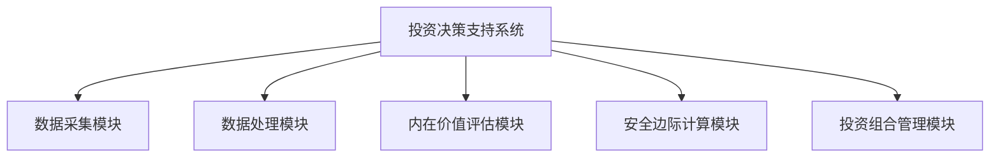

                 

# 《沃尔特·施洛斯的价值投资实践指南》

---

## 关键词：价值投资，沃尔特·施洛斯，安全边际，内在价值，低估值股票，投资策略，风险管理

---

## 摘要：本文深入探讨了沃尔特·施洛斯的价值投资理念和实践方法，结合数学模型和实际案例，系统地分析了其投资策略的核心要素，包括低估值股票的识别、安全边际的计算、投资组合的构建与优化，以及风险管理的具体实施方法。通过详细解析施洛斯的经典投资案例，本文为读者提供了可操作的价值投资指南。

---

## 第1章: 价值投资的起源与核心理念

### 1.1 沃尔特·施洛斯与价值投资的起源

#### 1.1.1 价值投资的定义与核心概念

价值投资是一种以企业内在价值为核心的投资策略，强调通过深入分析企业的财务状况、行业地位和竞争优势，寻找市场价格低于内在价值的股票进行投资。其核心理念在于“买便宜货”，即在市场价格低于企业真实价值时介入。

**核心概念对比表：**

| 概念         | 描述                                                                 |
|--------------|----------------------------------------------------------------------|
| 内在价值     | 企业未来现金流的现值，基于其盈利能力、资产质量和行业地位计算得出。|
| 市场价格     | 股票在二级市场上的交易价格，受市场情绪和短期因素影响。         |
| 安全边际     | 投资者在买入价格与内在价值之间的差距，用于降低投资风险。       |

#### 1.1.2 沃尔特·施洛斯的投资哲学

施洛斯是价值投资的代表人物之一，他的投资哲学可以总结为以下几点：
1. **长期持有**：相信市场短期波动无法预测，但长期趋势由企业价值决定。
2. **低估值优先**：寻找市场价格远低于内在价值的股票，尤其是那些被市场忽视或低估的企业。
3. **安全边际**：买入价格必须低于内在价值，以确保投资的安全性。

#### 1.1.3 价值投资与成长投资的区别

| 指标         | 价值投资                      | 成长投资                      |
|--------------|-------------------------------|-------------------------------|
| 投资目标     | 寻找低估值股票                | 寻找高成长潜力股票            |
| 关注点       | 市场价格与内在价值的差异      | 企业的成长性和未来盈利能力    |
| 投资期限     | 长期持有为主                  | 短期或中期为主                |

### 1.2 价值投资的核心理念

#### 1.2.1 市场先生理论

市场先生是价值投资者想象中的一个角色，他每天以不同的价格买卖股票。投资者的任务是识别市场先生的错误定价，并在价格低于内在价值时买入，价格高于内在价值时卖出。

#### 1.2.2 安全边际的概念

安全边际是投资价格低于内在价值的部分，公式为：
$$ 安全边际 = 内在价值 - 市场价格 $$

安全边际越大，投资的风险越小，回报的确定性越高。

#### 1.2.3 股价与内在价值的动态关系

股价围绕内在价值波动，但长期来看，股价会回归其内在价值。因此，价值投资者需要耐心等待市场先生的“定价错误”消失。

---

## 第2章: 沃尔特·施洛斯的投资策略与方法

### 2.1 低估值股票的识别与筛选

#### 2.1.1 市盈率与市净率的计算方法

市盈率（P/E）和市净率（P/B）是衡量股票估值的重要指标。

$$ P/E = \frac{市场价格}{每股收益} $$

$$ P/B = \frac{市场价格}{每股净资产} $$

#### 2.1.2 企业内在价值的评估模型

现金流折现模型（DCF）是评估企业内在价值的常用方法。

$$ 内在价值 = \sum_{t=1}^{n} \frac{CF_t}{(1 + r)^t} $$

其中，$CF_t$ 是第 $t$ 年的自由现金流，$r$ 是折现率。

#### 2.1.3 低估值股票的筛选标准

1. 市盈率低于行业平均水平。
2. 市净率低于行业平均水平。
3. 企业具有稳定的盈利能力。
4. 企业具备竞争优势和护城河。

### 2.2 安全边际的计算与应用

#### 2.2.1 安全边际的定义与作用

安全边际是投资者在买入价格与内在价值之间的保护垫，用于抵消短期市场波动带来的风险。

#### 2.2.2 安全边际的计算公式

$$ 安全边际 = 内在价值 - 市场价格 $$

#### 2.2.3 安全边际在投资决策中的应用

1. **买入决策**：当安全边际为正时，买入股票。
2. **卖出决策**：当安全边际为负时，卖出股票。

### 2.3 投资组合的构建与优化

#### 2.3.1 投资组合的分散化原则

通过投资不同行业和不同风险等级的股票，降低投资组合的整体风险。

#### 2.3.2 投资组合的风险与收益平衡

$$ 风险收益比 = \frac{预期收益}{风险} $$

---

## 第3章: 沃尔特·施洛斯的价值投资实战案例

### 3.1 经典投资案例分析

#### 3.1.1 施洛斯的经典投资案例

以某公司为例，分析其内在价值计算、市场价格波动和安全边际的应用。

#### 3.1.2 投资决策的详细分析

结合具体数据，展示如何通过低估值和安全边际原则做出投资决策。

### 3.2 投资过程中的风险控制

#### 3.2.1 风险识别与评估方法

1. 行业风险。
2. 企业基本面变化。
3. 市场波动风险。

#### 3.2.2 风险控制的具体措施

1. 保持安全边际。
2. 定期评估投资组合。
3. 适时调整持仓。

---

## 第4章: 价值投资的数学模型与公式

### 4.1 内在价值的评估公式

#### 4.1.1 现金流折现模型（DCF）

$$ 内在价值 = \sum_{t=1}^{n} \frac{CF_t}{(1 + r)^t} $$

#### 4.1.2 市盈率与市净率的比较

通过比较 P/E 和 P/B，识别低估值股票。

### 4.2 安全边际的计算公式

$$ 安全边际 = 内在价值 - 市场价格 $$

---

## 第5章: 价值投资的系统架构与工具

### 5.1 投资分析系统的构建

#### 5.1.1 系统功能模块划分

1. 数据采集与处理。
2. 内在价值评估。
3. 安全边际计算。
4. 投资组合管理。

#### 5.1.2 数据采集与处理流程

1. 从金融数据库获取股票数据。
2. 计算市盈率、市净率等指标。
3. 评估企业内在价值。

### 5.2 投资决策支持系统的架构

#### 5.2.1 系统架构图

---

## 第6章: 价值投资的实战与总结

### 6.1 实战案例分析

通过具体案例，展示如何应用施洛斯的价值投资理念进行实际操作。

### 6.2 投资策略的小结

总结价值投资的核心要点，强调低估值、安全边际和长期持有的重要性。

### 6.3 投资过程中的注意事项

1. 避免追涨杀跌。
2. 定期审视投资组合。
3. 保持对市场的敬畏之心。

### 6.4 拓展阅读

推荐价值投资领域的经典书籍和文献，帮助读者深入学习。

---

## 第7章: 价值投资的未来展望

### 7.1 价值投资的演变

价值投资在不同市场环境下的演变和创新。

### 7.2 数字化工具的应用

大数据和人工智能技术在价值投资中的应用前景。

### 7.3 风险管理的未来发展方向

结合现代风险管理技术，优化投资组合。

---

## 附录: 工具与经典文献

### 附录A: 投资分析工具推荐

推荐几款常用的价值投资分析工具，如Excel、Python、金融数据库等。

### 附录B: 经典文献

列出价值投资领域的经典书籍和论文。

---

## 结语

沃尔特·施洛斯的价值投资实践指南为投资者提供了系统化的方法和工具，帮助他们在复杂多变的市场中找到真正的投资机会。通过深入理解其理念和方法，投资者可以更好地把握价值投资的精髓，实现长期稳健的投资回报。

