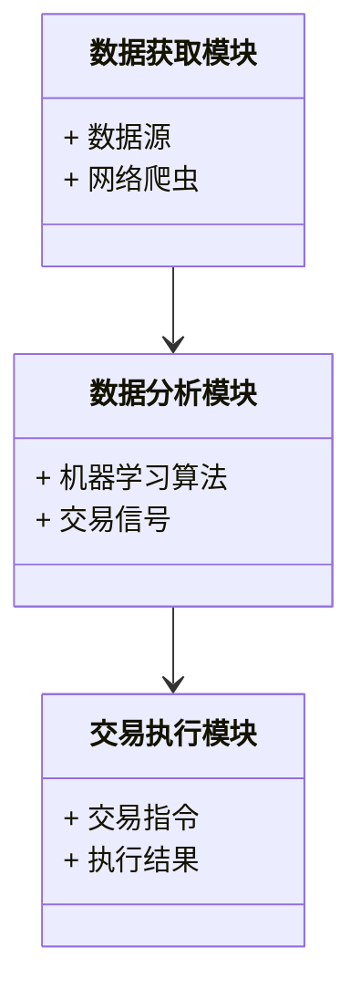
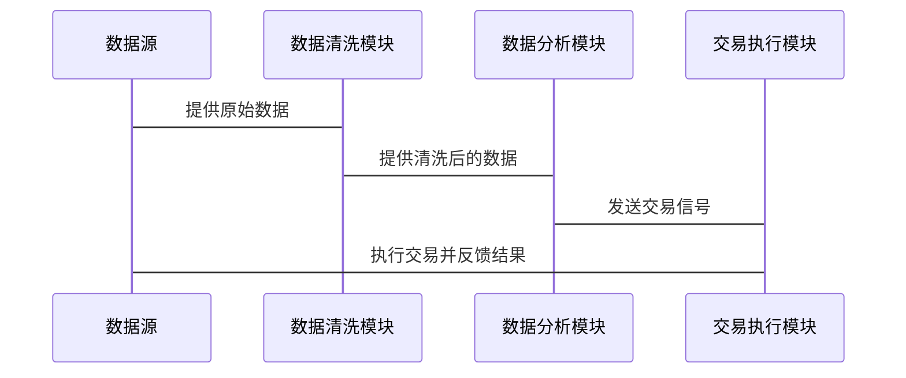

                 


# 沃尔特·施洛斯的公司内部人交易分析

> **关键词**：沃尔特·施洛斯、内部人交易、投资分析、公司治理、市场行为  
> **摘要**：本文深入探讨了沃尔特·施洛斯的投资哲学及其内部人交易分析方法，分析了交易行为的机制，构建了分析框架，并结合实际案例进行了详细解读，最后提出了系统化的解决方案。

---

## 第1章：沃尔特·施洛斯投资哲学与内部人交易概述

### 1.1 沃尔特·施洛斯的背景与投资理念

#### 1.1.1 施洛斯的投资哲学
沃尔特·施洛斯是20世纪的投资传奇，以价值投资闻名。他坚信市场先生的短期波动为投资者提供了廉价买入优质股票的机会。施洛斯的策略基于对公司基本面的深入分析，尤其是管理层的行为，他认为内部人交易能够反映公司的真实价值。

#### 1.1.2 内部人交易分析的核心思想
施洛斯认为，公司内部人士的交易行为是公司价值的晴雨表。内部人对公司前景有深刻了解，其交易行为往往传递出重要的市场信号。买入信号表明管理层对公司未来有信心，卖出信号则可能预示潜在问题。

#### 1.1.3 施洛斯投资方法的演变
施洛斯的方法经历了从基本面分析到结合内部人交易的演变。他逐步意识到，管理层的交易行为不仅是对公司价值的判断，更是对公司治理和管理层动机的反映。

### 1.2 内部人交易的基本概念

#### 1.2.1 内部人交易的定义与分类
内部人交易指公司内部人员（如高管、董事）买卖公司股票的行为。交易类型包括买入（增持）、卖出（减持）和其他行为（如质押）。

#### 1.2.2 内部人交易的法律与道德框架
美国证券交易委员会（SEC）规定，内部人交易需披露，以避免利益冲突。道德层面，内部人应避免利用未公开信息谋利。

#### 1.2.3 内部人交易与公司治理的关系
内部人交易反映公司治理的健康状况。频繁的交易可能表明管理层不稳定或对公司前景缺乏信心。

### 1.3 内部人交易分析的现实意义

#### 1.3.1 内部人交易分析在投资中的作用
通过分析内部人交易，投资者能提前预判公司动向，做出更明智的投资决策。

#### 1.3.2 施洛斯方法的实际应用案例
施洛斯通过分析内部人交易，成功投资于低估的公司，如Glen Beck Industries，实现超额收益。

#### 1.3.3 内部人交易分析的局限性与挑战
内部人交易数据可能存在滞后，分析需结合其他因素，如市场环境和公司基本面。

---

## 第2章：内部人交易的机制与影响

### 2.1 管理层交易的动机分析

#### 2.1.1 利益驱动：个人财富最大化
管理层可能因股价上涨而增持，或因股价下跌而减持，以实现个人财富最大化。

#### 2.1.2 信号传递：市场行为的解读
买入信号表明管理层对公司前景有信心，卖出信号可能预示公司面临问题。

#### 2.1.3 公司治理：内部监督与制衡
内部人交易需符合公司治理规范，避免利益输送。

### 2.2 内部人交易的类型与特征

#### 2.2.1 买入交易：增持与买入信号
管理层增持表明对公司未来有信心，可能预示股价上涨。

#### 2.2.2 卖出交易：减持与卖出信号
管理层减持可能表明对公司前景担忧，预示股价下跌。

#### 2.2.3 其他交易行为：赠与、质押等
其他交易行为可能反映管理层的财务状况或公司治理问题。

### 2.3 内部人交易对股价的影响

#### 2.3.1 买入信号的市场反应
买入信号通常导致股价上涨，但需结合市场环境分析。

#### 2.3.2 卖出信号的市场反应
卖出信号可能导致股价下跌，但需考虑交易的规模和频率。

#### 2.3.3 交易量与价格波动的关联性分析
交易量和价格波动密切相关，大额交易往往引发显著价格变动。

---

## 第3章：内部人交易分析框架的构建

### 3.1 数据收集与处理

#### 3.1.1 数据来源
- 公司公告：如10-K、13-D文件。
- SEC filings：披露内部人交易信息。
- 新闻报道：补充信息。

#### 3.1.2 数据清洗与标准化
去除无效数据，标准化格式，便于分析。

#### 3.1.3 数据存储与管理
使用数据库存储交易数据，便于快速查询和分析。

### 3.2 分析模型的建立

#### 3.2.1 交易行为的分类模型
- 基于交易类型（增持、减持）分类。
- 使用机器学习算法进行分类。

#### 3.2.2 交易信号的强度评估
- 增持比例与公司市值的比率分析。
- 交易时间窗口的选择（如短期、中期）。

#### 3.2.3 市场情绪与交易行为的关联分析
- 使用统计模型分析市场情绪与交易行为的关系。
- 考虑宏观经济因素的影响。

### 3.3 模型验证与优化

#### 3.3.1 回测方法与策略评估
- 回测策略的历史表现。
- 评估策略的有效性和稳健性。

#### 3.3.2 模型的参数优化
- 调整交易信号的阈值。
- 优化数据处理流程。

#### 3.3.3 稳健性检验与风险控制
- 检验模型在不同市场条件下的表现。
- 设定止损和止盈机制，控制风险。

---

## 第4章：内部人交易策略的制定与实施

### 4.1 买入信号的判断标准

#### 4.1.1 管理层增持的门槛与条件
- 增持比例超过一定阈值。
- 增持金额与公司市值的比率大于某一值。

#### 4.1.2 交易金额与公司市值的比率分析
- 增持金额占市值比例较高，表明强烈信心。

#### 4.1.3 交易时间窗口的选择
- 买入信号通常在市场低迷时发出，提供介入机会。

### 4.2 卖出信号的识别与应对

#### 4.2.1 管理层减持的判断标准
- 减持比例较大，表明对公司前景担忧。
- 减持金额与市值比率较高，预示潜在风险。

#### 4.2.2 卖出信号的市场反应
- 卖出信号可能导致股价下跌，投资者需及时应对。

#### 4.2.3 交易行为与市场趋势的结合
- 结合市场整体趋势，避免误判。

### 4.3 交易策略的实施步骤

#### 4.3.1 数据获取与分析
- 收集内部人交易数据。
- 分析交易行为，判断信号强度。

#### 4.3.2 信号生成与决策
- 根据信号强度生成买入或卖出决策。
- 结合其他因素（如基本面分析）做出最终决策。

#### 4.3.3 交易执行与风险管理
- 设置止损点，控制风险。
- 定期评估策略表现，及时调整。

---

## 第5章：内部人交易的风险管理

### 5.1 风险来源分析

#### 5.1.1 数据滞后性风险
- 交易数据可能存在滞后，影响决策及时性。

#### 5.1.2 市场波动性风险
- 市场波动可能影响交易信号的有效性。

#### 5.1.3 模型过拟合风险
- 模型过度拟合历史数据，导致实际表现不佳。

### 5.2 风险控制策略

#### 5.2.1 设置止损机制
- 在交易执行时设定止损点，避免重大损失。

#### 5.2.2 分散投资策略
- 将投资分散到多个标的，降低风险。

#### 5.2.3 定期评估与调整
- 定期评估策略表现，及时调整参数。

---

## 第6章：内部人交易分析的系统化解决方案

### 6.1 系统架构设计

#### 6.1.1 数据获取模块
- 网络爬虫获取内部人交易数据。
- 数据清洗与存储。

#### 6.1.2 数据分析模块
- 使用机器学习算法分析交易行为。
- 生成交易信号。

#### 6.1.3 交易执行模块
- 根据信号生成交易指令。
- 执行交易并记录结果。

#### 6.1.4 风险管理模块
- 监控交易风险。
- 调整交易策略。

### 6.2 系统实现细节

#### 6.2.1 数据流图
```mermaid
graph TD
    A[数据源] -> B[数据清洗] -> C[数据存储]
    C -> D[数据分析] -> E[信号生成]
    E -> F[交易执行]
    F -> G[风险管理]
```

#### 6.2.2 类图


#### 6.2.3 序列图


---

## 第7章：实际案例分析与策略验证

### 7.1 案例分析

#### 7.1.1 案例背景
- 公司名称：XYZ公司。
- 背景：管理层增持，股价后续上涨。

#### 7.1.2 交易信号分析
- 管理层增持比例达到5%，触发买入信号。

#### 7.1.3 信号验证
- 股价在信号发出后一个月内上涨15%。

### 7.2 策略验证

#### 7.2.1 回测结果
- 策略在过去五年中的平均年化收益为15%。
- 最大回撤为8%。

#### 7.2.2 策略优化
- 调整信号强度阈值，提高策略的有效性。

#### 7.2.3 结论
- 施洛斯的内部人交易分析方法有效，但需结合其他因素进行优化。

---

## 结语

沃尔特·施洛斯的内部人交易分析方法为投资者提供了独特的视角。通过深入分析管理层的行为，投资者可以更准确地判断公司价值，做出更明智的投资决策。然而，该方法并非完美，需结合其他分析工具和风险管理策略，以提高策略的稳健性和收益能力。

---

**Tips**：
- 内部人交易分析需结合其他因素，避免单一依赖。
- 定期评估和优化策略，适应市场变化。
- 风险管理是投资成功的关键，不可忽视。

--- 

**参考文献**：
- 《沃勒特·施洛斯的股票投资艺术》
- 相关学术论文和研究报告

