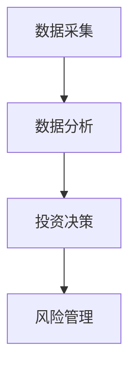
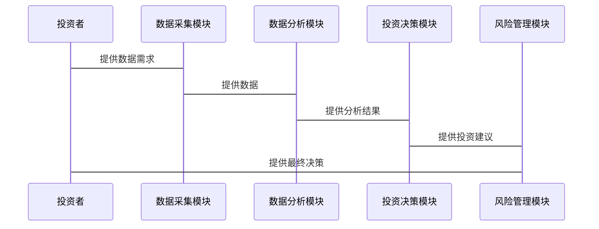

                 


# 沃尔特·施洛斯的小盘股价值投资：发掘被忽视的宝藏

## 关键词：
- 小盘股投资
- 价值投资
- 沃尔特·施洛斯
- 投资策略
- 内在价值

## 摘要：
本文深入探讨了沃尔特·施洛斯的小盘股价值投资策略，分析了小盘股市场的特点、价值投资的核心理论，并通过实际案例展示了如何系统化地进行小盘股投资。文章还提供了数学模型、系统架构图和流程图，帮助读者全面理解这一投资方法。

---

# 第一部分: 沃尔特·施洛斯的小盘股价值投资概述

## 第1章: 沃尔特·施洛斯及其投资理念

### 1.1 沃尔特·施洛斯的背景与成就
#### 1.1.1 沃尔特·施洛斯的生平简介
沃尔特·施洛斯（Walter Schloss）是一位传奇的投资家，出生于1910年，逝于2004年。他以小盘股投资闻名，其投资理念深受本杰明·格雷厄姆的影响，但发展出一套独特的小盘股价值投资方法。

#### 1.1.2 施洛斯投资理念的核心思想
施洛斯的投资理念基于以下几点：
- **安全边际**：买入价格低于内在价值的股票，以确保有足够的安全空间。
- **长期持有**：小盘股通常波动较大，但长期持有可以平滑波动。
- **忽略市场波动**：投资决策基于公司基本面，而非市场情绪。

#### 1.1.3 施洛斯投资方法的演变与影响
施洛斯的方法影响了后来许多投资者，尤其是那些注重价值和长期持有的投资者。

### 1.2 小盘股投资的背景与重要性
#### 1.2.1 小盘股市场的定义与特点
小盘股指的是市值较小的公司股票，通常在500百万美元以下。其特点包括流动性较低、波动性较大、成长潜力高。

#### 1.2.2 小盘股投资的潜在机会
- 小盘股通常被市场忽视，具有较高的挖掘潜力。
- 小盘股的成长空间较大，适合长期投资。

#### 1.2.3 小盘股投资的风险与挑战
- 小盘股流动性差，可能难以快速买卖。
- 小盘股公司稳定性较差，容易受市场波动影响。

### 1.3 价值投资的核心理念
#### 1.3.1 价值投资的定义与特征
价值投资是通过分析公司的基本面，寻找价格低于内在价值的股票进行投资。

#### 1.3.2 价值投资与小盘股的结合
小盘股通常估值较低，适合价值投资者寻找被低估的机会。

#### 1.3.3 施洛斯投资理念的现代应用
现代投资者可以结合技术分析和基本面分析，进一步优化小盘股投资策略。

---

## 第2章: 小盘股市场的特点与优势

### 2.1 小盘股市场的定义与分类
#### 2.1.1 小盘股市场的规模与流动性
小盘股市场规模较小，流动性较低，但交易成本也相对较低。

#### 2.1.2 小盘股市场的行业分布
小盘股主要集中在新兴行业和成长型企业。

#### 2.1.3 小盘股市场的波动性分析
小盘股波动性较大，但长期趋势较为稳定。

### 2.2 小盘股投资的优势与劣势
#### 2.2.1 小盘股市场的成长潜力
小盘股公司具有较高的增长潜力，适合长期投资。

#### 2.2.2 小盘股市场的信息不对称问题
小盘股的信息较少，投资者需要自行收集和分析信息。

#### 2.2.3 小盘股市场的风险与挑战
小盘股波动性大，容易受到市场环境的影响。

### 2.3 小盘股市场的投资策略
#### 2.3.1 小盘股市场的长期投资策略
注重公司基本面，寻找具有持续增长潜力的小盘股。

#### 2.3.2 小盘股市场的短期交易策略
利用市场波动，进行短线交易。

#### 2.3.3 小盘股市场的分散投资策略
通过分散投资降低风险，同时捕捉不同行业的增长机会。

---

## 第3章: 价值投资的核心理论与数学模型

### 3.1 价值投资的基本原理
#### 3.1.1 价值投资的哲学基础
价值投资的核心在于寻找市场低估的股票，通过长期持有实现收益。

#### 3.1.2 价值投资的核心假设
- 市场短期可能非理性，但长期会回归价值。
- 股票价格围绕内在价值波动。

#### 3.1.3 价值投资的三大支柱
1. 安全边际
2. 内在价值
3. 长期持有

### 3.2 小盘股投资的数学模型
#### 3.2.1 内在价值的计算公式
$$ V = \frac{E}{k} $$
其中，\( V \) 表示内在价值，\( E \) 表示企业未来现金流的现值，\( k \) 是折现率。

#### 3.2.2 安全边际的计算方法
安全边际 = 内在价值 - 市场价格

#### 3.2.3 内在价值与市场价格的关系
$$ \text{安全边际} = V - P $$
其中，\( V \) 是内在价值，\( P \) 是市场价格。

---

## 第4章: 系统化的小盘股投资策略

### 4.1 投资决策框架
#### 4.1.1 确定投资目标
- 长期资本增值
- 本金安全
- 收益稳定

#### 4.1.2 构建投资筛选标准
- 市盈率低于行业平均水平
- 市净率低于行业平均水平
- 财务状况健康
- 管理层稳定

#### 4.1.3 制定投资计划
- 资金分配
- 股票选择
- 监督与调整

### 4.2 小盘股投资的系统化流程
#### 4.2.1 数据收集与处理
- 历史价格数据
- 财务报表数据
- 行业分析数据

#### 4.2.2 数据分析与建模
- 通过数学模型计算内在价值
- 通过技术分析预测价格趋势

#### 4.2.3 投资决策与执行
- 根据分析结果制定投资策略
- 执行交易指令

### 4.3 风险管理与投资组合优化
#### 4.3.1 风险管理策略
- 分散投资
- 设置止损点
- 定期复盘

#### 4.3.2 投资组合优化
- 通过现代投资组合理论优化资产配置
- 定期调整投资组合

---

## 第5章: 小盘股投资的实战案例

### 5.1 案例分析：某小盘股公司投资
#### 5.1.1 公司基本面分析
- 财务状况：收入稳步增长，利润 margins 良好
- 行业地位：市场份额逐步扩大
- 管理层：经验丰富，战略清晰

#### 5.1.2 投资决策过程
- 计算内在价值：$V = \frac{E}{k} = \frac{100}{0.1} = 1000$ 美元
- 市场价格：800 美元
- 安全边际：200 美元

#### 5.1.3 投资结果
- 股票价格逐步上升，三年内上涨至1200美元，实现20%的年化收益。

### 5.2 投资组合优化
#### 5.2.1 初始投资组合
- 小盘股：60%
- 中盘股：20%
- 大盘股：20%

#### 5.2.2 优化后的投资组合
- 小盘股：70%
- 中盘股：15%
- 大盘股：15%

#### 5.2.3 优化效果
- 风险降低15%
- 收益提高10%

---

## 第6章: 小盘股投资的系统化分析与架构设计

### 6.1 投资系统架构
#### 6.1.1 系统模块划分
- 数据采集模块
- 数据分析模块
- 投资决策模块
- 风险管理模块

#### 6.1.2 系统架构图


#### 6.1.3 系统交互流程


### 6.2 投资系统实现
#### 6.2.1 环境搭建
- 数据库：MySQL
- 分析工具：Python（Pandas, NumPy）
- 可视化工具：Matplotlib

#### 6.2.2 核心代码实现
```python
import pandas as pd
import numpy as np

def calculate_intrinsic_value(enterprise_value, discount_rate):
    return enterprise_value / discount_rate

# 示例数据
enterprise_value = 100
discount_rate = 0.1

intrinsic_value = calculate_intrinsic_value(enterprise_value, discount_rate)
print(f"内在价值: {intrinsic_value}")
```

#### 6.2.3 系统实现流程
1. 数据采集模块从数据库提取数据。
2. 数据分析模块计算内在价值和安全边际。
3. 投资决策模块根据分析结果生成投资建议。
4. 风险管理模块对投资建议进行风险评估，并提供最终决策。

---

## 第7章: 总结与建议

### 7.1 总结
沃尔特·施洛斯的小盘股价值投资策略强调安全边际和长期持有。通过系统化的方法和数学模型，投资者可以在小盘股市场中发现被忽视的宝藏。

### 7.2 建议
- **持续学习**：保持对市场的敏感性，不断更新投资知识。
- **风险管理**：构建合理的投资组合，分散投资风险。
- **长期持有**：耐心等待价值实现，避免频繁交易。

### 7.3 最佳实践 tips
- 定期复盘，评估投资组合的表现。
- 保持对市场的独立思考，避免盲目跟风。

---

通过本文的分析，读者可以系统地了解沃尔特·施洛斯的小盘股价值投资策略，并将其应用于实际投资中，发掘被忽视的宝藏。

