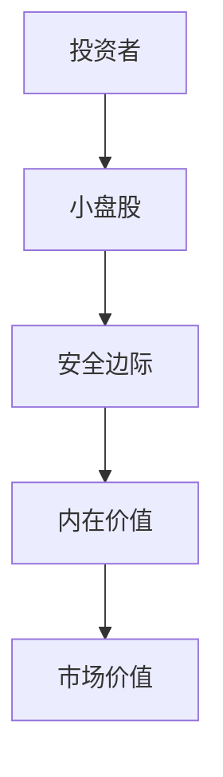
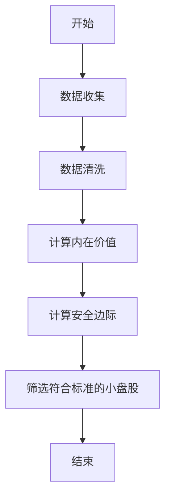
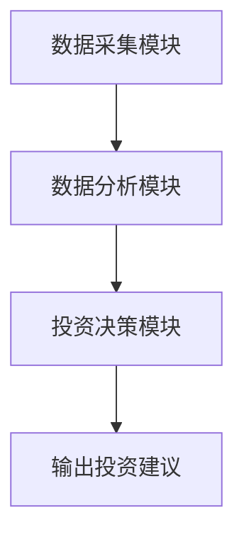

                 


# 沃尔特·施洛斯的小盘股研究方法论

> 关键词：沃尔特·施洛斯，小盘股，投资方法，安全边际，估值模型，投资策略

> 摘要：本文深入探讨了沃尔特·施洛斯的小盘股研究方法论，从背景介绍、核心概念、算法原理到系统分析和项目实战，全面剖析了其方法的精髓。通过详细的理论阐述和实际案例分析，揭示了小盘股投资中的安全边际、估值模型和长期持有策略，为投资者提供了实用的指导和启示。

---

# 第1章: 小盘股投资的背景与意义

## 1.1 小盘股投资的定义与特点

### 1.1.1 小盘股的定义
小盘股是指市值较小的公司股票，通常在10亿美元以下。这些公司通常处于成长阶段，具有较高的增长潜力，但也伴随着较高的风险。

### 1.1.2 小盘股投资的核心特点
- **低估值**：小盘股通常价格被市场低估，具有较大的增值空间。
- **高波动性**：由于市值小，容易受到市场情绪和资金流动的影响，价格波动较大。
- **高增长潜力**：小盘股公司通常具有较高的成长性，未来有可能成长为大盘股。

### 1.1.3 小盘股投资的潜在优势
- **超额回报**：历史上，小盘股的投资回报率通常高于大盘股。
- **分散风险**：通过投资多个小盘股，可以分散单一股票的风险。
- **挖掘潜力股**：小盘股中可能存在未来有巨大增长潜力的公司。

## 1.2 沃尔特·施洛斯的生平与投资理念

### 1.2.1 施洛斯的生平简介
沃尔特·施洛斯（Walter J. Schloss）是20世纪著名的投资家，被誉为“小盘股投资之父”。他从1950年代开始管理自己的投资组合，专注于小盘股投资，取得了优异的长期业绩。

### 1.2.2 施洛斯投资理念的核心思想
- **价值投资**：寻找被市场低估的公司，以低于其内在价值的价格买入。
- **安全边际**：买入价格远低于内在价值，以确保投资的安全性。
- **长期持有**：一旦买入优质的小盘股，长期持有，等待其价值回归。

### 1.2.3 施洛斯与巴菲特的师生关系
施洛斯是巴菲特的 mentor，巴菲特曾公开表示，从施洛斯那里学到了许多投资理念，尤其是小盘股投资的方法。

## 1.3 小盘股投资的市场背景

### 1.3.1 小盘股市场的特点
- **流动性较低**：小盘股的交易量通常较小，流动性较差。
- **波动性高**：小盘股价格波动较大，容易受到市场情绪的影响。
- **信息不透明**：小盘股公司信息披露较少，投资者获取信息的难度较大。

### 1.3.2 小盘股市场的投资机会
- **挖掘潜力股**：小盘股中可能存在未来有巨大增长潜力的公司。
- **市场低估**：小盘股通常价格被市场低估，具有较大的增值空间。
- **分散投资**：通过投资多个小盘股，可以分散单一股票的风险。

### 1.3.3 小盘股市场的风险与挑战
- **高波动性**：小盘股价格波动较大，容易受到市场情绪的影响。
- **信息不透明**：小盘股公司信息披露较少，投资者获取信息的难度较大。
- **流动性风险**：小盘股流动性较低，可能难以在需要时快速卖出。

## 1.4 本章小结
本章介绍了小盘股投资的背景、特点以及沃尔特·施洛斯的投资理念。小盘股投资具有潜在的超额回报和分散风险的优势，但也伴随着高波动性和信息不透明的风险。施洛斯的价值投资理念和安全边际策略为小盘股投资提供了重要的指导。

---

# 第2章: 小盘股研究的核心概念与联系

## 2.1 核心概念原理

### 2.1.1 安全边际的定义与计算
**安全边际**是指买入价格与内在价值之间的差距。计算公式为：
$$ \text{安全边际} = \text{内在价值} - \text{买入价格} $$

### 2.1.2 估值的定义与方法
**估值**是指对公司未来现金流的折现，计算其内在价值。常用的估值方法包括：
- **市盈率（P/E）**：股价除以每股收益。
- **市净率（P/B）**：股价除以每股净资产。
- **现金流折现模型（DCF）**：通过折现未来现金流计算内在价值。

### 2.1.3 小盘股的内在价值与市场价值
**内在价值**是公司未来现金流的现值，**市场价值**是市场价格，两者之间的差异决定了股票的估值是否合理。

## 2.2 核心概念属性特征对比

### 2.2.1 安全边际与估值的对比
| 属性       | 安全边际 | 估值 |
|------------|----------|------|
| 定义       | 买入价与内在价值的差额 | 公司未来现金流的现值 |
| 计算公式   | $$ \text{安全边际} = \text{内在价值} - \text{买入价格} $$ | $$ \text{内在价值} = \sum_{t=1}^{n} \frac{\text{现金流}_t}{(1+r)^t} $$ |
| 目的       | 确保投资的安全性 | 确定股票的合理价格 |

### 2.2.2 小盘股与大盘股的对比
| 属性       | 小盘股 | 大盘股 |
|------------|--------|--------|
| 市值范围   | 小于100亿美元 | 大于100亿美元 |
| 波动性     | 高     | 低     |
| 成长潜力   | 高     | 中等   |
| 信息透明度 | 低     | 高     |

### 2.2.3 投资者心理与市场行为的对比
| 属性       | 投资者心理 | 市场行为 |
|------------|------------|----------|
| 过度乐观   | 投资者可能高估小盘股的未来增长潜力 | 投资者大量买入小盘股，推高股价 |
| 过度悲观   | 投资者可能低估小盘股的价值 | 投资者大量卖出小盘股，压低股价 |

## 2.3 ER实体关系图



## 2.4 本章小结
本章详细介绍了小盘股研究的核心概念，包括安全边际、估值和内在价值。通过对比分析和ER实体关系图，揭示了这些概念之间的联系和相互作用。

---

# 第3章: 小盘股研究的算法原理

## 3.1 算法原理概述

### 3.1.1 小盘股筛选算法
小盘股筛选算法的目标是从市场中筛选出具有较高增长潜力且价格被低估的公司。步骤如下：
1. 数据收集：收集小盘股的基本数据，包括市值、市盈率、市净率等。
2. 数据清洗：剔除数据不完整或异常的公司。
3. 筛选标准：根据安全边际和估值指标筛选出符合条件的小盘股。

### 3.1.2 估值算法
估值算法的目标是计算公司的内在价值，常用的方法包括：
- 市盈率法：$$ \text{内在价值} = \text{市盈率} \times \text{每股收益} $$
- 市净率法：$$ \text{内在价值} = \text{市净率} \times \text{每股净资产} $$
- 现金流折现法：$$ \text{内在价值} = \sum_{t=1}^{n} \frac{\text{现金流}_t}{(1+r)^t} $$

### 3.1.3 安全边际计算算法
安全边际计算算法的目标是确保买入价格低于内在价值，公式为：
$$ \text{安全边际} = \text{内在价值} - \text{买入价格} $$

## 3.2 算法流程图



## 3.3 算法实现代码

### 3.3.1 数据收集与清洗
```python
import pandas as pd

# 假设我们已经收集了小盘股的数据
data = pd.read_csv('small_cap_stocks.csv')

# 数据清洗：剔除市值大于100亿美元的公司
data = data[data['Market Cap'] < 1000000000]
```

### 3.3.2 计算内在价值
```python
def calculate_intrinsic_value(company_data, required_return):
    # 现金流折现模型
    cash_flows = company_data['Cash Flow'].tolist()
    discount_factor = [(1 + required_return) ** i for i in range(len(cash_flows))]
    intrinsic_value = sum([cash_flows[i] / discount_factor[i] for i in range(len(cash_flows))])
    return intrinsic_value
```

### 3.3.3 计算安全边际
```python
def calculate_margin_of_safety(intrinsic_value, market_price):
    return intrinsic_value - market_price

# 示例计算
intrinsic_value = calculate_intrinsic_value(company_data, 0.1)
market_price = company_data['Price'][0]
margin_of_safety = calculate_margin_of_safety(intrinsic_value, market_price)
print(f"安全边际: {margin_of_safety}")
```

## 3.4 本章小结
本章详细介绍了小盘股研究的算法原理，包括数据收集、清洗、内在价值计算和安全边际判断。通过流程图和代码示例，展示了如何在实际操作中应用这些算法。

---

# 第4章: 小盘股研究的数学模型

## 4.1 数学模型概述

### 4.1.1 内在价值计算模型
$$ \text{内在价值} = \sum_{t=1}^{n} \frac{\text{现金流}_t}{(1+r)^t} $$

### 4.1.2 安全边际计算模型
$$ \text{安全边际} = \text{内在价值} - \text{买入价格} $$

### 4.1.3 市盈率模型
$$ \text{市盈率} = \frac{\text{股价}}{\text{每股收益}} $$

## 4.2 数学模型的应用

### 4.2.1 内在价值计算
假设某小盘股公司未来5年的现金流分别为100万、150万、200万、250万和300万，折现率为10%。计算其内在价值：
$$ \text{内在价值} = \frac{100}{1.1} + \frac{150}{1.1^2} + \frac{200}{1.1^3} + \frac{250}{1.1^4} + \frac{300}{1.1^5} \approx 477.26 $$

### 4.2.2 安全边际计算
假设买入价格为400美元，计算安全边际：
$$ \text{安全边际} = 477.26 - 400 = 77.26 $$

## 4.3 本章小结
本章通过数学模型详细解释了小盘股研究的核心计算方法，包括内在价值和安全边际的计算。这些模型为小盘股投资提供了重要的理论依据。

---

# 第5章: 小盘股研究的系统分析

## 5.1 系统分析概述

### 5.1.1 系统架构
小盘股研究系统包括数据采集模块、数据分析模块和投资决策模块。

### 5.1.2 系统功能
- 数据采集：从多个数据源获取小盘股的基本数据。
- 数据分析：计算内在价值和安全边际，筛选出符合条件的小盘股。
- 投资决策：根据分析结果制定投资策略。

## 5.2 系统架构图



## 5.3 系统实现代码

### 5.3.1 数据采集模块
```python
import requests
import pandas as pd

url = 'https://www.example.com/small_cap_data'
response = requests.get(url)
data = pd.read_json(response.text)
```

### 5.3.2 数据分析模块
```python
def analyze_data(data):
    # 计算内在价值
    data['Intrinsic Value'] = data.apply(lambda x: calculate_intrinsic_value(x, 0.1), axis=1)
    # 计算安全边际
    data['Margin of Safety'] = data['Intrinsic Value'] - data['Price']
    return data
```

### 5.3.3 投资决策模块
```python
def make_investment_decision(data):
    # 筛选安全边际大于零的小盘股
    selected_stocks = data[data['Margin of Safety'] > 0]
    return selected_stocks
```

## 5.4 本章小结
本章从系统架构和功能实现的角度，详细介绍了小盘股研究的系统设计方案。通过模块化设计和代码实现，展示了如何将理论应用于实际投资决策。

---

# 第6章: 小盘股研究的项目实战

## 6.1 项目背景
假设我们想要筛选出一只具有较高安全边际的小盘股进行投资。

## 6.2 项目实现

### 6.2.1 数据收集
```python
import pandas as pd

# 假设我们已经收集了小盘股的数据
data = pd.read_csv('small_cap_stocks.csv')
```

### 6.2.2 数据分析
```python
def calculate_intrinsic_value(company_data, required_return):
    cash_flows = company_data['Cash Flow'].tolist()
    discount_factor = [(1 + required_return) ** i for i in range(len(cash_flows))]
    intrinsic_value = sum([cash_flows[i] / discount_factor[i] for i in range(len(cash_flows))])
    return intrinsic_value

# 示例计算
required_return = 0.1
intrinsic_value = calculate_intrinsic_value(company_data, required_return)
margin_of_safety = intrinsic_value - company_data['Price'][0]
```

### 6.2.3 投资决策
```python
# 筛选安全边际大于零的小盘股
selected_stocks = data[data['Margin of Safety'] > 0]
print(selected_stocks)
```

## 6.3 项目小结
本章通过实际案例展示了小盘股研究的项目实战，从数据收集到投资决策的整个流程，帮助读者理解如何在实际操作中应用施洛斯的方法论。

---

# 第7章: 小盘股研究的最佳实践

## 7.1 投资策略与风险管理

### 7.1.1 投资策略
- **分散投资**：将资金分配到多个小盘股，分散风险。
- **长期持有**：避免频繁交易，耐心等待价值回归。
- **定期调整**：定期检查投资组合，重新评估安全边际。

### 7.1.2 风险管理
- **设定止损点**：当股价下跌超过一定幅度时，立即卖出。
- **控制仓位**：不要将所有资金投入到单一股票或行业。

## 7.2 投资技巧与注意事项

### 7.2.1 关注公司基本面
- 重视公司的财务状况，特别是现金流和盈利能力。
- 选择具有强大管理团队和竞争优势的公司。

### 7.2.2 保持耐心和纪律
- 避免被市场情绪左右，坚持长期投资。
- 严格按照筛选标准进行投资，不盲目跟风。

## 7.3 本章小结
本章总结了小盘股投资的最佳实践，包括投资策略、风险管理和技术分析。投资者需要结合理论与实践，制定适合自己的投资策略。

---

# 第8章: 小盘股研究的总结与展望

## 8.1 本研究的主要结论
- 小盘股投资具有较高的潜在回报，但也伴随着较高的风险。
- 施洛斯的安全边际策略为小盘股投资提供了重要的指导。
- 投资者需要结合理论与实践，制定适合自己的投资策略。

## 8.2 未来研究的方向
- 进一步优化小盘股筛选算法，提高筛选效率。
- 研究小盘股市场的行为特征，揭示投资者心理与市场行为的关系。
- 探讨小盘股投资与宏观经济的关系，寻找新的投资机会。

## 8.3 展望
随着市场的不断发展，小盘股投资将面临新的机遇和挑战。投资者需要不断学习和适应市场变化，利用先进的技术和方法，提高投资决策的科学性和有效性。

---

# 结语

沃尔特·施洛斯的小盘股研究方法论为投资者提供了重要的指导。通过安全边际和长期持有的策略，投资者可以在小盘股市场中挖掘潜在的超额回报。然而，小盘股投资也伴随着较高的风险，投资者需要具备扎实的理论基础和丰富的实战经验。希望本文能够为读者提供有价值的参考和启示，帮助他们在小盘股投资中取得成功。

--- 

**关键词**：沃尔特·施洛斯，小盘股，投资方法，安全边际，估值模型，投资策略

