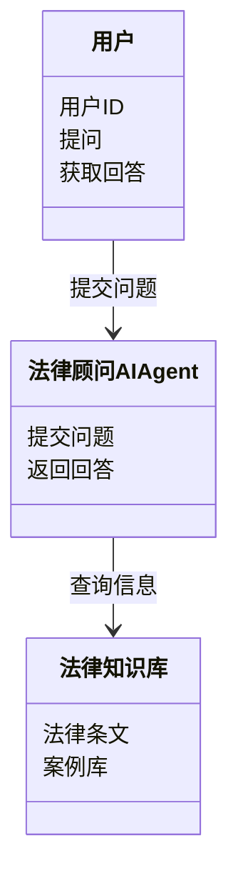
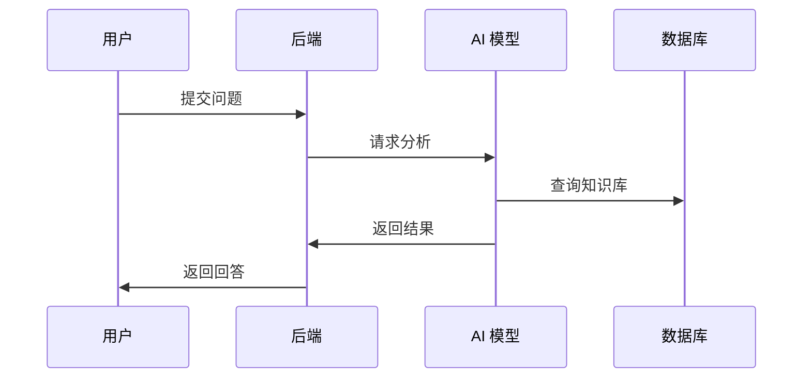

                 


# 法律顾问 AI Agent：LLM 在法律咨询与合规检查中的应用

> 关键词：法律顾问 AI Agent, LLM, 法律咨询, 合规检查, 人工智能, 大语言模型

> 摘要：本文深入探讨了法律顾问 AI Agent 在法律咨询与合规检查中的应用，详细分析了其核心概念、算法原理、系统架构及项目实战，结合实际案例展示了如何利用大语言模型（LLM）提升法律服务的效率与准确性。

---

## 第1章: 法律顾问 AI Agent 的背景介绍

### 1.1 问题背景与问题描述
#### 1.1.1 传统法律咨询的痛点
传统的法律咨询服务存在以下问题：
- **高成本**：律师事务所的收费通常较高，中小企业和个人难以负担。
- **低效率**：律师需要手动查阅大量法律条文和案例，耗时较长。
- **资源有限**：法律资源集中在大城市，偏远地区难以获得高质量的法律服务。
- **合规性挑战**：企业需要频繁进行合规检查，但传统方法效率低下。

#### 1.1.2 法律咨询与合规检查的需求分析
- **企业合规需求**：企业需要确保其业务符合相关法律法规，避免法律风险。
- **个人法律援助**：个人在面对法律问题时，往往缺乏专业的法律指导。
- **法律信息的及时性**：法律条文和案例会不断更新，需要实时获取最新信息。

#### 1.1.3 AI 技术在法律领域的应用潜力
- **自动化处理**：AI 可以快速分析法律文档，提取关键信息。
- **24/7 可用性**：AI 可以全天候提供咨询服务，无需人工值班。
- **成本降低**：AI 的应用可以显著降低法律服务的成本。

### 1.2 问题解决与边界定义
#### 1.2.1 AI Agent 在法律咨询中的角色定位
法律顾问 AI Agent 作为辅助工具，主要用于提供初步法律建议、合规检查和法律文档分析，帮助用户快速获取信息，减少人工干预。

#### 1.2.2 法律顾问 AI Agent 的功能边界
- **支持范围**：提供合同审查、法律条文查询、合规建议等服务。
- **限制范围**：不涉及复杂法律案件的深度分析，不能替代专业律师的决策。

#### 1.2.3 与传统法律咨询的对比分析
| 特性             | 传统法律咨询         | AI 法律顾问 Agent       |
|------------------|----------------------|-------------------------|
| 服务时间         | 工作时间             | 24/7                   |
| 成本             | 较高                 | 较低                   |
| 响应速度         | 较慢                 | 快速                   |
| 服务深度         | 深度                 | 浅度                   |

### 1.3 核心概念与结构
#### 1.3.1 法律顾问 AI Agent 的概念结构
法律顾问 AI Agent 的核心功能包括：
1. **自然语言处理（NLP）**：理解用户的问题并生成回答。
2. **法律知识库**：存储法律条文、案例和合规标准。
3. **推理引擎**：基于知识库进行逻辑推理，提供合规建议。

#### 1.3.2 核心要素组成分析
- **用户交互界面**：用户通过文本或语音与 AI Agent 互动。
- **法律知识库**：包含最新的法律条文和案例。
- **推理引擎**：负责分析用户的问题并生成回答。
- **结果输出**：将推理结果以文本形式返回给用户。

#### 1.3.3 系统架构的初步框架


---

## 第2章: 法律顾问 AI Agent 的核心原理

### 2.1 大语言模型（LLM）的基本原理
#### 2.1.1 LLM 的基本工作原理
大语言模型通过以下步骤工作：
1. **输入处理**：将用户的问题转换为模型可以理解的向量表示。
2. **编码层**：模型将输入编码为上下文表示。
3. **解码层**：模型根据编码结果生成输出。

#### 2.1.2 基于 Transformer 的架构特点
- **自注意力机制**：模型可以关注输入中的重要部分。
- **位置编码**：模型能够理解输入的顺序和位置。

#### 2.1.3 模型的训练与推理过程
模型的训练过程包括：
1. **监督微调**：使用标注数据对模型进行微调。
2. **强化学习**：通过奖励机制优化模型的输出。

### 2.2 法律顾问 AI Agent 的功能模块
#### 2.2.1 自然语言理解模块
- **分词**：将用户的问题分割成词语。
- **实体识别**：识别问题中的法律实体（如公司名称、法律条款）。
- **意图识别**：确定用户的需求类型（如合同审查、合规建议）。

#### 2.2.2 法律知识库的构建与应用
- **知识库构建**：收集和整理法律条文、案例和合规标准。
- **知识库应用**：模型在回答问题时参考知识库中的信息。

#### 2.2.3 合规检查模块的设计
- **合规规则**：定义合规检查的标准和条件。
- **自动检查**：模型根据规则对用户提供的文档进行检查。

### 2.3 核心概念的对比分析
#### 2.3.1 不同 LLM 模型的对比表格
| 模型名称 | 参数数量 | 预训练数据 | 优势                     |
|----------|----------|------------|--------------------------|
| GPT-3    | 175B     | 5.3T tokens | 高精度，支持多种任务     |
| LegalLM  | 120B     | 1.5T legal tokens | 专注于法律领域，更准确 |

#### 2.3.2 法律领域与通用领域的区别
- **法律领域**：需要处理专业术语和法律条文。
- **通用领域**：处理日常语言和多种任务。

---

## 第3章: 大语言模型的算法原理

### 3.1 基于 Transformer 的模型结构
#### 3.1.1 编码层与解码层的详细分析
- **编码层**：将输入序列转换为上下文表示。
- **解码层**：根据编码结果生成输出序列。

#### 3.1.2 注意力机制的数学公式
注意力机制的计算公式如下：
$$
\text{Attention}(Q, K, V) = \text{softmax}\left(\frac{QK^T}{\sqrt{d_k}}\right)V
$$

其中，$Q$、$K$、$V$分别是查询、键和值矩阵。

#### 3.1.3 梯度下降与优化算法
常用的优化算法包括：
- **Adam**：自适应矩估计优化器。
- **SGD**：随机梯度下降。

### 3.2 监督微调与强化学习
#### 3.2.1 监督微调的流程图


#### 3.2.2 强化学习的奖励机制
- **奖励函数**：根据模型输出的准确性给予奖励。
- **策略优化**：通过调整模型参数最大化奖励。

---

## 第4章: 法律顾问 AI Agent 的系统分析与架构设计

### 4.1 系统应用场景
- **合同审查**：帮助企业审查合同条款。
- **合规检查**：帮助企业确保业务符合相关法规。
- **法律咨询**：为个人提供法律问题解答。

### 4.2 系统功能设计
#### 4.2.1 领域模型类图


#### 4.2.2 系统架构图


#### 4.2.3 系统交互序列图


---

## 第5章: 项目实战

### 5.1 环境安装
- **Python**：安装 Python 3.8 或更高版本。
- **库依赖**：安装 `transformers`、`torch` 等库。

### 5.2 系统核心实现源代码
```python
from transformers import AutoTokenizer, AutoModelForCausalLM

model_name = "facebook/法律模型"
tokenizer = AutoTokenizer.from_pretrained(model_name)
model = AutoModelForCausalLM.from_pretrained(model_name)

def legal_consulting_agent(question):
    inputs = tokenizer(question, return_tensors="pt")
    outputs = model.generate(**inputs, max_length=500)
    answer = tokenizer.decode(outputs[0], skip_special_tokens=True)
    return answer
```

### 5.3 实际案例分析
案例：一家企业需要审查一份合同。
- **输入**：用户提交合同内容。
- **处理**：AI Agent 分析合同条款，识别潜在风险。
- **输出**：生成审查报告，指出不符合法规的部分。

### 5.4 项目小结
通过本项目，我们展示了如何利用大语言模型构建法律顾问 AI Agent，并在实际案例中验证了其有效性。

---

## 第6章: 总结与展望

### 6.1 最佳实践 tips
- **数据质量**：确保法律知识库的准确性和全面性。
- **模型优化**：定期更新模型，保持其性能。

### 6.2 小结
法律顾问 AI Agent 通过大语言模型实现了高效、准确的法律咨询服务，为企业和个人提供了便捷的法律支持。

### 6.3 注意事项
- **隐私保护**：确保用户数据的安全性。
- **法律合规性**：AI 的输出需符合相关法律法规。

### 6.4 拓展阅读
- 推荐阅读《Deep Learning for NLP》和《LegalTech Transformation》。

---

通过以上内容，我们详细探讨了法律顾问 AI Agent 的核心概念、算法原理、系统架构及项目实战，为读者提供了全面的技术解读。

