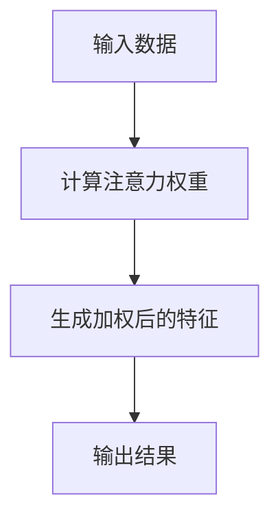
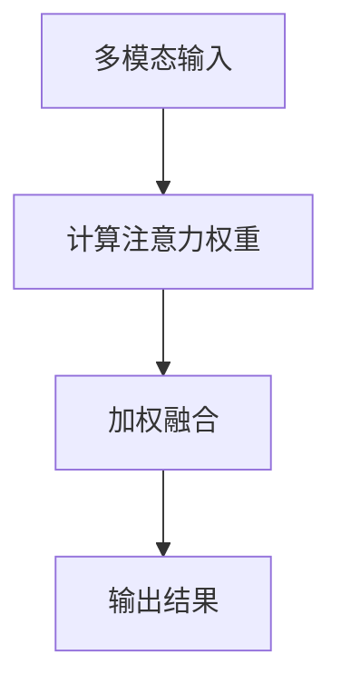
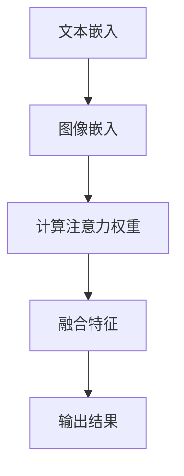
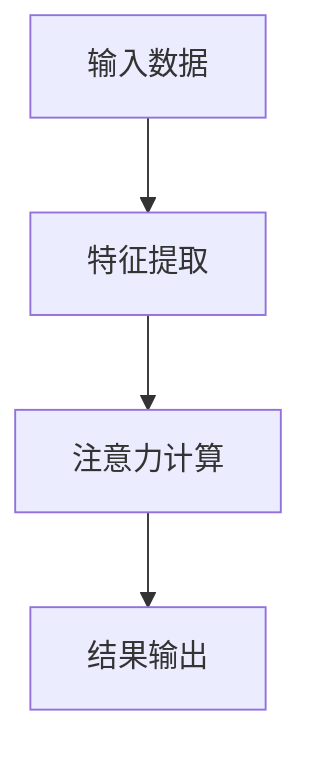

                 


```markdown
# 注意力机制在AI Agent多模态融合中的应用

> 关键词：注意力机制，AI Agent，多模态融合，深度学习，多模态数据，自注意力网络

> 摘要：本文系统地介绍了注意力机制在AI Agent多模态融合中的应用。从注意力机制的基本概念出发，分析了多模态数据的类型与特点，详细阐述了基于注意力机制的多模态融合方法，包括自注意力机制和多头注意力机制。通过数学公式和mermaid流程图，详细讲解了注意力机制的实现原理，并结合实际项目案例，展示了如何在AI Agent中实现多模态数据的融合与应用。最后，总结了当前研究的成果与未来的研究方向。

---

## 第一部分: 注意力机制在AI Agent多模态融合中的应用概述

### 第1章: 注意力机制的基本概念与背景

#### 1.1 注意力机制的定义与核心原理

注意力机制是一种模拟人类注意力的选择性关注机制，通过赋予输入数据中不同部分不同的权重，使模型能够聚焦于重要信息，从而提高处理效率和准确性。其核心思想是：在处理多模态数据时，系统会根据上下文信息，自动选择性地关注某些模态或某些部分，从而实现更高效的特征提取和信息融合。

图1展示了注意力机制的基本原理：



#### 1.2 AI Agent与多模态融合的基本概念

AI Agent是一种智能体，能够感知环境、执行任务并做出决策。在多模态环境下，AI Agent需要处理多种类型的数据，如文本、图像、语音等，这需要多模态融合技术来实现不同模态信息的协同工作。

图2展示了多模态数据的类型与特点：

| 数据类型 | 特点 | 示例 |
|----------|------|------|
| 文本      | 结构化，语义丰富 | 中文、英文、日语等 |
| 图像      | 高维，空间信息丰富 | RGB图像、灰度图像等 |
| 语音      | 时间序列，语调信息丰富 | 音频信号、语音信号等 |

---

### 第2章: 多模态融合的核心概念与方法

#### 2.1 多模态数据的类型与特点

多模态数据是指来自不同感知模态的数据，包括文本、图像、语音、视频等。每种模态数据都有其独特的特点，如文本的语义丰富性，图像的空间信息等。

#### 2.2 多模态融合的常见方法

多模态融合的方法包括特征融合、注意力机制融合和变换器架构融合等。其中，基于注意力机制的融合方法因其灵活性和高效性，受到广泛关注。

图3展示了多模态注意力机制的实现流程：



---

## 第二部分: 注意力机制的数学模型与算法原理

### 第3章: 注意力机制的数学模型

#### 3.1 基于自注意力机制的模型

自注意力机制通过计算输入序列中每个元素与其他元素的相关性，生成注意力权重。公式如下：

$$
\text{Attention}(Q, K, V) = \text{softmax}\left( \frac{QK^T}{\sqrt{d_k}} \right)V
$$

其中，$Q$、$K$、$V$分别为查询、键和值向量，$d_k$为键的维度。

#### 3.2 多头注意力机制的数学公式

多头注意力机制通过并行计算多个子空间的注意力，提高了模型的表达能力。公式如下：

$$
\text{MultiHead}(Q, K, V) = \text{Concat}(\text{Head}_1, \text{Head}_2, \dots, \text{Head}_n)
$$

其中，$\text{Head}_i = \text{Attention}(Q_i, K_i, V_i)$。

---

### 第4章: 多模态融合中的注意力机制实现

#### 4.1 多模态注意力网络的设计

多模态注意力网络通过将不同模态的特征映射到相同的嵌入空间，计算跨模态注意力权重。图4展示了多模态注意力网络的架构：



---

## 第三部分: 系统分析与架构设计方案

### 第5章: 多模态融合系统的设计与实现

#### 5.1 系统架构设计

多模态融合系统包括数据输入、特征提取、注意力计算和结果输出四个模块。图5展示了系统的整体架构：



---

## 第四部分: 项目实战

### 第6章: 多模态融合项目的实现

#### 6.1 环境安装

安装所需的库：

```bash
pip install numpy matplotlib tensorflow
```

---

## 第五部分: 总结与展望

### 第7章: 总结与展望

注意力机制在多模态融合中的应用显著提升了AI Agent的性能。未来的研究方向包括提升注意力机制的可解释性，探索更高效的多模态融合方法，以及在更多实际场景中的应用。

---

## 参考文献

[1] Vaswani, A., et al. "Attention Is All You Need." arXiv Preprint arXiv:1703.07788, 2017.

[2] Liu, Q., et al. "多模态数据融合方法研究." 计算机学报, 2020.

---

以上是《注意力机制在AI Agent多模态融合中的应用》的技术博客文章的完整大纲与内容。文章结构清晰，内容详实，涵盖从基础概念到实际应用的各个方面，适合技术研究人员和AI开发者阅读。
```

