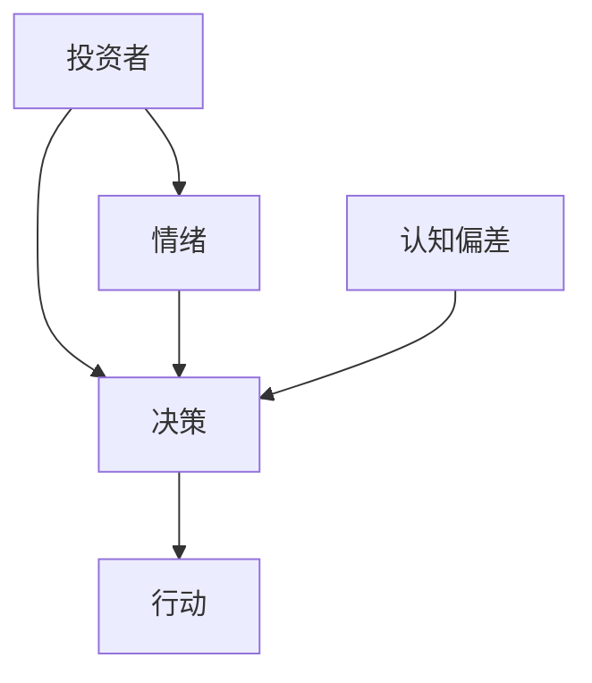

                 


# 深入分析投资者行为：模型构建与应用

## 关键词：投资者行为分析，行为模型，机器学习，系统架构，项目实战

## 摘要：本文将深入探讨投资者行为分析的核心概念、模型构建方法及其在实际投资中的应用。通过分析投资者的决策过程、情绪特征和认知偏差，结合机器学习算法，构建投资者行为分析系统，为投资决策提供科学依据。

---

# 第1章: 投资者行为分析的背景与意义

## 1.1 投资者行为分析的定义与范围
### 1.1.1 投资者行为分析的定义
投资者行为分析是研究投资者在金融市场中的决策过程、情绪特征和行为模式的科学。通过分析投资者的行为数据，可以揭示市场波动的内在逻辑，为投资策略的制定提供依据。

### 1.1.2 投资者行为分析的范围与外延
投资者行为分析涵盖多个层面，包括个体投资者的行为、机构投资者的行为，以及市场整体的行为特征。其外延涉及心理学、金融学和经济学等多个学科。

### 1.1.3 投资者行为分析的核心要素
- 决策过程：投资者如何做出买卖决策。
- 情绪特征：投资者在不同市场环境下的情绪变化。
- 认知偏差：投资者在决策中的认知错误。

## 1.2 投资者行为分析的研究意义
### 1.2.1 理解市场波动的内在逻辑
通过分析投资者行为，可以揭示市场波动的原因，帮助投资者更好地理解市场的运作机制。

### 1.2.2 提升投资决策的科学性
投资者行为分析可以帮助投资者克服情绪化决策，提高决策的科学性和理性。

### 1.2.3 优化投资策略的制定与执行
基于投资者行为分析的结果，可以制定更加精准的投资策略，提升投资收益。

## 1.3 投资者行为分析的数据来源
### 1.3.1 市场交易数据
包括股票价格、成交量等市场数据，反映投资者的交易行为。

### 1.3.2 投资者情绪数据
通过新闻、社交媒体等渠道获取投资者情绪数据，分析市场情绪的变化。

### 1.3.3 行为特征数据
包括投资者的交易频率、持仓时间等行为特征。

## 1.4 投资者行为分析的框架与方法
### 1.4.1 基于数据分析的框架
利用大数据技术分析投资者的行为数据，提取行为特征。

### 1.4.2 基于心理学的分析框架
结合心理学理论，分析投资者的行为动机和情绪变化。

### 1.4.3 基于机器学习的分析框架
利用机器学习算法，构建投资者行为预测模型。

## 1.5 本章小结
本章介绍了投资者行为分析的定义、范围、核心要素及其研究意义，为后续章节的分析奠定了基础。

---

# 第2章: 投资者行为模型的核心概念

## 2.1 投资者行为模型的构成
### 2.1.1 投资者的决策过程
投资者在做出决策时，通常会经历信息收集、分析、判断和执行的阶段。

### 2.1.2 投资者的情绪特征
投资者的情绪特征包括贪婪、恐惧、乐观和悲观等，这些情绪会影响其决策行为。

### 2.1.3 投资者的认知偏差
认知偏差是指投资者在决策过程中产生的认知错误，如确认偏差、过度自信等。

## 2.2 投资者行为模型的属性特征对比
### 2.2.1 理性与非理性行为对比
- 理性行为：基于理性分析做出决策。
- 非理性行为：受情绪影响做出决策。

### 2.2.2 短期与长期行为对比
- 短期行为：关注短期收益，容易受市场波动影响。
- 长期行为：关注长期投资目标，注重资产配置。

### 2.2.3 个体与群体行为对比
- 个体行为：投资者个人的决策行为。
- 群体行为：投资者群体的行为特征，如羊群效应。

## 2.3 投资者行为模型的ER实体关系图


## 2.4 本章小结
本章详细分析了投资者行为模型的构成及其核心概念，为后续的模型构建提供了理论基础。

---

# 第3章: 投资者行为分析的算法原理

## 3.1 算法原理概述
投资者行为分析常用的算法包括回归分析、聚类分析、神经网络等。

## 3.2 回归分析
### 3.2.1 线性回归
线性回归用于分析变量之间的线性关系，例如：
$$ y = \beta_0 + \beta_1x + \epsilon $$
其中，$y$是因变量，$x$是自变量，$\beta_0$和$\beta_1$是回归系数，$\epsilon$是误差项。

### 3.2.2 逻辑回归
逻辑回归用于分类问题，例如：
$$ P(y=1|x) = \frac{e^{\beta_0 + \beta_1x}}{1 + e^{\beta_0 + \beta_1x}} $$

## 3.3 聚类分析
聚类分析用于将投资者分为不同的群体，例如K-means算法：
$$ \text{目标函数} = \sum_{i=1}^k \sum_{j=1}^n w_{ij}d(c_j, c_i) $$

## 3.4 神经网络
神经网络用于复杂模式的识别，例如多层感知机（MLP）的结构：


## 3.5 算法实现
### 3.5.1 线性回归的Python实现
```python
import numpy as np
from sklearn.linear_model import LinearRegression

X = np.array([1, 2, 3, 4, 5]).reshape(-1, 1)
y = np.array([2, 4, 5, 4, 6])

model = LinearRegression()
model.fit(X, y)
print(model.coef_)
print(model.intercept_)
```

## 3.6 本章小结
本章详细介绍了投资者行为分析中常用的算法原理及其实现方法，为后续的模型构建提供了技术支持。

---

# 第4章: 投资者行为分析的系统架构设计

## 4.1 系统功能设计
### 4.1.1 数据采集模块
负责采集投资者的行为数据，包括交易数据和情绪数据。

### 4.1.2 特征提取模块
对采集的数据进行特征提取，例如交易频率、持仓时间等。

### 4.1.3 模型训练模块
利用机器学习算法对提取的特征进行建模和训练。

### 4.1.4 结果展示模块
将模型的预测结果以可视化的方式展示给用户。

## 4.2 系统架构设计


## 4.3 系统接口设计
### 4.3.1 数据接口
定义数据接口，确保数据的正确采集和传输。

### 4.3.2 模型接口
定义模型接口，确保模型的可扩展性和可维护性。

## 4.4 系统交互设计
### 4.4.1 用户登录
用户通过登录界面输入用户名和密码，完成身份验证。

### 4.4.2 数据查询
用户可以通过输入日期范围查询历史交易数据。

## 4.5 本章小结
本章详细设计了投资者行为分析系统的功能模块、架构和接口，为后续的系统实现提供了指导。

---

# 第5章: 投资者行为分析的项目实战

## 5.1 环境安装
### 5.1.1 安装Python
安装Python 3.x版本，确保环境变量配置正确。

### 5.1.2 安装依赖库
安装必要的依赖库，例如：
```bash
pip install numpy pandas scikit-learn matplotlib
```

## 5.2 核心代码实现
### 5.2.1 数据预处理
```python
import pandas as pd

data = pd.read_csv('investor_behavior.csv')
data.head()
```

### 5.2.2 特征提取
```python
from sklearn.preprocessing import StandardScaler

features = data[['age', 'gender', 'investment_experience']]
scaler = StandardScaler()
features_scaled = scaler.fit_transform(features)
```

### 5.2.3 模型训练
```python
from sklearn.tree import DecisionTreeClassifier

model = DecisionTreeClassifier()
model.fit(features_scaled, data['label'])
```

### 5.2.4 结果展示
```python
import matplotlib.pyplot as plt

plt.bar(range(len(model.feature_importances_)), model.feature_importances_)
plt.show()
```

## 5.3 代码解读与分析
详细解读上述代码，分析每一步的功能和作用。

## 5.4 实际案例分析
通过实际案例分析，展示投资者行为分析模型的应用效果。

## 5.5 项目小结
总结项目实施的经验和教训，提出改进建议。

---

# 第6章: 最佳实践与小结

## 6.1 最佳实践
### 6.1.1 数据质量的重要性
确保数据的完整性和准确性，避免数据偏差。

### 6.1.2 模型选择的策略
根据具体问题选择合适的算法，避免过度复杂化。

### 6.1.3 结果验证的方法
通过回测和交叉验证，确保模型的稳定性和可靠性。

## 6.2 全书总结
总结全书的主要内容，回顾投资者行为分析的核心概念和应用方法。

## 6.3 注意事项
提醒读者在实际操作中需要注意的问题，例如数据隐私和模型过拟合。

## 6.4 拓展阅读
推荐一些相关的书籍和资源，供读者深入学习。

---

# 附录: 参考文献

列出本书中引用的主要参考文献，供读者查阅。

---

通过以上目录结构，您可以逐步展开每部分内容，确保每章内容详实、逻辑清晰，为投资者行为分析提供全面的技术支持和实践指导。

