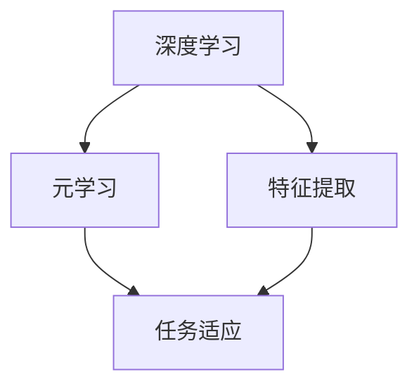
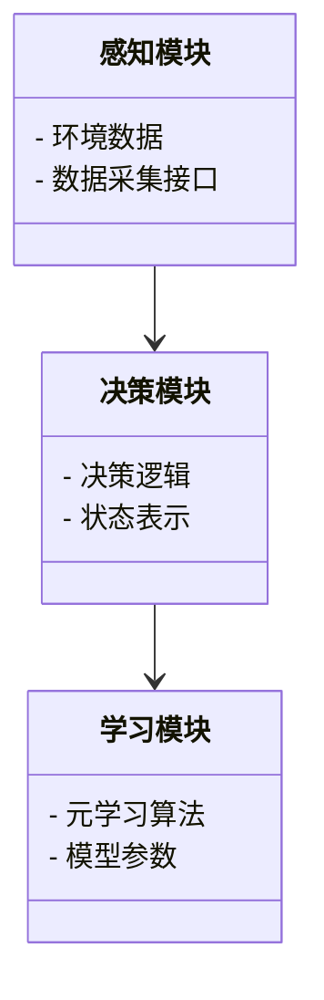
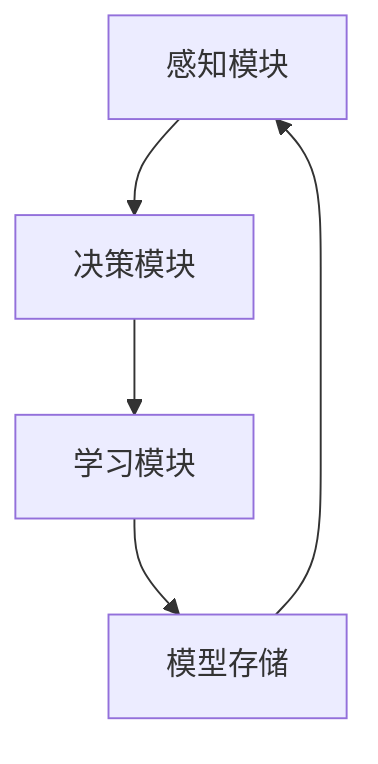

                 


# 深度元学习在AI Agent快速适应中的应用

> 关键词：深度元学习，AI Agent，快速适应，元学习算法，系统架构设计

> 摘要：本文系统地探讨了深度元学习在AI Agent快速适应中的应用，从理论基础到算法实现，再到系统设计与实际案例，全面解析了深度元学习如何赋能AI Agent在复杂动态环境中的快速适应能力。通过详细阐述深度元学习的核心原理、AI Agent的适应机制、算法实现、系统架构设计，以及实际项目中的应用案例，本文为读者提供了一个从理论到实践的完整视角，帮助读者深入理解并掌握深度元学习在AI Agent快速适应中的应用。

---

## 第一部分: 深度元学习与AI Agent概述

### 第1章: 深度元学习与AI Agent的背景介绍

#### 1.1 深度学习与元学习的核心概念

##### 1.1.1 深度学习的基本原理
深度学习是一种基于人工神经网络的机器学习方法，通过多层非线性变换，自动提取数据的高层次特征。其核心在于通过大量的训练数据，调整网络参数，使得模型能够准确地进行分类、回归或其他任务。

##### 1.1.2 元学习的定义与特点
元学习是一种学习如何学习的方法，旨在通过少量样本快速适应新任务。其核心思想是将学习过程本身作为目标，通过优化元参数（meta-parameters）来实现对新任务的快速适应。

##### 1.1.3 深度元学习的整合与优势
深度元学习结合了深度学习的特征提取能力和元学习的快速适应能力，能够在复杂任务中实现高效学习和快速调整。其优势在于能够同时处理多任务学习和快速适应问题。

#### 1.2 AI Agent的基本概念与分类

##### 1.2.1 AI Agent的定义
AI Agent（人工智能代理）是一种能够感知环境、执行任务并做出决策的智能实体。它通过与环境的交互，实现目标的优化。

##### 1.2.2 AI Agent的分类与应用场景
AI Agent可以分为基于规则的Agent、基于模型的Agent和基于学习的Agent。在实际应用中，AI Agent广泛应用于自动驾驶、智能助手、机器人控制等领域。

##### 1.2.3 AI Agent的适应性需求
为了应对动态变化的环境，AI Agent需要具备快速适应新任务的能力，这使得深度元学习成为其实现这一目标的理想选择。

---

### 第2章: 深度元学习在AI Agent中的应用背景

#### 2.1 AI Agent快速适应的挑战

##### 2.1.1 动态环境中的适应性问题
在动态环境中，AI Agent需要快速调整策略以应对环境的变化，传统的固定模型难以满足这一需求。

##### 2.1.2 多样化任务的处理需求
AI Agent可能需要处理多种任务，例如分类、检测、预测等，如何在这些任务之间快速切换是一个关键问题。

##### 2.1.3 知识迁移的效率与准确性
如何高效地将已有的知识迁移到新任务中，是实现快速适应的核心挑战。

#### 2.2 深度元学习的解决方案

##### 2.2.1 元学习在快速适应中的作用
元学习通过优化元参数，使得模型能够在新任务中快速调整，从而实现快速适应。

##### 2.2.2 深度学习与元学习的结合优势
深度学习提供了强大的特征提取能力，元学习提供了快速适应的机制，二者的结合使得AI Agent能够在复杂环境中高效工作。

##### 2.2.3 深度元学习在AI Agent中的具体应用
深度元学习可以应用于任务切换、多任务学习、动态环境适应等多个场景，帮助AI Agent快速适应新任务。

---

### 第3章: 深度元学习的核心概念与联系

#### 3.1 深度元学习的核心原理

##### 3.1.1 元学习的基本原理
元学习通过优化元参数，使得模型能够在新任务中快速调整，其核心是通过元梯度（meta-gradient）更新元参数。

##### 3.1.2 深度学习在元学习中的作用
深度学习通过提取高层次特征，为元学习提供了强大的特征表示能力。

##### 3.1.3 深度元学习的数学模型
深度元学习的数学模型通常包括任务损失函数和元损失函数，通过优化元损失函数来实现对任务损失函数的优化。

#### 3.2 核心概念对比与ER实体关系图

##### 3.2.1 深度学习与元学习的对比分析
- **深度学习**：注重特征提取和模式识别。
- **元学习**：注重快速适应和任务迁移。

##### 3.2.2 ER实体关系图展示


---

### 第4章: 深度元学习的算法原理

#### 4.1 元学习算法的基本流程

##### 4.1.1 元学习的训练过程
1. 初始化元参数。
2. 在训练任务上优化任务参数。
3. 基于任务参数的梯度更新元参数。

##### 4.1.2 元学习的推理过程
1. 使用元参数初始化任务参数。
2. 在新任务上优化任务参数。
3. 输出结果。

#### 4.2 深度元学习算法的数学模型

##### 4.2.1 元学习的优化目标
元学习的目标是最小化元损失函数，即：
$$ \min_{\theta} \mathbb{E}_{t}[\mathcal{L}_t(\theta_t; \theta)] $$
其中，$\theta$ 是元参数，$\theta_t$ 是任务参数。

##### 4.2.2 深度元学习的数学公式
深度元学习的梯度更新公式为：
$$ \nabla_{\theta} \mathcal{L}_{\text{meta}} = \nabla_{\theta} \sum_{t} \mathcal{L}_t(\theta_t; \theta) $$

---

### 第5章: AI Agent的系统架构与设计

#### 5.1 AI Agent的系统功能设计

##### 5.1.1 系统功能模块划分
- **感知模块**：负责环境感知和数据采集。
- **决策模块**：基于感知数据进行决策。
- **学习模块**：负责模型的训练和更新。

##### 5.1.2 功能模块之间的关系
感知模块向决策模块提供数据，决策模块调用学习模块进行模型更新。

##### 5.1.3 系统功能设计的领域模型



#### 5.2 系统架构设计

##### 5.2.1 系统架构图展示



##### 5.2.2 系统组件之间的交互关系
- 感知模块接收环境数据并传递给决策模块。
- 决策模块根据感知数据调用学习模块进行模型更新。
- 学习模块更新模型后，将新模型传递给感知模块。

##### 5.2.3 系统架构设计的优缺点分析
- **优点**：模块化设计，便于扩展和维护。
- **缺点**：组件之间的交互可能增加系统的复杂性。

---

### 第6章: 项目实战与案例分析

#### 6.1 项目环境与工具安装

##### 6.1.1 开发环境搭建
- 操作系统：Ubuntu 20.04
- 开发工具：PyCharm
- 依赖库：TensorFlow、Keras、numpy

##### 6.1.2 依赖库的安装与配置
```bash
pip install tensorflow keras numpy
```

#### 6.2 项目核心代码实现

##### 6.2.1 元学习算法的实现
```python
def meta_learning(model, tasks, meta_lr=1e-3):
    meta_optimizer = Adam(lr=meta_lr)
    for task in tasks:
        task_loss = task_fn(model, task)
        meta_gradients = compute_gradients(task_loss, model.trainable_weights)
        meta_optimizer.apply_gradients(zip(meta_gradients, model.trainable_weights))
```

##### 6.2.2 AI Agent的实现
```python
class AI_Agent:
    def __init__(self, model):
        self.model = model
        self.perception = PerceptionModule()
        self.decision = DecisionModule()
    
    def perceive(self, env):
        self.perception.receive_data(env)
    
    def decide(self, action_space):
        return self.decision.make_decision(action_space, self.model)
```

##### 6.2.3 系统功能模块的实现
```python
class LearningModule:
    def __init__(self, model):
        self.model = model
    
    def update_model(self, task_loss):
        self.model.train(task_loss)
```

#### 6.3 案例分析与详细解读

##### 6.3.1 案例背景介绍
假设我们有一个AI Agent需要在多个任务之间快速切换，例如从图像分类任务切换到图像检测任务。

##### 6.3.2 案例实现过程
1. 初始化模型参数。
2. 在训练任务上优化任务参数。
3. 在新任务上优化任务参数。

##### 6.3.3 案例结果分析
通过元学习算法，AI Agent能够在新任务上快速适应，实现任务切换。

---

### 第7章: 最佳实践与小结

#### 7.1 最佳实践 tips

##### 7.1.1 开发中的注意事项
- 确保元学习算法的收敛性。
- 合理设计系统架构，避免模块间的耦合度过高。

##### 7.1.2 系统优化建议
- 使用分布式训练提升效率。
- 通过正则化方法减少过拟合。

#### 7.2 小结
深度元学习在AI Agent快速适应中的应用，不仅提高了模型的适应性，还为复杂动态环境中的任务处理提供了新的解决方案。通过本文的系统分析与实践案例，读者可以更好地理解和掌握深度元学习在AI Agent中的应用。

---

通过以上内容，我们系统地探讨了深度元学习在AI Agent快速适应中的应用，从理论到实践，为读者提供了一个全面的视角。

