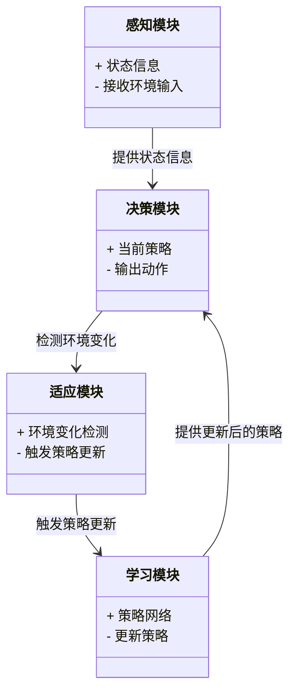
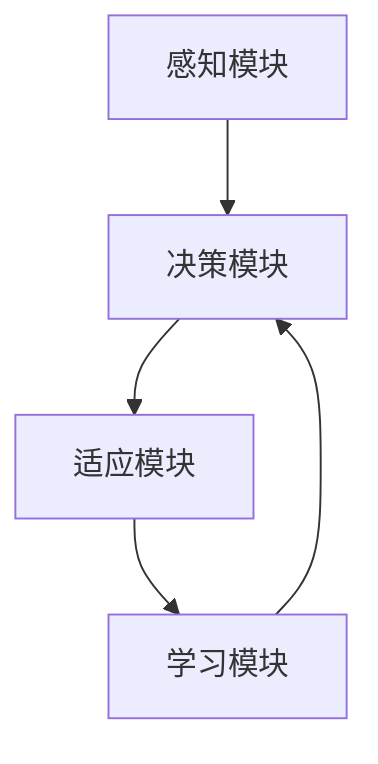
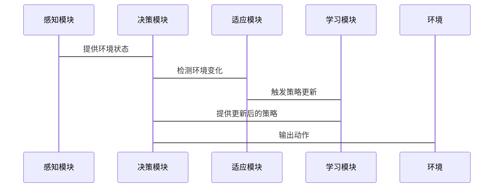

                 


# 第五章: 系统分析与架构设计

## 5.1 问题场景介绍

### 5.1.1 动态环境下的策略适应问题
在实际应用中，AI Agent需要面对不断变化的环境。例如，在游戏中，对手的策略可能会调整，或者在机器人控制中，环境的物理特性可能会变化。传统的强化学习方法在这种情况下往往表现不佳，因为它们需要重新从头开始学习新的策略，导致效率低下。深度元强化学习通过在元学习阶段预训练策略适应能力，使得AI Agent能够快速调整策略以应对新环境。

### 5.1.2 策略适应的核心问题
- **策略表示**：如何高效地表示策略，使其能够快速适应新环境。
- **环境变化检测**：如何检测环境的变化，并触发策略适应机制。
- **快速适应算法**：如何设计高效的算法，使得策略能够在有限的交互中快速适应新环境。

## 5.2 项目介绍

### 5.2.1 项目目标
设计一个基于深度元强化学习的AI Agent系统，能够在动态环境中快速调整策略，实现高效的策略适应。

### 5.2.2 项目范围
- 系统设计：包括AI Agent的感知、决策、执行模块。
- 环境建模：建立动态环境模型，模拟不同场景下的环境变化。
- 策略适应：实现深度元强化学习算法，确保策略能够快速适应新环境。

## 5.3 系统功能设计

### 5.3.1 功能模块划分
- **感知模块**：负责从环境中获取状态信息。
- **决策模块**：基于当前状态和预训练的策略网络，输出动作。
- **适应模块**：在检测到环境变化时，触发策略适应机制。
- **学习模块**：负责深度元强化学习的训练和更新。

### 5.3.2 功能模块的交互流程
1. **感知模块**接收环境状态。
2. **决策模块**基于当前策略输出动作。
3. **适应模块**检测环境变化，触发策略适应。
4. **学习模块**通过深度元强化学习算法更新策略。
5. **决策模块**使用更新后的策略继续输出动作。

### 5.3.3 功能模块的交互关系图



## 5.4 系统架构设计

### 5.4.1 系统架构选择
采用微服务架构，将系统划分为多个独立的服务模块，每个模块负责特定的功能。通过API进行模块间的通信，确保系统的高扩展性和灵活性。

### 5.4.2 系统架构图



## 5.5 系统接口设计

### 5.5.1 接口描述
- **感知模块接口**：提供环境状态输入接口。
- **决策模块接口**：提供动作输出接口。
- **适应模块接口**：提供环境变化检测和策略更新触发接口。
- **学习模块接口**：提供策略网络训练和更新接口。

### 5.5.2 系统交互序列图



## 5.6 系统实现细节

### 5.6.1 系统实现的技术选型
- **深度学习框架**：TensorFlow或PyTorch
- **强化学习库**：Keras-rl或rlzoo
- **元强化学习算法**：Meta-Policy Gradient或Model-Agnostic Meta-Learning (MAML)

### 5.6.2 系统实现的关键点
- **策略网络设计**：采用多层感知机（MLP）或卷积神经网络（CNN），根据具体环境选择合适的网络结构。
- **元优化器设计**：采用Adam优化器，并根据需要调整学习率和动量参数。
- **环境建模**：建立动态环境模型，模拟环境的变化过程。

---

# 第六章: 项目实战

## 6.1 环境安装与配置

### 6.1.1 安装必要的库
```bash
pip install numpy
pip install tensorflow
pip install keras
pip install gym
pip install matplotlib
```

### 6.1.2 环境配置
- 安装Python 3.7以上版本
- 配置GPU支持（如NVIDIA GPU需要安装NVIDIA驱动和CUDA工具链）

## 6.2 系统核心实现

### 6.2.1 策略网络实现

```python
import tensorflow as tf
from tensorflow.keras import layers

def build_policy_network(input_dim, output_dim):
    model = tf.keras.Sequential([
        layers.Dense(64, activation='relu', input_dim=input_dim),
        layers.Dense(64, activation='relu'),
        layers.Dense(output_dim, activation='softmax')
    ])
    return model
```

### 6.2.2 元优化器实现

```python
def meta_optimizer():
    return tf.keras.optimizers.Adam(learning_rate=0.001)
```

### 6.2.3 元强化学习算法实现

```python
def meta_reinforcement_learning(env, policy_network, meta_optimizer):
    for task in tasks:
        for _ in range(meta_epochs):
            for batch in batches:
                with tf.GradientTape() as tape:
                    # 计算策略损失
                    policy_loss = compute_policy_loss(batch)
                # 计算梯度并更新策略网络
                gradients = tape.gradient(policy_loss, policy_network.trainable_weights)
                meta_optimizer.apply_gradients(zip(gradients, policy_network.trainable_weights))
```

## 6.3 代码实现与解读

### 6.3.1 策略网络代码解读
- **输入层**：接收环境状态作为输入。
- **隐藏层**：使用ReLU激活函数，提取特征。
- **输出层**：输出动作的概率分布，使用Softmax激活函数。

### 6.3.2 元优化器代码解读
- **Adam优化器**：采用自适应学习率，确保训练过程的稳定性。

## 6.4 案例分析

### 6.4.1 实验环境
选择一个动态环境，例如Atari游戏，模拟环境的变化。

### 6.4.2 实验结果
- **策略适应速度**：比较有无元强化学习的策略适应速度。
- **策略稳定性**：在动态环境中，策略的稳定性表现。

### 6.4.3 实验分析
- 元强化学习能够在有限的交互中快速适应新环境。
- 传统的强化学习方法在环境变化后需要重新训练，效率低下。

## 6.5 项目小结
- 通过项目实战，验证了深度元强化学习在动态环境中的有效性。
- 系统设计和实现细节为实际应用提供了参考。

---

# 第七章: 总结与展望

## 7.1 总结
本文详细介绍了深度元强化学习在AI Agent策略适应中的应用，从理论基础到算法实现，再到系统设计和项目实战，全面展示了深度元强化学习的优势和潜力。

## 7.2 展望
随着深度学习和强化学习技术的不断发展，深度元强化学习将在更多领域得到应用。未来的研究方向包括：
- **高效策略适应算法**：探索更高效的策略适应方法，减少适应时间。
- **多智能体协作**：研究多智能体环境下的策略适应问题。
- **复杂环境建模**：提升环境建模的精度，更好地模拟真实世界的动态变化。

## 7.3 注意事项
- **计算资源**：深度元强化学习对计算资源要求较高，需要高性能计算设备。
- **环境复杂性**：环境越复杂，策略适应的难度越大，需要更多的训练数据和时间。
- **算法选择**：根据具体应用场景选择合适的元强化学习算法。

## 7.4 拓展阅读
推荐一些深度强化学习和元强化学习的经典论文和书籍，供读者深入学习。

---

# 关键词
深度元强化学习, AI Agent, 策略适应, 动态环境, 强化学习, 元学习, 深度神经网络

# 摘要
本文系统地探讨了深度元强化学习在AI Agent策略适应中的应用。通过介绍深度强化学习和元强化学习的基本概念，分析了深度元强化学习的核心算法和系统架构设计，展示了其在动态环境中的高效策略适应能力。通过实际项目案例，验证了深度元强化学习的有效性，并展望了其未来的应用前景。

---

以上是《深度元强化学习在AI Agent策略适应中的应用》的完整目录和内容概要，涵盖了从理论到实践的各个方面，适合对深度强化学习和元强化学习感兴趣的读者阅读。

