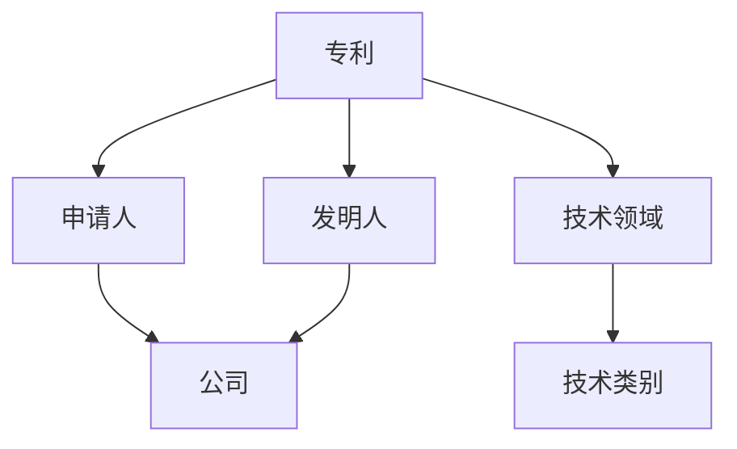
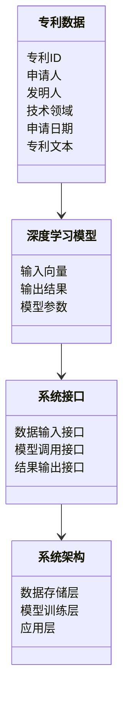

                 


# 目录大纲：《深度学习分析公司专利组合价值》

## # 第一部分：背景介绍

### ## 第1章：问题背景与核心概念

#### ### 1.1 问题背景
- 从传统专利分析到现代深度学习分析的演进
- 当前企业专利评估的痛点与挑战
- 深度学习技术在专利分析中的应用前景

#### ### 1.2 核心概念与问题描述
- 专利组合的定义与特征
- 专利组合价值的核心要素
- 深度学习在专利分析中的具体应用场景

#### ### 1.3 问题解决与边界
- 深度学习如何解决专利组合价值评估问题
- 专利组合分析的边界与外延
- 相关领域的区别与联系

#### ### 1.4 核心概念结构与要素
- 专利组合价值的构成要素
- 深度学习模型的输入与输出
- 专利数据与分析结果的关系

## # 第二部分：核心概念与联系

### ## 第2章：核心概念原理

#### ### 2.1 深度学习与专利分析的结合
- 深度学习在文本分析中的优势
- 专利文本的特征与挑战
- 深度学习模型在专利分析中的应用

#### ### 2.2 核心概念属性对比
- 专利数据与文本数据的对比
- 深度学习模型与传统统计模型的对比
- 不同深度学习模型的性能对比

#### ### 2.3 ER实体关系图


## # 第三部分：算法原理讲解

### ## 第3章：深度学习算法原理

#### ### 3.1 深度学习模型选择
- RNN与Transformer模型的对比
- BERT模型在文本分析中的应用
- 根据专利分析需求选择模型

#### ### 3.2 模型原理与流程
- Transformer模型的工作原理
- 注意力机制在专利分析中的应用
- 编码器-解码器架构的具体实现

#### ### 3.3 算法实现步骤
1. 数据预处理
2. 模型训练
3. 模型调优
4. 结果分析

## # 第四部分：系统分析与架构设计方案

### ## 第4章：系统设计

#### ### 4.1 问题场景介绍
- 专利数据的获取与清洗
- 模型训练与部署
- 系统功能需求

#### ### 4.2 系统功能设计


#### ### 4.3 系统架构设计
- 分层架构设计
- 模块化设计
- 可扩展性设计

## # 第五部分：项目实战

### ## 第5章：项目实施与分析

#### ### 5.1 环境安装
- 安装Python和相关库
- 安装深度学习框架（如TensorFlow或PyTorch）
- 安装NLP处理库（如NLTK或spaCy）

#### ### 5.2 核心代码实现
```python
import tensorflow as tf
from tensorflow.keras import layers

def build_model(max_sequence_length, vocab_size):
    model = tf.keras.Sequential()
    model.add(layers.Embedding(vocab_size, 100, input_length=max_sequence_length))
    model.add(layers.LSTM(128, return_sequences=True))
    model.add(layers.Dense(64, activation='relu'))
    model.add(layers.Dense(1, activation='sigmoid'))
    model.compile(optimizer='adam', loss='binary_crossentropy', metrics=['accuracy'])
    return model
```

#### ### 5.3 代码解读与分析
- 代码功能分析
- 模型训练过程
- 模型调优技巧

#### ### 5.4 实际案例分析
- 数据预处理步骤
- 模型训练与验证
- 结果分析与解读

#### ### 5.5 项目小结
- 成果总结
- 项目不足
- 改进方向

## # 第六部分：总结与建议

### ## 第6章：最佳实践与总结

#### ### 6.1 最佳实践
- 数据清洗的重要性
- 模型选择的策略
- 结果解读的技巧

#### ### 6.2 项目小结
- 项目目标的实现情况
- 关键技术点总结
- 经验与教训

#### ### 6.3 注意事项
- 数据隐私保护
- 模型泛化能力
- 系统性能优化

#### ### 6.4 拓展阅读
- 深度学习与NLP的结合
- 专利分析的最新研究
- 人工智能在知识产权领域的应用

## # 附录

### ## 附录A：常用工具与库

#### ### A.1 Python库
- TensorFlow/Keras
- PyTorch
- NLTK
- spaCy

#### ### A.2 开发环境配置
- 安装步骤
- 环境搭建教程

### ## 附录B：数学公式

#### ### B.1 注意力机制
$$
\text{Attention}(Q, K, V) = \text{softmax}\left(\frac{QK^T}{\sqrt{d_k}}\right)V
$$

#### ### B.2 模型损失函数
$$
\text{Loss} = -\sum_{i=1}^{n} y_i \log p_i + (1 - y_i) \log (1 - p_i)
$$

### ## 附录C：参考文献

#### ### C.1 主要参考文献
- 《深度学习》——Ian Goodfellow
- 《自然语言处理实战》——贾里德·斯科特
- 《专利分析与管理》——李明

#### ### C.2 其他参考资料
- TensorFlow官方文档
- PyTorch官方文档
- 各类技术博客与论文

---

**摘要：**  
本文将系统地探讨如何利用深度学习技术来分析和评估公司专利组合的价值。通过结合文本挖掘、自然语言处理和深度学习模型，本文提出了一种创新的方法，能够高效地从大量专利数据中提取关键信息，并评估其商业价值。文章从背景介绍、核心概念、算法原理、系统设计到项目实战，全面详细地阐述了深度学习在专利分析中的应用，并通过实际案例展示了该方法的有效性和实用性。

