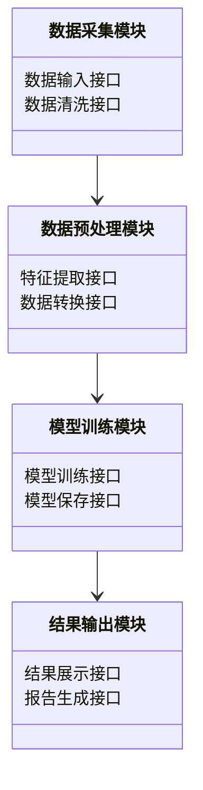
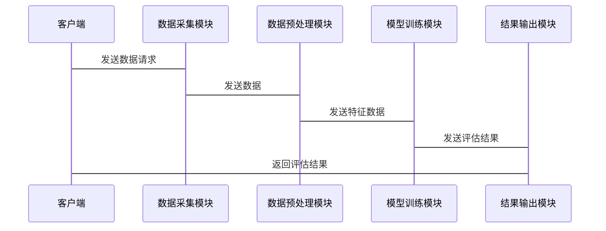

                 


---

# 深度学习分析公司无形资产价值

> 关键词：深度学习，无形资产，资产评估，神经网络，企业价值，风险评估，技术分析

> 摘要：本文将深入探讨如何利用深度学习技术分析和评估公司无形资产的价值。通过介绍无形资产的基本概念、深度学习的核心原理，以及两者结合的实际应用场景，本文旨在揭示深度学习在无形资产评估中的独特优势。从数学模型的构建到系统架构的设计，再到实际项目的实现，本文将全面解析深度学习在无形资产评估中的技术细节和实践方法。

---

## 第1章: 无形资产与深度学习概述

### 1.1 无形资产的基本概念

#### 1.1.1 无形资产的定义与分类

无形资产是企业拥有的一项重要资产类别，通常包括专利、商标、商誉、版权、特许经营权等。这些资产不具备物理形态，但对企业价值的贡献却非常显著。根据会计准则，无形资产可以分为可识别和不可识别两类。可识别无形资产如专利、商标等，而不可识别的则是商誉等。

| 无形资产类型 | 特征 | 例子 |
|--------------|------|------|
| 可识别无形资产 | 可以单独识别并计量 | 专利、商标 |
| 不可识别无形资产 | 与企业整体相关，难以单独计量 | 商誉 |

#### 1.1.2 无形资产在企业中的重要性

无形资产不仅是企业核心竞争力的体现，也是企业价值的重要组成部分。例如，知名品牌的商标价值可能远超过企业的有形资产。然而，无形资产的价值评估具有复杂性，受到市场环境、法律风险、技术更新等多种因素的影响。

#### 1.1.3 无形资产评估的挑战与难点

无形资产评估的难点在于其价值的高度不确定性。传统评估方法通常依赖于历史数据和市场对标，但在面对新兴技术和快速变化的市场时，这些方法往往显得力不从心。此外，无形资产的法律风险和市场风险也需要被充分考虑。

### 1.2 深度学习的基本概念

#### 1.2.1 深度学习的定义与特点

深度学习是一种人工智能技术，通过多层神经网络对数据进行特征提取和模式识别。与传统机器学习不同，深度学习能够自动学习数据的特征，减少对特征工程的依赖。

深度学习的核心特点包括：
- **非线性特征提取**：能够捕捉复杂的非线性关系。
- **自动特征学习**：无需手动提取特征。
- **强大的表示能力**：能够处理高维数据。

#### 1.2.2 深度学习的核心算法与技术

深度学习的核心算法包括卷积神经网络（CNN）、循环神经网络（RNN）、长短期记忆网络（LSTM）等。这些算法在图像识别、自然语言处理等领域取得了显著成果。

#### 1.2.3 深度学习在企业中的应用领域

深度学习已在多个领域得到广泛应用，包括：
- **金融领域**：股票预测、信用评估。
- **医疗领域**：疾病诊断、药物发现。
- **工业领域**：设备故障预测、质量控制。

### 1.3 深度学习与无形资产评估的结合

#### 1.3.1 深度学习在无形资产评估中的优势

深度学习能够处理海量非结构化数据，如文本、图像等，这使得其在无形资产评估中具有独特优势。例如，可以通过分析企业新闻、市场报告等文本数据，评估企业的品牌价值。

#### 1.3.2 深度学习如何提升无形资产评估的准确性

通过深度学习模型，可以将复杂的非结构化数据转化为可量化的指标，从而提高评估的准确性和可靠性。

#### 1.3.3 深度学习在无形资产评估中的应用场景

- **品牌价值评估**：通过分析社交媒体数据、新闻报道等，评估品牌价值。
- **技术价值评估**：通过分析专利数据，评估技术的创新性和市场前景。
- **商誉评估**：通过分析企业财务数据和市场表现，评估商誉价值。

---

## 第2章: 深度学习模型与无形资产评估的核心概念

### 2.1 深度学习模型的基本原理

#### 2.1.1 神经网络的结构与功能

神经网络由输入层、隐藏层和输出层组成。通过多层网络结构，能够提取数据的高层次特征。

#### 2.1.2 深度学习模型的训练过程

深度学习模型的训练过程包括正向传播和反向传播。正向传播用于计算预测值，反向传播用于更新模型参数。

#### 2.1.3 深度学习模型的评估指标

常用的评估指标包括准确率、召回率、F1分数等。

### 2.2 无形资产评估的核心要素

#### 2.2.1 无形资产的经济价值评估

经济价值评估需要考虑市场供需、行业竞争等因素。

#### 2.2.2 无形资产的风险评估

风险评估包括市场风险、法律风险等。

#### 2.2.3 无形资产的市场价值评估

市场价值评估需要参考可比交易、市场趋势等信息。

### 2.3 深度学习与无形资产评估的关联性分析

#### 2.3.1 深度学习在无形资产数据处理中的作用

深度学习能够处理非结构化数据，如文本、图像等。

#### 2.3.2 深度学习在无形资产价值预测中的应用

通过深度学习模型，可以预测无形资产的未来价值。

#### 2.3.3 深度学习在无形资产风险防控中的优势

深度学习能够实时监控市场动态，及时发现潜在风险。

---

## 第3章: 深度学习模型与无形资产评估的核心算法

### 3.1 神经网络模型的构建与训练

#### 3.1.1 神经网络的层数与节点设计

神经网络的层数和节点数需要根据具体任务进行调整。

#### 3.1.2 神经网络的激活函数与损失函数

常用的激活函数包括ReLU、sigmoid等，损失函数包括均方误差、交叉熵损失等。

#### 3.1.3 神经网络的优化算法与训练技巧

常用的优化算法包括随机梯度下降（SGD）、Adam等。

### 3.2 深度学习模型在无形资产评估中的应用

#### 3.2.1 神经网络模型在无形资产价值预测中的实现

通过训练神经网络模型，可以预测无形资产的未来价值。

#### 3.2.2 深度学习模型在无形资产风险评估中的应用

通过分析市场数据，可以评估无形资产的风险。

#### 3.2.3 深度学习模型在无形资产市场分析中的实践

通过分析市场趋势，可以制定投资策略。

---

## 第4章: 深度学习模型的数学基础与公式推导

### 4.1 神经网络的数学模型

#### 4.1.1 神经网络的输入输出关系

神经网络的输入为$x$, 输出为$y$，通过权重矩阵$W$和激活函数$f$进行变换。

#### 4.1.2 神经网络的权重与偏置参数

权重$W$和偏置$b$用于线性变换，激活函数$f$用于非线性变换。

#### 4.1.3 神经网络的激活函数与损失函数

常用的激活函数为ReLU，损失函数为交叉熵损失。

### 4.2 深度学习模型的优化算法

#### 4.2.1 梯度下降法的数学推导

梯度下降法通过计算损失函数的梯度，更新参数。

#### 4.2.2 Adam优化算法的数学公式

Adam优化算法结合了动量和自适应学习率。

#### 4.2.3 模型训练中的正则化技术

正则化技术包括L2正则化、Dropout等。

### 4.3 深度学习模型的评估指标

#### 4.3.1 分类问题的准确率与混淆矩阵

混淆矩阵用于评估分类模型的性能。

#### 4.3.2 回归问题的均方误差与均方根误差

均方误差（MSE）和均方根误差（RMSE）是常用的回归评估指标。

#### 4.3.3 模型的过拟合与欠拟合分析

过拟合和欠拟合是模型训练中常见的问题，需要通过调整模型复杂度和数据量来解决。

---

## 第5章: 深度学习模型的系统架构与设计

### 5.1 无形资产价值评估系统的功能模块

#### 5.1.1 数据采集模块

数据采集模块负责收集企业相关的无形资产数据。

#### 5.1.2 数据预处理模块

数据预处理模块对数据进行清洗和特征提取。

#### 5.1.3 模型训练模块

模型训练模块负责训练深度学习模型。

#### 5.1.4 结果输出模块

结果输出模块将评估结果呈现给用户。

### 5.2 系统功能设计

#### 5.2.1 领域模型设计（Mermaid类图）



#### 5.2.2 系统架构设计（Mermaid架构图）


### 5.3 系统接口设计

系统接口设计需要考虑模块之间的交互，例如数据采集模块与数据预处理模块之间的接口。

### 5.4 系统交互设计（Mermaid序列图）



---

## 第6章: 项目实战与最佳实践

### 6.1 项目实战

#### 6.1.1 环境安装

需要安装Python、TensorFlow、Keras等库。

#### 6.1.2 系统核心实现源代码

以下是一个简单的深度学习模型实现代码：

```python
import tensorflow as tf
from tensorflow import keras

# 数据预处理
# 数据加载和处理
# 模型定义
model = keras.Sequential([
    keras.layers.Dense(64, activation='relu'),
    keras.layers.Dense(1, activation='sigmoid')
])

# 模型编译
model.compile(optimizer='adam', loss='binary_crossentropy', metrics=['accuracy'])

# 模型训练
model.fit(x_train, y_train, epochs=10, batch_size=32)

# 模型评估
model.evaluate(x_test, y_test)
```

#### 6.1.3 代码应用解读与分析

代码实现了一个简单的深度学习模型，用于分类任务。模型结构包括两个全连接层，使用ReLU激活函数和Adam优化器。

#### 6.1.4 实际案例分析

以品牌价值评估为例，可以通过分析社交媒体数据，训练一个深度学习模型来评估品牌价值。

### 6.2 最佳实践

#### 6.2.1 小结

深度学习在无形资产评估中具有重要作用，能够提高评估的准确性和效率。

#### 6.2.2 注意事项

在实际应用中，需要注意数据的质量和模型的可解释性。

#### 6.2.3 拓展阅读

推荐阅读相关领域的书籍和论文，深入了解深度学习和无形资产评估的结合。

---

## 结语

深度学习作为一种强大的人工智能技术，正在 revolutionizing 无形资产评估领域。通过本文的介绍，希望能够为读者提供一个全面的视角，理解深度学习在无形资产评估中的应用价值和技术实现。未来，随着技术的不断发展，深度学习在无形资产评估中的应用将更加广泛和深入。

