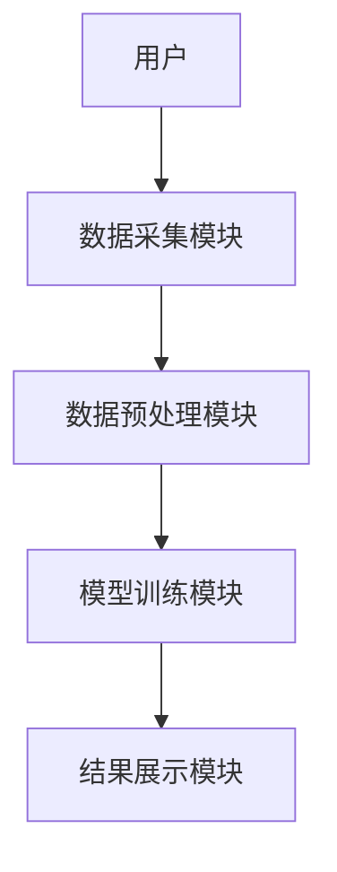

                 


# 深度学习分析社交媒体投资情绪

> 关键词：深度学习，社交媒体，投资情绪，自然语言处理，情感分析，深度学习算法

> 摘要：本文深入探讨了如何利用深度学习技术分析社交媒体上的投资情绪。通过自然语言处理和情感分析，结合深度学习算法，我们能够从社交媒体数据中提取有价值的信息，帮助投资者做出更明智的决策。本文将从背景介绍、核心概念、算法原理、系统设计、项目实战等方面详细阐述这一过程，并提供丰富的代码示例和实际案例分析。

---

## 第一部分：背景介绍

### 第1章：投资情绪分析的背景与意义

#### 1.1 社交媒体在投资中的作用

随着社交媒体的普及，投资者的行为和决策越来越依赖于社交媒体上的信息。社交媒体平台如Twitter、Reddit和微信等，每天产生海量的信息，包括对特定股票、市场趋势的评论和讨论。这些信息反映了投资者的情绪，如乐观、悲观、兴奋或恐慌等。通过分析这些情绪，投资者可以更好地理解市场动态，做出更明智的投资决策。

此外，社交媒体上的信息传播速度极快，能够在短时间内影响市场情绪，进而影响股价波动。因此，研究社交媒体上的投资情绪，对于投资者、机构以及市场监管者来说都具有重要意义。

---

#### 1.2 投资情绪分析的定义与重要性

**投资情绪分析**是指对社交媒体上的文本数据进行分析，识别出其中蕴含的投资情绪（如正面、负面或中性情绪）的过程。投资情绪分析可以帮助投资者了解市场参与者的心理状态，预测市场趋势，从而制定更有效的投资策略。

其重要性体现在以下几个方面：
1. **实时监控市场情绪**：通过实时分析社交媒体数据，投资者可以快速了解市场情绪的变化，及时调整投资策略。
2. **辅助决策**：投资情绪分析可以为投资者提供额外的信息，帮助他们做出更明智的决策。
3. **风险预警**：通过分析负面情绪的集中度，投资者可以提前预警潜在的市场风险。

---

#### 1.3 深度学习在投资情绪分析中的应用

深度学习是一种基于人工神经网络的机器学习方法，近年来在自然语言处理领域取得了显著进展。深度学习模型能够自动学习文本数据中的特征，无需手动提取特征，从而提高了情感分析的准确性和效率。

在投资情绪分析中，深度学习技术可以用于以下几个方面：
1. **情感分类**：对社交媒体上的文本进行情感分类，识别出正面、负面或中性情绪。
2. **情绪强度分析**：量化情绪的强度，帮助投资者更好地理解市场情绪的变化。
3. **情绪传播分析**：分析情绪在社交媒体上的传播路径，识别关键意见领袖（KOL）的影响。

---

## 第二部分：核心概念与联系

### 第2章：文本数据的预处理与向量化

#### 2.1 文本数据的预处理

在进行深度学习分析之前，需要对文本数据进行预处理，以提高模型的性能和准确性。预处理步骤包括：
1. **分词**：将文本分割成词语或短语。例如，中文需要进行分词处理，而英文可以直接处理。
2. **去除停用词**：停用词（如“的”、“是”、“在”等）对情感分析没有实际意义，需要去除。
3. **文本清洗**：去除特殊符号、数字和标点，保留纯文本内容。

#### 2.2 文本向量化方法

文本向量化是将文本数据转换为数值向量的过程，常见的方法包括：
1. **TF-IDF（词频-逆文档频率）**：TF-IDF是一种统计方法，用于衡量一个词语在文档中的重要性。TF-IDF向量可以用于表示文本数据。
2. **词嵌入（Word Embedding）**：词嵌入是一种将词语映射到低维连续向量空间的方法，常见的词嵌入模型包括Word2Vec、GloVe和FastText。
3. **句子嵌入（Sentence Embedding）**：句子嵌入是将整个句子映射到低维向量空间的方法，常见的句子嵌入模型包括BERT、Sentence-BERT和Doc2Vec。

---

### 第3章：深度学习模型概述

#### 3.1 RNN与LSTM

**循环神经网络（RNN）**是一种适合处理序列数据的深度学习模型。RNN通过循环结构处理序列数据，能够捕捉到文本的上下文信息。

**长短期记忆网络（LSTM）**是RNN的一种变体，通过引入记忆单元（Memory Cell）和遗忘门（Forget Gate）来解决RNN的梯度消失问题。LSTM在处理长序列数据时表现更为优秀。

#### 3.2 Transformer模型

**Transformer模型**是近年来在自然语言处理领域取得突破的模型，其核心思想是通过自注意力机制（Self-Attention）捕捉文本中的全局依赖关系。Transformer模型由编码器（Encoder）和解码器（Decoder）组成，广泛应用于机器翻译、文本生成和情感分析等任务。

#### 3.3 情感分析任务的模型选择

在投资情绪分析中，选择合适的深度学习模型需要考虑以下几个因素：
1. **任务类型**：情感分类任务通常可以选择LSTM或Transformer模型。
2. **数据规模**：如果数据规模较小，可以优先选择LSTM模型；如果数据规模较大，可以选择Transformer模型。
3. **计算资源**：Transformer模型需要更多的计算资源，而LSTM模型相对简单。

---

## 第三部分：算法原理讲解

### 第4章：情感分析的深度学习算法

#### 4.1 基于RNN的情感分析模型

**基于RNN的情感分析模型**通过循环结构处理文本数据，捕捉到文本的上下文信息。模型结构如下：
1. 输入层：接收文本数据，通常将文本转换为词向量或词嵌入。
2. RNN层：通过循环结构处理序列数据，输出隐藏状态（Hidden State）。
3. 全连接层：将隐藏状态输入到全连接层，输出情感类别。

#### 4.2 基于Transformer的情感分析模型

**基于Transformer的情感分析模型**通过自注意力机制捕捉文本中的全局依赖关系。模型结构如下：
1. 输入层：接收文本数据，将文本转换为词嵌入。
2. 编码器层：通过自注意力机制和前馈网络处理文本数据，输出编码器表示。
3. 全连接层：将编码器表示输入到全连接层，输出情感类别。

---

## 第四部分：系统分析与架构设计方案

### 第5章：投资情绪分析系统的构建

#### 5.1 系统功能设计

投资情绪分析系统需要具备以下功能：
1. **数据采集**：从社交媒体平台获取投资相关的文本数据。
2. **数据预处理**：对文本数据进行分词、去停用词等预处理操作。
3. **模型训练**：基于预处理后的数据，训练情感分析模型。
4. **结果展示**：将模型输出的情感结果展示给用户，提供可视化界面。

#### 5.2 系统架构设计

**系统架构图**（使用Mermaid）：



---

## 第五部分：项目实战

### 第6章：投资情绪分析系统实现

#### 6.1 环境安装

1. **安装Python和相关库**：
   ```bash
   pip install numpy
   pip install pandas
   pip install tensorflow
   pip install keras
   ```

2. **安装自然语言处理库**：
   ```bash
   pip install nltk
   pip install transformers
   ```

---

#### 6.2 数据采集与预处理

1. **数据加载**：
   ```python
   import pandas as pd
   df = pd.read_csv('data.csv')
   texts = df['text'].tolist()
   labels = df['label'].tolist()
   ```

2. **分词与去停用词**：
   ```python
   from nltk import word_tokenize
   from nltk.corpus import stopwords
   stop_words = set(stopwords.words('english'))
   preprocessed_texts = []
   for text in texts:
       words = word_tokenize(text.lower())
       filtered_words = [word for word in words if word not in stop_words]
       preprocessed_texts.append(' '.join(filtered_words))
   ```

---

#### 6.3 模型训练与评估

1. **构建模型**：
   ```python
   from tensorflow.keras.models import Sequential
   from tensorflow.keras.layers import Embedding, LSTM, Dense, Dropout
   model = Sequential()
   model.add(Embedding(input_dim=词汇表大小, output_dim=100, input_length=序列长度))
   model.add(LSTM(units=128))
   model.add(Dropout(rate=0.5))
   model.add(Dense(units=3, activation='softmax'))
   model.compile(loss='categorical_crossentropy', optimizer='Adam', metrics=['accuracy'])
   ```

2. **训练模型**：
   ```python
   model.fit(x_train, y_train, epochs=10, batch_size=32, validation_split=0.2)
   ```

3. **评估模型**：
   ```python
   loss, accuracy = model.evaluate(x_test, y_test)
   print(f'测试损失：{loss}, 测试准确率：{accuracy}')
   ```

---

## 第六部分：总结与展望

### 第7章：小结与未来展望

#### 7.1 小结

通过本文的介绍，我们了解了深度学习在社交媒体投资情绪分析中的应用。从文本数据的预处理、向量化方法，到深度学习模型的选择与实现，我们系统地探讨了投资情绪分析的全过程。

#### 7.2 未来展望

随着深度学习技术的不断发展，投资情绪分析将更加智能化和自动化。未来的研究方向包括：
1. **多模态情感分析**：结合文本、图像和视频等多种模态信息，提高情感分析的准确性。
2. **实时情感监控**：开发实时情感监控系统，帮助投资者快速响应市场变化。
3. **跨语言情感分析**：研究多语言情感分析，拓展投资情绪分析的应用范围。

---

## 关键词

深度学习，社交媒体，投资情绪，自然语言处理，情感分析，深度学习算法

---

## 摘要

本文深入探讨了如何利用深度学习技术分析社交媒体上的投资情绪。通过自然语言处理和情感分析，结合深度学习算法，我们能够从社交媒体数据中提取有价值的信息，帮助投资者做出更明智的决策。本文将从背景介绍、核心概念、算法原理、系统设计、项目实战等方面详细阐述这一过程，并提供丰富的代码示例和实际案例分析。

