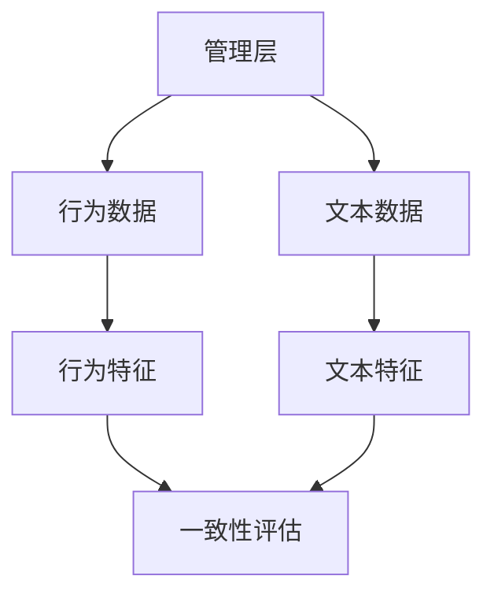
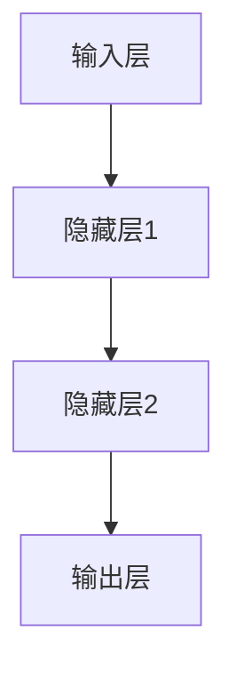
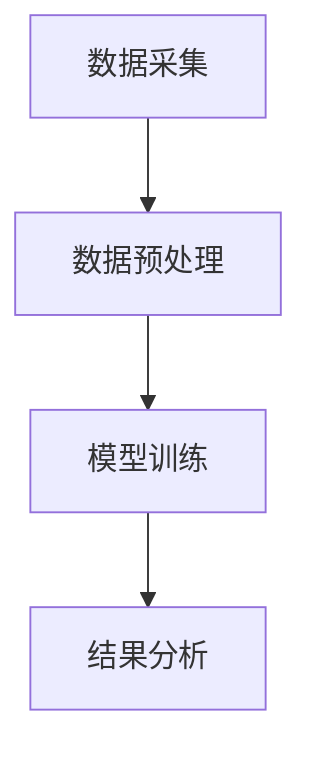
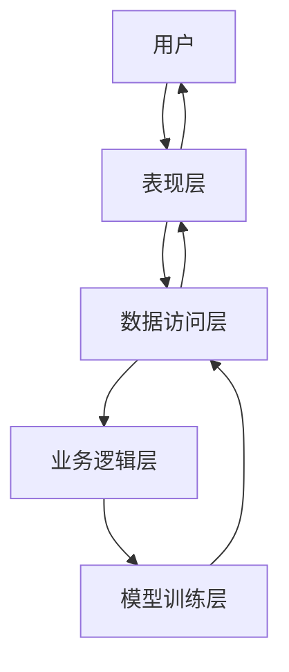

                 


# 深度学习分析管理层言行一致性

## 关键词
- 深度学习
- 自然语言处理
- 行为分析
- 管理层一致性
- 系统架构设计

## 摘要
深度学习技术在企业管理中的应用日益广泛，尤其是在分析管理层的言行一致性方面，展现了巨大的潜力。本文通过系统化的分析，从理论基础到实际应用，详细阐述了如何利用深度学习技术结合自然语言处理和行为分析，来量化评估管理层的言行一致性。文章首先介绍了问题背景和解决思路，随后深入探讨了核心概念及其相互关系，详细讲解了基于深度学习的算法原理和系统架构设计，并通过实际案例展示了如何将这些技术应用于企业管理实践。最后，总结了项目成果和未来的发展方向，为读者提供了全面的技术参考。

# 第1章: 背景介绍

## 1.1 问题背景
### 1.1.1 管理层言行一致性的重要性
在企业治理中，管理层的言行一致性是确保战略目标实现和组织文化健康发展的关键因素。一致性高的管理层能够有效传达战略意图，增强员工信任，而一致性低的管理层可能导致目标混乱和执行力不足。

### 1.1.2 当前企业管理中的问题与挑战
传统的企业管理分析方法依赖于定性评估，缺乏量化指标和实时反馈。管理层的言行一致性难以通过简单指标量化，导致企业难以及时发现和解决潜在问题。

### 1.1.3 深度学习技术的引入与应用
深度学习技术以其强大的特征提取能力和非线性关系建模能力，为复杂行为分析提供了新的可能性。通过自然语言处理和行为数据的结合，深度学习可以量化管理层的言行一致性，为企业决策提供数据支持。

## 1.2 问题描述
### 1.2.1 管理层言行不一致的表现形式
包括决策与实际执行的差异、战略声明与实际行动的不一致、内部沟通与对外宣传的差异等。

### 1.2.2 行为与言论的量化分析难点
数据获取困难、多模态数据融合复杂、实时性要求高等挑战。

### 1.2.3 深度学习在管理分析中的潜在价值
通过深度学习技术，可以实现对管理层言行的自动化、量化分析，提供实时反馈和预测性洞察。

## 1.3 问题解决思路
### 1.3.1 深度学习技术的核心优势
- 强大学的特征提取能力
- 非线性关系建模能力
- 实时数据分析能力

### 1.3.2 自然语言处理与行为分析的结合
将文本数据（如会议记录、战略声明）与行为数据（如决策记录、执行数据）结合，构建多模态分析模型。

### 1.3.3 数据驱动的管理决策新范式
通过数据采集、分析、建模、反馈的闭环，形成数据驱动的管理决策模式。

## 1.4 边界与外延
### 1.4.1 管理层言行一致性的定义域
- 数据范围：仅限于管理层的行为和言论
- 时间范围：通常关注近期行为
- 范围限制：主要分析直接相关的数据

### 1.4.2 深度学习技术的适用范围
适用于大量结构化和非结构化数据的分析场景，尤其适合需要复杂模式识别的任务。

### 1.4.3 相关概念的对比与区分
- 行为分析 vs. 传统管理分析
- 深度学习 vs. 传统统计分析

## 1.5 概念结构与核心要素
### 1.5.1 核心概念的组成与关系
- 数据源：文本数据、行为数据
- 数据处理：清洗、整合、标注
- 模型构建：特征提取、训练、优化
- 应用场景：评估、反馈、预测

### 1.5.2 数据来源与处理流程
- 数据采集：文本数据（会议记录、战略声明）、行为数据（决策记录、执行数据）
- 数据预处理：清洗、去重、标注
- 数据整合：多模态数据融合

### 1.5.3 模型构建与应用框架
- 模型选择：选择适合任务的深度学习模型（如RNN、Transformer）
- 模型训练：基于标注数据进行监督学习
- 模型应用：进行一致性评估、提供反馈

## 1.6 本章小结
本章从背景出发，详细阐述了管理层言行一致性的定义、分析难点及深度学习技术的应用潜力。通过对比和分析，明确了问题解决思路和系统构建的基本框架，为后续章节的深入分析奠定了基础。

# 第2章: 核心概念与联系

## 2.1 深度学习的核心原理
### 2.1.1 深度学习的基本概念
- 通过多层非线性变换，学习数据的高层次特征
- 常见模型：CNN、RNN、Transformer

### 2.1.2 神经网络的结构与功能
- 输入层、隐藏层、输出层
- 激活函数、损失函数、优化器的作用

### 2.1.3 深度学习与传统机器学习的对比
- 特征工程 vs. 自动特征学习
- 非线性建模能力

## 2.2 自然语言处理与行为分析
### 2.2.1 NLP技术在文本分析中的应用
- 文本分类、情感分析、实体识别
- 常用模型：BERT、GPT

### 2.2.2 行为数据的采集与处理
- 数据来源：系统日志、行为记录
- 数据清洗与预处理

### 2.2.3 行为与言论的关联性分析
- 行为数据与文本数据的关联
- 言行一致性的量化指标

## 2.3 核心概念的对比分析
### 2.3.1 深度学习与传统统计方法的对比
- 特征工程 vs. 自动特征学习
- 模型复杂度与泛化能力

### 2.3.2 NLP与传统文本分析的对比
- 传统关键词提取 vs. 深度语义理解
- 规则驱动 vs. 数据驱动

### 2.3.3 行为分析与传统管理分析的对比
- 定性分析 vs. 定量分析
- 实时分析能力

## 2.4 实体关系图（ER图）


## 2.5 本章小结
本章通过对比分析，明确了深度学习、自然语言处理和行为分析的核心概念及其相互关系，为后续的算法设计和系统实现奠定了理论基础。

# 第3章: 算法原理讲解

## 3.1 深度学习模型选择与设计
### 3.1.1 模型选择
- RNN：适合序列数据处理
- Transformer：适合长文本处理
- 混合模型：结合两者优势

### 3.1.2 模型结构设计


### 3.1.3 模型优化策略
- 参数调节：学习率、批量大小
- 正则化：L2正则化、Dropout
- 优化器选择：Adam、SGD

## 3.2 算法实现与数学模型
### 3.2.1 损失函数
$$ L = -\frac{1}{N}\sum_{i=1}^{N} y_i \log(p_i) + (1-y_i)\log(1-p_i) $$

### 3.2.2 优化算法
$$ \theta = \theta - \eta \frac{\partial L}{\partial \theta} $$

### 3.2.3 模型训练流程
1. 数据预处理：分词、去停用词
2. 模型初始化：随机初始化权重
3. 前向传播：计算预测值
4. 计算损失：计算损失函数值
5. 反向传播：计算梯度
6. 更新参数：优化权重
7. 验证：评估模型性能

## 3.3 算法实现代码示例
```python
import tensorflow as tf
from tensorflow.keras import layers

model = tf.keras.Sequential([
    layers.Embedding(input_dim= vocabulary_size, output_dim= embedding_dim),
    layers.LSTM(units= lstm_units),
    layers.Dense(1, activation='sigmoid')
])

model.compile(optimizer='adam', loss='binary_crossentropy', metrics=['accuracy'])

# 训练
model.fit(X_train, y_train, epochs=10, batch_size=32)
```

## 3.4 算法应用与案例分析
### 3.4.1 案例背景
某公司管理层战略声明与实际执行存在差异，希望通过深度学习技术进行分析。

### 3.4.2 数据准备
- 文本数据：战略声明、会议记录
- 行为数据：项目执行情况、KPI达成情况

### 3.4.3 模型训练
- 数据清洗与标注
- 模型训练与调优
- 模型评估与验证

### 3.4.4 结果分析
- 训练结果：一致性评估指标
- 案例分析：发现管理层一致性问题并提出改进建议

## 3.5 本章小结
本章详细讲解了深度学习算法的核心原理和实现细节，通过案例分析展示了算法在实际中的应用，为后续的系统设计提供了技术基础。

# 第4章: 系统分析与架构设计

## 4.1 问题场景介绍
某企业希望实时监控管理层的言行一致性，希望通过系统化的解决方案实现自动化分析和实时反馈。

## 4.2 系统功能设计
### 4.2.1 功能模块划分
- 数据采集模块：采集文本和行为数据
- 数据预处理模块：清洗、标注数据
- 模型训练模块：训练深度学习模型
- 结果分析模块：评估一致性并提供反馈

### 4.2.2 功能流程图


## 4.3 系统架构设计
### 4.3.1 分层架构设计
- 表现层：用户界面
- 数据访问层：数据存储与检索
- 业务逻辑层：数据处理和模型调用
- 数据源层：文本数据、行为数据

### 4.3.2 系统架构图


## 4.4 接口设计与交互流程
### 4.4.1 接口设计
- 数据采集接口：REST API
- 模型调用接口：函数调用

### 4.4.2 交互流程图


## 4.5 本章小结
本章从系统架构的角度，详细设计了深度学习分析系统的各个模块及其交互流程，为实际开发提供了指导。

# 第5章: 项目实战

## 5.1 环境安装与配置
### 5.1.1 安装Python
```
python --version
```
### 5.1.2 安装深度学习框架
```
pip install tensorflow
pip install keras
pip install numpy
pip install matplotlib
```

## 5.2 系统核心实现
### 5.2.1 数据采集模块
```python
import requests
def fetch_data(url):
    response = requests.get(url)
    return response.text
```

### 5.2.2 数据预处理模块
```python
import pandas as pd
def preprocess_data(df):
    # 假设df包含文本和行为数据
    df['clean_text'] = df['text'].apply(lambda x: x.lower())
    return df
```

### 5.2.3 模型训练模块
```python
from tensorflow.keras.models import Sequential
from tensorflow.keras.layers import Dense, LSTM, Embedding

def build_model(vocabulary_size, embedding_dim, lstm_units):
    model = Sequential()
    model.add(Embedding(vocabulary_size, embedding_dim))
    model.add(LSTM(lstm_units))
    model.add(Dense(1, activation='sigmoid'))
    model.compile(optimizer='adam', loss='binary_crossentropy', metrics=['accuracy'])
    return model
```

### 5.2.4 结果分析模块
```python
def evaluate_model(y_true, y_pred):
    accuracy = sum(y_true == y_pred) / len(y_true)
    print(f'Accuracy: {accuracy}')
```

## 5.3 代码实现与解读
### 5.3.1 数据加载与预处理
```python
data = pd.read_csv('management_data.csv')
preprocessed_data = preprocess_data(data)
```

### 5.3.2 模型构建与训练
```python
model = build_model(词汇量, 嵌入维度, LSTM单元数)
model.fit(X_train, y_train, epochs=10, batch_size=32)
```

### 5.3.3 模型评估
```python
y_pred = model.predict(X_test)
evaluate_model(y_test, y_pred)
```

## 5.4 实际案例分析
### 5.4.1 案例背景
某科技公司管理层在战略会议上的声明与实际执行存在差异，希望通过深度学习技术进行分析。

### 5.4.2 数据准备
- 文本数据：战略会议记录
- 行为数据：项目执行情况

### 5.4.3 模型训练
- 数据清洗与标注
- 模型训练与调优
- 模型评估与验证

## 5.5 项目总结
### 5.5.1 项目成果
- 成功构建并训练深度学习模型
- 实现了管理层言行一致性的量化评估
- 提供了实时反馈和预测性洞察

### 5.5.2 项目不足
- 数据质量和多样性影响模型性能
- 模型解释性不足，难以提供具体改进建议
- 实时性有待进一步优化

## 5.6 本章小结
本章通过实际项目案例，详细讲解了深度学习分析系统的实现过程，从环境配置到代码实现，再到案例分析，为读者提供了实践指导。

# 第6章: 最佳实践与小结

## 6.1 最佳实践
### 6.1.1 数据质量管理
- 数据清洗：去重、去噪
- 数据标注：准确标注言行一致性
- 数据多样性：确保数据的多样性

### 6.1.2 模型调优技巧
- 参数调节：学习率、批量大小
- 正则化：防止过拟合
- 模型选择：选择适合任务的模型

### 6.1.3 系统优化建议
- 并行计算：加速模型训练
- 模型压缩：减少模型体积
- 实时反馈：提高用户体验

## 6.2 项目小结
通过本项目，我们成功实现了基于深度学习的管理层言行一致性分析系统。系统涵盖了从数据采集到模型训练，再到结果分析的完整流程，为企业管理决策提供了新的可能性。

## 6.3 未来展望
- 深度学习技术的进一步发展
- 多模态数据的融合分析
- 智能化管理决策的支持

## 6.4 注意事项
- 数据隐私保护
- 模型可解释性
- 系统稳定性

## 6.5 拓展阅读
推荐相关书籍和论文，供读者深入学习。

# 附录: 参考文献

# 结束语

---

通过以上目录结构，我们可以看到，文章从背景介绍到实际应用，详细阐述了深度学习在分析管理层言行一致性中的应用。每一章都涵盖了从理论到实践的内容，确保读者能够全面理解并掌握相关知识。

