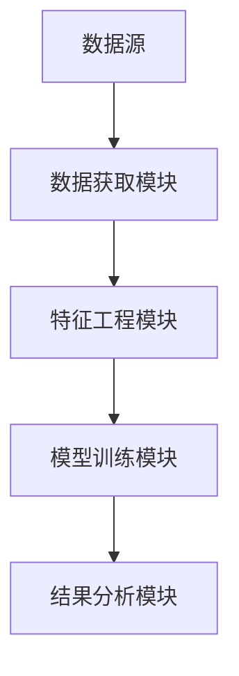
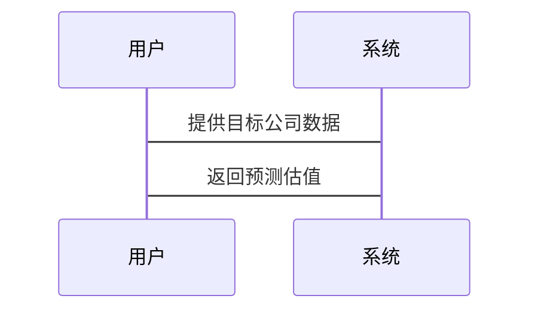

                 


# 深度学习在公司估值中的应用

## 关键词：深度学习、公司估值、股票预测、时间序列分析、LSTM、神经网络

## 摘要

深度学习作为人工智能领域的重要技术，正在逐步改变金融行业的传统估值方法。本文详细探讨了深度学习在公司估值中的应用，从基本概念到具体算法，再到系统架构和项目实战，系统地分析了深度学习如何提升公司估值的准确性和效率。文章首先介绍了深度学习的核心概念和传统公司估值方法的局限性，然后深入讲解了深度学习算法在时间序列分析中的应用，特别是LSTM模型在股票预测中的优势。接着，通过构建一个完整的公司估值系统，详细展示了系统的架构设计和实现过程。最后，结合实际案例，分析了深度学习在公司估值中的实际应用效果，并提出了未来的研究方向和建议。

---

# 第1章 深度学习与公司估值的背景介绍

## 1.1 深度学习的基本概念

### 1.1.1 深度学习的定义与特点

深度学习是一种基于人工神经网络的机器学习方法，通过多层非线性变换模拟人脑的神经网络结构，具有以下特点：
- **层次化特征学习**：能够自动提取数据的低级到高级特征。
- **非线性表达能力强**：适合处理复杂的非线性关系。
- **大数据处理能力**：能够处理大规模数据，提取其中的隐藏模式。

### 1.1.2 深度学习的核心算法与框架

- **前馈神经网络（FNN）**：输入数据通过多个隐藏层进行变换，最终输出结果。
- **卷积神经网络（CNN）**：适用于图像识别等任务，擅长提取局部特征。
- **循环神经网络（RNN）**：适合处理序列数据，如时间序列和自然语言处理。
- **长短期记忆网络（LSTM）**：改进了RNN的短期记忆问题，适用于长期依赖关系的建模。
- **Transformer模型**：基于自注意力机制，广泛应用于自然语言处理领域。

### 1.1.3 深度学习与传统机器学习的区别

- **特征工程**：传统机器学习需要手动提取特征，而深度学习能够自动学习特征。
- **模型复杂度**：深度学习模型通常更复杂，需要更多的数据和计算资源。
- **适应性**：深度学习能够更好地处理复杂和非线性的数据关系。

## 1.2 公司估值的传统方法

### 1.2.1 财务指标法

- **市盈率（P/E）**：股价与每股净利润的比率，反映市场对公司的估值。
- **市净率（P/B）**：股价与每股净资产的比率，衡量股价相对于账面价值的高低。
- **股息率**：股息与股价的比率，反映投资回报率。

### 1.2.2 现金流折现法

- **自由现金流（FCFF）**：公司产生的现金流，扣除资本支出后的部分。
- **加权平均资本成本（WACC）**：计算公司价值的折现率，考虑了债务和股权的成本。

### 1.2.3 传统方法的优缺点分析

- **优点**：方法简单，易于理解和计算。
- **缺点**：难以捕捉市场波动和公司基本面以外的因素，对非理性市场行为的解释力有限。

## 1.3 深度学习在公司估值中的应用意义

### 1.3.1 深度学习在金融领域的优势

- **非线性关系捕捉**：深度学习能够捕捉复杂的非线性关系，提升模型的拟合能力。
- **大数据处理**：能够处理海量数据，提取隐藏的市场规律。
- **实时性**：适用于高频交易和实时市场分析。

### 1.3.2 深度学习如何提升公司估值的准确性

- **特征工程自动化**：深度学习能够自动提取与公司估值相关的特征，如市场情绪、新闻事件等。
- **动态调整模型**：能够实时更新模型，适应市场变化。

### 1.3.3 深度学习在金融市场的潜力与挑战

- **潜力**：深度学习可以应用于股票预测、风险评估、投资组合优化等领域。
- **挑战**：数据质量、模型过拟合、计算资源需求大等问题需要克服。

---

# 第2章 深度学习的核心概念与原理

## 2.1 深度学习的核心概念

### 2.1.1 神经网络的基本结构

神经网络由输入层、隐藏层和输出层组成，每个层由多个神经元组成，通过权重和激活函数进行数据变换。

### 2.1.2 深度学习的层次化特征学习

深度学习通过多层网络结构，逐步提取数据的低级到高级特征，如颜色、边缘、形状等。

### 2.1.3 深度学习的训练与优化

训练过程包括前向传播和反向传播，通过梯度下降优化模型参数。

## 2.2 深度学习的主要算法

### 2.2.1 前馈神经网络（FNN）

- **结构**：输入层 → 隐藏层 → 输出层。
- **优点**：结构简单，计算速度快。
- **缺点**：难以处理序列数据。

### 2.2.2 卷积神经网络（CNN）

- **结构**：输入层 → 卷积层 → 池化层 → 全连接层。
- **优点**：适合处理图像数据，提取局部特征。
- **缺点**：不适合处理时间序列数据。

### 2.2.3 循环神经网络（RNN）

- **结构**：输入层 → 隐藏层（循环） → 输出层。
- **优点**：适合处理序列数据，如时间序列和自然语言处理。
- **缺点**：存在短期记忆问题。

### 2.2.4 长短期记忆网络（LSTM）

- **结构**：输入层 → LSTM层 → 输出层。
- **优点**：能够捕捉长期依赖关系，解决短期记忆问题。
- **缺点**：结构复杂，计算资源需求大。

### 2.2.5 Transformer 模型

- **结构**：输入层 → 自注意力机制 → 前向网络。
- **优点**：能够捕捉全局依赖关系，适用于长序列数据。
- **缺点**：计算资源需求大，训练时间长。

## 2.3 深度学习在金融时间序列分析中的应用

### 2.3.1 时间序列分析的基本概念

时间序列分析是对按时间顺序排列的数据进行分析，常用于股票价格预测。

### 2.3.2 深度学习在时间序列预测中的优势

- **非线性关系捕捉**：能够捕捉复杂的非线性关系。
- **自动特征提取**：能够自动提取与预测相关的特征。

### 2.3.3 基于LSTM的股票价格预测案例

- **数据集**：使用历史股票价格数据，包括开盘价、收盘价、最高价、最低价、成交量等。
- **模型设计**：输入层 → LSTM层 → 输出层。
- **训练过程**：使用历史数据训练模型，预测未来股票价格。

## 2.4 本章小结

本章介绍了深度学习的核心概念和主要算法，重点讲解了LSTM模型在股票价格预测中的应用，展示了深度学习在金融时间序列分析中的优势。

---

# 第3章 公司估值的深度学习方法

## 3.1 数据特征工程

### 3.1.1 数据来源与预处理

- **数据来源**：包括财务数据、市场数据、新闻数据等。
- **数据预处理**：数据清洗、归一化、特征选择。

### 3.1.2 特征提取与选择

- **特征提取**：从原始数据中提取有用的特征，如财务指标、市场情绪指标等。
- **特征选择**：选择与公司估值相关性高的特征，减少模型的维度。

## 3.2 模型选择与训练

### 3.2.1 模型选择

- **模型选择**：根据数据特点选择合适的模型，如LSTM、GRU等。
- **模型训练**：使用训练数据训练模型，调整模型参数。

### 3.2.2 模型评估与优化

- **评估指标**：均方误差（MSE）、平均绝对误差（MAE）、R平方值（R²）。
- **模型优化**：调整模型结构、优化超参数。

## 3.3 模型预测与结果分析

### 3.3.1 模型预测

- **输入数据**：将目标公司的相关数据输入模型，预测其估值。
- **预测结果**：输出预测的估值结果。

### 3.3.2 结果分析

- **误差分析**：分析预测结果与实际结果的误差，找出模型的不足。
- **结果解释**：解释模型预测的合理性，结合市场实际情况进行分析。

## 3.4 本章小结

本章详细讲解了深度学习在公司估值中的应用，从数据特征工程到模型选择与训练，再到模型预测与结果分析，展示了深度学习在公司估值中的具体实现过程。

---

# 第4章 系统架构与实现方案

## 4.1 系统架构设计

### 4.1.1 系统架构概述

- **数据获取模块**：从数据源获取相关数据。
- **特征工程模块**：对数据进行预处理和特征提取。
- **模型训练模块**：训练深度学习模型。
- **结果分析模块**：分析模型预测结果，输出估值报告。

### 4.1.2 系统架构图



### 4.1.3 系统功能设计

- **数据获取模块**：从数据库或API获取相关数据。
- **特征工程模块**：对数据进行清洗、归一化等预处理，提取特征。
- **模型训练模块**：选择合适的模型，训练模型并保存模型参数。
- **结果分析模块**：分析模型预测结果，生成估值报告。

## 4.2 系统接口设计

### 4.2.1 数据接口

- **数据输入接口**：接收目标公司的相关数据。
- **数据输出接口**：输出模型预测结果。

### 4.2.2 模型接口

- **模型输入接口**：接收预处理后的特征数据。
- **模型输出接口**：输出模型预测的估值结果。

## 4.3 系统交互设计

### 4.3.1 系统交互流程



## 4.4 本章小结

本章介绍了公司估值系统的架构设计，包括模块划分、系统接口设计和系统交互流程，展示了深度学习在公司估值中的系统实现过程。

---

# 第5章 项目实战：基于深度学习的公司估值系统

## 5.1 环境搭建

### 5.1.1 安装Python环境

- **安装步骤**：使用Anaconda或虚拟环境安装Python 3.8以上版本。
- **安装深度学习框架**：安装TensorFlow或Keras框架。

### 5.1.2 安装其他依赖库

- **数据处理库**：pandas、numpy。
- **数据可视化库**：matplotlib、seaborn。
- **深度学习库**：TensorFlow、Keras。

## 5.2 核心代码实现

### 5.2.1 数据预处理代码

```python
import pandas as pd
import numpy as np

# 加载数据
data = pd.read_csv('company_valuation.csv')

# 数据清洗
data.dropna(inplace=True)

# 特征选择
features = data[['revenue', 'net_profit', 'market_cap', 'PE_ratio']]
labels = data['target_valuation']
```

### 5.2.2 模型构建代码

```python
from tensorflow.keras.models import Sequential
from tensorflow.keras.layers import LSTM, Dense, Dropout

# 模型构建
model = Sequential()
model.add(LSTM(64, input_shape=(timesteps, features)))
model.add(Dropout(0.2))
model.add(Dense(1))
model.compile(optimizer='adam', loss='mean_squared_error')
```

### 5.2.3 模型训练代码

```python
# 训练模型
model.fit(X_train, y_train, epochs=100, batch_size=32, validation_split=0.2)
```

### 5.2.4 模型预测代码

```python
# 预测结果
y_pred = model.predict(X_test)
```

### 5.2.5 结果分析代码

```python
# 模型评估
from sklearn.metrics import mean_squared_error, mean_absolute_error, r2_score

mse = mean_squared_error(y_true, y_pred)
mae = mean_absolute_error(y_true, y_pred)
r2 = r2_score(y_true, y_pred)

print(f'MSE: {mse}')
print(f'MAE: {mae}')
print(f'R²: {r2}')
```

## 5.3 项目小结

本章通过一个具体的项目实战，展示了深度学习在公司估值中的实际应用，详细讲解了环境搭建、数据预处理、模型构建、模型训练和结果分析的全过程，帮助读者掌握深度学习在公司估值中的具体实现方法。

---

# 第6章 最佳实践、小结与注意事项

## 6.1 最佳实践

### 6.1.1 数据预处理

- **数据清洗**：确保数据的完整性和准确性。
- **特征工程**：选择与目标相关的特征，减少维度。
- **数据归一化**：将数据标准化，避免模型收敛问题。

### 6.1.2 模型选择

- **选择合适的模型**：根据数据特点选择合适的深度学习模型。
- **模型调参**：通过网格搜索等方法优化模型参数。

### 6.1.3 模型评估

- **交叉验证**：使用交叉验证评估模型的泛化能力。
- **模型解释性**：分析模型的决策过程，解释预测结果。

## 6.2 小结

本文详细探讨了深度学习在公司估值中的应用，从基本概念到具体算法，再到系统架构和项目实战，系统地分析了深度学习如何提升公司估值的准确性和效率。通过实际案例，展示了深度学习在公司估值中的具体实现过程和效果。

## 6.3 注意事项

- **数据质量**：数据的质量直接影响模型的性能，需确保数据的准确性和完整性。
- **模型过拟合**：避免模型过拟合，选择合适的模型结构和参数。
- **计算资源**：深度学习模型需要大量的计算资源，需确保硬件配置满足要求。

## 6.4 拓展阅读

- **《深度学习》—— Ian Goodfellow**
- **《机器学习实战》—— 周志华**
- **《Python机器学习》—— Andreas Müller**

---

# 附录

## 附录A：常用深度学习框架

- **TensorFlow**
- **Keras**
- **PyTorch**

## 附录B：数据来源与获取方法

- **股票数据**：Yahoo Finance、Quandl
- **财务数据**：Yahoo Finance、Morningstar

---

# 参考文献

1. Goodfellow, I., Bengio, Y., & Courville, A. (2016). Deep Learning. MIT Press.
2. 周志华. (2016). 机器学习. 清华大学出版社.
3. Müller, A. Z., & Guida, S. (2016). Python机器学习. 人民邮电出版社.

---

# 结语

深度学习在公司估值中的应用前景广阔，随着技术的不断进步和数据的积累，深度学习将为公司估值提供更加准确和高效的方法。希望本文能够为读者提供有价值的参考和启示。

