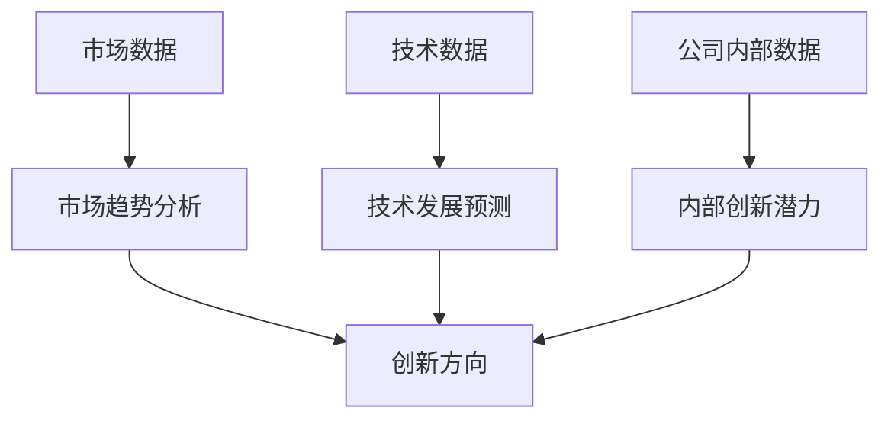
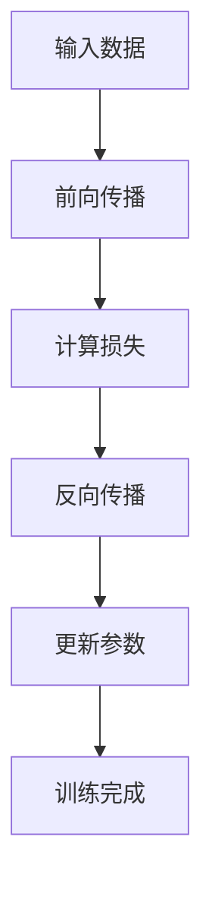

                 

# 深度学习预测公司创新突破

---

## 关键词
深度学习、创新预测、公司战略、数据驱动、AI技术

---

## 摘要
本文通过深度学习技术，结合公司内外部数据，分析潜在模式和趋势，预测公司创新方向，制定创新战略。文章系统地介绍了深度学习的基本概念、创新预测的核心方法，详细讲解了相关算法原理和系统架构设计，最后通过实际案例展示深度学习在公司创新预测中的应用。

---

## 第一部分：深度学习与公司创新预测概述

### 第1章：深度学习与公司创新预测概述

#### 1.1 深度学习的基本概念

深度学习是一种基于人工神经网络的机器学习技术，通过多层非线性变换模拟人脑的神经网络。其特点包括：

- **多层结构**：深度学习模型通常由多个隐藏层组成，能够提取复杂的特征。
- **非线性变换**：通过激活函数引入非线性，增强模型的表达能力。
- **端到端学习**：从输入到输出直接优化，减少特征工程的需求。

深度学习的核心算法包括卷积神经网络（CNN）、循环神经网络（RNN）、长短期记忆网络（LSTM）和Transformer等。

#### 1.2 公司创新预测的背景与意义

创新是企业保持竞争优势的关键，而创新预测帮助企业提前识别机会和风险。深度学习在创新预测中的优势在于其强大的特征提取能力和非线性建模能力。

创新预测的目标是通过分析公司内外部数据，如市场趋势、技术发展、研发投入等，预测公司的创新方向和潜力。

#### 1.3 深度学习在公司创新预测中的应用

深度学习在创新预测中的应用包括：

- **市场趋势分析**：预测行业未来趋势，识别潜在创新领域。
- **竞争对手分析**：分析竞争对手的创新动态，制定应对策略。
- **内部数据分析**：通过公司内部数据，预测创新项目成功率。

---

## 第二部分：公司创新预测的核心概念与联系

### 第2章：公司创新预测的核心概念与联系

#### 2.1 创新预测的核心概念

- **创新数据**：包括专利申请、研发投入、新产品发布等。
- **创新指标**：如创新强度、创新成功率等。
- **创新预测的边界**：预测的范围和时间跨度。

#### 2.2 深度学习与创新预测的核心联系

- **深度学习的特征提取能力**：能够从大量数据中提取有用的特征。
- **创新数据的非线性关系**：深度学习擅长处理复杂的非线性关系。
- **实时预测能力**：深度学习模型可以实时更新，适应快速变化的市场环境。

#### 2.3 创新预测的核心要素与关系

- **创新数据**：包括市场数据、技术数据、公司内部数据。
- **预测模型**：深度学习模型。
- **预测结果**：创新方向、创新潜力。

通过Mermaid流程图展示创新预测的核心要素及其关系：

---

## 第三部分：深度学习算法与数学模型

### 第3章：深度学习算法原理

#### 3.1 深度学习算法原理

- **卷积神经网络（CNN）**：适用于图像数据，常用于识别模式。
- **长短期记忆网络（LSTM）**：适用于时间序列数据，处理长序列依赖。
- **Transformer**：基于注意力机制，适用于自然语言处理和序列数据。

#### 3.2 深度学习算法的数学模型

深度学习模型的数学基础包括：

- **神经网络的数学表示**：输入经过权重矩阵和激活函数处理后得到输出。
  $$ y = \sigma(Wx + b) $$
  其中，$\sigma$ 是激活函数，$W$ 是权重矩阵，$x$ 是输入，$b$ 是偏置。

- **损失函数**：衡量预测值与真实值的差异。
  $$ \text{损失函数} = \frac{1}{n}\sum_{i=1}^{n}(y_i - \hat{y_i})^2 $$

- **优化器**：Adam优化器结合动量和自适应学习率。
  $$ \theta_{t+1} = \theta_t - \eta \frac{g_t}{1-\beta_1^{t}} + \frac{\beta_2(1-\beta_2^{t})}{1-\beta_2}g_t^2 $$

---

### 第3章：深度学习算法的数学模型（续）

通过Mermaid流程图展示深度学习算法的流程：

---

## 总结

深度学习在公司创新预测中的应用前景广阔，通过强大的特征提取能力和非线性建模能力，帮助企业预测市场趋势、识别创新方向。本文详细介绍了深度学习的基本概念、创新预测的核心方法、相关算法原理和系统架构设计，并通过实际案例展示了深度学习在创新预测中的应用。

---

## 接下来步骤

1. **系统架构设计**：包括数据预处理、模型训练、结果分析等模块。
2. **项目实战**：通过Python代码实现模型，并详细解读代码和分析结果。
3. **数学公式与代码示例**：展示深度学习模型的数学基础和代码实现。

希望这篇文章能为您提供关于深度学习预测公司创新突破的系统性了解，并为实际应用提供参考。

