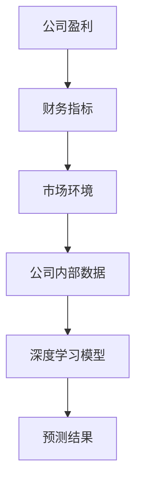
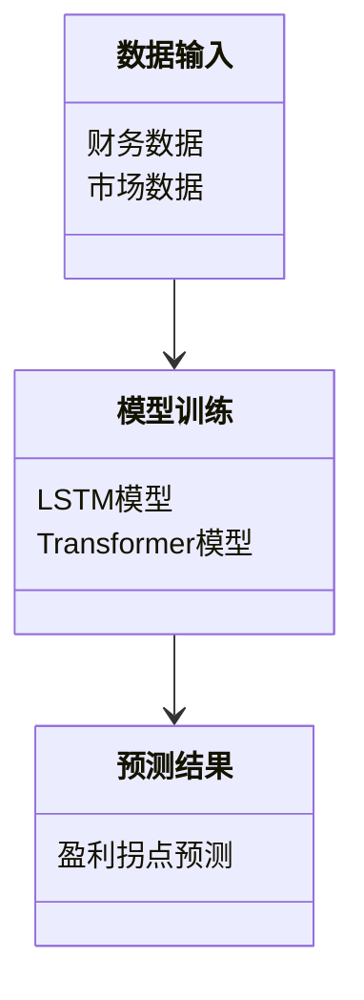
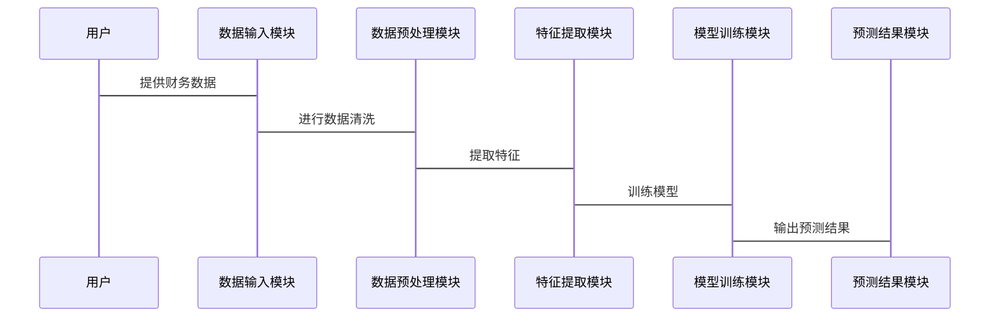

                 


# 深度学习预测公司盈利拐点

## 关键词：深度学习，盈利拐点，LSTM，Transformer，时间序列预测，财务指标

## 摘要：本文将详细介绍如何利用深度学习技术，特别是循环神经网络（LSTM）和Transformer模型，来预测公司的盈利拐点。我们将从问题背景出发，探讨深度学习在金融预测中的优势，分析模型的数学基础，设计系统的架构，并通过实际案例展示如何将理论应用于实践。文章最后将总结深度学习预测公司盈利拐点的关键点，并展望未来的发展方向。

---

# 第1章 深度学习与公司盈利拐点预测的背景介绍

## 1.1 问题背景与定义

### 1.1.1 公司盈利拐点的定义与重要性
公司盈利拐点是指公司在经营过程中，从持续亏损到盈利，或从盈利到持续亏损的转折点。准确预测这一拐点对公司战略调整、投资决策具有重要意义。深度学习通过分析历史财务数据和市场信息，能够捕捉复杂的时间序列模式，为拐点预测提供新思路。

### 1.1.2 深度学习在金融预测中的应用
深度学习在金融领域的应用越来越广泛，尤其是在时间序列预测方面。通过处理大量的非结构化数据（如新闻、社交媒体），深度学习模型能够提取传统统计方法难以捕捉的特征。

### 1.1.3 盈利拐点预测的挑战与意义
盈利拐点预测的挑战在于数据的稀疏性、噪声干扰以及市场的不确定性。然而，准确预测拐点能够帮助投资者做出更明智的决策，避免重大损失。

## 1.2 问题描述与解决方法

### 1.2.1 盈利拐点预测的核心问题
我们需要建立一个模型，能够根据历史财务数据和市场信息，预测公司未来是否会出现盈利拐点。

### 1.2.2 深度学习在时间序列预测中的优势
深度学习能够处理复杂的非线性关系，捕捉长期依赖关系，并自动提取特征。

### 1.2.3 盈利拐点预测的边界与外延
本文将重点分析公司财务数据和市场数据，不考虑宏观经济政策的突然变化。

## 1.3 核心概念与结构

### 1.3.1 盈利拐点预测的模型结构
本文将采用LSTM和Transformer模型进行预测。

### 1.3.2 深度学习模型的核心要素
包括输入特征、模型参数、损失函数和优化器。

### 1.3.3 问题的数学模型与公式
定义损失函数为均方误差：
$$ L = \frac{1}{N}\sum_{i=1}^{N}(y_i - \hat{y}_i)^2 $$

## 1.4 本章小结
本章介绍了盈利拐点预测的背景、挑战和意义，并明确了本文的研究目标和方法。

---

# 第2章 深度学习与盈利拐点预测的核心概念

## 2.1 深度学习模型原理

### 2.1.1 RNN与LSTM的原理
RNN通过循环结构处理序列数据，而LSTM通过门控机制解决梯度消失问题。

### 2.1.2 Transformer模型的结构
Transformer由编码器和解码器组成，采用自注意力机制捕捉全局依赖。

### 2.1.3 深度学习模型的特征提取能力
深度学习能够自动提取非线性特征，适合处理复杂的财务数据。

## 2.2 盈利拐点预测的特征分析

### 2.2.1 财务指标的特征提取
包括收入、利润、成本等指标的时序分析。

### 2.2.2 市场环境的特征建模
考虑宏观经济指标和行业趋势。

### 2.2.3 公司内部数据的特征处理
包括生产效率、研发投入等数据的预处理。

## 2.3 深度学习与传统统计模型的对比

### 2.3.1 模型性能对比
深度学习在复杂数据上表现更优。

### 2.3.2 训练数据量对比
深度学习需要大量数据支持。

### 2.3.3 模型解释性对比
传统模型解释性更强，但深度学习更擅长捕捉复杂模式。

## 2.4 概念关系图

### 2.4.1 概念属性对比表
| 概念 | 属性 |
|------|------|
| 深度学习 | 非线性、自动特征提取 |
| 盈利拐点 | 财务指标、时间序列 |

### 2.4.2 概念关系的Mermaid流程图


## 2.5 本章小结
本章详细介绍了深度学习模型的核心概念，并分析了其在盈利拐点预测中的优势。

---

# 第3章 深度学习算法的数学模型与实现

## 3.1 深度学习模型的数学基础

### 3.1.1 线性代数基础
矩阵乘法、向量空间等是深度学习的基础。

### 3.1.2 微积分基础
导数、梯度下降是训练模型的核心。

## 3.2 LSTM模型的数学推导

### 3.2.1 LSTM的门控机制
包括输入门、遗忘门和输出门的数学表达式。

### 3.2.2 LSTM的细胞状态更新
$$ c_t = \sigma(gate_f) \cdot c_{t-1} + \sigma(gate_i) \cdot \tilde{c}_t $$

## 3.3 Transformer模型的数学推导

### 3.3.1 自注意力机制
$$ \text{Attention}(Q, K, V) = \text{softmax}\left(\frac{QK^T}{\sqrt{d_k}}\right)V $$

### 3.3.2 前向网络结构
包括编码器和解码器的堆叠结构。

## 3.4 模型实现的Python代码示例

### 3.4.1 LSTM模型代码
```python
import torch
import torch.nn as nn

class LSTMModel(nn.Module):
    def __init__(self, input_size, hidden_size, output_size):
        super(LSTMModel, self).__init__()
        self.lstm = nn.LSTM(input_size, hidden_size, batch_first=True)
        self.fc = nn.Linear(hidden_size, output_size)
    
    def forward(self, x):
        out, _ = self.lstm(x)
        out = self.fc(out[:, -1, :])
        return out
```

### 3.4.2 Transformer模型代码
```python
import torch
import torch.nn as nn

class TransformerModel(nn.Module):
    def __init__(self, input_size, d_model, nhead, output_size):
        super(TransformerModel, self).__init__()
        self.transformer = nn.Transformer(d_model=d_model, nhead=nhead)
        self.fc = nn.Linear(d_model, output_size)
    
    def forward(self, x):
        out = self.transformer(x)
        out = self.fc(out[:, -1, :])
        return out
```

## 3.5 本章小结
本章详细推导了LSTM和Transformer模型的数学公式，并给出了Python实现代码。

---

# 第4章 深度学习预测公司盈利拐点的系统分析与架构设计

## 4.1 问题场景介绍
本文将构建一个基于深度学习的盈利拐点预测系统，目标是通过历史财务数据和市场信息，预测公司的盈利拐点。

## 4.2 系统功能设计

### 4.2.1 领域模型设计
使用Mermaid类图展示系统功能模块。



### 4.2.2 系统架构设计
使用Mermaid架构图展示系统架构。


### 4.2.3 系统交互设计
使用Mermaid序列图展示系统交互流程。



## 4.3 本章小结
本章详细设计了系统的功能模块、架构和交互流程。

---

# 第5章 深度学习预测公司盈利拐点的项目实战

## 5.1 环境配置

### 5.1.1 安装必要的Python库
包括PyTorch、numpy、pandas等。

## 5.2 系统核心实现

### 5.2.1 数据预处理代码
```python
import pandas as pd
import numpy as np

# 加载数据
data = pd.read_csv('company_financial.csv')

# 数据清洗
data = data.dropna()
```

### 5.2.2 模型训练代码
```python
model = TransformerModel(input_size=10, d_model=64, nhead=4, output_size=1)
criterion = nn.MSELoss()
optimizer = torch.optim.Adam(model.parameters(), lr=0.001)

# 训练模型
for epoch in range(100):
    outputs = model(data)
    loss = criterion(outputs, labels)
    optimizer.zero_grad()
    loss.backward()
    optimizer.step()
```

## 5.3 代码应用解读与分析

### 5.3.1 数据预处理的详细解读
包括数据清洗、特征选择等步骤。

### 5.3.2 模型训练的详细解读
包括模型训练的循环过程、损失函数的计算等。

## 5.4 实际案例分析

### 5.4.1 数据来源与预处理
以某公司财务数据为例，展示数据预处理的过程。

### 5.4.2 模型训练与结果分析
展示训练结果并分析模型的预测效果。

### 5.4.3 模型优缺点分析
总结模型的优势和局限性。

## 5.5 本章小结
本章通过实际案例展示了深度学习预测公司盈利拐点的实现过程。

---

# 第6章 总结与展望

## 6.1 本章总结
总结本文的主要内容和研究成果。

## 6.2 未来展望
展望深度学习在公司盈利拐点预测中的未来发展方向。

## 6.3 最佳实践Tips
给出一些实践中的建议和注意事项。

---

# 参考文献

---

通过以上目录大纲，我们可以看到本文从理论到实践，系统地介绍了深度学习预测公司盈利拐点的方法和实现过程。

