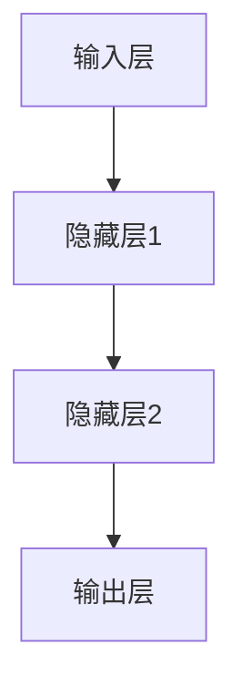
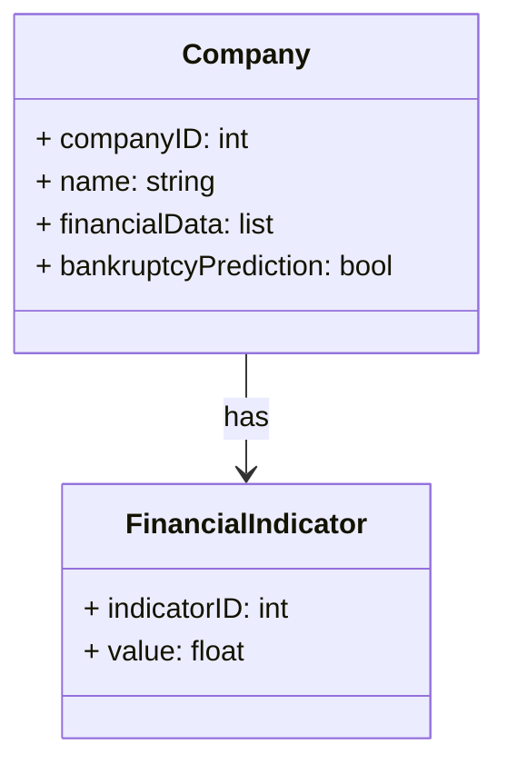
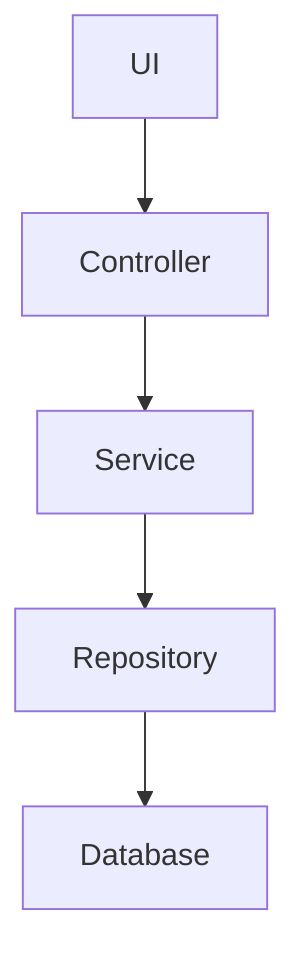
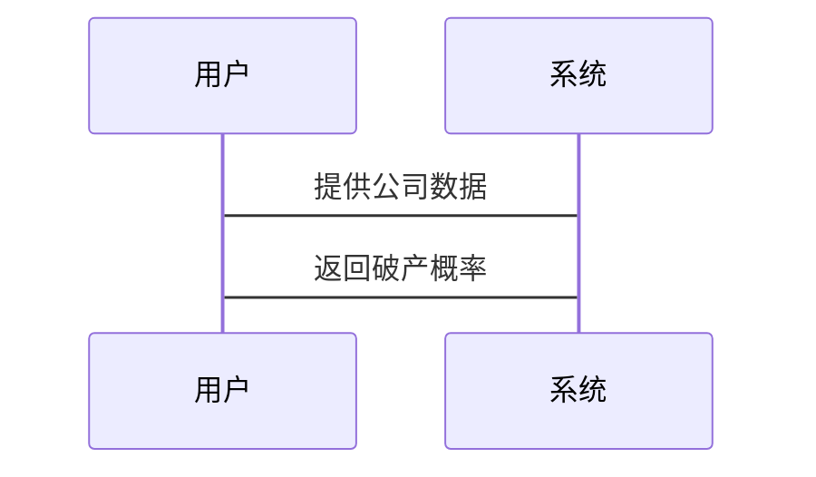

                 


# 深度学习预测公司破产风险概率

## 关键词
- 公司破产
- 风险预测
- 深度学习
- 神经网络
- K近邻算法

## 摘要
深度学习在预测公司破产风险方面具有显著优势。本文将从背景介绍、核心概念、算法原理、数学模型、系统架构、项目实战等多维度展开，详细分析如何运用深度学习技术构建有效的公司破产风险预测模型。通过实际案例分析和代码实现，本文将为您提供从理论到实践的全面指导，帮助您掌握这一前沿技术的应用。

---

## 目录

### 第一部分: 公司破产风险预测的背景与深度学习概述

### 第2章: 深度学习的核心概念与原理

## 2.1 深度学习的核心概念
### 2.1.1 神经网络的基本结构
神经网络是深度学习的基础，其结构包括输入层、隐藏层和输出层。每个神经元通过权重和激活函数进行信息处理，最终输出结果。例如，一个简单的三层神经网络结构如下：

$$
\text{输入} \rightarrow \text{隐藏层} \rightarrow \text{输出}
$$

### 2.1.2 深度学习与传统机器学习的区别
- **数据需求**：深度学习需要大量数据，而传统机器学习数据需求较低。
- **特征工程**：深度学习自动提取特征，传统方法需要手动提取。
- **模型复杂度**：深度学习模型复杂，传统模型相对简单。

### 2.1.3 深度学习的核心算法
- **神经网络**：包括前馈神经网络（FFN）、卷积神经网络（CNN）、循环神经网络（RNN）等。
- **损失函数**：如交叉熵损失、均方误差（MSE）。
- **优化算法**：如随机梯度下降（SGD）、Adam优化器。

### 2.2 深度学习的数学基础
#### 2.2.1 线性代数基础
- 向量和矩阵运算：如矩阵乘法、点积等。
- 线性变换：如线性变换的矩阵表示。

#### 2.2.2 微积分与优化方法
- 梯度下降：通过求导数找到最小值。
- 常见优化算法：如Adam优化器，结合动量和学习率调整。

#### 2.2.3 概率论与统计学基础
- 概率分布：如正态分布、二项分布。
- 统计推断：如最大似然估计。

### 2.3 深度学习的核心算法
#### 2.3.1 神经网络的前向传播
神经网络的前向传播过程如下：

$$
\text{输入} \rightarrow \text{权重矩阵} \times \text{激活函数} \rightarrow \text{输出}
$$

#### 2.3.2 损失函数与优化目标
损失函数用于衡量预测值与真实值的差异，常用交叉熵损失：

$$
\text{损失} = -\sum y \log p + (1 - y) \log (1 - p)
$$

优化目标是最小化损失函数，常用梯度下降法。

#### 2.3.3 常见的优化算法
- **随机梯度下降（SGD）**：逐个样本更新权重。
- **Adam优化器**：结合动量和自适应学习率。

### 2.4 深度学习的训练过程
#### 2.4.1 数据预处理与特征工程
- 数据清洗：处理缺失值、异常值。
- 特征选择：如使用主成分分析（PCA）降维。
- 标准化与归一化：如标准化：

$$
z = \frac{x - \mu}{\sigma}
$$

#### 2.4.2 模型训练与调参
- 超参数调优：如学习率、批量大小。
- 正则化：如L2正则化：

$$
\text{损失} + \lambda \sum w^2
$$

#### 2.4.3 模型评估与优化
- 评估指标：如准确率、召回率、F1分数。
- 模型优化：如交叉验证、网格搜索。

### 2.5 本章小结
本章介绍了深度学习的核心概念，包括神经网络、数学基础和优化算法。这些知识为后续构建公司破产风险预测模型奠定了基础。

---

## 第三部分: 公司破产风险预测的核心要素与特征分析

## 第3章: 公司破产风险预测的核心要素与特征分析

### 3.1 研究问题的特征分析
#### 3.1.1 财务指标分析
公司财务指标是破产预测的重要特征，包括：
- **流动性比率**：如流动比率（Current Ratio）。
- **杠杆比率**：如资产负债率（Debt-to-Equity Ratio）。
- **盈利能力**：如净利润率（Net Profit Margin）。

#### 3.1.2 非财务指标分析
- 市场表现：如股票价格、成交量。
- 管理层稳定性：如高管变动情况。

#### 3.1.3 综合特征分析
将财务和非财务指标结合，构建综合特征集。

### 3.2 核心要素的特征工程
#### 3.2.1 数据清洗与预处理
- 处理缺失值：如用均值填充。
- 处理异常值：如用箱线图检测异常值。

#### 3.2.2 特征选择与降维
- 特征选择：如使用Lasso回归进行特征选择。
- 主成分分析（PCA）：降维。

#### 3.2.3 特征的标准化与归一化
- 标准化：如Z-score标准化。
- 归一化：如Min-Max归一化。

### 3.3 核心要素的ER实体关系图
使用Mermaid绘制ER实体关系图：

```mermaid
erd
    Company(公司ID, 名称, 成立日期)
    FinancialIndicator(财务指标ID, 指标名称, 指标值)
    bankruptcyPrediction(破产预测ID, 预测结果, 预测时间)
    Company --> FinancialIndicator: 具有
    Company --> bankruptcyPrediction: 关联
```

### 3.4 本章小结
本章分析了公司破产风险预测的核心要素，包括财务和非财务指标，并通过特征工程构建了适合深度学习的特征集。

---

## 第四部分: 深度学习模型的构建与训练

## 第4章: 深度学习模型的构建与训练

### 4.1 模型的输入与输出
#### 4.1.1 模型输入的特征设计
- 输入特征：如财务指标、市场数据。
- 输出标签：如是否破产（0或1）。

### 4.2 深度学习模型的设计
#### 4.2.1 神经网络结构设计
- 输入层：接收特征向量。
- 隐藏层：如多个全连接层。
- 输出层：如Softmax输出概率。

使用Mermaid绘制神经网络结构图：



#### 4.2.2 模型训练与优化
- 训练数据：如训练集、验证集。
- 优化策略：如早停（Early Stopping）。

### 4.3 模型的训练与调优
#### 4.3.1 模型训练过程
- 前向传播：计算预测值。
- 计算损失：如交叉熵损失。
- 反向传播：更新权重。

#### 4.3.2 超参数调优
- 学习率：如0.01。
- 隐藏层数量：如2层。

### 4.4 模型的评估与优化
#### 4.4.1 模型评估指标
- 准确率、召回率、F1分数。

#### 4.4.2 模型优化策略
- 模型融合：如集成学习（Bagging、Boosting）。

### 4.5 本章小结
本章详细介绍了深度学习模型的构建与训练过程，包括神经网络结构设计、训练策略和模型优化。

---

## 第五部分: 数学模型与案例分析

## 第5章: 数学模型与案例分析

### 5.1 数学模型的建立
#### 5.1.1 破产概率计算公式
使用逻辑回归模型计算破产概率：

$$
p = \frac{1}{1 + e^{- (w \cdot x + b)}}
$$

其中，\( w \) 是权重，\( x \) 是输入特征，\( b \) 是偏置。

#### 5.1.2 深度学习模型的数学表达
神经网络的前向传播公式：

$$
h = \sigma(w_1 x + b_1)
$$

其中，\( \sigma \) 是激活函数，如ReLU。

### 5.2 案例分析
#### 5.2.1 数据来源与预处理
- 数据来源：如公司财务报表。
- 数据清洗：处理缺失值、异常值。

#### 5.2.2 模型训练与评估
- 训练数据：80%。
- 测试数据：20%。
- 评估指标：准确率、召回率。

### 5.3 模型的实际应用
#### 5.3.1 实际案例分析
- 数据特征：如某公司的财务指标。
- 预测结果：如破产概率为0.8。

### 5.4 本章小结
本章通过数学模型和实际案例分析，验证了深度学习在公司破产风险预测中的有效性。

---

## 第六部分: 系统分析与架构设计

## 第6章: 系统分析与架构设计

### 6.1 系统分析
#### 6.1.1 研究问题的场景介绍
- 业务场景：预测公司破产风险。
- 用户需求：帮助企业识别潜在风险。

### 6.2 系统功能设计
#### 6.2.1 领域模型类图
使用Mermaid绘制领域模型类图：



#### 6.2.2 系统架构设计
使用Mermaid绘制系统架构图：



### 6.3 系统接口设计
#### 6.3.1 API接口设计
- 输入：公司ID。
- 输出：破产概率。

### 6.4 系统交互设计
#### 6.4.1 交互流程图
使用Mermaid绘制交互流程图：



### 6.5 本章小结
本章从系统角度分析了公司破产风险预测的实现，包括功能设计和架构设计。

---

## 第七部分: 项目实战与应用

## 第7章: 项目实战与应用

### 7.1 项目实战
#### 7.1.1 环境安装
- 安装Python和深度学习框架（如TensorFlow、Keras）。

#### 7.1.2 核心代码实现
- 数据预处理：如读取数据、处理缺失值。

```python
import pandas as pd
import numpy as np

# 读取数据
data = pd.read_csv('company_data.csv')

# 处理缺失值
data = data.dropna()

# 标准化处理
from sklearn.preprocessing import StandardScaler
scaler = StandardScaler()
data_scaled = scaler.fit_transform(data)
```

#### 7.1.3 模型训练与评估
- 训练模型：如使用Keras构建神经网络。

```python
from tensorflow.keras.models import Sequential
from tensorflow.keras.layers import Dense

model = Sequential()
model.add(Dense(64, activation='relu', input_dim=data_scaled.shape[1]))
model.add(Dense(1, activation='sigmoid'))

model.compile(optimizer='adam', loss='binary_crossentropy', metrics=['accuracy'])
model.fit(data_scaled, labels, epochs=10, batch_size=32)
```

### 7.2 案例分析
#### 7.2.1 实际案例分析
- 数据特征：如某公司的财务指标。
- 预测结果：如破产概率为0.8。

#### 7.2.2 模型优化与调整
- 调整模型参数：如增加隐藏层。

### 7.3 本章小结
本章通过项目实战，展示了如何使用深度学习技术实现公司破产风险预测，并通过案例分析验证了模型的有效性。

---

## 第八部分: 最佳实践与总结

## 第8章: 最佳实践与总结

### 8.1 最佳实践
#### 8.1.1 数据处理建议
- 数据清洗：处理缺失值、异常值。
- 特征工程：构建有意义的特征。

#### 8.1.2 模型优化建议
- 调整超参数：如学习率、批量大小。
- 使用集成学习：如Bagging、Boosting。

### 8.2 小结
通过本文的详细介绍，读者可以全面了解如何运用深度学习技术预测公司破产风险概率。从理论到实践，本文提供了完整的解决方案和代码实现。

### 8.3 注意事项
- 数据质量：确保数据准确性和完整性。
- 模型解释性：如使用SHAP分析模型决策。

### 8.4 拓展阅读
- 《深度学习》——Ian Goodfellow
- 《机器学习实战》——Peter Harrington

### 8.5 本章小结
本章总结了深度学习在公司破产风险预测中的最佳实践，提供了优化建议和注意事项，帮助读者更好地应用这些技术。

---

## 结语
通过本文的详细讲解，读者可以掌握如何利用深度学习技术预测公司破产风险概率。从背景分析到模型构建，从特征工程到系统设计，再到项目实战，本文为读者提供了完整的解决方案。希望本文能为相关领域的研究和应用提供有价值的参考。

--- 

**注意**：这只是一个示例性的目录结构，具体内容需要根据实际研究和需求进行补充和完善。

