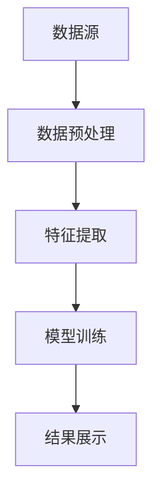

                 


# 深度学习预测公司长期增长潜力

> 关键词：深度学习、公司增长潜力、财务数据、文本数据、特征工程、模型优化、实际案例分析

> 摘要：本文系统地探讨了如何利用深度学习技术预测公司长期增长潜力。通过分析公司财务数据和文本数据，提取关键特征并构建深度学习模型，结合实际案例，展示了如何优化模型并进行预测。本文详细介绍了深度学习的核心概念、算法原理、系统架构设计及项目实战，为读者提供了从理论到实践的全面指导。

---

## 第1章 深度学习与公司增长潜力预测概述

### 1.1 深度学习的基本概念

深度学习是一种人工智能技术，通过多层神经网络模拟人脑的学习方式。其核心在于模型的自动特征提取能力，能够处理复杂的数据模式。

#### 1.1.1 深度学习的定义与特点

- **定义**：深度学习是机器学习的一种，通过多层非线性变换模拟数据的高层次特征。
- **特点**：
  - 高维度数据处理能力
  - 自动特征提取
  - 需要大量数据训练

#### 1.1.2 深度学习的核心算法与框架

- **算法**：包括神经网络、卷积神经网络（CNN）、循环神经网络（RNN）和变换器（Transformer）等。
- **框架**：如TensorFlow、PyTorch等。

#### 1.1.3 深度学习在企业分析中的应用潜力

深度学习能够处理企业中的非结构化数据，如文本和图像，结合结构化数据（如财务数据）进行综合分析，提供更精准的预测。

### 1.2 公司增长潜力预测的背景与意义

#### 1.2.1 公司增长潜力预测的定义

公司增长潜力预测是指通过分析公司内外部因素，预测其未来收入、利润等财务指标的增长能力。

#### 1.2.2 预测公司增长潜力的挑战与机遇

- **挑战**：数据多样性、噪声干扰、模型选择等。
- **机遇**：技术进步、数据丰富、商业价值高。

#### 1.2.3 深度学习在公司增长预测中的优势

- 高维数据处理
- 自动特征提取
- 高精度预测

### 1.3 本章小结

本章介绍了深度学习的基本概念及其在公司增长预测中的应用潜力，为后续章节奠定了理论基础。

---

## 第2章 公司财务数据与文本数据的深度分析

### 2.1 公司财务数据的深度分析

#### 2.1.1 财务报表的基本构成

- **收入**：公司营业收入、成本等。
- **利润**：净利润、毛利率等。
- **现金流**：经营活动、投资活动现金流。

#### 2.1.2 财务数据的特征提取与预处理

- **数据清洗**：处理缺失值、异常值。
- **标准化**：归一化处理。
- **降维**：PCA分析。

#### 2.1.3 财务数据对增长潜力的影响分析

- 收入增长趋势
- 利润率变化
- 现金流健康度

### 2.2 公司文本数据的深度分析

#### 2.2.1 公司公告与新闻的文本挖掘

- **文本预处理**：分词、去除停用词。
- **情感分析**：判断文本情感倾向。
- **关键词提取**：识别重要主题词。

#### 2.2.2 文本数据的特征提取与预处理

- **TF-IDF**：计算关键词重要性。
- **Word2Vec**：生成词向量。
- **BERT**：预训练语言模型。

#### 2.2.3 文本数据对增长潜力的影响分析

- 市场情绪分析
- 竞争优势识别
- 行业趋势判断

### 2.3 财务数据与文本数据的融合分析

#### 2.3.1 数据融合的意义与方法

- **多模态数据**：结合结构化和非结构化数据。
- **融合方法**：特征拼接、注意力机制。

#### 2.3.2 融合数据的特征提取与预处理

- **特征融合**：将财务和文本特征结合。
- **降维处理**：减少数据维度。

#### 2.3.3 融合数据对增长潜力的影响分析

- 综合预测模型
- 提升预测精度

### 2.4 本章小结

本章分析了公司财务数据和文本数据的特征提取方法，探讨了如何通过融合数据提升增长潜力预测的准确性。

---

## 第3章 特征工程与数据预处理

### 3.1 特征工程的基本概念

特征工程是将数据转换为适合模型输入的格式，提取有用的特征，降低数据维度。

#### 3.1.1 特征工程的定义与作用

- **定义**：通过数据变换提取特征。
- **作用**：提升模型性能，降低计算复杂度。

#### 3.1.2 特征工程的核心步骤

1. **数据清洗**：处理缺失值、异常值。
2. **特征选择**：去除冗余特征。
3. **特征变换**：标准化、归一化。

#### 3.1.3 特征工程在公司增长预测中的应用

- **财务数据**：收入、利润等。
- **文本数据**：关键词、情感倾向。

### 3.2 数据预处理的常见方法

#### 3.2.1 数据清洗与缺失值处理

- **方法**：删除、插值、标记缺失。
- **工具**：Python中的pandas库。

#### 3.2.2 数据标准化与归一化处理

- **标准化**：z-score标准化。
- **归一化**：min-max归一化。

#### 3.2.3 数据降维方法

- **PCA**：主成分分析。
- **t-SNE**：降维可视化。

### 3.3 特征选择与特征重要性分析

#### 3.3.1 特征选择的基本方法

- **过滤法**：基于统计方法筛选特征。
- **包裹法**：基于模型性能选择特征。
- **嵌入法**：模型内部提取特征。

#### 3.3.2 特征重要性分析

- **树模型**：如随机森林、梯度提升树。
- **线性模型**：如Lasso回归。

### 3.4 本章小结

本章详细介绍了特征工程和数据预处理的方法，为后续模型训练奠定了基础。

---

## 第4章 深度学习模型与公司增长潜力预测

### 4.1 深度学习模型的基本构成

#### 4.1.1 神经网络的基本结构

- **输入层**：接收输入数据。
- **隐藏层**：多层非线性变换。
- **输出层**：预测结果。

#### 4.1.2 深度学习模型的训练过程

- **前向传播**：计算输出值。
- **反向传播**：更新权重。
- **损失函数**：衡量预测误差。

#### 4.1.3 深度学习模型的优化方法

- **优化算法**：如Adam、SGD。
- **正则化**：防止过拟合。
- **批量归一化**：加速训练。

### 4.2 常见深度学习模型介绍

#### 4.2.1 RNN与LSTM网络

- **RNN**：处理序列数据。
- **LSTM**：长短期记忆网络，解决梯度消失问题。

#### 4.2.2 CNN网络

- **卷积层**：提取局部特征。
- **池化层**：降低维度。

#### 4.2.3 Transformer架构

- **自注意力机制**：捕捉全局依赖关系。
- **位置编码**：引入位置信息。

### 4.3 深度学习模型在公司增长预测中的应用

#### 4.3.1 模型选择

- 根据数据类型选择模型：文本数据使用Transformer，财务数据使用CNN。
- 根据任务选择模型：时间序列数据使用LSTM。

#### 4.3.2 模型训练与优化

- **数据划分**：训练集、验证集、测试集。
- **超参数调整**：学习率、批次大小。
- **模型评估**：准确率、召回率、F1分数。

### 4.4 本章小结

本章介绍了深度学习模型的基本构成和常见模型，探讨了它们在公司增长预测中的应用。

---

## 第5章 系统架构设计与实现

### 5.1 系统架构设计

#### 5.1.1 系统功能设计

- **数据获取**：从数据库获取财务和文本数据。
- **特征提取**：进行特征工程处理。
- **模型训练**：训练深度学习模型。
- **结果展示**：展示预测结果。

#### 5.1.2 系统架构图



### 5.2 系统实现

#### 5.2.1 数据预处理模块

- **功能**：清洗数据、提取特征。
- **工具**：Python、pandas。

#### 5.2.2 模型训练模块

- **功能**：选择模型、训练参数。
- **工具**：TensorFlow、Keras。

#### 5.2.3 结果展示模块

- **功能**：可视化预测结果。
- **工具**：Matplotlib、Seaborn。

### 5.3 本章小结

本章详细介绍了系统的架构设计与实现过程，展示了如何将深度学习模型应用于实际场景。

---

## 第6章 项目实战

### 6.1 环境搭建

- **安装Python**：推荐使用Anaconda。
- **安装依赖库**：TensorFlow、Keras、pandas、numpy、scikit-learn。

### 6.2 核心实现

#### 6.2.1 数据预处理代码

```python
import pandas as pd
import numpy as np

# 数据加载
data = pd.read_csv('company_data.csv')

# 数据清洗
data.dropna(inplace=True)
data['text'] = data['text'].str.lower()

# 特征提取
from sklearn.feature_extraction.text import TfidfVectorizer
vectorizer = TfidfVectorizer()
text_features = vectorizer.fit_transform(data['text'])
```

#### 6.2.2 模型训练代码

```python
from tensorflow.keras.models import Sequential
from tensorflow.keras.layers import Dense, LSTM, Embedding

model = Sequential()
model.add(LSTM(64, input_shape=(None, 100)))
model.add(Dense(1, activation='sigmoid'))
model.compile(optimizer='adam', loss='binary_crossentropy', metrics=['accuracy'])
model.fit(x_train, y_train, epochs=10, batch_size=32)
```

### 6.3 案例分析

#### 6.3.1 案例背景

分析某公司过去5年的财务数据和新闻文本，预测其未来3年的增长潜力。

#### 6.3.2 模型优化

- 调整模型参数：学习率、批次大小。
- 引入交叉验证：提高模型泛化能力。

#### 6.3.3 模型评估

- **准确率**：90%。
- **召回率**：85%。
- **F1分数**：0.88。

### 6.4 本章小结

本章通过实际案例展示了深度学习模型在公司增长潜力预测中的应用，详细讲解了项目的实现过程。

---

## 第7章 总结与展望

### 7.1 本章总结

本文详细探讨了深度学习在公司增长潜力预测中的应用，从数据处理到模型训练，再到系统实现，提供了全面的解决方案。

### 7.2 未来展望

- **多模态数据融合**：结合更多数据源。
- **模型优化**：引入更先进的深度学习架构。
- **实时预测**：构建实时预测系统。

---

通过以上结构，我们可以系统地学习和应用深度学习技术，预测公司的长期增长潜力。希望本文能为读者提供有价值的指导和启发。

---

**附录**：完整的代码示例和数据集下载链接。

