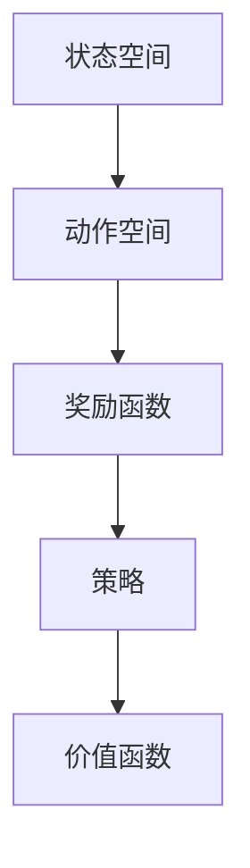
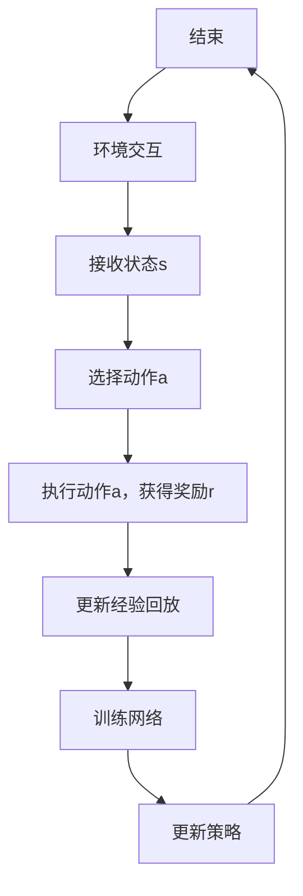
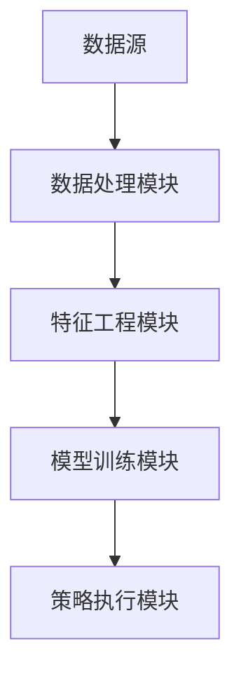
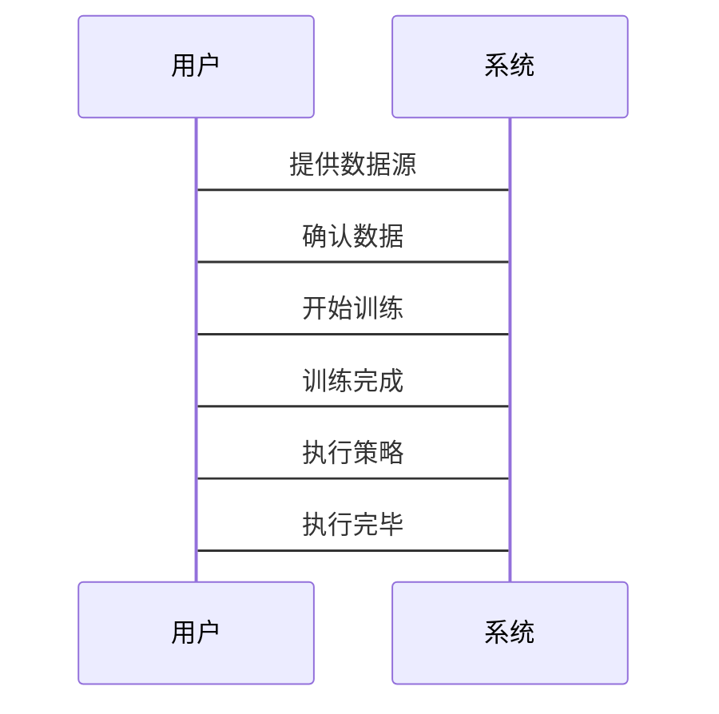

                 


# 深度强化学习优化投资决策

> 关键词：深度强化学习，投资决策，算法原理，系统架构，项目实战

> 摘要：本文将深入探讨深度强化学习在投资决策中的应用，分析其核心概念、算法原理、系统架构，并通过具体项目实战，展示深度强化学习如何优化投资决策过程。我们将从背景介绍、核心概念、算法实现、系统设计到项目实战，逐步解析深度强化学习在金融投资中的潜力与挑战。

---

## 第1章: 深度强化学习与投资决策概述

### 1.1 深度强化学习的定义与特点

深度强化学习（Deep Reinforcement Learning，DRL）是一种结合了深度学习和强化学习的人工智能技术。它通过神经网络来近似价值函数或策略，从而在复杂环境中做出最优决策。与传统强化学习相比，深度强化学习能够处理更高维、更复杂的输入数据。

### 1.2 投资决策的复杂性与挑战

投资决策是一个高度动态和不确定的过程，涉及大量非线性关系和复杂的市场行为。传统的基于规则的交易系统和统计套利方法在面对市场波动和复杂场景时显得力不从心。深度强化学习能够通过历史数据学习复杂的决策模式，从而在动态市场中做出更优决策。

### 1.3 深度强化学习在金融领域的应用前景

近年来，深度强化学习在金融领域的应用逐渐增多，尤其是在高频交易、风险控制和投资组合管理等方面。通过深度强化学习，投资者可以更好地捕捉市场机会，优化交易策略，并在复杂市场环境中实现更优的投资回报。

---

## 第2章: 深度强化学习的核心概念与联系

### 2.1 深度强化学习的核心原理

深度强化学习结合了深度学习的特征提取能力和强化学习的决策优化能力。通过构建神经网络，DRL系统可以从历史数据中学习状态、动作和奖励之间的关系，并通过不断试错优化决策策略。

### 2.2 深度强化学习与传统机器学习的对比

| **方法**       | **监督学习**       | **无监督学习**   | **强化学习**        | **深度强化学习** |
|----------------|-------------------|-----------------|--------------------|------------------|
| 数据需求       | 需大量标注数据     | 无标签数据       | 环境交互产生奖励     | 环境交互产生奖励 |
| 任务类型       | 分类、回归         | 聚类、降维       | 控制、游戏          | 控制、游戏          |
| 决策依据       | 标签              | 特征             | 奖励函数           | 奖励函数           |
| 代表算法       | 线性回归、SVM      | K-means、PCA     | Q-learning、DQN     | DQN、PPO          |

### 2.3 深度强化学习的核心要素

- **状态空间（State Space）**：描述环境的所有可能状态。
- **动作空间（Action Space）**：系统可以执行的所有动作。
- **奖励函数（Reward Function）**：定义每个动作的奖励值，引导学习方向。
- **策略与价值函数（Policy & Value Function）**：策略决定动作选择，价值函数评估状态的价值。

### 2.4 深度强化学习的数学模型与公式

- **Q-learning的数学公式**：
  $$ Q(s,a) = Q(s,a) + \alpha [r + \max_{a'} Q(s',a') - Q(s,a)] $$
  其中，$\alpha$ 是学习率，$r$ 是奖励，$s'$ 是下一状态。

- **策略梯度的数学公式**：
  $$ \nabla \theta J(\theta) = \mathbb{E}[ \nabla \log \pi(a|s) Q(s,a) ] $$
  其中，$\pi(a|s)$ 是策略函数，$Q(s,a)$ 是价值函数。

### 2.5 深度强化学习的ER实体关系图



---

## 第3章: 深度强化学习算法原理与实现

### 3.1 深度强化学习算法概述

- **DQN算法**：通过经验回放和目标网络解决样本不足和不稳定问题。
- **策略梯度算法**：直接优化策略，通过梯度上升方法更新参数。
- **Actor-Critic算法**：结合策略梯度和Q-learning，通过双网络结构优化动作选择。

### 3.2 DQN算法的实现细节

```python
class DQN:
    def __init__(self, state_space, action_space):
        self.state_space = state_space
        self.action_space = action_space
        self.memory = deque(maxlen=1000)
        self.gamma = 0.95
        self.epsilon = 0.5
        self.epsilon_min = 0.01
        self.epsilon_decay = 0.995
        self.model = self.build_model()

    def build_model(self):
        model = Sequential()
        model.add(Dense(32, activation='relu', input_dim=self.state_space))
        model.add(Dense(32, activation='relu'))
        model.add(Dense(self.action_space, activation='linear'))
        model.compile(optimizer='adam', loss='mse')
        return model
```

### 3.3 算法流程图



---

## 第4章: 深度强化学习在投资决策中的应用

### 4.1 投资决策场景介绍

在股票交易中，深度强化学习可以通过历史价格数据和市场情绪预测未来走势，并制定买卖决策。

### 4.2 系统功能设计

- 数据处理模块：从数据源获取并预处理数据。
- 特征工程模块：提取有用的特征，如技术指标和市场情绪。
- 模型训练模块：训练深度强化学习模型。
- 策略执行模块：根据模型输出执行交易操作。

### 4.3 系统架构设计



### 4.4 接口设计与交互流程图



---

## 第5章: 项目实战

### 5.1 环境安装与配置

```bash
pip install tensorflow keras matplotlib pandas numpy
```

### 5.2 核心实现代码

```python
import numpy as np
import pandas as pd
import matplotlib.pyplot as plt
from tensorflow.keras import layers

# 数据预处理
data = pd.read_csv('stock_prices.csv')
prices = data['close'].values
states = prices[:-1]
actions = prices[1:]

# DQN模型训练
def build_model(input_dim):
    model = Sequential()
    model.add(Dense(32, activation='relu', input_dim=input_dim))
    model.add(Dense(32, activation='relu'))
    model.add(Dense(1, activation='linear'))
    model.compile(optimizer='adam', loss='mse')
    return model

# 训练过程
model = build_model(len(states))
for i in range(1000):
    state = states[i]
    action = model.predict(np.array([state]))[0][0]
    reward = (actions[i] - state) * action
    # 更新模型
    model.fit(np.array([state]), np.array([action]), epochs=1, verbose=0)
```

### 5.3 案例分析与解读

通过训练好的模型，我们可以预测未来的股票价格，并制定买卖策略。例如，当预测价格将上涨时，模型会建议买入；反之，建议卖出。

### 5.4 项目小结

通过本项目，我们展示了深度强化学习在股票交易中的应用潜力。虽然目前的模型还比较简单，但可以作为进一步优化和扩展的基础。

---

## 第6章: 最佳实践与总结

### 6.1 小结

深度强化学习在投资决策中的应用前景广阔，能够帮助投资者在复杂市场中做出更优决策。

### 6.2 注意事项

- 数据质量对模型性能影响重大。
- 模型需要定期重新训练以适应市场变化。
- 需要结合市场专家知识优化策略。

### 6.3 拓展阅读

- 《Deep Reinforcement Learning: Theory and Algorithms》
- 《Reinforcement Learning: An Introduction》

---

通过以上章节的详细讲解，我们系统地介绍了深度强化学习在投资决策中的应用，从理论到实践，为读者提供了全面的视角和实用的指导。

