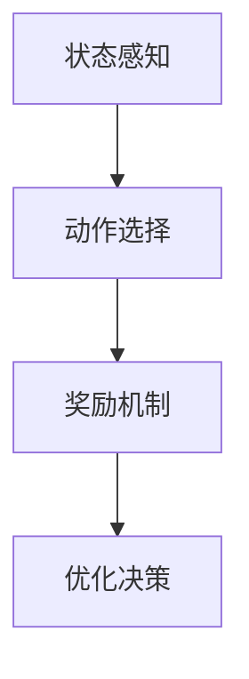

                 

---

# 《深度强化学习在AI Agent决策优化中的应用》

> **关键词**：深度强化学习、AI Agent、决策优化、强化学习、深度学习

> **摘要**：本文详细探讨了深度强化学习在AI Agent决策优化中的应用，从基础概念到高级算法，再到实际项目实现，全面解析了深度强化学习如何提升AI Agent的决策能力。文章首先介绍了AI Agent的基本概念和决策优化的重要性，接着深入分析了深度强化学习的核心原理和算法，包括Q-learning、策略梯度和深度Q网络等。随后，通过数学公式和算法流程图，详细推导了深度强化学习的数学模型，并结合实际项目案例，展示了如何构建和优化AI Agent系统。最后，总结了深度强化学习在AI Agent中的应用价值，并展望了未来的研究方向。

---

# 第1章: AI Agent与决策优化概述

## 1.1 AI Agent的基本概念

### 1.1.1 什么是AI Agent

AI Agent（人工智能代理）是指能够感知环境、自主决策并执行动作的智能实体。它可以是一个软件程序、机器人或其他智能系统，通过与环境交互来实现特定目标。

### 1.1.2 AI Agent的分类

AI Agent可以根据智能水平分为：

- **反应式AI Agent**：基于当前感知做出反应，不依赖历史信息。
- **认知式AI Agent**：具备复杂推理和规划能力，能够根据历史信息做出决策。
- **学习型AI Agent**：通过经验改进自身决策能力。

### 1.1.3 AI Agent的核心特征

AI Agent的核心特征包括自主性、反应性、目标导向和学习能力。

---

## 1.2 决策优化的定义与应用

### 1.2.1 决策优化的定义

决策优化是指通过算法和模型，找到最优或近似最优的决策策略，以最大化目标函数或最小化损失函数。

### 1.2.2 决策优化的应用场景

- **游戏AI**：如棋类游戏中的最优走法选择。
- **机器人控制**：如自动驾驶中的路径规划。
- **金融投资**：如最优投资组合的选择。
- **推荐系统**：如个性化推荐策略的优化。

### 1.2.3 决策优化的挑战与意义

- **挑战**：环境复杂性、决策不确定性、计算资源限制。
- **意义**：提高效率、降低成本、提升用户体验。

---

## 1.3 深度强化学习的引入

### 1.3.1 强化学习的基本概念

强化学习是一种通过试错机制，学习最优策略的方法。智能体通过与环境交互，获得奖励或惩罚，逐步优化决策策略。

### 1.3.2 深度学习与强化学习的结合

深度学习提供了强大的特征表示能力，强化学习提供了决策优化的框架。两者的结合使得AI Agent能够处理复杂高维的状态空间和动作空间。

### 1.3.3 深度强化学习的优势

- **处理高维状态**：深度神经网络能够自动提取高维状态的特征。
- **端到端学习**：可以直接从输入状态到输出动作，无需手动设计特征。
- **适应动态环境**：通过强化学习的试错机制，能够适应不断变化的环境。

---

## 1.4 本章小结

本章介绍了AI Agent的基本概念、决策优化的定义与应用，以及深度强化学习的引入。深度强化学习结合了深度学习的特征表示能力和强化学习的决策优化框架，为AI Agent的决策优化提供了强大的工具。

---

# 第2章: 深度强化学习的基本原理

## 2.1 强化学习的数学模型

### 2.1.1 状态空间与动作空间

- **状态空间**：智能体所处环境的所有可能状态的集合。
- **动作空间**：智能体在每个状态下可以执行的所有动作的集合。

### 2.1.2 奖励函数的设计

奖励函数定义了智能体在特定状态下执行某个动作所获得的奖励。好的奖励函数设计能够引导智能体学习最优策略。

### 2.1.3 策略与价值函数的定义

- **策略**：智能体选择动作的概率分布，记为$\pi(a|s)$。
- **价值函数**：衡量一个状态-动作对的长期价值，记为$Q(s, a)$。

---

## 2.2 深度强化学习的核心算法

### 2.2.1 Q-learning算法

Q-learning是一种基于价值函数的强化学习算法。通过更新Q表，学习最优策略。

### 2.2.2 策略梯度算法

策略梯度算法直接优化策略，通过梯度上升方法最大化目标函数。

### 2.2.3 深度Q网络（DQN）

DQN结合了Q-learning和深度神经网络，通过经验回放和目标网络提高学习稳定性。

---

## 2.3 深度强化学习的关键技术

### 2.3.1 经验回放机制

通过存储历史经验，减少样本之间的依赖性，提高学习效率。

### 2.3.2 嵌入式网络结构

深度神经网络用于处理高维状态空间，提取有用的特征表示。

### 2.3.3 探索与利用的平衡

在强化学习中，智能体需要在探索新动作和利用已知动作之间找到平衡。

---

## 2.4 本章小结

本章详细介绍了深度强化学习的基本原理，包括数学模型、核心算法和关键技术。深度强化学习通过结合深度学习和强化学习，为AI Agent的决策优化提供了强大的工具。

---

# 第3章: Q-learning算法的数学模型

## 3.1 Q-learning的基本公式

Q-learning的基本更新公式为：

$$ Q(s, a) = Q(s, a) + \alpha (r + \gamma \max Q(s', a') - Q(s, a)) $$

其中，$\alpha$是学习率，$\gamma$是折扣因子。

## 3.2 深度Q网络的结构

深度Q网络通常由输入层、隐藏层和输出层组成。

### 3.2.1 状态输入层

将状态空间映射为输入层的神经元。

### 3.2.2 隐藏层

通过多个隐藏层提取特征。

### 3.2.3 输出层

输出每个动作的Q值。

## 3.3 损失函数的定义

深度Q网络的损失函数通常定义为：

$$ L = \frac{1}{N} \sum_{i=1}^{N} (y_i - Q(s_i, a_i))^2 $$

其中，$y_i$是目标值，$Q(s_i, a_i)$是预测值。

## 3.4 优化算法的选择

### 3.4.1 梯度下降法

常用的优化算法，通过梯度下降更新网络参数。

### 3.4.2 Adam优化器

Adam优化器是一种自适应学习率优化算法，收敛速度快，性能好。

---

## 3.5 本章小结

本章详细推导了Q-learning算法的数学模型和深度Q网络的结构，介绍了损失函数和优化算法的选择。

---

# 第4章: AI Agent系统功能设计

## 4.1 系统功能模块划分

AI Agent系统通常包括以下功能模块：

- **状态感知模块**：感知环境状态。
- **动作选择模块**：基于当前状态选择动作。
- **奖励机制模块**：根据动作结果给予奖励。

### 4.1.1 状态感知模块

通过传感器或API获取环境状态。

### 4.1.2 动作选择模块

基于Q-learning或策略梯度算法选择动作。

### 4.1.3 奖励机制模块

定义奖励函数，给予奖励或惩罚。

## 4.2 系统功能流程图

---

## 4.3 系统功能的实现细节

### 4.3.1 状态空间的构建

将环境状态转化为神经网络的输入。

### 4.3.2 动作空间的定义

定义智能体在每个状态下可执行的动作。

### 4.3.3 奖励函数的设计

设计合理的奖励函数，引导智能体学习最优策略。

---

## 4.4 本章小结

本章详细介绍了AI Agent系统的功能设计，包括模块划分、流程图和实现细节。

---

# 第5章: AI Agent系统架构设计

## 5.1 系统架构概述

AI Agent系统通常采用分层架构，包括感知层、决策层和执行层。

---

## 5.2 系统架构设计

AI Agent系统的架构设计可以分为以下几个部分：

### 5.2.1 感知层

负责感知环境状态。

### 5.2.2 决策层

负责基于感知状态选择动作。

### 5.2.3 执行层

负责执行选择的动作并反馈结果。

---

## 5.3 本章小结

本章介绍了AI Agent系统的架构设计，包括感知层、决策层和执行层的划分。

---

# 第6章: 项目实战

## 6.1 环境配置

### 6.1.1 安装必要的库

安装TensorFlow、Keras、OpenAI Gym等库。

### 6.1.2 配置开发环境

选择合适的IDE，如PyCharm或VS Code。

## 6.2 系统核心实现

### 6.2.1 状态空间的处理

将环境状态转化为神经网络的输入。

### 6.2.2 动作选择模块的实现

基于Q-learning算法选择动作。

### 6.2.3 奖励机制的实现

定义奖励函数，给予奖励或惩罚。

## 6.3 案例分析

以OpenAI Gym中的CartPole环境为例，展示深度强化学习在AI Agent中的应用。

---

## 6.4 本章小结

本章通过项目实战，展示了如何将深度强化学习应用于AI Agent的决策优化。

---

# 第7章: 总结与展望

## 7.1 总结

本文详细探讨了深度强化学习在AI Agent决策优化中的应用，从理论到实践，全面解析了深度强化学习的核心原理和实际应用。

## 7.2 展望

未来，随着深度强化学习技术的不断发展，AI Agent的决策优化能力将更加智能化和高效化。

---

**结束**

