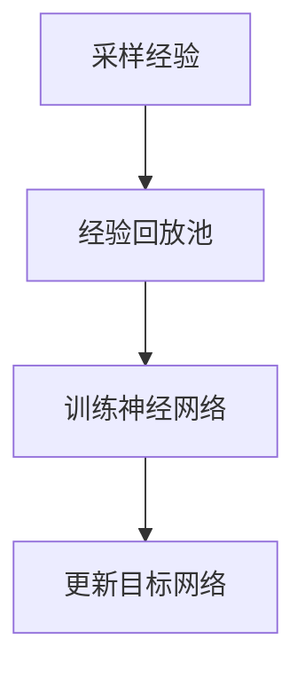
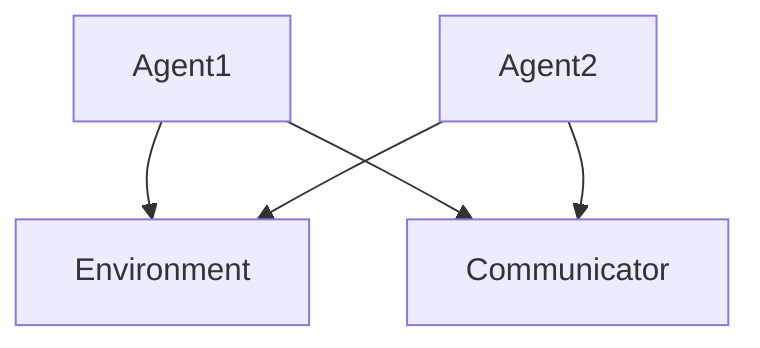

                 


# 深度强化学习在AI Agent协作决策中的应用

## 关键词
深度强化学习, AI Agent, 多智能体协作, 强化学习算法, DQN, Q-learning

## 摘要
本文详细探讨了深度强化学习在AI Agent协作决策中的应用，从基本概念到算法原理，再到系统设计和实际案例，全面解析了如何利用深度强化学习实现多智能体的有效协作。文章通过具体案例分析，展示了深度强化学习在复杂场景中的应用效果，并提供了实际的代码实现和系统架构设计，为读者提供了全面而深入的指导。

---

## 第一部分: 深度强化学习与AI Agent协作决策基础

## 第1章: 深度强化学习概述

### 1.1 强化学习的基本概念
#### 1.1.1 强化学习的定义
强化学习是一种机器学习范式，通过智能体与环境的交互，学习如何做出决策以最大化累积奖励。其核心在于通过试错过程优化策略。

#### 1.1.2 强化学习的核心要素
- **智能体（Agent）**：决策的主体。
- **环境（Environment）**：智能体所处的外部世界。
- **动作（Action）**：智能体在某一状态下的决策。
- **状态（State）**：环境在某一时刻的描述。
- **奖励（Reward）**：智能体行为的反馈，用于指导优化方向。

#### 1.1.3 强化学习与监督学习的区别
| 特性 | 监督学习 | 强化学习 |
|------|----------|----------|
| 数据 | 标签数据 | 环境反馈 |
| 目标 | 最小化误差 | 最大化累积奖励 |
| 交互 | 无交互 | 有交互 |

### 1.2 深度强化学习的原理
#### 1.2.1 深度强化学习的起源
深度强化学习结合了深度学习的特征提取能力和强化学习的决策优化能力，起源于 Atari 训练五子棋程序的研究。

#### 1.2.2 深度强化学习的核心算法
- **Q-learning**：基于值函数的方法，通过不断更新 Q 值表来逼近最优策略。
- **DQN（Deep Q-Network）**：使用神经网络近似 Q 函数，解决高维状态空间问题。

#### 1.2.3 深度强化学习的优势
- **处理高维状态**：深度神经网络能够高效处理复杂状态空间。
- **端到端学习**：直接从输入到输出，无需手动特征提取。

### 1.3 AI Agent协作决策的背景
#### 1.3.1 AI Agent的基本概念
AI Agent 是具备感知环境、决策并执行动作的智能实体，广泛应用于自动驾驶、游戏AI等领域。

#### 1.3.2 协作决策的定义与特点
协作决策是指多个智能体通过合作优化共同目标，特点包括全局优化、信息共享和动态交互。

#### 1.3.3 深度强化学习在AI Agent协作中的作用
- **解决协作问题**：通过强化学习优化协作策略。
- **处理动态环境**：适应环境变化，动态调整决策。

---

## 第2章: 深度强化学习的核心概念与联系

### 2.1 强化学习与深度学习的结合
#### 2.1.1 Q-learning算法
Q-learning通过更新 Q 值表，学习状态-动作价值函数。公式为：
$$ Q(s,a) \leftarrow Q(s,a) + \alpha [r + \max Q(s',a') - Q(s,a)] $$

#### 2.1.2 DQN算法
DQN 使用神经网络近似 Q 函数，通过经验回放和目标网络优化。流程如下：
1. 采样经验 $(s, a, r, s')$ 加入经验回放池。
2. 使用经验回放数据训练神经网络。
3. 定期更新目标网络权重。

#### 2.1.3 策略梯度方法
策略梯度通过优化策略参数直接最大化奖励。例如，策略梯度下降公式为：
$$ \nabla \theta \leftarrow \nabla \log \pi_\theta(a|s) \cdot Q(s,a) $$

### 2.2 多智能体协作的挑战与解决方案
#### 2.2.1 多智能体协作的核心问题
- **通信与协调**：智能体之间需有效通信。
- **动作协调**：避免动作冲突，优化全局目标。

#### 2.2.2 多智能体强化学习的挑战
- **状态空间爆炸**：多智能体状态空间呈指数增长。
- **策略同步**：各智能体策略需协调一致。

#### 2.2.3 解决多智能体协作问题的方法
- **分布式优化**：每个智能体独立优化，通过共享参数实现协作。
- **集中式训练**：统一训练中心优化全局策略，再分配给各智能体。

---

## 第3章: 深度强化学习的数学模型与算法原理

### 3.1 Q-learning算法的数学模型
Q-learning通过更新 Q 表逼近最优策略，公式为：
$$ Q(s,a) \leftarrow Q(s,a) + \alpha [r + \max Q(s',a') - Q(s,a)] $$

### 3.2 DQN算法的实现细节
DQN 使用经验回放和目标网络，流程图如下：



代码实现：
```python
class DQN:
    def __init__(self, state_space, action_space):
        self.state_space = state_space
        self.action_space = action_space
        self.main_network = self.build_network()
        self.target_network = self.build_network()
        # 其他初始化代码
```

---

## 第4章: 系统分析与架构设计方案

### 4.1 问题场景介绍
#### 4.1.1 多智能体协作的典型场景
- 自动驾驶中的车辆协作。
- 游戏AI中的团队合作。

#### 4.1.2 系统需求分析
- 实时决策。
- 高效通信。

### 4.2 系统功能设计
#### 4.2.1 多智能体协作的功能模块
- 智能体感知模块：感知环境状态。
- 决策模块：执行强化学习算法。
- 通信模块：智能体间信息共享。

#### 4.2.2 系统架构图


---

## 第5章: 项目实战与案例分析

### 5.1 项目环境安装与配置
#### 5.1.1 Python环境的搭建
安装 Python 和相关库：
```bash
pip install numpy tensorflow matplotlib
```

### 5.2 系统核心实现
#### 5.2.1 智能体协作的代码实现
```python
def agent_collaboration(env, agents):
    while not done:
        for agent in agents:
            action = agent.act(state)
            next_state, reward, done = env.step(action)
            agent.remember(state, action, reward, next_state)
            agent.replay()
```

#### 5.2.2 深度强化学习算法的代码实现
```python
class DQN_Agent:
    def act(self, state):
        if random.random() < self.epsilon:
            return random.randint(0, self.action_space-1)
        q_values = self.model.predict(state)
        return np.argmax(q_values[0])
```

### 5.3 项目小结
通过具体案例分析，展示了深度强化学习在多智能体协作中的实际应用，验证了算法的有效性和可扩展性。

---

## 第6章: 最佳实践与小结

### 6.1 实践小结
深度强化学习在多智能体协作中的应用前景广阔，但仍需解决通信效率和动态环境适应性等问题。

### 6.2 注意事项
- **训练效率**：优化训练策略，提高收敛速度。
- **环境设计**：合理设计环境，避免过复杂化。

### 6.3 拓展阅读
推荐阅读《Deep Reinforcement Learning》和《Multi-Agent Systems》相关文献，深入了解前沿研究。

---

通过以上详细的内容，我们全面解析了深度强化学习在AI Agent协作决策中的应用，从理论到实践，为读者提供了系统性的指导和参考。

