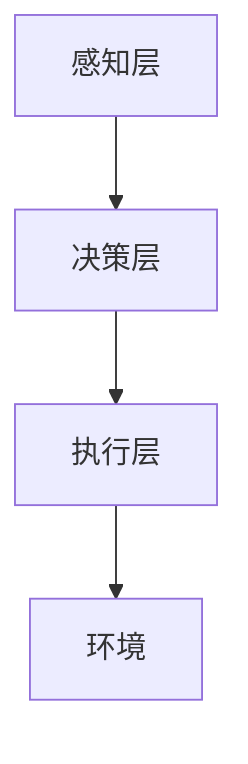

                 


# 深度强化学习在AI Agent行为生成中的应用

---

## 关键词

深度强化学习，AI Agent，行为生成，强化学习，DQN，策略梯度

---

## 摘要

深度强化学习（Deep Reinforcement Learning, DRL）是一种结合了深度学习和强化学习的技术，近年来在AI Agent行为生成领域取得了显著进展。本文详细探讨了DRL的核心概念、算法原理以及在AI Agent行为生成中的系统设计与实际应用。通过对DRL算法的数学模型分析、系统架构设计以及实际案例研究，本文为读者提供了从理论到实践的全面解析，帮助理解如何利用DRL技术实现智能代理的行为生成。

---

# 第一部分: 深度强化学习与AI Agent行为生成的背景介绍

---

## 第1章: 深度强化学习与AI Agent行为生成概述

### 1.1 深度强化学习的基本概念

#### 1.1.1 强化学习的定义与特点

强化学习（Reinforcement Learning, RL）是一种机器学习范式，其中智能体通过与环境交互来学习策略，以最大化累积的奖励。其特点是：

- **试错性**：智能体通过尝试不同的动作来学习最优策略。
- **延迟反馈**：奖励通常在多个动作之后才给出。
- **策略优化**：目标是找到最优策略，使累积奖励最大化。

#### 1.1.2 深度强化学习的核心思想

深度强化学习（Deep RL）是强化学习的一种扩展，利用深度神经网络来逼近策略或价值函数。其核心思想包括：

- **端到端学习**：直接从输入状态到输出动作，无需显式建模。
- **高维状态处理**：深度神经网络能够处理高维复杂状态。
- **非线性近似**：利用深度网络的非线性能力，逼近复杂的函数。

#### 1.1.3 AI Agent行为生成的定义与目标

AI Agent行为生成是指智能体根据当前状态和环境信息，生成符合目标的动作或行为。其目标是：

- **最大化累积奖励**：通过策略优化使智能体获得最大的累积奖励。
- **适应复杂环境**：在动态和不确定的环境中，生成灵活且智能的行为。
- **实现人类水平智能**：使AI Agent的行为接近或超越人类水平。

### 1.2 深度强化学习在AI Agent中的应用背景

#### 1.2.1 AI Agent的发展历程

AI Agent的发展经历了以下几个阶段：

1. **基于规则的AI Agent**：依赖预定义规则，无法处理复杂任务。
2. **基于知识的AI Agent**：利用知识库进行推理，但仍受限于知识的完备性。
3. **基于学习的AI Agent**：通过机器学习技术，从数据中学习策略。
4. **基于深度强化学习的AI Agent**：结合深度学习和强化学习，实现端到端学习。

#### 1.2.2 深度强化学习在AI Agent中的优势

深度强化学习在AI Agent中的优势主要体现在以下几个方面：

- **端到端学习能力**：无需手动设计特征，直接从状态到动作。
- **处理高维状态**：深度神经网络能够处理复杂的高维状态空间。
- **适应动态环境**：通过策略优化，智能体能够适应环境的变化。

#### 1.2.3 当前研究与应用的热点问题

当前，深度强化学习在AI Agent行为生成中的研究热点包括：

- **多智能体协作**：研究多个智能体之间的协作与竞争。
- **复杂环境建模**：如何建模复杂的现实环境，以提高智能体的适应性。
- **高效训练方法**：如何提高训练效率，减少计算资源消耗。

### 1.3 本章小结

本章介绍了深度强化学习的基本概念、核心思想以及在AI Agent行为生成中的应用背景。通过对比传统AI Agent和深度强化学习AI Agent的差异，突出了DRL在复杂环境下的优势，并指出了当前研究的热点问题。

---

# 第二部分: 深度强化学习的核心概念与算法原理

---

## 第2章: 深度强化学习的核心概念

### 2.1 强化学习的基本要素

#### 2.1.1 状态空间与动作空间

- **状态空间（State Space）**：智能体所处的环境状态集合。
- **动作空间（Action Space）**：智能体在每个状态下可执行的动作集合。

#### 2.1.2 奖励函数的设计

- **奖励函数（Reward Function）**：定义智能体在每个动作后的奖励，引导智能体学习最优策略。
- **折扣因子γ**：用于平衡当前奖励和未来奖励的重要性。

#### 2.1.3 策略与价值函数的定义

- **策略π**：从状态到动作的映射，表示智能体在每个状态下选择动作的概率分布。
- **价值函数V**：评估某个状态下的期望累积奖励。

### 2.2 深度强化学习的数学模型

#### 2.2.1 Q-learning与策略梯度的基本公式

- **Q-learning**：
  $$ Q(s,a) = Q(s,a) + \alpha (r + \gamma \max Q(s',a') - Q(s,a)) $$
- **策略梯度**：
  $$ \nabla \theta \leftarrow \nabla \log \pi(a|s) \cdot Q(s,a) $$

#### 2.2.2 策略网络与值函数网络的结构

- **策略网络**：直接输出动作概率分布。
- **值函数网络**：输出状态的价值函数。

#### 2.2.3 动作空间与策略空间

- **离散动作空间**：动作是有限的离散集合。
- **连续动作空间**：动作是连续的，通常使用策略梯度方法。

### 2.3 深度强化学习与监督学习的区别

- **数据来源**：监督学习基于标记数据，而强化学习基于与环境的交互。
- **目标函数**：监督学习最小化预测误差，强化学习最大化累积奖励。
- **反馈机制**：监督学习实时反馈，强化学习延迟反馈。

### 2.4 本章小结

本章详细讲解了深度强化学习的核心概念，包括强化学习的基本要素、数学模型以及与监督学习的区别，为后续算法分析奠定了基础。

---

## 第3章: 深度强化学习的核心算法原理

### 3.1 Q-learning算法

#### 3.1.1 算法的基本流程

1. 初始化Q表为零。
2. 在每个时间步，智能体根据当前状态选择动作。
3. 执行动作，获得奖励和新的状态。
4. 更新Q表：$$ Q(s,a) = Q(s,a) + \alpha (r + \gamma \max Q(s',a') - Q(s,a)) $$

#### 3.1.2 Q值更新的数学公式

$$ Q(s,a) = Q(s,a) + \alpha (r + \gamma \max Q(s',a') - Q(s,a)) $$

#### 3.1.3 算法的收敛性分析

- **收敛性**：在离散状态和动作空间下，Q-learning算法在无限时间步下收敛。
- **收敛速度**：与学习率α和探索策略有关。

#### 3.1.4 优缺点

- **优点**：简单易实现，适合离散动作空间。
- **缺点**：收敛速度慢，不适用于连续动作空间。

### 3.2 策略梯度方法

#### 3.2.1 策略梯度的基本思想

- **策略优化**：直接优化策略，最大化累积奖励。
- **梯度上升**：通过梯度上升方法更新策略参数θ。

#### 3.2.2 基于梯度的优化方法

- **REINFORCE算法**：
  $$ \nabla \theta \leftarrow \nabla \log \pi(a|s) \cdot Q(s,a) $$

#### 3.2.3 优缺点

- **优点**：适用于连续动作空间，能够处理高维状态。
- **缺点**：需要计算梯度，计算复杂度较高。

### 3.3 深度Q网络（DQN）算法

#### 3.3.1 DQN的网络结构

- **双网络结构**：使用两个深度神经网络，一个作为主网络，一个作为目标网络。
- **经验回放**：存储历史经验，随机采样进行训练。

#### 3.3.2 经验回放机制

- **经验存储**：将状态、动作、奖励、新状态存储在经验回放池中。
- **经验采样**：随机采样经验进行训练，减少样本偏差。

#### 3.3.3 目标网络的设计

- **目标网络**：用于稳定训练，定期更新目标网络的权重。
- **更新公式**：
  $$ \theta' = \tau \theta + (1-\tau) \theta' $$

### 3.4 本章小结

本章详细讲解了Q-learning、策略梯度方法和DQN算法的核心思想和实现细节，重点分析了每种算法的优缺点及适用场景。

---

# 第三部分: 深度强化学习在AI Agent行为生成中的系统设计

---

## 第4章: AI Agent行为生成的系统架构

### 4.1 系统功能需求分析

#### 4.1.1 行为生成的核心功能

- **状态感知**：智能体感知当前环境状态。
- **动作选择**：根据状态选择最优动作。
- **奖励反馈**：根据动作结果获得奖励。

#### 4.1.2 系统的输入输出接口

- **输入接口**：接收环境状态和传感器数据。
- **输出接口**：输出动作指令和反馈信息。

#### 4.1.3 系统的性能指标

- **反应速度**：智能体生成动作的延迟。
- **准确率**：生成动作的正确性。
- **稳定性**：系统在复杂环境下的鲁棒性。

### 4.2 系统架构设计

#### 4.2.1 分层架构设计

- **感知层**：处理传感器数据，提取有用信息。
- **决策层**：基于感知信息，生成动作指令。
- **执行层**：将动作指令转化为实际操作。

#### 4.2.2 模块间的交互关系



### 4.3 系统接口设计

#### 4.3.1 输入接口的设计

- **输入数据格式**：如图像、文本、数值等。
- **数据预处理**：对输入数据进行归一化或特征提取。

#### 4.3.2 输出接口的设计

- **输出数据格式**：如动作指令、控制信号。
- **数据后处理**：如数据打包、格式转换。

#### 4.3.3 反馈机制的实现

- **反馈接收**：接收环境对动作的反馈信息。
- **反馈处理**：更新系统状态或调整策略。

### 4.4 本章小结

本章详细分析了AI Agent行为生成系统的功能需求和架构设计，重点介绍了各模块之间的交互关系和接口设计，为后续的实现奠定了基础。

---

## 第5章: 项目实战——基于DRL的AI Agent行为生成系统

### 5.1 项目背景与目标

- **项目背景**：在复杂环境中实现智能体的行为生成。
- **项目目标**：设计并实现一个基于DRL的AI Agent，能够在动态环境中生成最优行为。

### 5.2 项目实施步骤

#### 5.2.1 环境搭建

- **开发环境**：选择Python、TensorFlow或PyTorch框架。
- **训练环境**：配置GPU加速，选择合适的深度强化学习库。

#### 5.2.2 系统核心实现

- **状态空间定义**：根据具体任务定义状态空间。
- **动作空间定义**：定义智能体可执行的动作。
- **奖励函数设计**：设计合理的奖励函数，引导智能体学习。

#### 5.2.3 算法实现

- **选择算法**：根据任务选择合适的深度强化学习算法，如DQN或策略梯度方法。
- **网络结构设计**：设计策略网络和值函数网络的结构。
- **训练过程**：实现训练循环，更新网络参数。

#### 5.2.4 系统集成

- **模块集成**：将感知、决策、执行模块集成到一个系统中。
- **系统测试**：在模拟环境中测试系统的性能。

### 5.3 实际案例分析

#### 5.3.1 案例描述

假设我们设计一个智能机器人，在动态环境中完成任务。机器人需要根据环境状态选择动作，如移动、抓取等。

#### 5.3.2 系统实现

1. **状态感知**：机器人通过传感器获取环境状态。
2. **动作选择**：智能体根据当前状态选择最优动作。
3. **执行动作**：机器人执行选定的动作。
4. **奖励反馈**：根据动作结果获得奖励。

#### 5.3.3 性能分析

- **训练曲线**：观察累积奖励的变化，判断算法的收敛性。
- **动作成功率**：评估智能体在不同环境下的动作成功率。
- **系统稳定性**：测试系统在复杂环境下的鲁棒性。

### 5.4 本章小结

本章通过一个实际案例，详细讲解了基于DRL的AI Agent行为生成系统的实现过程，从环境搭建到算法实现，再到系统集成，为读者提供了实践指导。

---

## 第6章: 总结与展望

### 6.1 本章总结

本文详细探讨了深度强化学习在AI Agent行为生成中的应用，从理论到实践，系统地分析了DRL的核心概念、算法原理和系统设计。通过实际案例的分析，验证了DRL在复杂环境下的有效性。

### 6.2 未来研究方向

1. **多智能体协作**：研究多个智能体之间的协作与竞争。
2. **复杂环境建模**：提高环境建模的准确性，增强智能体的适应性。
3. **高效训练方法**：探索更高效的训练方法，减少计算资源的消耗。

### 6.3 展望

随着深度强化学习技术的不断发展，AI Agent行为生成将在更多领域得到应用，如自动驾驶、机器人控制、游戏AI等。未来的研究将更加注重多智能体协作和复杂环境建模，以实现更智能、更高效的AI Agent。

---

## 附录: 深度强化学习相关工具与库

### 附录A: 深度强化学习框架

- **TensorFlow**：Google的深度学习框架，支持强化学习算法的实现。
- **PyTorch**：Facebook的深度学习框架，广泛应用于强化学习领域。
- **OpenAI Gym**：OpenAI提供的强化学习环境库。

### 附录B: Python实现示例代码

```python
import numpy as np
import gym
from tensorflow.keras import layers

# 创建环境
env = gym.make('CartPole-v0')
env.seed(42)

# 定义策略网络
def build_policy_network(state_space, action_space):
    model = tf.keras.Sequential([
        layers.Dense(24, activation='relu', input_shape=(state_space,)),
        layers.Dense(action_space, activation='softmax')
    ])
    return model

# 初始化网络
policy_network = build_policy_network(env.observation_space.shape[0], env.action_space.n)
optimizer = tf.keras.optimizers.Adam(learning_rate=0.01)

# 训练循环
for episode in range(1000):
    state = env.reset()
    total_reward = 0
    while True:
        # 选择动作
        logits = policy_network(tf.expand_dims(state, 0))
        action = tf.random.multinomial(logits, 1)[0, 0].numpy()
        # 执行动作
        next_state, reward, done, _ = env.step(action)
        # 计算梯度
        with tf.GradientTape() as tape:
            tape.watch(policy_network.trainable_weights)
            current_logits = policy_network(tf.expand_dims(state, 0))
            loss = -tf.reduce_mean(tf.nn.softmax_cross_entropy_with_logits(
                labels=tf.one_hot(action, env.action_space.n), logits=current_logits))
        gradients = tape.gradient(loss, policy_network.trainable_weights)
        optimizer.apply_gradients(zip(gradients, policy_network.trainable_weights))
        # 更新状态和奖励
        total_reward += reward
        state = next_state
        if done:
            break
    print(f'Episode {episode}, Reward: {total_reward}')
```

---

通过本文的详细分析，读者可以全面理解深度强化学习在AI Agent行为生成中的应用，从理论到实践，为后续的研究和应用提供了坚实的基础。

