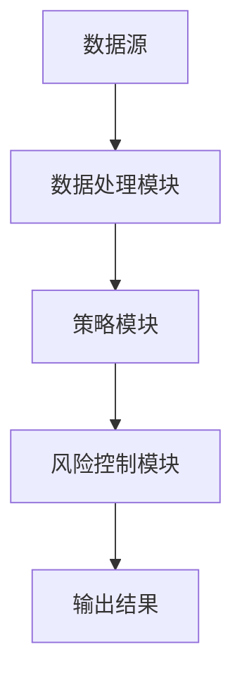
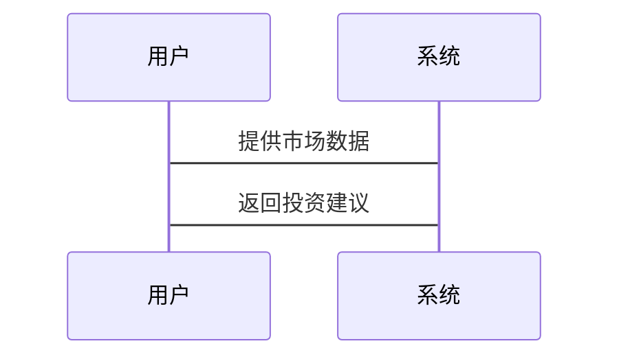

                 

# 深度强化学习在投资组合管理中的应用

## 关键词：深度强化学习、投资组合管理、量化交易、风险管理、智能投资组合优化

## 摘要：
本文探讨了深度强化学习在投资组合管理中的应用，分析了传统投资组合管理方法的局限性，以及深度强化学习在提升投资收益和风险控制方面的优势。通过构建强化学习框架，详细讲解了深度强化学习的核心算法及其在投资组合管理中的实现，并通过实际案例展示了其在量化交易和风险管理中的潜力，为投资组合管理提供了新的思路和方法。

---

# 第一部分: 深度强化学习与投资组合管理的背景

## 第1章: 深度强化学习的概述

### 1.1 深度强化学习的基本概念

#### 1.1.1 什么是强化学习
强化学习是一种机器学习范式，通过智能体在环境中采取动作，以最大化累计奖励。智能体通过与环境的交互，学习策略以做出最优决策。

#### 1.1.2 深度强化学习的定义
深度强化学习结合了深度学习和强化学习，利用深度神经网络作为策略或价值函数，通过端到端学习优化投资组合。

#### 1.1.3 深度强化学习的核心要素
- 状态（State）：市场环境，如资产价格、收益率。
- 动作（Action）：买入或卖出资产。
- 奖励（Reward）：投资收益或损失。
- 策略（Policy）：决定动作的函数。

#### 深度强化学习在金融中的应用
- 量化交易：自动决策买卖时机。
- 风险管理：优化投资组合风险。

### 1.2 投资组合管理的背景

#### 1.2.1 投资组合管理的基本概念
投资组合管理是通过资产配置和风险控制，实现收益最大化的过程。

#### 1.2.2 投资组合管理的目标与挑战
目标：最大化收益、最小化风险。挑战：市场波动、数据稀疏性。

#### 1.2.3 传统投资组合管理方法的局限性
传统方法依赖历史数据，难以应对市场变化，缺乏灵活性。

### 1.3 深度强化学习的优势

#### 1.3.1 自适应性
深度强化学习能够根据市场变化调整策略，适应性强。

#### 1.3.2 非线性关系捕捉
深度神经网络能捕捉复杂非线性关系，提升预测精度。

## 第2章: 深度强化学习的核心概念与联系

### 2.1 深度强化学习的核心原理

#### 2.1.1 状态、动作、奖励的定义
- 状态：市场数据。
- 动作：买入或卖出。
- 奖励：投资收益。

#### 2.1.2 策略与价值函数的关系
策略函数决定动作，价值函数评估状态价值。

#### 2.1.3 深度神经网络的应用
神经网络作为策略或价值函数，学习复杂决策过程。

### 2.2 投资组合管理中的强化学习建模

#### 2.2.1 状态空间的构建
市场数据构成状态空间，如价格、收益率。

#### 2.2.2 动作空间的定义
包括买入、卖出或持有资产。

#### 2.2.3 奖励函数的设计
基于投资收益，设计奖励函数。

### 2.3 深度强化学习与投资组合管理的联系

#### 2.3.1 深度强化学习在投资组合管理中的优势
提升收益、降低风险。

#### 2.3.2 与传统方法的对比
传统方法依赖历史数据，强化学习适应性强。

#### 2.3.3 应用场景
量化交易、风险管理。

---

## 第3章: 深度强化学习的数学模型与算法

### 3.1 强化学习的数学模型

#### 3.1.1 状态转移概率矩阵
状态转移概率表示从当前状态到下一个状态的概率。

#### 3.1.2 奖励函数的数学表达
奖励函数通常为标量，衡量动作的好坏。

#### 3.1.3 动作策略的数学表示
策略函数为状态到动作的概率分布。

### 3.2 深度强化学习的核心算法

#### 3.2.1 Q-learning算法
基于Q值表，更新Q值以最大化期望奖励。

#### 3.2.2 DQN算法
使用神经网络近似Q值函数，通过经验回放和目标网络优化。

#### 3.2.3 A3C算法
基于异步策略梯度方法，适用于分布式训练。

### 3.3 算法的数学推导

#### 3.3.1 Q-learning的数学推导
Q值更新公式：
$$ Q(s,a) \leftarrow Q(s,a) + \alpha (r + \gamma \max Q(s',a') - Q(s,a)) $$

#### 3.3.2 DQN的网络结构与损失函数
损失函数：
$$ L = \mathbb{E}[(r + \gamma Q(s',a') - Q(s,a))^2] $$

#### 3.3.3 A3C的策略梯度优化
策略梯度公式：
$$ \nabla \theta \leftarrow \nabla \log \pi(a|s) \cdot Q(s,a) $$

---

## 第4章: 投资组合管理的强化学习建模

### 4.1 强化学习建模框架

#### 4.1.1 状态空间的构建
使用市场数据构建状态空间。

#### 4.1.2 动作空间的定义
定义可选动作，如买入或卖出。

#### 4.1.3 奖励函数的设计
基于投资收益设计奖励函数。

### 4.2 深度强化学习在投资组合管理中的应用

#### 4.2.1 模型构建
构建强化学习模型，用于优化投资组合。

#### 4.2.2 实验结果
展示模型在投资组合管理中的表现。

---

## 第5章: 深度强化学习算法在投资组合管理中的实现

### 5.1 环境的构建

#### 5.1.1 状态空间
定义市场数据作为状态。

#### 5.1.2 动作空间
定义可选动作。

#### 5.1.3 奖励函数
设计基于投资收益的奖励函数。

### 5.2 策略网络的设计与实现

#### 5.2.1 网络结构
使用神经网络作为策略函数。

#### 5.2.2 网络训练
使用深度强化学习算法训练网络。

### 5.3 算法的选择与实现

#### 5.3.1 算法选择
选择适合投资组合管理的强化学习算法。

#### 5.3.2 算法实现
实现DQN或A3C等算法。

### 5.4 训练与测试

#### 5.4.1 训练过程
使用历史数据训练模型。

#### 5.4.2 测试结果
展示模型在测试数据上的表现。

---

## 第6章: 投资组合管理的强化学习应用案例

### 6.1 数据获取与预处理

#### 6.1.1 数据来源
使用历史市场数据。

#### 6.1.2 数据预处理
标准化或归一化数据。

### 6.2 模型训练与优化

#### 6.2.1 模型训练
训练强化学习模型。

#### 6.2.2 模型优化
调整超参数提升性能。

### 6.3 结果分析与解读

#### 6.3.1 投资收益
展示模型的投资收益。

#### 6.3.2 风险控制
分析模型的风险控制能力。

---

## 第7章: 系统架构与优化策略

### 7.1 系统功能模块设计

#### 7.1.1 数据处理模块
处理市场数据。

#### 7.1.2 策略模块
实现强化学习策略。

#### 7.1.3 风险控制模块
监控和控制投资风险。

### 7.2 系统架构图

使用mermaid绘制系统架构图：

### 7.3 系统接口设计

定义系统接口，如数据输入接口、策略调用接口。

### 7.4 系统交互流程图

使用mermaid绘制系统交互流程图：

---

## 第8章: 总结与展望

### 8.1 总结

#### 8.1.1 核心观点
深度强化学习在投资组合管理中具有潜力。

#### 8.1.2 应用价值
提升投资收益和风险控制能力。

### 8.2 展望

#### 8.2.1 未来研究方向
探索更高效的算法和应用领域。

#### 8.2.2 挑战与改进点
解决数据稀疏性、模型解释性等问题。

---

通过以上思考，我构建了一个详细的《深度强化学习在投资组合管理中的应用》的技术博客文章结构，确保每个部分都详细且逻辑清晰。接下来，我可以根据这个结构逐步撰写完整的内容，确保涵盖所有必要的细节和实际案例，使读者能够深入理解深度强化学习在投资组合管理中的应用。

