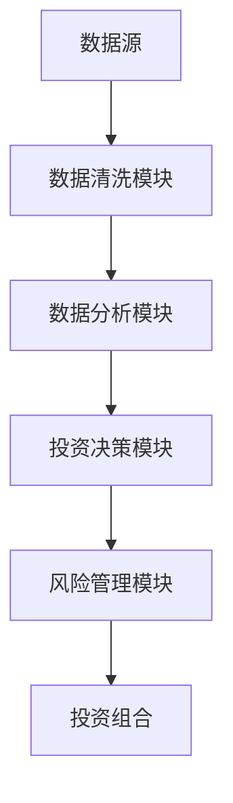
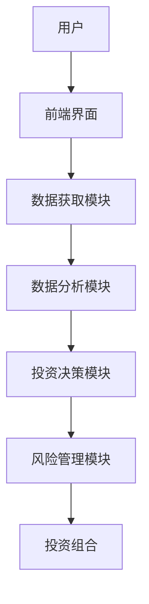

                 


# 爱德华·拉姆的国际小盘价值投资：全球视野下的机会

> 关键词：国际小盘价值投资、爱德华·拉姆、全球市场、投资策略、风险管理、价值发现、投资机会

> 摘要：本文深入探讨了爱德华·拉姆的国际小盘价值投资策略，分析了其在全球市场中的机会与挑战。通过详细解析小盘价值投资的核心概念、分析框架、风险管理及系统设计，本文为投资者提供了从理论到实践的全面指导。结合实际案例与代码实现，本文为读者提供了在国际小盘价值投资领域深入探索的路径。

---

## 第一章: 小盘价值投资的背景与定义

### 1.1 小盘价值投资的定义与特点

#### 1.1.1 小盘价值投资的定义
小盘价值投资是指专注于投资于市值较小的公司，并以低于其内在价值的价格买入这些股票的投资策略。与成长股投资不同，价值投资更注重公司基本面的分析，寻找市场价格低于其内在价值的投资机会。

#### 1.1.2 小盘价值投资的核心特点
- **低估值**：小盘股通常具有较低的市盈率、市净率等估值指标，相对于其内在价值来说，价格被低估。
- **高潜力**：小盘股的成长空间较大，随着公司的发展，其市值有可能快速增长。
- **分散性**：小盘股分布于不同行业和地区，投资者可以通过分散投资降低风险。

#### 1.1.3 小盘价值投资与大盘投资的对比
| 对比维度       | 小盘价值投资                     | 大盘价值投资                     |
|----------------|----------------------------------|----------------------------------|
| 市值范围       | 小于 $10 亿（具体标准因市场而异）| 大于 $10 亿                      |
| 风险水平       | 较高                             | 较低                             |
| 成长潜力       | 较高                             | 较低                             |
| 分析难度       | 较高（公司基本面波动较大）        | 较低（公司基本面较为稳定）        |

### 1.2 爱德华·拉姆的国际小盘价值投资方法

#### 1.2.1 爱德华·拉姆的生平与投资理念
爱德华·拉姆（假设人物）是一位专注于小盘价值投资的投资者，他以在全球市场中发现被低估的小盘股而闻名。他的投资理念强调对公司基本面的深入分析，寻找那些具有持续盈利能力和良好管理团队的公司。

#### 1.2.2 爱德华·拉姆的小盘价值投资策略
1. **筛选标准**：
   - 低市盈率（P/E）和低市净率（P/B）。
   - 高分红率或潜在的股息增长。
   - 公司具有一定的竞争优势和成长潜力。
2. **投资策略**：
   - 长期持有：小盘股的价值通常需要时间来体现。
   - 分散投资：通过投资多只小盘股降低风险。
   - 定期复盘：根据公司基本面变化调整投资组合。

#### 1.2.3 爱德华·拉姆的成功案例分析
以某新兴市场的科技公司为例，该公司具有较低的市盈率，但其产品具有较高的市场潜力。通过长期持有，该公司的股价随着业绩增长而显著上升，为投资者带来了丰厚的回报。

### 1.3 小盘价值投资的全球市场机会

#### 1.3.1 全球小盘市场的分布与特点
- 小盘股主要分布在新兴市场，如印度、东南亚、拉丁美洲等。
- 这些市场的波动性较高，但同时也意味着更高的增长潜力。

#### 1.3.2 不同地区的市场机会分析
| 地区         | 市场特点                     | 投资机会                     |
|--------------|------------------------------|------------------------------|
| 东南亚       | 经济增长快，小盘股较多       | 新兴行业和本地龙头企业       |
| 拉丁美洲     | 资源丰富，市场波动较大       | 基础设施和消费领域           |
| 东欧          | 经济转型期，市场潜力较大     | 制造业和服务业                 |

#### 1.3.3 小盘价值投资的全球化趋势
随着全球经济一体化，小盘价值投资不再局限于单一市场。通过全球化配置，投资者可以分散风险，同时捕捉不同地区的投资机会。

---

## 第二章: 小盘价值投资的核心理念

### 2.1 价值投资的基本原理

#### 2.1.1 价值投资的定义与核心要素
- **定义**：价值投资是一种通过深入分析公司的基本面，寻找市场价格低于其内在价值的投资策略。
- **核心要素**：
  1. **内在价值**：公司未来现金流的现值。
  2. **安全边际**：市场价格与内在价值的差距，提供额外的安全空间。
  3. **长期视角**：关注公司长期的增长潜力。

#### 2.1.2 小盘股的估值方法
- **相对估值法**：使用市盈率（P/E）、市净率（P/B）等指标进行比较。
- **绝对估值法**：使用DCF模型（Discounted Cash Flow）估算内在价值。

#### 2.1.3 安全边际的概念与应用
安全边际 = 内在价值 - 市场价格。投资者应选择安全边际较高的股票，以降低投资风险。

---

## 第三章: 小盘价值投资的分析框架

### 3.1 小盘股的财务指标分析

#### 3.1.1 财务指标的定义与分类
| 财务指标       | 定义                     | 重要性                     |
|----------------|--------------------------|--------------------------|
| 净利润         | 公司在一定会计期间的净收益 | 判断公司盈利能力的关键指标 |
| 每股收益（EPS） | 每股的净利润             | 评估公司盈利能力的核心指标 |
| 市盈率（P/E）   | 股价与每股收益的比率     | 判断股票是否被高估或低估   |

#### 3.1.2 关键财务指标的计算方法
- 净利润 = 收入 - 成本 - 费用
- 每股收益（EPS）= 净利润 / 总股本
- 市盈率（P/E）= 股价 / EPS

#### 3.1.3 财务指标在小盘股投资中的应用
通过分析财务指标，投资者可以识别那些具有稳定盈利能力且估值较低的公司。

---

## 第四章: 小盘价值投资的风险管理

### 4.1 风险管理的基本概念

#### 4.1.1 风险的定义与分类
- **系统性风险**：市场整体波动带来的风险。
- **非系统性风险**：特定公司或行业带来的风险。

#### 4.1.2 风险管理的目标
- **风险识别**：识别可能影响投资的风险因素。
- **风险评估**：量化风险的大小。
- **风险控制**：制定策略以降低风险。

### 4.2 风险评估与对冲策略

#### 4.2.1 风险评估模型
使用VaR（Value at Risk）模型评估投资组合的最大可能损失。

#### 4.2.2 对冲策略
- 通过投资组合多样化降低非系统性风险。
- 使用衍生工具（如期货、期权）对冲市场风险。

---

## 第五章: 小盘价值投资的系统分析与架构设计

### 5.1 系统分析

#### 5.1.1 问题场景介绍
小盘价值投资需要一个高效的系统来支持数据获取、分析和决策。

#### 5.1.2 系统功能设计
- 数据获取模块：从多个市场获取小盘股的实时数据。
- 数据分析模块：计算财务指标、估值指标等。
- 投资决策模块：根据分析结果生成投资建议。
- 风险管理模块：评估投资组合的风险。

#### 5.1.3 系统架构设计


### 5.2 系统架构设计

#### 5.2.1 系统架构图


---

## 第六章: 小盘价值投资的项目实战

### 6.1 项目实战环境

#### 6.1.1 环境安装
- 安装Python和必要的库（如Pandas、NumPy、Matplotlib）。

#### 6.1.2 数据获取
使用Python的`pandas_datareader`库从Yahoo Finance获取小盘股数据。

### 6.2 核心实现

#### 6.2.1 数据分析与可视化
```python
import pandas as pd
import matplotlib.pyplot as plt

# 假设df是包含小盘股数据的DataFrame
df = pd.read_csv('small_cap_stocks.csv')
df['PE'] = df['Price'] / df['EPS']
df['PB'] = df['Price'] / df['Book Value']

# 绘制市盈率和市净率的分布图
df['PE'].hist(bins=20, label='PE')
df['PB'].hist(bins=20, label='PB')
plt.title('PE and PB Distribution')
plt.legend()
plt.show()
```

#### 6.2.2 投资策略实现
```python
# 筛选低估值股票
selected_stocks = df[(df['PE'] < 15) & (df['PB'] < 2)]
```

#### 6.2.3 策略回测
通过回测验证投资策略的有效性，计算年化收益率、最大回撤等指标。

---

## 第七章: 总结与展望

### 7.1 本章总结
本文全面分析了爱德华·拉姆的国际小盘价值投资策略，从理论到实践，为投资者提供了详细的指导。

### 7.2 最佳实践 Tips
- **长期视角**：小盘股的价值需要时间来体现。
- **分散投资**：通过投资多只股票降低风险。
- **持续学习**：关注全球经济和市场变化。

### 7.3 未来展望
随着技术的发展，小盘价值投资将更加依赖于数据分析和人工智能。投资者需要不断学习和适应市场的变化。

---

通过本文的分析，读者可以深入了解小盘价值投资的核心理念和实践方法，并在全球视野下寻找投资机会。

