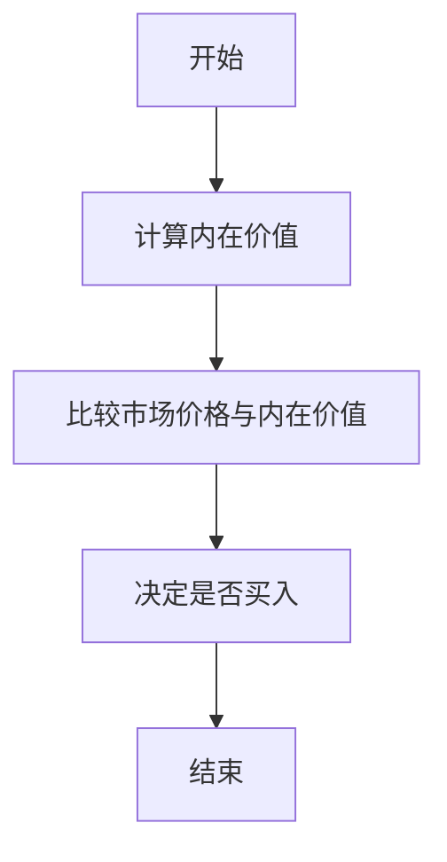
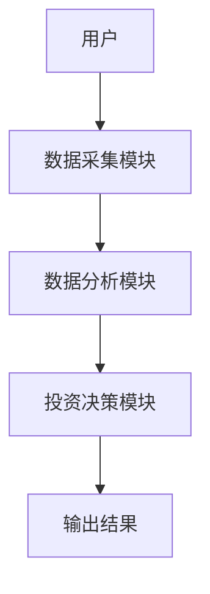

                 


# 特价股票与价值投资的关系探讨

## 关键词
- 特价股票、价值投资、数学模型、系统设计、Python算法

## 摘要
本文探讨特价股票与价值投资之间的关系，分析两者的核心概念、数学模型和系统架构设计，结合Python算法实现价值投资策略，帮助读者理解如何通过技术手段在股票市场中实现稳健投资。

---

## 第一部分: 特价股票与价值投资的背景介绍

### 第1章: 特价股票与价值投资的定义与背景

#### 1.1 特价股票的定义与特征
- **1.1.1 特价股票的定义**
  特价股票是指市场价格显著低于其内在价值的股票，通常被认为是被市场低估的投资机会。
- **1.1.2 特价股票的核心特征**
  - 市场价格低于内在价值。
  - 公司基本面良好，具备长期增长潜力。
  - 通常出现在市场恐慌或经济低迷时期。
- **1.1.3 特价股票的市场表现**
  - 短期内可能表现不佳，但长期来看，其价值回归的可能性较大。

#### 1.2 价值投资的起源与发展
- **1.2.1 价值投资的起源**
  价值投资理念起源于20世纪初，由本杰明·格雷厄姆和戴维·多德提出。
- **1.2.2 价值投资的核心理念**
  - 买入低于内在价值的资产，长期持有。
  - 强调安全边际和风险管理。
- **1.2.3 价值投资的现代发展**
  - 结合现代金融理论，价值投资方法不断优化。

#### 1.3 特价股票与价值投资的关系
- **1.3.1 特价股票与价值投资的联系**
  - 特价股票是价值投资的核心标的。
- **1.3.2 特价股票与价值投资的区别**
  - 特价股票是现象，价值投资是方法。

---

## 第二部分: 特价股票与价值投资的核心概念与联系

### 第2章: 特价股票与价值投资的核心概念对比

#### 2.1 特价股票与价值投资的核心概念对比表
| **核心概念** | **特价股票** | **价值投资** |
|--------------|--------------|--------------|
| 定义          | 市场价格低于内在价值的股票。 | 以低于内在价值的价格买入并长期持有的投资策略。 |
| 核心特征      | 价格低估     | 价格低估、安全边际 |
| 实施方法      | 寻找低估股票 | 寻找低估股票并建立投资组合 |

#### 2.2 特价股票与价值投资的ER实体关系图
```mermaid
er
  root
    entity 特价股票
      attributes: 市场价格、内在价值
    entity 价值投资
      attributes: 安全边际、投资期限
    relationship: 特价股票与价值投资的联系
```

---

## 第三部分: 价值投资中的数学模型与算法

### 第3章: 价值投资中的数学模型与算法

#### 3.1 价值投资的数学模型
- **市盈率（P/E）计算公式**
  $$ P/E = \frac{市场价格}{每股收益} $$
- **市净率（P/B）计算公式**
  $$ P/B = \frac{市场价格}{每股净资产} $$

#### 3.2 价值投资的算法实现


#### 3.3 Python代码实现
```python
def calculate_intrinsic_value(stock_price, earnings_per_share):
    pe_ratio = stock_price / earnings_per_share
    if pe_ratio < 15:  # 假设安全边际为15%
        return "买入"
    else:
        return "观望"
```

---

## 第四部分: 系统分析与架构设计

### 第4章: 投资决策支持系统的架构设计

#### 4.1 系统功能设计
- 数据采集模块：获取股票价格、财务数据。
- 数据分析模块：计算市盈率、市净率。
- 投资决策模块：判断是否为特价股票。

#### 4.2 系统架构设计


#### 4.3 接口设计与交互流程
- API接口：`/api/intrinsic_value`
- 请求参数：股票代码、财务数据。
- 响应参数：投资建议。

---

## 第五部分: 项目实战

### 第5章: 价值投资策略的Python实现

#### 5.1 环境安装
- Python 3.8+
- Pandas、NumPy、Matplotlib库。

#### 5.2 核心代码实现
```python
import pandas as pd
import numpy as np

def calculate_intrinsic_value(stock_data):
    stock_data['PE'] = stock_data['市场价格'] / stock_data['每股收益']
    stock_data['PB'] = stock_data['市场价格'] / stock_data['每股净资产']
    stock_data['投资建议'] = np.where(stock_data['PE'] < 15, '买入', '观望')
    return stock_data

# 示例数据
data = {
    '股票代码': ['A', 'B', 'C'],
    '市场价格': [10, 20, 15],
    '每股收益': [0.5, 1.0, 0.75],
    '每股净资产': [5, 10, 6]
}

df = pd.DataFrame(data)
result = calculate_intrinsic_value(df)
print(result)
```

#### 5.3 实际案例分析
- 分析某公司财务数据，计算其内在价值。
- 制定投资策略：若PE < 15，建议买入。

---

## 第六部分: 总结与最佳实践

### 第6章: 总结与最佳实践

#### 6.1 总结
- 特价股票是价值投资的重要标的。
- 数学模型与系统设计是实现价值投资的关键。

#### 6.2 最佳实践
- **投资策略**：结合PE、PB等指标筛选特价股票。
- **风险管理**：设置止损点，避免重大损失。
- **长期视角**：坚持价值投资，避免短期波动干扰。

#### 6.3 注意事项
- 数据准确性：确保财务数据的准确性。
- 市场变化：及时跟踪市场变化，调整投资策略。

#### 6.4 拓展阅读
- 《价值投资入门》
- 《投资学原理》

---

通过以上分析和实践，我们可以更好地理解特价股票与价值投资的关系，并利用技术手段实现稳健的投资策略。

