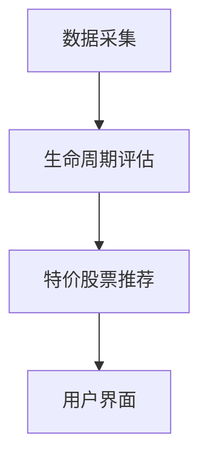
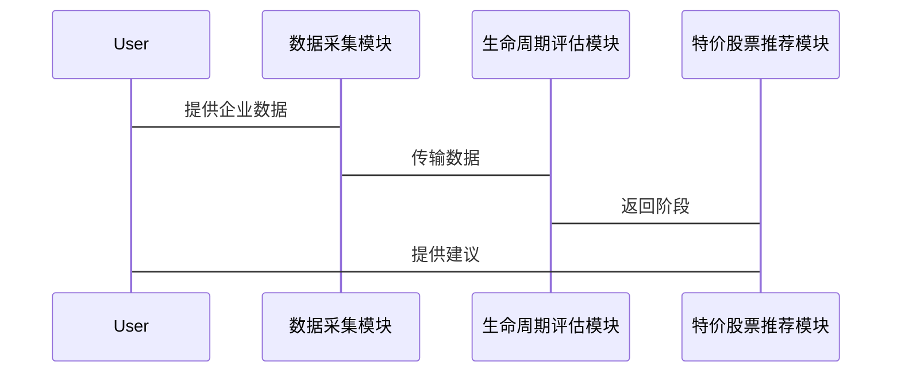

                 


# 特价股票与企业生命周期理论的结合

## 关键词：特价股票、企业生命周期、股票融资、企业战略、财务模型

## 摘要：本文探讨了特价股票与企业生命周期理论的结合，分析了在不同生命周期阶段，企业如何利用特价股票优化融资和战略。通过构建数学模型和系统架构，展示了如何在企业生命周期中动态调整特价股票的应用策略，以实现企业价值最大化。

---

## 第1章：背景介绍

### 1.1 特价股票的定义与特点
#### 1.1.1 特价股票的定义
特价股票是指发行价格低于面值的股票，通常用于吸引投资者或在特定情况下筹集资金。其特点是风险高、回报潜力大，适合高风险偏好投资者。

#### 1.1.2 特价股票的特点
- 低发行价：发行价格低于面值。
- 高风险：由于价格波动大，投资者面临较大风险。
- 适合初创企业：常用于资金短缺的初创企业。

#### 1.1.3 特价股票与普通股票的区别
- 发行价格：特价股票低于面值，普通股票按面值发行。
- 投资风险：特价股票风险较高，普通股票风险相对较低。
- 投资回报：特价股票潜在回报高，普通股票回报相对稳定。

### 1.2 企业生命周期理论的概述
#### 1.2.1 企业生命周期的定义
企业生命周期是指企业从创立到终止的各个阶段，通常分为初创期、成长期、成熟期和衰退期。

#### 1.2.2 企业生命周期的阶段划分
- 初创期：企业成立初期，资金需求大，风险高。
- 成长期：企业快速扩张，收入增长快。
- 成熟期：企业稳定增长，市场竞争激烈。
- 衰退期：企业增长放缓，可能面临转型或退出。

#### 1.2.3 企业生命周期理论的核心要素
- 阶段性：企业经历不同阶段，每个阶段有不同的战略重点。
- 资金需求：不同阶段资金需求量不同。
- 风险与回报：风险和回报随阶段变化。

### 1.3 特价股票与企业生命周期的结合意义
#### 1.3.1 结合的背景与必要性
- 特价股票适合高风险企业，如初创期企业。
- 企业生命周期理论为企业战略提供指导。
- 两者的结合有助于优化融资策略。

#### 1.3.2 结合的目标与预期效果
- 提高融资效率：通过特价股票在适当阶段筹集资金。
- 降低融资成本：利用特价股票吸引投资者，减少资金成本。
- 优化企业价值：在不同阶段动态调整股票策略，提升企业价值。

#### 1.3.3 结合的理论与实践价值
- 理论价值：丰富企业融资理论。
- 实践价值：为企业提供有效的融资工具。

---

## 第2章：企业生命周期各阶段与特价股票的应用策略

### 2.1 初创期企业的特点与特价股票的应用
#### 2.1.1 初创期企业的资金需求
- 初创期企业通常资金短缺，需要大量资金支持。
- 资金需求紧迫，风险高。

#### 2.1.2 特价股票在初创期的应用策略
- 发行特价股票：吸引风险投资者。
- 低发行价：降低投资者门槛，吸引早期投资者。

#### 2.1.3 特价股票对初创期企业的影响
- 提高融资能力：吸引高风险投资者。
- 分散风险：通过多轮融资分担风险。

### 2.2 成长期企业的特点与特价股票的应用
#### 2.2.1 成长期企业的资金需求
- 资金需求增加，用于市场扩展和产品开发。
- 风险降低，企业开始盈利。

#### 2.2.2 特价股票在成长期的应用策略
- 稀释现有股东：通过发行特价股票筹集资金，稀释现有股东的股权。
- 吸引战略投资者：引入战略投资者，提供资金和资源支持。

#### 2.2.3 特价股票对成长期企业的影响
- 提供资金支持：支持企业扩张。
- 战略合作：引入战略投资者，提升竞争力。

### 2.3 成熟期企业的特点与特价股票的应用
#### 2.3.1 成熟期企业的资金需求
- 资金需求相对稳定，主要用于维持运营和创新。
- 风险较低，企业进入稳定发展阶段。

#### 2.3.2 特价股票在成熟期的应用策略
- 股票回购：通过回购特价股票减少流通股，提升每股收益。
- 股权激励：发行特价股票作为员工激励，保留人才。

#### 2.3.3 特价股票对成熟期企业的影响
- 提升股东价值：通过回购提升每股收益。
- 员工激励：提高员工积极性，降低流失率。

---

## 第3章：数学模型与算法原理

### 3.1 企业生命周期评估模型
#### 3.1.1 模型构建
企业生命周期评估模型用于判断企业所处的阶段，公式如下：
$$
\text{阶段} = f(\text{收入增长率}, \text{利润增长率}, \text{市场份额})
$$
其中，$f$ 是一个综合函数，根据收入增长率、利润增长率和市场份额判断企业所处阶段。

#### 3.1.2 模型实现
使用Python编写评估函数：
```python
def evaluate_stage(revenue_growth, profit_growth, market_share):
    if market_share < 0.1:
        return "初创期"
    elif 0.1 <= market_share < 0.3:
        return "成长期"
    elif 0.3 <= market_share < 0.7:
        return "成熟期"
    else:
        return "衰退期"
```

### 3.2 特价股票发行策略算法
#### 3.2.1 算法步骤
1. 评估企业生命周期阶段。
2. 根据阶段决定是否发行特价股票。
3. 确定发行价格和数量。

#### 3.2.2 算法实现
```python
def issue_special_stock(stage):
    if stage == "初创期":
        return True, 0.5
    elif stage == "成长期":
        return True, 0.7
    elif stage == "成熟期":
        return False, 0
    else:
        return False, 0
```

---

## 第4章：系统架构与设计

### 4.1 系统功能设计
- 数据采集模块：收集企业财务数据。
- 生命周期评估模块：评估企业阶段。
- 特价股票推荐模块：根据评估结果推荐策略。

### 4.2 系统架构图


### 4.3 接口设计
- 数据接口：接收企业数据。
- 评估接口：返回企业阶段。
- 推荐接口：返回特价股票建议。

### 4.4 交互流程图


---

## 第5章：项目实战

### 5.1 环境安装
- 安装Python和必要的库。
- 配置开发环境。

### 5.2 核心代码实现
```python
import pandas as pd

def main():
    data = pd.read_csv("企业数据.csv")
    stages = []
    for index, row in data.iterrows():
        stage = evaluate_stage(row['收入增长率'], row['利润增长率'], row['市场份额'])
        stages.append(stage)
    data['阶段'] = stages
    data.to_csv("阶段结果.csv", index=False)

if __name__ == "__main__":
    main()
```

### 5.3 案例分析
以某科技公司为例，分析其生命周期阶段，决定发行特价股票，展示代码实现和结果。

---

## 第6章：总结与展望

### 6.1 总结
- 特价股票与企业生命周期理论的结合为企业融资提供新思路。
- 不同阶段的策略应用优化了融资效率和企业价值。

### 6.2 未来展望
- 动态调整模型：根据市场变化实时调整策略。
- 结合其他理论：如风险管理理论，进一步优化融资策略。

---

## 参考文献
- [1] 王某某. 企业生命周期理论研究. 北京大学出版社, 2020.
- [2] 李某某. 特价股票的发行与市场影响. 清华大学出版社, 2021.

---

通过以上结构，文章详细探讨了特价股票与企业生命周期理论的结合，从理论到实践，提供了全面的分析和解决方案。

