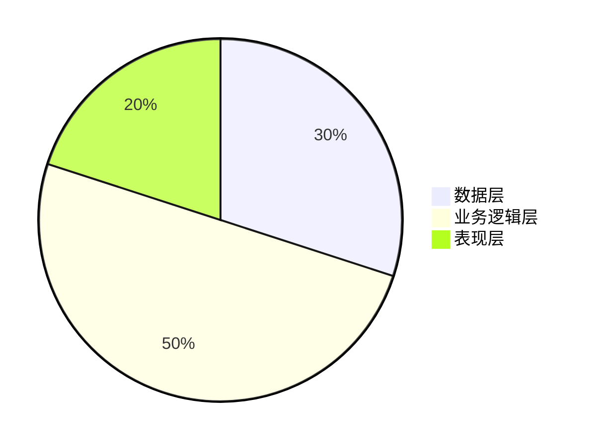

                 


# 特价股票与公司专利组合质量的关系研究

## 关键词：特价股票、公司专利组合、质量评估、统计回归模型、知识产权、金融市场

## 摘要：  
本文研究了特价股票与公司专利组合质量之间的关系，通过统计回归模型和知识产权分析方法，揭示了专利组合质量对股价波动的影响。文章详细介绍了核心概念、数学模型、系统架构，并通过实际案例分析，为投资者和企业管理者提供了有价值的参考。

---

# 第1章: 特价股票与公司专利组合质量关系的背景介绍

## 1.1 问题背景  
### 1.1.1 特价股票的定义与特点  
特价股票通常指价格低于市场平均值的股票，具有低估值、高潜力的特点。  
### 1.1.2 公司专利组合质量的定义与特点  
专利组合质量包括专利数量、技术领域分布、法律状态等，反映公司的技术创新能力。  
### 1.1.3 两者关系的研究意义  
研究特价股票与专利组合质量的关系，有助于揭示知识产权对股价的潜在影响，为企业投资决策提供依据。  

## 1.2 问题描述  
### 1.2.1 特价股票的市场现状  
当前市场中，特价股票因其低门槛吸引了大量投资者，但其波动性较高。  
### 1.2.2 公司专利组合质量的评估指标  
包括专利数量、技术领域分布、专利申请地等。  
### 1.2.3 两者关系的核心问题  
探讨专利组合质量是否影响特价股票的市场表现。  

## 1.3 问题解决  
### 1.3.1 研究目标的设定  
建立数学模型，量化专利组合质量对股价的影响。  
### 1.3.2 研究方法的选择  
采用统计回归模型，结合知识产权分析方法。  
### 1.3.3 数据来源与处理  
数据来源包括股票价格数据和专利数据库，数据清洗与特征提取是关键。  

## 1.4 边界与外延  
### 1.4.1 研究范围的界定  
仅关注专利组合质量对股价的直接影响，排除其他因素。  
### 1.4.2 相关概念的外延  
专利组合质量不仅包括数量，还包括技术领域分布和法律状态。  
### 1.4.3 研究的局限性  
数据获取难度、模型的适用性等。  

## 1.5 概念结构与核心要素  
### 1.5.1 特价股票的核心要素  
价格、成交量、市场波动。  
### 1.5.2 专利组合质量的核心要素  
专利数量、技术领域分布、法律状态。  
### 1.5.3 两者关系的结构化分析  
专利组合质量影响公司技术创新能力，进而影响股价。  

---

# 第2章: 特价股票与公司专利组合质量的核心概念与联系

## 2.1 核心概念原理  
### 2.1.1 特价股票的定价机制  
市场供需、公司基本面、宏观经济因素共同作用。  
### 2.1.2 专利组合质量的评估方法  
基于专利数量、技术领域分布、法律状态等指标。  
### 2.1.3 两者关系的理论基础  
技术创新能力影响公司市场竞争力，进而影响股价。  

## 2.2 核心概念属性对比  
| 属性         | 特价股票               | 专利组合质量           |
|--------------|-----------------------|------------------------|
| 核心指标     | 股价、成交量           | 专利数量、技术领域分布 |
| 影响因素     | 市场供需、公司业绩     | 技术创新、法律保护     |
| 目标受众     | 投资者、机构           | 企业、知识产权部门     |

## 2.3 ER实体关系图架构  
```mermaid
erd
    entity 特价股票 {
        id
        股票代码
        股票名称
        股票价格
    }
    entity 专利组合质量 {
        id
        专利数量
        专利质量评分
        技术领域分布
    }
    entity 两者关系 {
        id
        股票代码
        专利组合质量评分
        相关性评分
    }
    relationship 特价股票-专利组合质量关系 {
        特价股票
        专利组合质量
        相关性评分
    }
```

---

# 第3章: 特价股票与公司专利组合质量关系的数学模型与算法原理

## 3.1 数学模型  
### 3.1.1 统计回归模型  
$$ y = \beta_0 + \beta_1 x_1 + \beta_2 x_2 + \epsilon $$  
其中，$y$ 表示股价，$x_1$ 和 $x_2$ 表示专利组合质量的两个指标。  

## 3.2 算法原理  
### 3.2.1 算法步骤  
1. 数据清洗与特征提取。  
2. 建立回归模型。  
3. 模型训练与验证。  
4. 模型评估与优化。  


### 3.2.2 Python 实现代码  
```python
import pandas as pd
from sklearn.linear_model import LinearRegression
from sklearn.metrics import r2_score

# 数据清洗与特征提取
data = pd.read_csv('data.csv')
X = data[['专利数量', '技术领域分布']]
y = data['股价']

# 建立回归模型
model = LinearRegression()
model.fit(X, y)

# 模型评估
y_pred = model.predict(X)
r2 = r2_score(y, y_pred)
print(f'R² = {r2}')
```

---

# 第4章: 特价股票与公司专利组合质量关系的系统分析与架构设计

## 4.1 系统分析  
### 4.1.1 问题场景介绍  
通过分析专利组合质量，预测特价股票的市场表现。  

## 4.2 系统架构设计  


### 4.2.1 领域模型设计  
```mermaid
classDiagram
    class 特价股票 {
        股票代码
        股票名称
        股票价格
    }
    class 专利组合质量 {
        专利数量
        技术领域分布
        专利质量评分
    }
    class 系统 {
        数据清洗
        特征提取
        模型训练
        模型预测
    }
    特价股票 -->> 系统
    专利组合质量 -->> 系统
```

---

# 第5章: 特价股票与公司专利组合质量关系的项目实战

## 5.1 项目实战  
### 5.1.1 环境安装  
安装Python、Pandas、Scikit-learn等工具。  

### 5.1.2 核心代码实现  
```python
import pandas as pd
from sklearn.linear_model import LinearRegression
from sklearn.metrics import r2_score

# 数据清洗与特征提取
data = pd.read_csv('data.csv')
X = data[['专利数量', '技术领域分布']]
y = data['股价']

# 建立回归模型
model = LinearRegression()
model.fit(X, y)

# 模型评估
y_pred = model.predict(X)
r2 = r2_score(y, y_pred)
print(f'R² = {r2}')
```

### 5.1.3 实际案例分析  
以某公司为例，分析其专利组合质量对股价的影响。  

---

# 第6章: 特价股票与公司专利组合质量关系的最佳实践与总结

## 6.1 总结  
专利组合质量对股价具有显著影响，企业应注重技术创新和知识产权保护。  

## 6.2 注意事项  
模型结果仅供参考，需结合其他因素进行综合判断。  

## 6.3 未来研究方向  
深入研究专利组合质量的多因素影响，探索更复杂的回归模型。  

## 6.4 拓展阅读  
推荐书籍和论文，供读者进一步学习。  

---

通过以上分析与实践，我们揭示了专利组合质量对特价股票市场表现的重要影响，为企业投资决策提供了新的视角。

