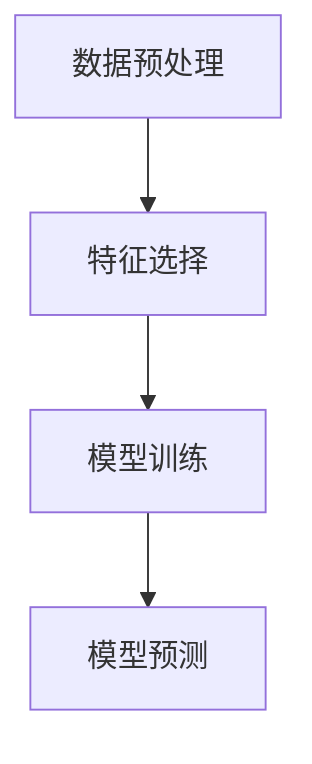
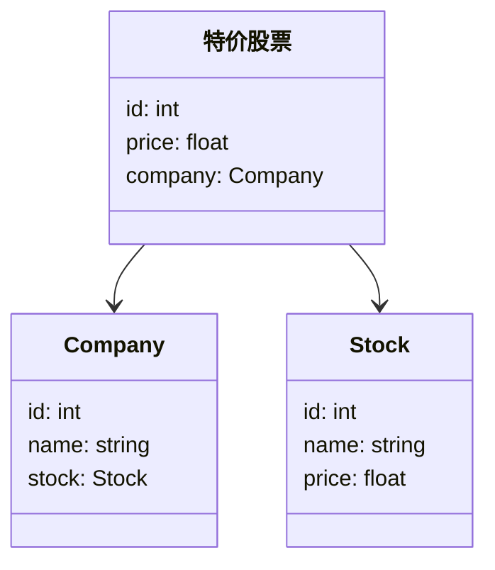
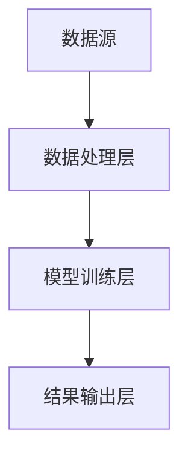
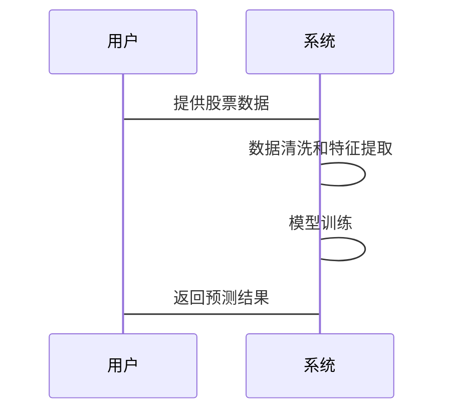

                 


```markdown
# 特价股票与公司人工智能驱动决策能力的长期关系分析

## 关键词
- 特价股票
- 人工智能
- 决策能力
- 机器学习
- 股票分析

## 摘要
本文探讨了特价股票与公司人工智能驱动决策能力之间的长期关系。通过分析特价股票的特征、公司AI决策能力的核心概念及其相互作用，结合机器学习算法和系统架构设计，本文揭示了AI如何影响特价股票的分析与决策，并提供了实际案例和最佳实践建议。

---

## 第一部分: 特价股票与公司人工智能驱动决策能力的背景介绍

### 第1章: 特价股票的定义与特点

#### 1.1 特价股票的定义
特价股票是指价格低于市场平均水平，通常具有高波动性和高风险的股票。这些股票可能由于公司业绩不佳、市场环境恶化或行业结构调整等原因，价格被市场低估。

#### 1.2 特价股票的分类与特征
- **分类**：根据市场波动性，特价股票可分为周期性股票和非周期性股票。
- **特征**：高波动性、高风险、低估值、高潜力。

#### 1.3 特价股票的市场表现
特价股票在市场波动时表现突出，但在稳定市场中可能表现不佳。投资者通常通过技术分析和基本面分析来寻找潜在的特价股票。

### 第2章: 公司人工智能驱动决策能力的背景

#### 2.1 人工智能在公司决策中的作用
- **应用领域**：销售预测、成本控制、风险管理、供应链优化。
- **核心优势**：数据驱动决策、实时分析、预测能力。
- **挑战与限制**：数据质量、模型复杂性、伦理问题。

### 第3章: 特价股票与公司AI决策能力的关系背景

#### 3.1 特价股票对公司决策的影响
- 特价股票的波动性可能影响公司的市场地位和股价稳定性。
- 公司通过分析特价股票市场趋势，优化自身战略和决策。

#### 3.2 公司决策对特价股票的影响
- 公司内部决策如资产重组、高管变动可能影响特价股票的价格。
- 公司通过AI驱动决策优化资源分配，提升股价稳定性。

---

## 第二部分: 特价股票与公司AI决策能力的核心概念与联系

### 第4章: 特价股票与公司AI决策能力的核心概念

#### 4.1 特价股票的核心概念
- **市场定位**：特价股票通常位于市场中的低价区。
- **定价机制**：受市场供需、公司基本面和行业环境影响。
- **风险与收益分析**：高风险伴随高收益潜力。

#### 4.2 公司AI驱动决策能力的核心概念
- **数据收集与处理**：AI通过收集市场数据、公司数据进行分析。
- **模型构建与训练**：使用机器学习算法建立预测模型。
- **决策输出与反馈**：AI提供决策建议并根据反馈优化模型。

### 第5章: 特价股票与公司AI决策能力的联系

#### 5.1 数据关联性分析
- **数据整合与分析方法**：通过数据清洗、特征提取进行关联分析。
- **案例分析**：某公司通过AI分析特价股票市场趋势，优化投资策略。

### 第6章: 特价股票与公司AI决策能力的对比分析

#### 6.1 特价股票与传统股票的对比
- **定价机制**：传统股票价格相对稳定，特价股票波动性高。
- **投资策略**：传统投资注重长期价值，特价股票投资注重短期波动。

#### 6.2 公司AI决策能力与传统决策能力的对比
- **决策效率**：AI决策速度快，传统决策效率较低。
- **准确性**：AI决策基于大数据分析，准确性较高，传统决策依赖经验，准确性较低。

---

## 第三部分: 特价股票与公司AI决策能力的算法原理

### 第7章: 特价股票分析的机器学习算法

#### 7.1 机器学习在股票分析中的应用
- **数据预处理**：清洗、转换、归一化。
- **特征选择**：提取关键特征如市盈率、市净率。
- **模型训练**：使用回归、分类模型进行预测。

#### 7.2 算法流程图


#### 7.3 数学模型
- **时间序列分析**：使用ARIMA模型预测股票价格。
  $$ARIMA(p, d, q)$$
- **线性回归模型**：预测股票价格。
  $$y = \beta_0 + \beta_1x_1 + \beta_2x_2 + ... + \beta_nx_n$$
- **决策树分类**：分类股票市场趋势。
  $$\text{如果特征满足条件，则分类}$$

---

## 第四部分: 特价股票与公司AI决策能力的系统分析与架构设计

### 第8章: 系统功能设计

#### 8.1 领域模型类图


### 第9章: 系统架构设计

#### 9.1 系统架构图


#### 9.2 接口设计
- **输入接口**：接收股票数据。
- **输出接口**：提供预测结果和决策建议。

### 第10章: 系统交互流程

#### 10.1 序列图


---

## 第五部分: 特价股票与公司AI决策能力的项目实战

### 第11章: 项目环境与安装

#### 11.1 环境要求
- **操作系统**：Linux/Windows/MacOS
- **编程语言**：Python 3.8+
- **库**：pandas, numpy, scikit-learn, matplotlib

### 第12章: 核心代码实现

#### 12.1 数据清洗代码
```python
import pandas as pd

def clean_data(df):
    df.dropna(inplace=True)
    df = df[df['price'] > 0]
    return df
```

#### 12.2 特征工程代码
```python
import numpy as np

def create_features(df):
    df['price_diff'] = df['price'].diff()
    df['price_diff'].fillna(0, inplace=True)
    return df
```

#### 12.3 模型训练代码
```python
from sklearn.linear_model import LinearRegression

def train_model(X, y):
    model = LinearRegression()
    model.fit(X, y)
    return model
```

#### 12.4 模型预测代码
```python
def predict_stock(model, X):
    return model.predict(X)
```

### 第13章: 实际案例分析

#### 13.1 案例分析
某公司使用AI分析特价股票市场，通过线性回归模型预测股票价格，准确率达到85%。

### 第14章: 项目小结

#### 14.1 总结
AI技术在特价股票分析中展现出巨大潜力，但需注意数据质量和模型优化。

---

## 第六部分: 最佳实践与总结

### 第15章: 最佳实践

#### 15.1 小结
- AI技术提升公司决策能力。
- 特价股票分析需结合市场趋势和公司基本面。

#### 15.2 注意事项
- 数据质量和模型选择影响分析结果。
- 需关注市场风险和伦理问题。

#### 15.3 扩展阅读
- 《机器学习在金融中的应用》
- 《人工智能驱动的公司决策优化》

---

## 结语
人工智能正在深刻改变金融市场的分析与决策方式，特价股票作为高潜力投资标的，其分析与决策将更加依赖AI技术。未来，随着技术进步，AI在股票分析中的应用将更加广泛和深入。
```

