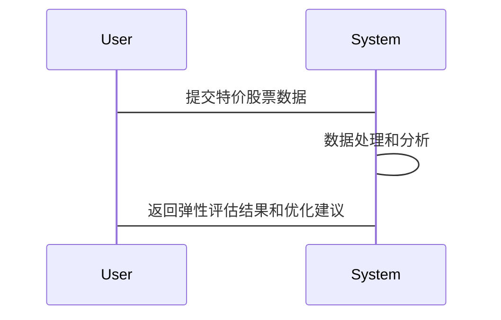

                 


# 特价股票与公司供应链弹性的关系探讨

## 关键词
- 特价股票
- 供应链弹性
- 供应链管理
- 企业风险管理
- 市场波动

## 摘要
本文探讨了特价股票对公司供应链弹性的影响，分析了供应链弹性在应对特价股票引发的市场波动中的关键作用。通过构建数学模型和算法，本文详细解释了特价股票如何影响供应链的弹性，并提出了优化供应链弹性的策略和建议。文章还通过实际案例分析了供应链弹性在应对特价股票时的具体应用，为企业的供应链管理提供了实践指导。

---

# 第一部分: 特价股票与供应链弹性的背景与概念

## 第1章: 特价股票的定义与特性

### 1.1 特价股票的定义
#### 1.1.1 特价股票的基本概念
特价股票是指公司为了清理库存、促销产品或吸引顾客而以低于市场价出售的股票。这些股票通常附带一定的条件或限制，例如购买门槛或使用期限。

#### 1.1.2 特价股票的分类
- 清仓特价股票：用于清理库存的产品。
- 促销特价股票：用于吸引新客户或推广新产品。
- 季节性特价股票：根据季节或节日推出的优惠。

#### 1.1.3 特价股票的市场特征
- 价格敏感性：特价股票通常低于市场价，吸引价格敏感的消费者。
- 时间限制：特价股票通常有时间限制，促使消费者尽快购买。
- 需求弹性：特价股票可能短期内增加销量，但长期影响需谨慎评估。

### 1.2 供应链弹性的定义与特性
#### 1.2.1 供应链弹性的基本概念
供应链弹性是指供应链在面对市场需求波动、供应中断或其他外部冲击时，能够灵活调整、快速响应并恢复的能力。

#### 1.2.2 供应链弹性的关键特征
- 柔性：供应链能够根据需求变化调整生产和配送。
- 可扩展性：供应链在需求激增时能够快速扩展生产能力。
- 恢复性：供应链在受到干扰后能够迅速恢复正常运营。

#### 1.2.3 供应链弹性的评估指标
- 响应时间：供应链对需求变化的响应速度。
- 成本变化：供应链在弹性调整过程中的成本增加情况。
- 资源利用率：供应链在弹性调整中的资源使用效率。

### 1.3 特价股票与供应链弹性的关系背景
#### 1.3.1 问题背景介绍
- 特价股票可能引发市场需求的突然激增或波动。
- 供应链弹性是企业应对市场波动的关键能力。
- 特价股票可能对供应链的库存、生产和交付能力提出更高要求。

#### 1.3.2 问题描述与边界
- 特价股票可能导致供应链库存压力增加。
- 供应链弹性需要在特价股票期间保持高效运作。
- 问题的边界包括供应链的上游供应商、库存管理、生产和配送环节。

## 第2章: 核心概念与联系

### 2.1 核心概念原理
#### 2.1.1 特价股票的市场机制
特价股票通过价格折扣吸引消费者，可能短期内增加销量，但也可能影响市场价格稳定性和供应商利润。

#### 2.1.2 供应链弹性的运作机制
供应链弹性通过灵活的库存管理、多供应商策略和快速响应机制，确保在市场需求波动时保持稳定供应。

#### 2.1.3 两者之间的相互作用
特价股票可能导致供应链需求波动，而供应链弹性则是企业应对这种波动的关键能力。

### 2.2 概念属性特征对比
| 概念 | 属性 | 特征 |
|------|------|------|
| 特价股票 | 价格 | 低于市场价 |
|        | 时间 | 短期优惠 |
|        | 对象 | 特定产品或服务 |
| 供应链弹性 | 响应速度 | 快速调整 |
|        | 资源利用率 | 高效利用 |
|        | 恢复能力 | 快速恢复 |

### 2.3 ER实体关系图
```mermaid
er
  actor(投资者)
  actor(供应商)
  actor(零售商)
  entity(特价股票)
  entity(供应链弹性)
  entity(市场数据)
  entity(公司绩效)
  relation(投资者参与)
  relation(供应链弹性依赖)
  relation(市场数据影响)
```

## 第3章: 算法原理与数学模型

### 3.1 算法原理
#### 3.1.1 供应链弹性评估算法
供应链弹性评估算法通过分析供应链在面对特价股票时的响应速度、资源利用率和恢复能力，量化其弹性。

#### 3.1.2 特价股票影响分析算法
特价股票影响分析算法模拟特价股票对供应链各环节的影响，评估其对供应链弹性的影响程度。

#### 3.1.3 综合评估模型
综合评估模型结合特价股票和供应链弹性的影响因素，提供一个全面的评估框架。

### 3.2 算法流程图
```mermaid
graph T
    A[开始] --> B[数据收集]
    B --> C[数据清洗]
    C --> D[数据分析]
    D --> E[模型构建]
    E --> F[结果输出]
    F --> G[结束]
```

### 3.3 算法实现
#### 3.3.1 Python代码实现
```python
import pandas as pd
import numpy as np

def calculate_supply_chain_elasticity(sales_data, inventory_data):
    # 数据清洗
    sales_data = sales_data.dropna()
    inventory_data = inventory_data.dropna()
    
    # 数据分析
    elasticity = np.corrcoef(sales_data, inventory_data)
    return elasticity

# 示例数据
sales = pd.DataFrame({'price': [10, 20, 30, 40], 'quantity': [100, 200, 300, 400]})
inventory = pd.DataFrame({'stock': [50, 100, 150, 200], 'lead_time': [5, 7, 9, 11]})

# 计算弹性
result = calculate_supply_chain_elasticity(sales['quantity'], inventory['stock'])
print("供应链弹性系数:", result)
```

#### 3.3.2 数学模型和公式
供应链弹性评估公式：
$$
Elasticity = \frac{\Delta Q}{\Delta P}
$$
其中，$\Delta Q$ 是需求量的变化，$\Delta P$ 是价格的变化。

特价股票影响分析模型：
$$
Impact = \alpha \times Elasticity + \beta \times Lead\_Time + \gamma \times Inventory\_Level
$$
其中，$\alpha$, $\beta$, $\gamma$ 是权重系数，$Lead\_Time$ 是交货时间，$Inventory\_Level$ 是库存水平。

---

# 第四部分: 供应链弹性在特价股票中的系统分析与架构设计

## 第4章: 系统分析与架构设计方案

### 4.1 问题场景介绍
特价股票可能导致供应链需求激增，供应链弹性需要在库存管理、生产和交付等方面快速响应。

### 4.2 系统功能设计
#### 4.2.1 数据采集模块
- 采集市场数据、销售数据和库存数据。
- 数据清洗和预处理。

#### 4.2.2 分析模块
- 使用数据分析工具（如Python、Pandas）进行数据处理。
- 应用机器学习算法预测需求和库存变化。

#### 4.2.3 评估模块
- 使用弹性评估模型量化供应链弹性。
- 输出弹性评估结果和改进建议。

#### 4.2.4 优化建议模块
- 根据评估结果优化供应链弹性。
- 提供库存调整、供应商管理等策略建议。

### 4.3 系统架构设计


### 4.4 系统交互设计


---

# 第五部分: 项目实战与最佳实践

## 第5章: 项目实战

### 5.1 环境安装与配置
- 安装Python、Pandas、NumPy等工具。
- 配置数据存储和分析环境。

### 5.2 核心代码实现
```python
import pandas as pd
import numpy as np

def calculate_elasticity(sales, inventory):
    return np.corrcoef(sales, inventory)

# 示例数据
sales = pd.Series([100, 200, 300, 400])
inventory = pd.Series([50, 100, 150, 200])

# 计算弹性
elasticity = calculate_elasticity(sales, inventory)
print("弹性系数:", elasticity)
```

### 5.3 案例分析与解读
通过分析实际案例，展示特价股票对供应链弹性的具体影响，以及如何通过弹性优化策略提升供应链应对能力。

### 5.4 项目总结
总结项目实施过程中的关键点和经验教训，强调供应链弹性在应对特价股票中的重要性。

## 第6章: 最佳实践与注意事项

### 6.1 小结
- 特价股票对供应链弹性提出更高要求。
- 供应链弹性是企业应对市场波动的关键能力。

### 6.2 注意事项
- 特价股票可能影响库存管理和供应商关系。
- 供应链弹性需要在长期规划中得到重视。

### 6.3 拓展阅读
推荐相关书籍和资源，帮助读者深入理解供应链弹性和市场波动应对策略。

---

# 结语

通过本文的探讨，读者可以全面理解特价股票与供应链弹性的关系，并掌握如何在实际业务中优化供应链弹性，应对市场波动。希望本文能为企业的供应链管理提供有价值的指导和启示。

