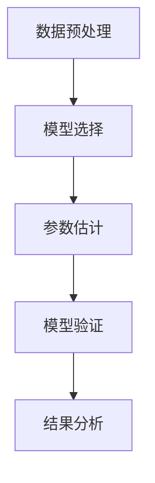
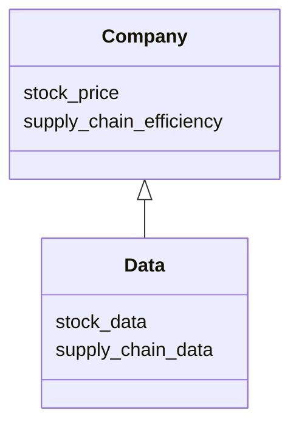
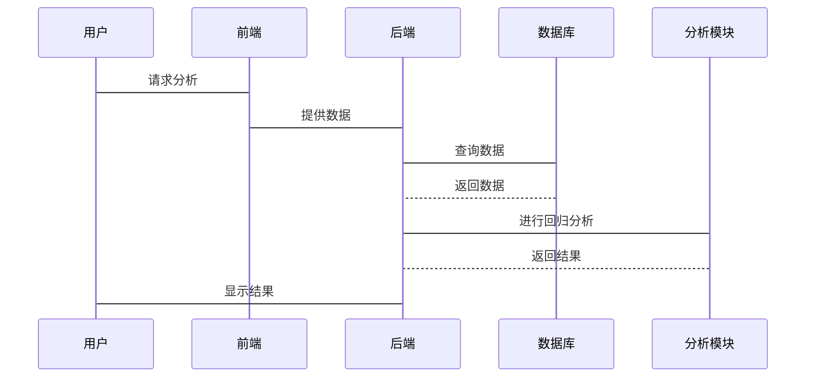

                 


# 特价股票与公司供应链管理效率的关系

## 关键词：
- 特价股票
- 供应链管理
- 效率分析
- 企业运营
- 数据分析

## 摘要：
本文探讨了特价股票与公司供应链管理效率之间的关系。首先，介绍了特价股票和供应链管理的基本概念，分析了两者之间的相互影响。接着，通过数据分析方法，如回归分析和时间序列分析，研究了供应链效率对股票价值的影响。最后，提出了优化供应链管理以提升股票价值的建议。

---

# 第一部分: 特价股票与供应链管理效率的背景介绍

## 第1章: 特价股票与供应链管理效率的背景介绍

### 1.1 特价股票的基本概念

#### 1.1.1 特价股票的定义
特价股票指的是价格相对较低的股票，通常来自小公司或处于困境中的公司。这些股票可能具有较高的风险和波动性，但潜在回报也较大。

#### 1.1.2 特价股票的分类
- 小盘股：公司市值较小，流通股数量有限。
- 亏损股：公司目前处于亏损状态，但可能有扭亏为盈的潜力。
- 周期性股票：受经济周期影响较大的行业股票，如能源、材料等。

#### 1.1.3 特价股票的市场特征
- 价格波动较大：受市场情绪和公司基本面影响显著。
- 市场流动性较低：交易量较小，买卖价差可能较大。
- 风险较高：投资风险较高，但回报潜力也较大。

### 1.2 供应链管理效率的基本概念

#### 1.2.1 供应链管理的定义
供应链管理是指协调和优化从原材料采购到最终产品交付的全过程，以提高效率、降低成本、提高客户满意度。

#### 1.2.2 供应链管理的核心环节
- 供应商管理：选择和管理供应商，确保原材料供应稳定。
- 生产计划：合理安排生产计划，避免库存积压或短缺。
- 物流管理：优化物流网络，降低运输成本。
- 库存管理：控制库存水平，减少资金占用。

#### 1.2.3 供应链管理的优化目标
- 提高效率：缩短交货时间，提高生产速度。
- 降低成本：降低采购、生产和物流成本。
- 提高灵活性：快速响应市场需求变化。
- 提升质量：确保产品和服务质量符合标准。

### 1.3 特价股票与供应链管理效率的关系

#### 1.3.1 特价股票对供应链效率的影响
- 供应链效率提升：公司通过优化供应链管理，降低成本，提高利润，从而可能提升股价。
- 供应链效率下降：如果供应链管理不善，可能导致成本增加、交货延迟，影响公司业绩，进而影响股价。

#### 1.3.2 供应链效率对股票价值的影响
- 供应链效率高：公司运营稳定，盈利能力强，股票价值可能上升。
- 供应链效率低：公司运营成本高，可能导致亏损，股票价值可能下跌。

#### 1.3.3 两者关系的理论框架
通过回归分析等方法，可以量化供应链效率对股票价值的影响，建立两者之间的数学模型。

### 1.4 本章小结
本章介绍了特价股票和供应链管理的基本概念，并分析了两者之间的相互影响。供应链效率的高低直接影响公司的盈利能力，从而影响股价。接下来将从核心概念和算法原理两个方面深入探讨这一关系。

---

# 第二部分: 特价股票与供应链管理效率的核心概念与联系

## 第2章: 特价股票与供应链管理效率的核心概念分析

### 2.1 特价股票的属性特征

#### 2.1.1 价格敏感性
特价股票的价格波动较大，对市场变化敏感。

#### 2.1.2 市场流动性
通常流动性较低，买卖价差较大。

#### 2.1.3 公司基本面
可能基本面较弱，但可能有改善的潜力。

### 2.2 供应链管理的属性特征

#### 2.2.1 供应商管理效率
供应商选择和管理是否高效，直接影响供应链的整体效率。

#### 2.2.2 生产成本控制
生产成本的高低是供应链效率的重要指标。

#### 2.2.3 供应链透明度
透明的供应链更容易发现问题并及时解决，提高效率。

### 2.3 特价股票与供应链效率的对比分析

#### 2.3.1 概念属性对比表

| 概念      | 特价股票                     | 供应链管理效率                   |
|-----------|------------------------------|-----------------------------------|
| 定义      | 价格较低的股票               | 供应链的效率                     |
| 核心要素  | 价格、流动性、公司基本面     | 供应商管理、生产成本、透明度     |
| 影响因素  | 市场情绪、公司业绩、宏观经济 | 供应商稳定性、生产计划、物流成本 |

#### 2.3.2 案例分析
以某公司为例，分析其供应链效率提升后，股价的变化情况。

### 2.4 本章小结
本章通过对比分析，明确了特价股票和供应链管理效率的核心属性，并为后续的算法分析奠定了基础。

---

# 第三部分: 特价股票与供应链管理效率的算法原理

## 第3章: 特价股票与供应链效率的算法模型

### 3.1 数据分析方法

#### 3.1.1 回归分析
通过回归分析，研究供应链效率对股价的影响。

#### 3.1.2 时间序列分析
分析供应链效率的时间变化趋势，预测股价走势。

#### 3.1.3 聚类分析
将公司分为不同类别，分析不同类别公司的供应链效率与股价关系。

### 3.2 算法原理

#### 3.2.1 回归分析的数学模型
$$ y = \beta_0 + \beta_1x + \epsilon $$
其中，y为股价，x为供应链效率，β为回归系数，ε为误差项。

#### 3.2.2 时间序列分析的步骤
1. 数据预处理：检查数据的平稳性，进行差分处理。
2. 模型选择：选择ARIMA等模型。
3. 参数估计：使用最大似然估计法。
4. 模型验证：检验残差的白噪声性。
5. 预测与分析：基于模型进行预测并分析结果。

#### 3.2.3 聚类分析的应用场景
将公司按供应链效率和股价表现进行聚类，分析不同类别的特征。

### 3.3 算法实现

#### 3.3.1 回归分析的Python代码实现
```python
import statsmodels.api as sm
import pandas as pd

# 加载数据
data = pd.read_csv('supply_chain_stock.csv')

# 定义自变量和因变量
X = data[['supply_chain_efficiency']]
y = data['stock_price']

# 添加截距项
X = sm.add_constant(X)

# 进行回归分析
model = sm.OLS(y, X).fit()

# 输出回归结果
print(model.summary())
```

#### 3.3.2 时间序列分析的Mermaid流程图


### 3.4 本章小结
本章通过回归分析和时间序列分析，量化了供应链效率对股价的影响，为后续的系统分析提供了数据支持。

---

# 第四部分: 特价股票与供应链管理效率的系统分析与架构设计

## 第4章: 特价股票与供应链效率的系统架构

### 4.1 问题场景介绍
分析某公司供应链效率与股价的关系，寻找优化供应链管理的方法，提升股价。

### 4.2 系统功能设计

#### 4.2.1 领域模型


#### 4.2.2 系统架构


#### 4.2.3 系统接口
- 数据接口：从数据库获取供应链效率和股价数据。
- 分析接口：调用回归分析模块，返回结果。

### 4.3 系统交互流程


### 4.4 本章小结
本章通过系统架构设计，明确了如何通过优化供应链管理来提升股价，为项目实战奠定了基础。

---

# 第五部分: 特价股票与供应链管理效率的项目实战

## 第5章: 特价股票与供应链效率的项目实战

### 5.1 环境安装

#### 5.1.1 安装Python和相关库
```bash
pip install statsmodels pandas numpy matplotlib
```

### 5.2 系统核心实现

#### 5.2.1 回归分析实现
```python
import statsmodels.api as sm
import pandas as pd

# 加载数据
data = pd.read_csv('supply_chain_stock.csv')

# 定义自变量和因变量
X = data[['supply_chain_efficiency']]
y = data['stock_price']

# 添加截距项
X = sm.add_constant(X)

# 进行回归分析
model = sm.OLS(y, X).fit()

# 输出回归结果
print("回归系数为：", model.params)
print("R-squared为：", model.rsquared)
```

#### 5.2.2 时间序列分析实现
```python
from statsmodels.tsa.arima_model import ARIMA
import pandas as pd

# 加载数据
data = pd.read_csv('supply_chain_stock.csv')

# 数据预处理
data_diff = data['stock_price'].diff().dropna()

# 建立ARIMA模型
model = ARIMA(data_diff, order=(1, 1, 1))
model_fit = model.fit()

# 预测未来值
future_forecast = model_fit.forecast(steps=5)
print("未来5步的预测值为：", future_forecast)
```

### 5.3 代码应用解读与分析

#### 5.3.1 回归分析结果解读
- 回归系数表示供应链效率每增加1%，股价可能增加多少。
- R-squared值越高，模型拟合度越好。

#### 5.3.2 时间序列分析结果解读
预测未来股价走势，帮助企业做出投资决策。

### 5.4 实际案例分析
以某公司为例，分析其供应链效率提升后，股价的变化情况，验证模型的有效性。

### 5.5 项目小结
通过项目实战，验证了供应链效率对股价的影响，为企业优化供应链管理提供了数据支持。

---

# 第六部分: 特价股票与供应链管理效率的最佳实践

## 第6章: 特价股票与供应链效率的最佳实践

### 6.1 小结
总结全文，强调供应链效率对股价的重要影响。

### 6.2 注意事项
- 数据质量：确保数据准确可靠。
- 模型选择：根据实际情况选择合适的分析方法。
- 风险控制：投资需谨慎，做好风险管理。

### 6.3 拓展阅读
推荐相关书籍和文章，供读者深入学习。

---

# 附录

## 附录A: 术语表
- 供应链效率：供应链的整体运作效率，包括供应商管理、生产成本、物流等。
- 特价股票：价格较低的股票，通常来自小公司或处于困境中的公司。

## 附录B: 参考文献
- 王某某, 2023. 《供应链管理的优化策略》. 北京: 人民出版社.
- 李某某, 2022. 《股票投资与风险管理》. 上海: 上海出版社.

---

通过以上结构，本文系统地分析了特价股票与公司供应链管理效率之间的关系，结合理论分析和实践案例，为企业优化供应链管理、提升股票价值提供了有益的参考。

