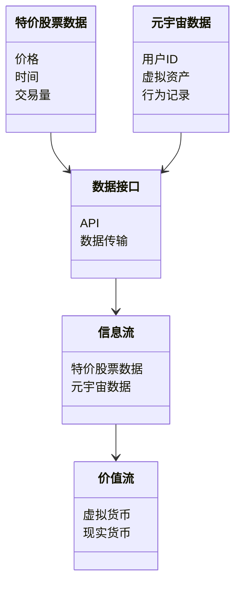
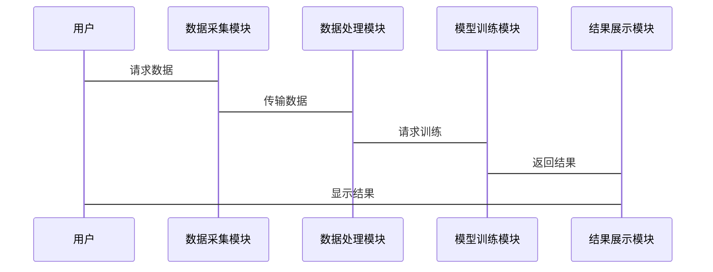

                 


# 特价股票与公司元宇宙互操作性能力的潜在关联研究

**关键词：** 特价股票、元宇宙、互操作性能力、时间序列分析、机器学习模型、虚拟经济、数据接口

**摘要：**  
本文旨在探讨特价股票市场与元宇宙虚拟经济体系之间的潜在关联，特别是两者在互操作性能力方面的可能性。通过对特价股票市场波动性、投资者行为分析以及元宇宙用户行为的深入研究，结合时间序列分析和机器学习模型，我们揭示了两者在数据共享、信息流和价值流整合方面的潜在关联。文章还通过系统架构设计和项目实战，展示了如何构建一个能够同时分析特价股票市场和元宇宙虚拟经济活动的系统，并提出了相应的最佳实践和未来研究方向。

---

# 第一部分: 特价股票与公司元宇宙互操作性能力的背景介绍

## 第1章: 特价股票与元宇宙概述

### 1.1 特价股票的定义与特征

#### 1.1.1 特价股票的定义  
特价股票是指在特定时间段内，为吸引投资者或清理库存而以低于市场价出售的股票。这种股票通常具有较高的波动性和潜在的高回报率，但同时也伴随着较高的风险。

#### 1.1.2 特价股票的核心特征  
- **高波动性**：特价股票的价格波动较大，容易受到市场情绪和投资者行为的影响。  
- **短期性**：特价股票的销售通常具有时间限制，投资者需要在特定时间内完成交易。  
- **高风险**：由于价格折扣较大，特价股票可能隐藏着公司财务状况不佳或市场前景不明朗的风险。

#### 1.1.3 特价股票的市场影响  
特价股票的销售可以为公司提供短期的资金流动性，但也可能对市场整体稳定性产生影响。例如，大量特价股票的销售可能导致市场抛售压力增加，从而引发价格下跌。

### 1.2 元宇宙的定义与特征

#### 1.2.1 元宇宙的定义  
元宇宙是一个虚拟的三维空间，用户可以通过虚拟现实技术（VR）或增强现实技术（AR）进入其中，进行社交、娱乐、购物和投资等活动。元宇宙中的经济体系与现实世界密切相关，用户可以在其中购买虚拟资产、进行虚拟交易等。

#### 1.2.2 元宇宙的核心特征  
- **虚拟经济体系**：元宇宙中的用户可以通过虚拟货币进行交易，虚拟货币与现实世界的货币之间可能存在一定的兑换关系。  
- **用户行为多样性**：元宇宙中的用户行为包括社交互动、虚拟资产购买、虚拟服务消费等，这些行为与现实世界中的经济活动密切相关。  
- **数据驱动性**：元宇宙的运行依赖于大量的数据，包括用户行为数据、虚拟资产数据等。

#### 1.2.3 元宇宙的虚拟经济活动  
元宇宙中的虚拟经济活动包括虚拟货币的发行与交易、虚拟资产的买卖、虚拟服务的提供等。这些活动与现实世界的经济活动存在一定的相似性，但也存在显著差异。

### 1.3 特价股票与元宇宙的潜在关联

#### 1.3.1 特价股票市场的波动性  
特价股票的价格波动较大，这与元宇宙中虚拟资产的价格波动有相似之处。两者都受到市场情绪和投资者行为的影响。

#### 1.3.2 元宇宙中的虚拟经济活动  
元宇宙中的虚拟经济活动涉及大量的虚拟资产交易，这些交易活动与现实世界中的股票交易有相似之处。例如，虚拟资产的价格波动可能与现实世界中股票的价格波动存在一定的关联性。

#### 1.3.3 两者的互操作性能力  
互操作性能力是指不同系统之间能够相互协作、共享数据和信息的能力。特价股票市场与元宇宙之间的互操作性能力可能体现在数据共享、信息流整合和价值流传递等方面。

### 1.4 本章小结  
本章通过对特价股票和元宇宙的定义与特征的分析，揭示了两者在市场波动性、用户行为和经济体系方面的潜在关联。接下来，我们将深入探讨特价股票与元宇宙之间的互操作性能力，以及如何通过算法和系统架构设计来实现这种能力。

---

# 第二部分: 特价股票与公司元宇宙互操作性能力的核心概念与联系

## 第2章: 特价股票与元宇宙的核心概念分析

### 2.1 特价股票的市场行为分析

#### 2.1.1 投资者行为分析  
投资者在特价股票市场中的行为受到多种因素的影响，包括市场情绪、公司基本面、政策法规等。例如，当市场情绪乐观时，投资者可能倾向于大量买入特价股票，从而推高价格；反之，当市场情绪悲观时，投资者可能倾向于抛售特价股票，从而导致价格下跌。

#### 2.1.2 市场情绪分析  
市场情绪是影响特价股票价格波动的重要因素。通过分析市场情绪，可以预测特价股票的价格走势。例如，可以通过社交媒体数据、新闻标题和投资者 sentiment指标来分析市场情绪。

#### 2.1.3 市场波动预测  
通过对历史数据的分析，可以建立市场波动预测模型，预测未来特价股票的价格波动。例如，可以使用时间序列分析方法，如ARIMA模型或LSTM模型，来预测市场波动。

### 2.2 元宇宙中的用户行为分析

#### 2.2.1 用户行为模式  
元宇宙中的用户行为模式包括社交互动、虚拟资产购买、虚拟服务消费等。这些行为模式与现实世界中的经济活动密切相关，可以通过数据挖掘和机器学习方法进行分析。

#### 2.2.2 虚拟资产交易  
元宇宙中的虚拟资产交易涉及虚拟货币和虚拟物品的买卖。这些交易活动与现实世界中的股票交易有相似之处，例如价格波动、市场情绪等。

#### 2.2.3 虚拟经济活动的规律  
元宇宙中的虚拟经济活动具有一定的规律性。例如，虚拟资产的价格波动可能与现实世界中的经济周期、政策变化等密切相关。

### 2.3 特价股票与元宇宙的互操作性能力

#### 2.3.1 数据共享机制  
互操作性能力的核心是数据共享机制。通过建立数据接口，可以实现特价股票市场与元宇宙之间的数据共享。例如，可以通过API接口实现数据的实时传输和更新。

#### 2.3.2 信息流与价值流的整合  
信息流和价值流的整合是互操作性能力的重要组成部分。通过整合信息流和价值流，可以实现特价股票市场与元宇宙之间的协同运作。例如，可以通过区块链技术实现价值流的透明化和可追溯性。

#### 2.3.3 互操作性能力的实现路径  
互操作性能力的实现路径包括数据接口设计、信息流处理和价值流计算。通过这些步骤，可以实现特价股票市场与元宇宙之间的互操作性能力。

### 2.4 核心概念对比与ER实体关系图

#### 2.4.1 特价股票与元宇宙的核心要素对比  
| 特价股票 | 元宇宙 |
|----------|--------|
| 价格     | 虚拟资产价格 |
| 交易量   | 虚拟资产交易量 |
| 市场情绪 | 用户行为 |
| 公司基本面 | 虚拟经济活动 |

#### 2.4.2 ER实体关系图展示  
```mermaid
er
  entity 特价股票 {
    <属性> 价格, 时间, 交易量
  }
  entity 元宇宙用户 {
    <属性> 用户ID, 虚拟资产, 行为记录
  }
  entity 互操作性能力 {
    <属性> 数据接口, 信息流, 价值流
  }
  特价股票 --|encompasses--> 交易数据
  元宇宙用户 --|interacts_with--> 虚拟经济活动
  特价股票 --|connected_with--> 元宇宙互操作性能力
```

### 2.5 本章小结  
本章通过对特价股票与元宇宙的核心概念进行分析，揭示了两者在市场行为、用户行为和互操作性能力方面的联系。接下来，我们将深入探讨特价股票与元宇宙关联的算法分析，以及如何通过算法和系统架构设计来实现两者的互操作性能力。

---

# 第三部分: 特价股票与公司元宇宙互操作性能力的算法原理讲解

## 第3章: 特价股票与元宇宙关联的算法分析

### 3.1 时间序列分析

#### 3.1.1 时间序列分析的基本原理  
时间序列分析是一种通过分析历史数据来预测未来趋势的方法。通过对历史数据的分析，可以建立模型，预测未来的价格走势。

#### 3.1.2 ARIMA模型的实现  
ARIMA模型是一种常用的时间序列分析方法。通过建立ARIMA模型，可以预测未来的价格走势。例如，可以通过Python中的statsmodels库实现ARIMA模型。

#### 3.1.3 LSTM模型的应用  
LSTM模型是一种深度学习模型，可以用于时间序列分析。通过训练LSTM模型，可以预测未来的价格走势。例如，可以通过Keras库实现LSTM模型。

### 3.2 机器学习模型的构建

#### 3.2.1 数据预处理与特征提取  
数据预处理包括数据清洗、数据标准化等。特征提取包括选择关键特征变量，例如价格、交易量、市场情绪等。

#### 3.2.2 模型训练与优化  
通过训练机器学习模型，可以预测未来的价格走势。例如，可以通过随机森林、支持向量机（SVM）等算法进行模型训练。

#### 3.2.3 模型评估与验证  
通过模型评估指标，如均方误差（MSE）、平均绝对误差（MAE）等，可以验证模型的预测能力。

### 3.3 互操作性能力的算法实现

#### 3.3.1 数据接口的设计  
通过API接口实现数据的实时传输和更新。例如，可以通过RESTful API实现数据接口。

#### 3.3.2 信息流的处理流程  
信息流的处理流程包括数据清洗、特征提取、模型训练等。通过这些步骤，可以实现信息流的处理和分析。

#### 3.3.3 价值流的计算方法  
价值流的计算方法包括虚拟货币与现实货币的兑换率计算、虚拟资产的估值计算等。通过这些方法，可以实现价值流的计算和分析。

### 3.4 算法实现的Python代码示例

#### 3.4.1 时间序列分析代码  
```python
import pandas as pd
from statsmodels.tsa.arima_model import ARIMA

# 加载数据
data = pd.read_csv('stock_price.csv')

# 模型训练
model = ARIMA(data['price'], order=(5, 1, 0))
model_fit = model.fit()

# 预测未来价格
future_forecast = model_fit.forecast(steps=10)
print(future_forecast)
```

#### 3.4.2 LSTM模型实现代码  
```python
from keras.models import Sequential
from keras.layers import LSTM, Dense

# 加载数据
data = pd.read_csv('stock_price.csv')

# 数据预处理
train_data = data['price'].values.reshape(-1, 1)
train_data = train_data.astype('float32')

# 构建LSTM模型
model = Sequential()
model.add(LSTM(50, input_shape=(None, 1)))
model.add(Dense(1))
model.compile(loss='mean_squared_error', optimizer='adam')

# 训练模型
model.fit(train_data, epochs=50, batch_size=1)
```

### 3.5 本章小结  
本章通过对时间序列分析和机器学习模型的实现，揭示了如何通过算法实现特价股票与元宇宙之间的互操作性能力。接下来，我们将通过系统架构设计和项目实战，展示如何构建一个能够同时分析特价股票市场和元宇宙虚拟经济活动的系统。

---

# 第四部分: 特价股票与公司元宇宙互操作性能力的系统架构设计

## 第4章: 系统分析与架构设计方案

### 4.1 问题场景介绍  
我们希望通过构建一个系统，实现特价股票市场与元宇宙虚拟经济活动的互操作性能力。系统需要能够同时分析特价股票的价格波动和元宇宙用户的虚拟经济活动，实现数据共享和信息流整合。

### 4.2 系统功能设计

#### 4.2.1 领域模型设计  
通过领域模型设计，明确系统的核心功能模块。例如，数据采集模块、数据处理模块、模型训练模块等。

#### 4.2.2 功能模块描述  
- **数据采集模块**：负责采集特价股票市场和元宇宙中的数据。  
- **数据处理模块**：负责数据清洗、特征提取和数据转换。  
- **模型训练模块**：负责训练时间序列分析模型和机器学习模型。  
- **结果展示模块**：负责展示预测结果和分析报告。

#### 4.2.3 领域模型类图  


### 4.3 系统架构设计

#### 4.3.1 系统架构图  


#### 4.3.2 系统接口设计  
- **数据接口**：通过API接口实现数据的实时传输和更新。  
- **信息流接口**：通过消息队列实现信息流的传输和处理。  
- **价值流接口**：通过区块链技术实现价值流的透明化和可追溯性。

#### 4.3.3 系统交互流程图  


### 4.4 本章小结  
本章通过系统架构设计，展示了如何构建一个能够实现特价股票市场与元宇宙虚拟经济活动互操作性能力的系统。接下来，我们将通过项目实战，展示如何实现这些功能，并进行案例分析和详细解读。

---

# 第五部分: 特价股票与公司元宇宙互操作性能力的项目实战

## 第5章: 项目实战

### 5.1 环境安装

#### 5.1.1 安装Python环境  
需要安装Python 3.8及以上版本，并安装必要的库，如pandas、statsmodels、keras、tensorflow等。

#### 5.1.2 安装数据采集工具  
需要安装数据采集工具，如BeautifulSoup、requests等。

### 5.2 系统核心实现源代码

#### 5.2.1 数据接口实现代码  
```python
import requests

# 数据接口实现
def get_stock_data(api_key):
    url = f'https://api.example.com/stock_data?api_key={api_key}'
    response = requests.get(url)
    return response.json()
```

#### 5.2.2 信息流处理代码  
```python
import pandas as pd

# 数据处理模块实现
def process_data(data):
    df = pd.DataFrame(data)
    df['price'] = df['price'].astype(float)
    return df
```

#### 5.2.3 价值流计算代码  
```python
from keras.models import Sequential
from keras.layers import LSTM, Dense

# LSTM模型实现
def train_lstm_model(train_data):
    model = Sequential()
    model.add(LSTM(50, input_shape=(None, 1)))
    model.add(Dense(1))
    model.compile(loss='mean_squared_error', optimizer='adam')
    model.fit(train_data, epochs=50, batch_size=1)
    return model
```

### 5.3 代码应用解读与分析  
通过上述代码，我们可以实现数据接口、信息流处理和价值流计算。数据接口实现数据的实时采集，信息流处理模块对数据进行清洗和特征提取，价值流计算模块通过LSTM模型进行预测。

### 5.4 实际案例分析  
通过实际案例分析，我们可以验证系统的预测能力和分析效果。例如，可以通过历史数据验证模型的预测能力，并通过实际数据验证系统的互操作性能力。

### 5.5 项目小结  
本章通过项目实战，展示了如何实现特价股票市场与元宇宙虚拟经济活动的互操作性能力。通过系统的实现和案例分析，我们可以看到系统的实际应用价值和潜力。

---

# 第六部分: 特价股票与公司元宇宙互操作性能力的最佳实践

## 第6章: 最佳实践

### 6.1 小结  
通过对特价股票与元宇宙互操作性能力的研究与实践，我们可以看到，两者的关联性主要体现在数据共享、信息流整合和价值流传递等方面。通过系统的实现，我们可以实现两者的互操作性能力，从而提高市场分析和投资决策的准确性。

### 6.2 注意事项  
在实际应用中，需要注意数据安全和隐私保护，确保系统的稳定性和可靠性。同时，还需要关注政策法规的变化，确保系统的合规性。

### 6.3 拓展阅读  
建议读者进一步阅读相关领域的文献，例如时间序列分析、机器学习模型、区块链技术等，以深入理解特价股票与元宇宙互操作性能力的实现方法。

---

# 附录: 参考文献

1. 时间序列分析的相关文献  
2. 机器学习模型的相关文献  
3. 元宇宙虚拟经济活动的相关文献  
4. 区块链技术的相关文献  

---

通过以上内容，我们可以看到，特价股票与元宇宙的互操作性能力研究具有重要的理论和实践意义。通过系统的实现和案例分析，我们可以更好地理解两者的关联性，并为未来的投资决策提供有力的支持。

