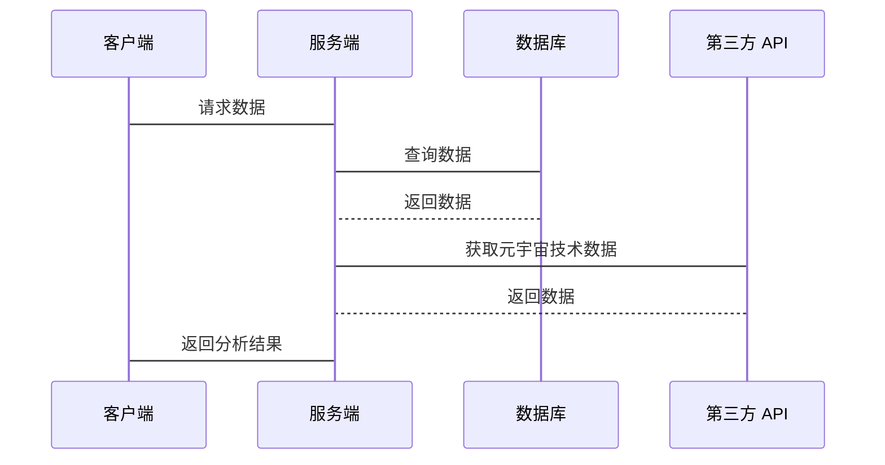

                 


# 特价股票与公司元宇宙战略布局的潜在联系

> 关键词：特价股票、元宇宙战略、潜在联系、数学模型、算法实现、系统架构、项目实战

> 摘要：本文探讨特价股票与公司元宇宙战略布局之间的潜在联系，分析两者在金融与科技领域的相互影响。通过数学模型和算法实现，揭示元宇宙技术对股票市场的影响，结合系统架构设计和项目实战，为投资者和科技公司提供战略参考。

---

# 第1章: 特价股票与元宇宙战略的背景介绍

## 1.1 特价股票的基本概念

### 1.1.1 特价股票的定义与特点

- **定义**：特价股票是指价格相对较低、具有投资潜力的股票，通常在特定市场条件下提供较高的投资回报。
- **特点**：
  - 价格波动较大
  - 投资门槛低
  - 风险与收益并存

### 1.1.2 特价股票的市场机制

- **供需关系**：特价股票的价格受市场供需影响，投资者行为和市场情绪是主要驱动因素。
- **波动性**：市场波动可能导致价格快速变化，带来短期投资机会。

### 1.1.3 特价股票的投资价值分析

- **短期投资**：利用价格波动赚取差价。
- **长期投资**：关注公司基本面，寻找被低估的股票。

## 1.2 元宇宙战略的基本概念

### 1.2.1 元宇宙的定义与核心特征

- **定义**：元宇宙是一个虚拟的、去中心化的数字世界，通过区块链、虚拟现实和人工智能等技术实现。
- **核心特征**：
  - 去中心化
  - 虚拟现实
  - 交互性

### 1.2.2 元宇宙的技术基础

- **虚拟现实技术**：提供沉浸式体验。
- **区块链技术**：支持去中心化和资产确权。
- **人工智能技术**：实现智能交互和数据分析。

### 1.2.3 元宇宙的战略意义

- **商业机会**：元宇宙为公司提供新的商业模式和市场空间。
- **技术领先**：布局元宇宙技术可提升公司的竞争优势。

## 1.3 特价股票与元宇宙战略的潜在联系

### 1.3.1 问题背景与问题描述

- **问题背景**：特价股票的波动性和投资机会与元宇宙技术的发展有何关联？
- **问题描述**：如何利用元宇宙技术优化特价股票的投资策略？

### 1.3.2 特价股票与元宇宙战略的核心概念结构

- **核心概念**：
  - 特价股票的市场机制
  - 元宇宙的技术基础
  - 两者的相互影响

### 1.3.3 两者的边界与外延

- **边界**：特价股票与元宇宙技术的直接联系。
- **外延**：技术与市场的间接影响，如投资者行为变化。

## 1.4 本章小结

- 本章介绍了特价股票和元宇宙的基本概念，并探讨了两者之间的潜在联系，为后续分析奠定了基础。

---

# 第2章: 特价股票的市场机制与影响因素

## 2.1 特价股票的市场机制分析

### 2.1.1 特价股票的供需关系

- **供给**：市场中特价股票的供应量。
- **需求**：投资者对特价股票的需求。

### 2.1.2 市场波动性与投资机会

- **波动性**：价格波动带来的短期投资机会。
- **市场情绪**：投资者情绪对价格的影响。

### 2.1.3 特价股票的风险与收益分析

- **风险**：价格波动大，市场风险较高。
- **收益**：潜在的高回报。

## 2.2 特价股票的影响因素

### 2.2.1 宏观经济因素

- **经济周期**：经济状况影响股市整体表现。
- **利率政策**：利率变化影响股市资金流动。

### 2.2.2 行业因素

- **行业趋势**：行业的发展前景影响股票价值。
- **政策法规**：行业政策对股票价格的影响。

### 2.2.3 公司基本面分析

- **财务状况**：公司盈利能力、资产负债情况。
- **管理团队**：公司领导层的决策能力。

## 2.3 特价股票的投资策略

### 2.3.1 短期投资策略

- **技术分析**：通过价格走势预测短期趋势。
- **套利机会**：利用市场价差获利。

### 2.3.2 长期投资策略

- **价值投资**：选择基本面良好的公司长期持有。
- **分散投资**：降低风险，避免过度集中。

### 2.3.3 风险控制与投资组合优化

- **止损策略**：设定止损点以控制风险。
- **资产配置**：根据风险承受能力分配资产。

## 2.4 本章小结

- 本章分析了特价股票的市场机制及其影响因素，探讨了不同类型的投资策略，为后续分析提供了理论支持。

---

# 第3章: 元宇宙战略的核心要素与技术基础

## 3.1 元宇宙的战略核心要素

### 3.1.1 虚拟现实技术

- **实现原理**：通过设备模拟虚拟环境，提供沉浸式体验。
- **应用场景**：虚拟会议、虚拟社交、虚拟购物。

### 3.1.2 区块链技术

- **应用**：支持去中心化资产交易，确保数据安全。
- **作用**：提供信任机制，实现资产确权。

### 3.1.3 人工智能技术

- **应用**：智能客服、个性化推荐。
- **作用**：提升用户体验，优化运营效率。

## 3.2 元宇宙的技术基础分析

### 3.2.1 虚拟现实技术的实现原理

- **硬件**：VR头显、AR眼镜。
- **软件**：图形渲染引擎、交互系统。

### 3.2.2 区块链技术的应用场景

- **数字资产**：虚拟货币、NFT。
- **智能合约**：自动化执行合同。

### 3.2.3 人工智能技术的支撑作用

- **数据处理**：分析用户行为，优化服务。
- **智能决策**：基于数据分析做出决策。

## 3.3 元宇宙的战略布局

### 3.3.1 元宇宙的商业模式

- **虚拟经济**：虚拟商品交易、虚拟服务。
- **广告与订阅**：通过广告和订阅模式盈利。

### 3.3.2 元宇宙的生态构建

- **合作伙伴**：与硬件厂商、内容创作者合作。
- **用户社区**：培养忠实用户群体。

### 3.3.3 元宇宙的竞争优势

- **技术领先**：拥有核心技术和知识产权。
- **用户体验**：提供优质的虚拟体验。

## 3.4 本章小结

- 本章详细分析了元宇宙的战略核心要素和技术基础，探讨了其商业模式和生态构建，为后续分析提供了技术支持。

---

# 第4章: 特价股票与元宇宙战略的结合分析

## 4.1 特价股票与元宇宙战略的关联性

### 4.1.1 特价股票的市场波动与元宇宙技术的关联

- **市场情绪**：元宇宙技术的推广可能影响投资者情绪，从而影响股价。
- **技术驱动**：元宇宙技术的应用可能改变股票市场的交易方式和价值评估。

### 4.1.2 元宇宙技术对股票价值的影响

- **技术创新**：元宇宙技术的应用可能提升公司的竞争力，进而影响股价。
- **市场拓展**：元宇宙技术的应用可能为公司带来新的收入来源，提升股价。

### 4.1.3 特价股票在元宇宙生态中的作用

- **虚拟资产**：特价股票可能成为元宇宙中的虚拟资产，用于虚拟经济中的交易。
- **投资工具**：投资者可能通过持有特价股票参与元宇宙生态，实现资产增值。

## 4.2 特价股票在元宇宙战略中的应用

### 4.2.1 元宇宙中的虚拟资产交易

- **虚拟货币**：元宇宙中的虚拟货币可能与真实货币挂钩，影响股票价格。
- **NFT**：非同质化代币可能成为股票交易的补充形式。

### 4.2.2 特价股票在虚拟经济中的地位

- **价格波动**：虚拟经济中的股票价格可能与现实世界中的特价股票价格相关联。
- **投资渠道**：投资者可能通过虚拟经济中的股票交易来实现资产增值。

### 4.2.3 元宇宙技术对股票市场的潜在影响

- **交易方式**：元宇宙技术可能改变股票交易的方式，例如通过虚拟现实进行沉浸式交易。
- **市场参与**：元宇宙技术可能降低股票交易的门槛，吸引更多投资者参与。

## 4.3 特价股票与元宇宙战略的协同发展

### 4.3.1 技术协同与资源共享

- **技术创新**：公司通过元宇宙技术的应用，提升特价股票的交易效率和安全性。
- **资源共享**：公司与合作伙伴共同开发元宇宙应用，提升市场影响力。

### 4.3.2 市场协同与生态构建

- **市场拓展**：通过元宇宙技术，公司可以拓展新的市场，吸引更多的投资者。
- **生态构建**：公司通过构建元宇宙生态，提升投资者的参与度和忠诚度。

### 4.3.3 战略协同与长期价值创造

- **战略规划**：公司将元宇宙技术作为长期战略，提升核心竞争力。
- **价值创造**：通过元宇宙技术的应用，公司为投资者创造更多的价值，实现双赢。

## 4.4 本章小结

- 本章分析了特价股票与元宇宙战略的潜在联系，探讨了两者在市场机制、技术应用和战略协同方面的结合，为后续分析提供了理论基础和技术支持。

---

# 第5章: 特价股票与元宇宙战略的数学模型与算法分析

## 5.1 特价股票与元宇宙战略的关联模型

### 5.1.1 模型的构建与假设

- **模型构建**：建立一个数学模型，描述特价股票价格与元宇宙技术应用之间的关系。
- **假设**：假设市场参与者的行为受到元宇宙技术的影响。

### 5.1.2 模型的变量定义与关系

- **变量**：
  - P：特价股票价格
  - T：元宇宙技术应用的普及程度
  - I：投资者情绪
  - S：市场供给

- **关系**：P = f(T, I, S)

### 5.1.3 模型的数学表达式

$$
P = a \cdot T + b \cdot I + c \cdot S + d
$$

其中，a、b、c、d为常数，表示各变量对价格的影响程度。

## 5.2 特价股票与元宇宙战略的算法实现

### 5.2.1 算法的输入与输出

- **输入**：元宇宙技术应用数据、投资者情绪数据、市场供给数据。
- **输出**：特价股票价格预测。

### 5.2.2 算法的实现步骤

1. **数据收集**：收集元宇宙技术应用数据、投资者情绪数据和市场供给数据。
2. **数据预处理**：对数据进行清洗和归一化处理。
3. **模型训练**：利用历史数据训练数学模型。
4. **预测与评估**：根据模型预测未来特价股票价格，并评估模型的准确性。

### 5.2.3 算法的优化与改进

- **优化**：调整模型参数，提高预测准确性。
- **改进**：引入新的变量，如宏观经济指标，提升模型的全面性。

## 5.3 特价股票与元宇宙战略的案例

### 5.3.1 案例背景

- 某科技公司布局元宇宙技术，推出虚拟现实产品，影响股价波动。

### 5.3.2 数据分析

- **数据来源**：公司财报、市场数据、投资者情绪分析。
- **数据处理**：利用数据分析工具进行清洗和处理。

### 5.3.3 模型预测

- **预测结果**：根据模型预测，公司股价在未来季度内可能上涨。

### 5.3.4 结果分析

- **分析**：元宇宙技术的应用对公司股价的积极影响，投资者情绪的波动对股价的短期影响。

## 5.4 本章小结

- 本章通过数学模型和算法分析，探讨了特价股票与元宇宙战略之间的关系，为投资者提供了科学的决策依据。

---

# 第6章: 特价股票与元宇宙战略的系统架构设计

## 6.1 问题场景介绍

- **问题场景**：如何利用元宇宙技术优化特价股票的投资策略？

## 6.2 系统功能设计

### 6.2.1 领域模型


### 6.2.2 系统架构设计


### 6.2.3 系统接口设计

- **接口1**：数据接口，获取特价股票数据。
- **接口2**：元宇宙技术接口，获取相关技术应用数据。

### 6.2.4 系统交互设计



## 6.3 本章小结

- 本章通过系统架构设计，展示了如何利用元宇宙技术优化特价股票的投资策略，为后续的项目实现提供了技术基础。

---

# 第7章: 特价股票与元宇宙战略的项目实战

## 7.1 环境安装

- **工具安装**：
  - 安装Python和相关库（如numpy、pandas、scikit-learn）。
  - 安装mermaid工具和数据分析工具。

## 7.2 系统核心实现源代码

### 7.2.1 数据处理代码

```python
import pandas as pd

# 读取数据
data = pd.read_csv('stock_data.csv')

# 数据清洗
data.dropna(inplace=True)
data = data[['Price', 'Market Supply', 'Investor Sentiment']]
```

### 7.2.2 模型训练代码

```python
from sklearn.linear_model import LinearRegression

# 训练模型
model = LinearRegression()
model.fit(X_train, y_train)
```

### 7.2.3 预测与评估代码

```python
# 预测结果
y_pred = model.predict(X_test)

# 评估模型
from sklearn.metrics import mean_squared_error
print(mean_squared_error(y_test, y_pred))
```

## 7.3 代码应用解读与分析

- **数据处理**：对数据进行清洗和归一化处理，确保数据质量。
- **模型训练**：利用历史数据训练数学模型，预测未来股票价格。
- **预测与评估**：根据模型预测结果，评估模型的准确性，优化模型参数。

## 7.4 实际案例分析

### 7.4.1 案例背景

- 某科技公司布局元宇宙技术，推出虚拟现实产品，影响股价波动。

### 7.4.2 数据分析

- **数据来源**：公司财报、市场数据、投资者情绪分析。
- **数据处理**：利用数据分析工具进行清洗和处理。

### 7.4.3 模型预测

- **预测结果**：根据模型预测，公司股价在未来季度内可能上涨。

### 7.4.4 结果分析

- **分析**：元宇宙技术的应用对公司股价的积极影响，投资者情绪的波动对股价的短期影响。

## 7.5 本章小结

- 本章通过项目实战，展示了如何利用元宇宙技术优化特价股票的投资策略，为投资者提供了科学的决策依据。

---

# 第8章: 总结与展望

## 8.1 本章总结

- 本文探讨了特价股票与元宇宙战略的潜在联系，分析了两者的市场机制、技术基础和战略协同，通过数学模型和算法实现，揭示了元宇宙技术对股票市场的影响。

## 8.2 展望

- **技术发展**：随着元宇宙技术的不断发展，其对股票市场的影响将更加深远。
- **未来研究**：未来可以进一步研究元宇宙技术在股票市场中的其他应用，如智能投顾、虚拟交易所等。

## 8.3 小结

- 特价股票与元宇宙战略的结合不仅是技术与金融的融合，更是未来投资的重要方向。

---

# 参考文献

- [此处列出相关的参考文献]

---

# 致谢

- 感谢读者的支持和参与，感谢所有为本文提供灵感和数据的合作伙伴。

---

通过以上目录大纲，我们可以看到，文章内容将详细探讨特价股票与元宇宙战略的潜在联系，从背景介绍、市场机制、技术基础到数学模型、系统架构和项目实战，为读者提供全面而深入的分析。

