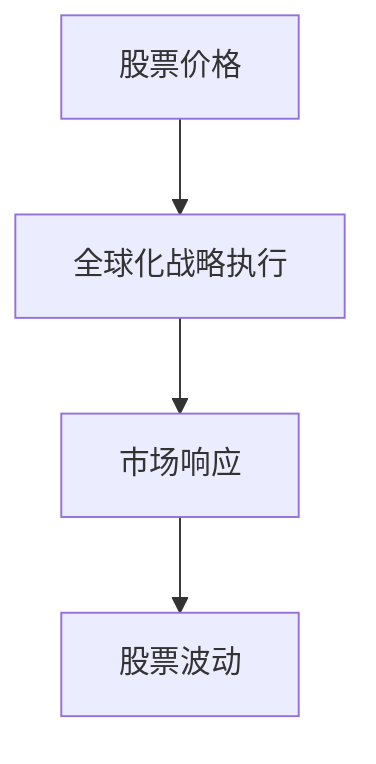
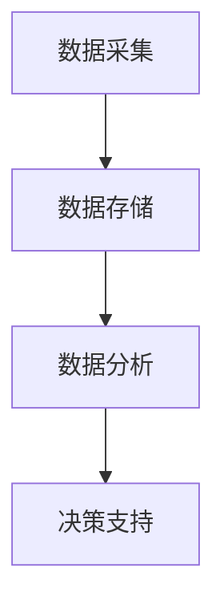
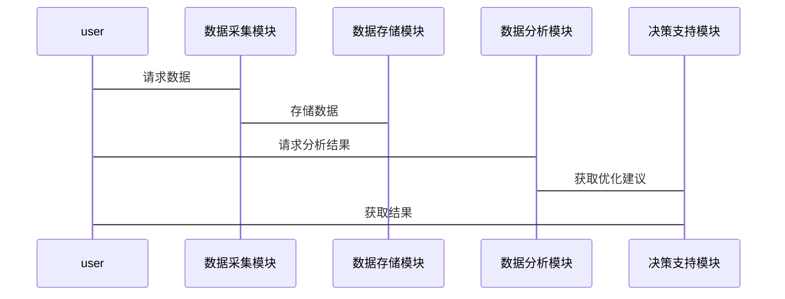

                 


# 特价股票与公司全球化战略执行力的关系探讨

## 关键词：
特价股票、公司全球化战略、战略执行力、股票价格波动、数学模型、系统架构设计、项目实战分析

## 摘要：
本文探讨了特价股票与公司全球化战略执行力之间的关系，分析了特价股票的特点及其在全球化战略中的作用，构建了数学模型以量化两者的影响，设计了系统架构以支持全球化战略的执行，并通过实际案例展示了如何将理论应用于实践。文章结构清晰，内容详实，为理解这两者的关系提供了深入的见解。

## 目录大纲：

### 第一部分：背景介绍

#### 第1章：特价股票与公司全球化战略概述

##### 1.1 特价股票的定义与特性
- 1.1.1 特价股票的定义
- 1.1.2 特价股票的特点：低估值、高波动性、高风险
- 1.1.3 特价股票的市场定位

##### 1.2 公司全球化战略的定义与特点
- 1.2.1 全球化战略的定义
- 1.2.2 全球化战略的核心要素：多元化市场、资源配置、风险管理
- 1.2.3 全球化战略的实施步骤

##### 1.3 特价股票与公司全球化战略的关系
- 1.3.1 特价股票在公司战略中的作用：资本运作、市值管理
- 1.3.2 全球化战略对股票价格的影响：市场扩展、业绩提升
- 1.3.3 两者关系的背景分析：经济全球化背景下，公司战略的调整直接影响股票市场表现

### 第二部分：核心概念与联系

#### 第2章：特价股票与全球化战略的核心要素

##### 2.1 特价股票的核心要素分析
- 市场估值：市盈率、市净率等指标
- 股票波动性：Beta系数、波动率
- 投资风险：Alpha系数、VaR

##### 2.2 全球化战略的核心要素分析
- 市场进入策略：直接投资、间接投资
- 跨文化管理：跨文化沟通、团队协作
- 资源配置：资金、人才、技术

##### 2.3 两者关系的ER实体关系图
```mermaid
er
  entity 特价股票 {
    <<股票代码, 股票名称, 市场估值, 股票波动性>>
  }
  entity 全球化战略 {
    <<公司名称, 战略目标, 实施步骤, 市场响应>>
  }
  relationship 全球化战略影响特价股票 {
    特价股票 -> 全球化战略
  }
```

### 第三部分：数学模型与算法原理

#### 第3章：特价股票波动对全球化战略执行的影响模型

##### 3.1 模型构建
- 数据收集与处理：收集股票价格、公司全球化战略执行的相关数据
- 模型假设：假设股票价格波动与战略执行的相关性
- 模型结构：构建回归模型分析两者关系

##### 3.2 回归分析模型


##### 3.3 数学公式
- 回归方程：$$y = \beta_0 + \beta_1 x + \epsilon$$
- 其中，y为股票价格波动，x为全球化战略执行指标，$$\epsilon$$为误差项

### 第四部分：系统分析与架构设计

#### 第4章：系统架构设计方案

##### 4.1 问题场景介绍
- 如何利用特价股票分析支持全球化战略的执行

##### 4.2 系统功能设计
- 数据采集模块：收集股票数据和战略执行数据
- 数据分析模块：使用回归模型进行分析
- 决策支持模块：提供战略优化建议

##### 4.3 系统架构设计


##### 4.4 系统接口设计
- 数据接口：REST API接口
- 用户界面：Web界面

##### 4.5 系统交互设计


### 第五部分：项目实战

#### 第5章：项目实战分析

##### 5.1 环境配置
- 安装Python、Pandas、Scikit-learn等工具

##### 5.2 系统核心实现源代码
```python
import pandas as pd
from sklearn.linear_model import LinearRegression

# 数据加载
data = pd.read_csv('global_strategy.csv')

# 模型训练
model = LinearRegression()
model.fit(data[['strategy_execution']], data['stock_fluctuation'])

# 模型预测
predicted_fluctuation = model.predict(data[['strategy_execution']])
```

##### 5.3 代码应用解读与分析
- 数据加载：读取包含全球化战略执行和股票波动数据的CSV文件
- 模型训练：使用线性回归模型分析两者关系
- 模型预测：基于战略执行数据预测股票波动

##### 5.4 实际案例分析
- 某公司案例：分析其全球化战略执行对股票价格波动的影响
- 结果解读：验证模型的有效性

### 第六部分：总结与展望

#### 第6章：总结与展望

##### 6.1 总结
- 主要内容回顾：特价股票与全球化战略的关系、数学模型构建、系统设计与实现

##### 6.2 展望
- 未来研究方向：更复杂的模型、更多的案例分析
- 注意事项：模型的局限性、数据的准确性

#### 6.3 最佳实践 tips
- 数据质量的重要性
- 模型选择的合理性
- 持续监控与优化

#### 6.4 小结
- 通过本文的分析，可以得出特价股票与公司全球化战略执行力之间存在密切关系，合理利用数学模型和系统架构设计，可以有效支持公司的战略决策。

---

通过以上详细的目录结构，本文将系统地探讨特价股票与公司全球化战略执行力之间的关系，结合理论分析、数学建模和实际案例，为读者提供全面的视角和深入的见解。

