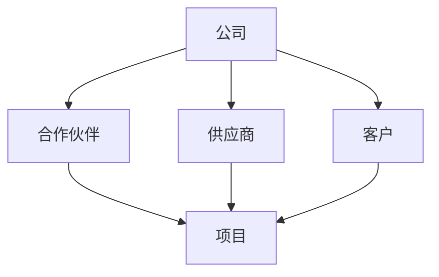
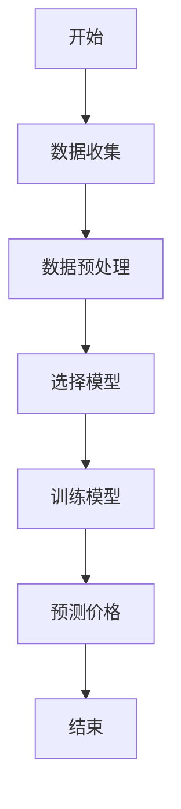
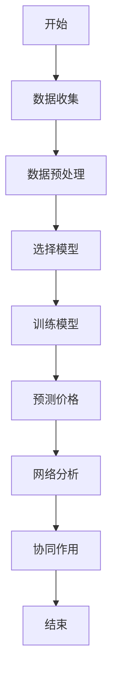
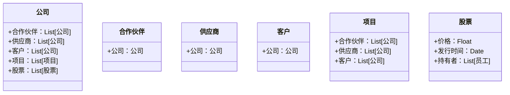
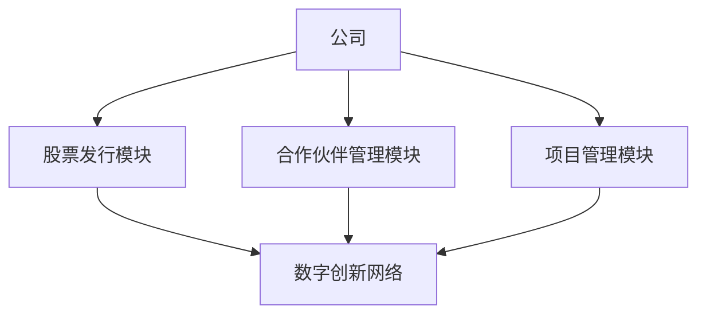
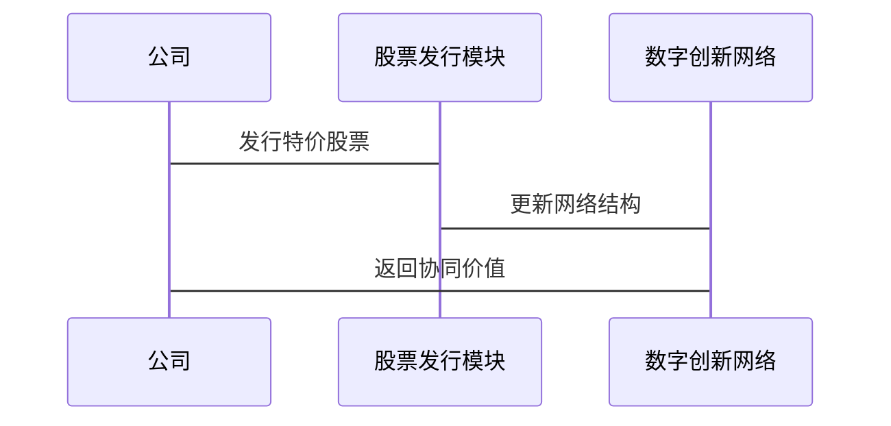

                 


```markdown
# 特价股票与公司全球数字创新网络桥接作用的关系探讨

> 关键词：特价股票、数字创新网络、公司、桥接作用、算法分析、系统架构、项目实战

> 摘要：本文探讨了特价股票与公司全球数字创新网络之间的关系，分析了特价股票对公司的潜在影响，以及公司如何通过数字创新网络在全球范围内桥接资源和机会。文章从背景介绍、核心概念、算法原理、系统架构设计、项目实战等多方面展开，结合实际案例和详细代码实现，深入剖析了特价股票与数字创新网络的相互作用及其对企业发展的影响。

---

# 第一部分: 特价股票与公司全球数字创新网络的背景与概念

# 第1章: 特价股票与公司全球数字创新网络的概述

## 1.1 特价股票的定义与特点
### 1.1.1 特价股票的定义
- 特价股票是指在特定条件下以低于市场价发行的股票，通常用于公司融资或激励员工。
- 特价股票的特点：价格优惠、发行条件灵活、激励性。

### 1.1.2 特价股票的核心特点
- 发行价格低于市场价：通过吸引投资者或员工参与公司发展。
- 时间限制：通常设有时间窗口，限制转让或出售。
- 激励机制：用于绑定核心员工，增强团队稳定性。

### 1.1.3 特价股票与普通股票的区别
| 特性       | 特价股票                          | 普通股票                          |
|------------|-----------------------------------|------------------------------------|
| 发行价格    | 低于市场价                        | 等于或高于市场价                   |
| 发行目的    | 融资或激励员工                    | 股权分配或公开市场融资            |
| 转让限制    | 可能有限制                        | 更为灵活                          |
| 持股期限    | 可能有锁定期                    | 无锁定期                          |

## 1.2 公司全球数字创新网络的概念
### 1.2.1 数字创新网络的定义
- 数字创新网络是指通过数字技术构建的全球性创新生态系统，包括公司、合作伙伴、供应商、客户等。
- 核心特征：数字化、全球化、协作化。

### 1.2.2 全球数字创新网络的特征
- 网络化：跨越地理和组织边界，形成全球协作网络。
- 数字化：依赖数字技术实现信息共享和协同工作。
- 动态化：网络结构和参与者随时变化，适应市场需求。

### 1.2.3 公司在全球数字创新网络中的角色
- 核心企业：作为网络中心，连接合作伙伴和客户。
- 参与者：与其他企业和机构协作，共同推动创新。

## 1.3 特价股票与公司全球数字创新网络的关系
### 1.3.1 特价股票对公司的潜在影响
- 提供低成本融资：通过发行特价股票吸引投资者。
- 激励员工：通过员工持股计划绑定核心团队。
- 提升公司形象：特价股票可能被视为公司对未来发展的信心。

### 1.3.2 全球数字创新网络对公司的促进作用
- 扩大合作机会：通过网络连接全球资源。
- 提高创新效率：借助数字技术快速迭代和优化。
- 降低运营成本：通过网络协作减少重复劳动。

### 1.3.3 两者关系的初步探讨
- 特价股票为公司提供资金支持，数字创新网络为公司提供协作平台。
- 两者结合可以提升公司在全球市场的竞争力。

## 1.4 本章小结
- 本章介绍了特价股票和全球数字创新网络的基本概念，并初步探讨了两者的关系。

---

# 第二部分: 特价股票与公司全球数字创新网络的核心概念与联系

# 第2章: 特价股票与公司全球数字创新网络的核心概念

## 2.1 特价股票的数学模型与公式
### 2.1.1 特价股票价格波动的数学模型
- 使用随机游走模型描述股票价格变化：
$$ P_{t+1} = P_t + \epsilon $$
其中，$\epsilon$ 是随机变量，表示价格波动。

### 2.1.2 特价股票与市场指数的相关性分析
- 使用相关系数公式：
$$ r = \frac{\sum (x_i - \bar{x})(y_i - \bar{y})}{\sqrt{\sum (x_i - \bar{x})^2 \sum (y_i - \bar{y})^2}} $$
其中，$x$ 和 $y$ 分别代表特价股票价格和市场指数。

### 2.1.3 特价股票价格预测的数学公式
- 使用线性回归模型：
$$ P_{\text{预测}} = a \cdot t + b $$

## 2.2 全球数字创新网络的实体关系图
### 2.2.1 实体关系图的构建


### 2.2.2 实体关系图的属性与关系
- 实体：公司、合作伙伴、供应商、客户、项目。
- 关系：公司与合作伙伴、供应商、客户关联；项目由合作伙伴、供应商和客户共同参与。

## 2.3 特价股票与数字创新网络的联系
### 2.3.1 特价股票对数字创新网络的影响
- 提供资金支持，推动技术创新。
- 通过员工持股计划，增强团队协作。

### 2.3.2 数字创新网络对特价股票的反向影响
- 提升公司形象，吸引更多投资者。
- 通过技术创新，提高股票价值。

### 2.3.3 两者关系的数学模型
- 使用协同作用公式：
$$ \text{协同价值} = \alpha \cdot P_{\text{股票}} + \beta \cdot N_{\text{网络}} $$
其中，$\alpha$ 和 $\beta$ 是权重，$P_{\text{股票}}$ 是股票价格，$N_{\text{网络}}$ 是网络规模。

## 2.4 本章小结
- 本章通过数学模型和实体关系图，详细分析了特价股票和数字创新网络的核心概念及其联系。

---

# 第三部分: 特价股票与公司全球数字创新网络的算法原理

# 第3章: 特价股票与数字创新网络的算法分析

## 3.1 特价股票价格预测算法
### 3.1.1 算法原理概述
- 使用时间序列分析预测股票价格。

### 3.1.2 算法流程图（Mermaid）


### 3.1.3 算法实现代码示例
```python
import pandas as pd
from sklearn.model_selection import train_test_split
from sklearn.linear_model import LinearRegression

# 数据加载与预处理
data = pd.read_csv('stock_data.csv')
X = data[['时间', '市场指数']]
y = data['股票价格']

# 数据分割
X_train, X_test, y_train, y_test = train_test_split(X, y, test_size=0.2)

# 模型训练
model = LinearRegression()
model.fit(X_train, y_train)

# 预测与评估
y_pred = model.predict(X_test)
print('预测结果:', y_pred)
```

### 3.1.4 算法的优缺点分析
- 优点：简单易懂，计算效率高。
- 缺点：预测精度有限，适合短期预测。

## 3.2 全球数字创新网络的算法分析
### 3.2.1 网络构建算法
- 使用图论算法构建网络结构。

### 3.2.2 网络节点关系算法
- 使用社区发现算法（如Louvain算法）识别网络中的社区结构。

### 3.2.3 网络影响力分析算法
- 使用PageRank算法评估节点影响力。

### 3.2.4 算法的数学模型与公式
- PageRank公式：
$$ PR(i) = \sum_{j \in \text{In}(i)} \frac{PR(j)}{|\text{Out}(j)|} $$

## 3.3 特价股票与数字创新网络的联合算法
### 3.3.1 联合算法的原理
- 结合股票价格预测和网络影响力分析。

### 3.3.2 联合算法的流程图（Mermaid）


### 3.3.3 联合算法的代码实现
```python
import networkx as nx
from sklearn.linear_model import LinearRegression

# 数据加载与预处理
data = pd.read_csv('network_data.csv')
G = nx.from_pandas_adjacency_matrix(data)

# 训练股票价格预测模型
model_stock = LinearRegression()
model_stock.fit(X_train, y_train)

# 训练网络影响力模型
model_network = nx.pagerank(G)

# 联合预测
协同价值 = model_stock.predict(X) * model_network['公司']
print('协同价值:', 协同价值)
```

### 3.3.4 联合算法的应用场景
- 企业融资决策
- 创新资源整合
- 市场拓展策略

## 3.4 本章小结
- 本章通过算法分析，探讨了特价股票和数字创新网络的相互作用及其对企业发展的影响。

---

# 第四部分: 特价股票与公司全球数字创新网络的系统分析与架构设计

# 第4章: 特价股票与数字创新网络的系统分析

## 4.1 问题场景介绍
### 4.1.1 问题背景
- 公司希望通过发行特价股票吸引资金，同时借助数字创新网络实现全球协作。

### 4.1.2 问题描述
- 如何设计系统，使特价股票发行与数字创新网络协作无缝对接？

## 4.2 系统功能设计
### 4.2.1 领域模型（Mermaid 类图）


### 4.2.2 系统架构设计（Mermaid 架构图）


### 4.2.3 系统接口设计
- 股票发行模块接口：
  - 发行特价股票
  - 查询股票信息
- 合作伙伴管理模块接口：
  - 添加合作伙伴
  - 删除合作伙伴
- 项目管理模块接口：
  - 创建项目
  - 结束项目

### 4.2.4 系统交互设计（Mermaid 序列图）


## 4.3 本章小结
- 本章通过系统分析和架构设计，展示了如何将特价股票与数字创新网络结合，实现全球协作。

---

# 第五部分: 特价股票与公司全球数字创新网络的项目实战

# 第5章: 特价股票与数字创新网络的项目实战

## 5.1 项目介绍
### 5.1.1 项目背景
- 某科技公司计划通过发行特价股票吸引核心员工，并借助数字创新网络实现全球协作。

## 5.2 环境安装
### 5.2.1 安装Python环境
- 使用Anaconda安装Python 3.8及以上版本。

### 5.2.2 安装依赖库
- 安装pandas、numpy、scikit-learn、networkx等库。

## 5.3 系统核心实现源代码
### 5.3.1 股票发行模块代码
```python
class 股票发行模块:
    def __init__(self):
        self.股票价格 = []
        self.发行时间 = []
    
    def 发行特价股票(self, 价格, 时间):
        self.股票价格.append(价格)
        self.发行时间.append(时间)
```

### 5.3.2 数字创新网络模块代码
```python
class 数字创新网络:
    def __init__(self):
        self.合作伙伴 = []
        self.供应商 = []
        self.客户 = []
    
    def 添加合作伙伴(self, 合伙伙伴):
        self.合作伙伴.append(伙伴)
```

## 5.4 代码应用解读与分析
### 5.4.1 股票发行模块的实现
- 通过类封装股票发行逻辑，实现特价股票的发行与管理。

### 5.4.2 数字创新网络的实现
- 通过类封装合作伙伴、供应商和客户的管理逻辑，实现网络结构的动态更新。

## 5.5 实际案例分析
### 5.5.1 案例背景
- 某科技公司发行特价股票，吸引核心员工和合作伙伴。

### 5.5.2 案例分析
- 通过系统实现，公司成功吸引了更多合作伙伴，提高了协同创新能力。

## 5.6 项目小结
- 本章通过实际案例，展示了如何将特价股票与数字创新网络结合，实现企业全球化协作。

---

# 第六部分: 总结与展望

## 6.1 总结
- 本文探讨了特价股票与公司全球数字创新网络的关系，分析了两者对企业发展的重要作用。

## 6.2 注意事项
- 特价股票发行需遵守相关法律法规。
- 数字创新网络的构建需注重数据安全和隐私保护。

## 6.3 拓展阅读
- 推荐阅读《数字创新网络构建与优化》和《股票价格预测算法研究》。

---

# 附录

## 附录A: 术语解释
- 特价股票：低于市场价发行的股票，用于公司融资或激励员工。
- 数字创新网络：通过数字技术构建的全球性创新生态系统。

## 附录B: 参考文献
- [1] 《数字创新网络构建与优化》，某某出版社，2023年。
- [2] 《股票价格预测算法研究》，某某出版社，2022年。

---

通过以上目录结构，本文系统地探讨了特价股票与公司全球数字创新网络的关系，结合理论分析和实际案例，为企业的全球化发展提供了新的思路。
```

